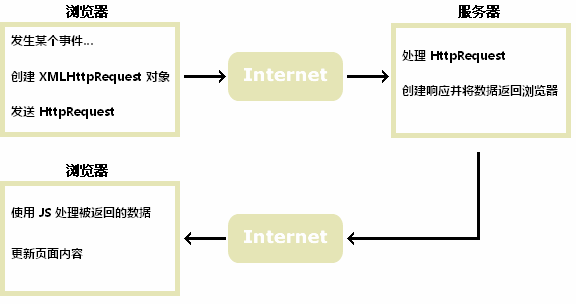

# AJAX

## 简介

AJAX 最大的优点是在不重新加载整个页面的情况下，可以与服务器交换数据并更新部分网页内容。

AJAX 不需要任何浏览器插件，但需要用户允许 JavaScript 在浏览器上执行。

XMLHttpRequest 只是实现 Ajax 的一种方式。

## 快速入门

### Servlet后端

```java
resp.getWriter().write("Success Data");
```

### js-AJAX 快速入门

```html
<html>
<body>
<h2>Hello World!</h2>
<p id="demo"></p>
</body>
<script>
  var xhr = new XMLHttpRequest();
 
  xhr.onload = function () {
      // 输出接收到的文字数据
      document.getElementById("demo").innerHTML=xhr.responseText;
  }
  
  xhr.onerror = function () {
      document.getElementById("demo").innerHTML="请求出错";
  }
  
  // 发送异步 GET 请求
  xhr.open("GET", "/ajaxtest/emp?method=test", true);
  xhr.send();
</script>
</html>

```

### jq-AJAX 快速入门

```html
<%@ page contentType="text/html;charset=UTF-8" language="java" %>
<html>
<script src="https://cdn.staticfile.org/jquery/1.10.2/jquery.min.js"></script>
<body>
<h2>Hello World!</h2>
<p id="demo"></p>
</body>
<button>发送一个 HTTP GET 请求并获取返回结果</button>
<script>
$(document).ready(function(){
	$("button").click(function(){
		$.get("/ajaxtest/emp?method=test",function(data,status){
			alert("数据: " + data + "\n状态: " + status);
		});
	});
});
</script>
</html>
```

## AJAX 工作原理



## 创建 **XMLHttpRequest** 对象

XMLHttpRequest 是 AJAX 的基础。

### XMLHttpRequest 对象

所有现代浏览器均支持 XMLHttpRequest 对象（IE5 和 IE6 使用 ActiveXObject）。

XMLHttpRequest 用于在后台与服务器交换数据。这意味着可以在不重新加载整个网页的情况下，对网页的某部分进行更新。

### 创建 XMLHttpRequest 对象

所有现代浏览器（IE7+、Firefox、Chrome、Safari 以及 Opera）均内建 XMLHttpRequest 对象。

创建 XMLHttpRequest 对象的语法：

```js
variable=new XMLHttpRequest();
```

老版本的 Internet Explorer （IE5 和 IE6）使用 ActiveX 对象：

```js
variable=new ActiveXObject("Microsoft.XMLHTTP");
```

为了应对所有的现代浏览器，包括 IE5 和 IE6，请检查浏览器是否支持 XMLHttpRequest 对象。如果支持，则创建 XMLHttpRequest 对象。如果不支持，则创建 ActiveXObject ：

```js
var xmlhttp;
if (window.XMLHttpRequest){
    //  IE7+, Firefox, Chrome, Opera, Safari 浏览器执行代码
    xmlhttp=new XMLHttpRequest();
}
else{
    // IE6, IE5 浏览器执行代码
    xmlhttp=new ActiveXObject("Microsoft.XMLHTTP");
}
```

## 向服务器发送**请求**

XMLHttpRequest 对象用于和服务器交换数据。

### 发送请求的方法

如需将请求发送到服务器，我们使用 **XMLHttpRequest** 对象的 **open()** 和 **send()** 方法：

```js
xmlhttp.open("GET","ajax_info.txt",true);
xmlhttp.send();

xmlhttp.open("POST","ajax_info.txt",true);
xmlhttp.send();
```

| 方法                                    | 描述                                                                                                                                                                          |
| --------------------------------------- | ----------------------------------------------------------------------------------------------------------------------------------------------------------------------------- |
| open(*method* , *url* , *async* ) | 规定请求的类型、URL 以及是否异步处理请求。<br />**method* ：请求的类型；GET 或 POST<br /> *url* ：文件在服务器上的位置* <br /> *async* ：true（异步）或 false（同步） |
| send(*string* )                       | 将请求发送到服务器。*string* ：仅用于 POST 请求                                                                                                                             |

### GET 还是 POST？

与 POST 相比，GET 更简单也更快，并且在大部分情况下都能用。

然而，在以下情况中，请使用 POST 请求：

* 不愿使用缓存文件（更新服务器上的文件或数据库）
* 向服务器发送大量数据（POST 没有数据量限制）
* 发送包含未知字符的用户输入时，POST 比 GET 更稳定也更可靠

### GET 请求

```js
xmlhttp.open("GET","/try/ajax/demo_get.php",true);
xmlhttp.send();
```

在上面的例子中，您可能得到的是缓存的结果。

为了避免这种情况，请向 URL 添加一个唯一的 ID：

```js
xmlhttp.open("GET","/try/ajax/demo_get.php?t=" + Math.random(),true);
xmlhttp.send();
```

如果您希望通过 GET 方法发送信息，请向 URL 添加信息：

```js
xmlhttp.open("GET","/try/ajax/demo_get2.php?fname=Henry&lname=Ford",true);
xmlhttp.send();
```

### POST 请求

```js
xmlhttp.open("POST","/try/ajax/demo_post.php",true);
xmlhttp.send();
```

如果需要像 HTML 表单那样 POST 数据，请使用 setRequestHeader() 来添加 HTTP 头。然后在 send() 方法中规定您希望发送的数据：

```js
xmlhttp.open("POST","/try/ajax/demo_post2.php",true);
xmlhttp.setRequestHeader("Content-type","application/x-www-form-urlencoded");
xmlhttp.send("fname=Henry&lname=Ford");
```

### url - 服务器上的文件

open() 方法的 *url* 参数是服务器上文件的地址：

```js
xmlhttp.open("GET","ajax_test.html",true);
```

该文件可以是任何类型的文件，比如 .txt 和 .xml，或者服务器脚本文件，比如 .asp 和 .php （在传回响应之前，能够在服务器上执行任务）。

### 异步 - True 或 False？

AJAX 指的是异步 JavaScript 和 XML（Asynchronous JavaScript and XML）。

XMLHttpRequest 对象如果要用于 AJAX 的话，其 open() 方法的 async 参数必须设置为 true：

```js
xmlhttp.open("GET","ajax_test.html",true);
```

对于 web 开发人员来说，发送异步请求是一个巨大的进步。很多在服务器执行的任务都相当费时。AJAX 出现之前，这可能会引起应用程序挂起或停止。

通过 AJAX，JavaScript 无需等待服务器的响应，而是：

* 在等待服务器响应时执行其他脚本
* 当响应就绪后对响应进行处理

### Async=true

当使用 async=true 时，请规定在响应处于 onreadystatechange 事件中的就绪状态时执行的函数：

```js
xmlhttp.onreadystatechange=function()
{
    if (xmlhttp.readyState==4 && xmlhttp.status==200)
    {
        document.getElementById("myDiv").innerHTML=xmlhttp.responseText;
    }
}
xmlhttp.open("GET","/try/ajax/ajax_info.txt",true);
xmlhttp.send();
```

### Async = false

如需使用 async=false，请将 open() 方法中的第三个参数改为 false：

不推荐使用 async=false，但是对于一些小型的请求，也是可以的。

请记住，JavaScript 会等到服务器响应就绪才继续执行。如果服务器繁忙或缓慢，应用程序会挂起或停止。

 **注意：** 当您使用 async=false 时，请不要编写 onreadystatechange 函数 - 把代码放到 send() 语句后面即可：

```js
xmlhttp.open("GET","/try/ajax/ajax_info.txt",false);
xmlhttp.send();
document.getElementById("myDiv").innerHTML=xmlhttp.responseText;
```

## 服务器 **响应**

如需获得来自服务器的响应，请使用 XMLHttpRequest 对象的 responseText 或 responseXML 属性。

| 属性         | 描述                       |
| ------------ | -------------------------- |
| responseText | 获得字符串形式的响应数据。 |
| responseXML  | 获得 XML 形式的响应数据。  |

### responseText 属性

如果来自服务器的响应并非 XML，请使用 responseText 属性。

responseText 属性返回字符串形式的响应，因此您可以这样使用：

```js
document.getElementById("myDiv").innerHTML=xmlhttp.responseText;
```

### responseXML 属性

如果来自服务器的响应是 XML，而且需要作为 XML 对象进行解析，请使用 responseXML 属性：

```js
xmlDoc=xmlhttp.responseXML;
txt="";
x=xmlDoc.getElementsByTagName("ARTIST");
for (i=0;i<x.length;i++)
{
    txt=txt + x[i].childNodes[0].nodeValue + "<br>";
}
document.getElementById("myDiv").innerHTML=txt;
```

## onreadystatechange 事件

当请求被发送到服务器时，我们需要执行一些基于响应的任务。

每当 readyState 改变时，就会触发 onreadystatechange 事件。

readyState 属性存有 XMLHttpRequest 的状态信息。

下面是 XMLHttpRequest 对象的三个重要的属性：

| 属性               | 描述                                                                                                                                              |
| :----------------- | :------------------------------------------------------------------------------------------------------------------------------------------------ |
| onreadystatechange | 存储函数（或函数名），每当 readyState 属性改变时，就会调用该函数。                                                                                |
| readyState         | 存有 XMLHttpRequest 的状态。从 0 到 4 发生变化。* 0: 请求未初始化* 1: 服务器连接已建立* 2: 请求已接收* 3: 请求处理中* 4: 请求已完成，且响应已就绪 |
| status             | 200: "OK"``404: 未找到页面                                                                                                                        |

在 onreadystatechange 事件中，我们规定当服务器响应已做好被处理的准备时所执行的任务。

当 readyState 等于 4 且status为 200 时，表示响应已就绪：

```js
xmlhttp.onreadystatechange=function()
{
    if (xmlhttp.readyState==4 && xmlhttp.status==200)
    {
        document.getElementById("myDiv").innerHTML=xmlhttp.responseText;
    }
}
```

**注意：** onreadystatechange 事件被触发 4 次（0 - 4）, 分别是： 0-1、1-2、2-3、3-4，对应着 readyState 的每个变化。

### 细节

onreadystatechange总是会执行（类似监听的感觉）

[对 onreadystatechange 属性的理解 | 菜鸟教程 (runoob.com)](https://www.runoob.com/w3cnote/onreadystatechange-attribute-learn.html)

### 使用回调函数

回调函数是一种以参数形式传递给另一个函数的函数。

如果您的网站上存在多个 AJAX 任务，那么您应该为创建 XMLHttpRequest 对象编写一个*标准*的函数，并为每个 AJAX 任务调用该函数。

该函数调用应该包含 URL 以及发生 onreadystatechange 事件时执行的任务（每次调用可能不尽相同）：

```js
function myFunction()
{
    loadXMLDoc("/try/ajax/ajax_info.txt",function()
    {
        if (xmlhttp.readyState==4 && xmlhttp.status==200)
        {
            document.getElementById("myDiv").innerHTML=xmlhttp.responseText;
        }
    });
}
```

### onload和onreadystatechange区别

#### onreadystatechange

当网络请求码为200（服务器成功返回网页），readyState状态码为4时（请求已完成，响应已就绪），方可打印请求的数据。如图，在readyState状态码3的情况下不会再打印请求返回的数据。

```js
function loadText(){
            let xhr = new XMLHttpRequest();
            xhr.open('GET','sample.txt',true);
            console.log("READYSTATE"+ xhr.readyState);
            xhr.onreadystatechange = function(){
                console.log("READYSTATE"+ xhr.readyState);
                if(this.status == 200 && this.readyState == 4){
                    console.log(this.responseText);
                }else if(this.status == 404){
                    console.log("网页不存在");
                }
        
            }
            xhr.send();
        }
```

#### onload

当网络请求码为200（服务器成功返回网页），readyState状态码为4时（请求已完成，响应已就绪），方可打印请求的数据。如图，在readyState状态码3的情况下不会再打印请求返回的数据。

```js
 function loadText(){
            let xhr = new XMLHttpRequest();
            xhr.open('GET','sample.txt',true);
            console.log("READYSTATE"+ xhr.readyState);
            //两种请求方式onload和onreadystatechange
            xhr.onload = function(){
                console.log("READYSTATE"+ xhr.readyState);
                console.log(this.responseText);
            }
            xhr.send();
}
```

## js中原生AJAX的封装

```js
function ajax(options) {
  options = options || {};  //调用函数时如果options没有指定，就给它赋值{ },一个空的Object
  options.type = (options.type || "GET").toUpperCase();/// 请求格式GET、POST，默认为GET
  options.dataType = options.dataType || "json";    //响应数据格式，默认json
  options.timeout = options.timeout || 10000;    //超时时间
  var params = formatParams(options.data);//options.data请求的数据(统一转换为form表单格式)

  var xhr;
  //考虑兼容性
  if (window.XMLHttpRequest) {
    xhr = new XMLHttpRequest();
  } else if (window.ActiveObject) {//兼容IE6以下版本
    xhr = new ActiveXobject('Microsoft.XMLHTTP');
  }

  //启动并发送一个请求
  if (options.type == "GET") {
    xhr.open("GET", options.url + "?" + params, true);
    xhr.send(null);
  } else if (options.type == "POST") {
    xhr.open("post", options.url, true);

    //设置表单提交时的内容类型
    //Content-type数据请求的格式
    xhr.setRequestHeader("Content-type", "application/x-www-form-urlencoded");
    xhr.send(params);
  }

  //    设置有效时间
  setTimeout(function () {
    if (xhr.readySate != 4) {
      xhr.abort();
    }
  }, options.timeout)
  //    接收
  //     options.success成功之后的回调函数  options.error失败后的回调函数    //xhr.responseText,xhr.responseXML  获得字符串形式的响应数据或者XML形式的响应数据
  xhr.onreadystatechange = function () {
    if (xhr.readyState == 4) {
      var status = xhr.status;
      if (status >= 200 && status < 300 || status == 304) {
        options.success && options.success(JSON.parse(xhr.responseText), xhr.responseXML);
      } else {
        options.error && options.error(status);
      }
    }
  }
}

//格式化请求参数
function formatParams(data) {
  var arr = [];
  for (var name in data) {
    arr.push(encodeURIComponent(name) + "=" + encodeURIComponent(data[name]));
  }
  arr.push(("v=" + Math.random()).replace(".", ""));
  return arr.join("&");
}

ajax({
      type: "POST",
      url: "/ajaxtest/customer",
      data: {
        method: 'login',
        customer_no: customer_no,
        password: password
      },
      dataType: 'json',
      timeout: 10000,
      success: function (res) {
        console.log(res);
        if (res.code === '0') {
          console.log(res);
          $.growl.notice({
            title: "登录成功",
            message: res.data.name+"登录成功!"
          });
        } else {
          $.growl.error({
            title: "登录失败",
            message: "账号密码不正确!"
          });
        }
      },
      error: function (e) {
        console.log(e);
      }
    });
  }
```

## jq中ajax的使用

```js
$.getJSON("/ajaxtest/customer", {
        method: 'login',
        customer_no: customer_no,
        password: password
      },
      function (res) {
        console.log(res);
        if (res.code === '0') {
          console.log(res);
          $.growl.notice({
            title: "登录成功",
            message: res.data.name+"登录成功!"
          });
        } else {
          $.growl.error({
            title: "登录失败",
            message: "账号密码不正确!"
          });
        }
      },
    );
```
