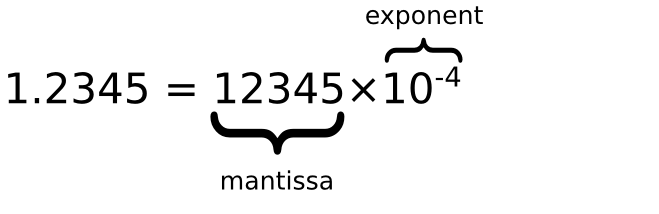

# js高级

## 对象

JavaScript 中的所有事物都是对象：字符串、数值、数组、函数...

此外，JavaScript 允许自定义对象。

### 所有事物都是对象

JavaScript 提供多个内建对象，比如 String、Date、Array 等等。 对象只是带有属性和方法的特殊数据类型。

* 布尔型可以是一个对象。
* 数字型可以是一个对象。
* 字符串也可以是一个对象
* 日期是一个对象
* 数学和正则表达式也是对象
* 数组是一个对象
* 甚至函数也可以是对象

### JavaScript 对象

对象只是一种特殊的数据。对象拥有**属性**和 **方法** 。

### 访问对象的属性

属性是与对象相关的值。

访问对象属性的语法是：

```js
objectName.propertyName
```

这个例子使用了 String 对象的 length 属性来获得字符串的长度：

```js
var message="Hello World!";
var x=message.length;
```

### 访问对象的方法

方法是能够在对象上执行的动作。

您可以通过以下语法来调用方法：

```js
objectName.methodName()
```

这个例子使用了 String 对象的 toUpperCase() 方法来将文本转换为大写：

```js
var message="Hello world!";
var x=message.toUpperCase();
```

### 创建 JavaScript 对象

通过 JavaScript，您能够定义并创建自己的对象。

创建新对象有两种不同的方法：

* 使用 Object 定义并创建对象的实例。
* 使用函数来定义对象，然后创建新的对象实例。

#### 使用 Object

在 JavaScript 中，几乎所有的对象都是 Object 类型的实例，它们都会从 Object.prototype 继承属性和方法。

Object 构造函数创建一个对象包装器。

Object 构造函数，会根据给定的参数创建对象，具体有以下情况：

* 如果给定值是 null 或 undefined，将会创建并返回一个空对象。
* 如果传进去的是一个基本类型的值，则会构造其包装类型的对象。
* 如果传进去的是引用类型的值，仍然会返回这个值，经他们复制的变量保有和源对象相同的引用地址。
* 当以非构造函数形式被调用时，Object 的行为等同于 new Object()。

语法格式：

```js
// 以构造函数形式来调用
new Object([value])

// 等价于 o = new Boolean(true);
var o = new Object(true);
```

```js
person=new Object();
person.firstname="John";
person.lastname="Doe";
person.age=50;
person.eyecolor="blue";
document.write(person.firstname + " is " + person.age + " years old.");
```

也可以使用对象字面量来创建对象，语法格式如下：

```js
{ name1 : value1, name2 : value2,...nameN : valueN }
```

其实就是大括号里面创建 **name:valu**e 对，然后 **name:value** 对之间以逗号 **,** 隔开。

```js
person={firstname:"John",lastname:"Doe",age:50,eyecolor:"blue"};
```

#### 使用对象构造器

本例使用函数来构造对象：

```js
function person(firstname,lastname,age,eyecolor)
{
    this.firstname=firstname;
    this.lastname=lastname;
    this.age=age;
    this.eyecolor=eyecolor;
}
```

在JavaScript中，this通常指向的是我们正在执行的函数本身，或者是指向该函数所属的对象

一旦您有了对象构造器，就可以创建新的对象实例，就像这样：

```js
ar myFather=new person("John","Doe",50,"blue");
var myMother=new person("Sally","Rally",48,"green");
```

您可以通过为对象赋值，向已有对象添加新属性：

假设 person 对象已存在 - 您可以为其添加这些新属性：firstname、lastname、age 以及 eyecolor：

```js
person.firstname="John";
person.lastname="Doe";
person.age=30;
person.eyecolor="blue";

x=person.firstname;
```

把方法添加到 JavaScript 对象，方法只不过是附加在对象上的函数。

在构造器函数内部定义对象的方法：

```js
function person(firstname,lastname,age,eyecolor)
{
    this.firstname=firstname;
    this.lastname=lastname;
    this.age=age;
    this.eyecolor=eyecolor;

    this.changeName=changeName;
    function changeName(name)
    {
        this.lastname=name;
    }
}
```

```js
<script>
function person(firstname,lastname,age,eyecolor){
    this.firstname=firstname;
    this.lastname=lastname;
    this.age=age;
    this.eyecolor=eyecolor;
    this.changeName=changeName;
	function changeName(name){
		this.lastname=name;
	}
}
myMother=new person("Sally","Rally",48,"green");
myMother.changeName("Doe");
document.write(myMother.lastname);
</script>
```

## JavaScript 类

JavaScript 是面向对象的语言，但 JavaScript 不使用类。

在 JavaScript 中，不会创建类，也不会通过类来创建对象（就像在其他面向对象的语言中那样）。

JavaScript 基于 prototype，而不是基于类的。

### JavaScript for...in 循环

JavaScript for...in 语句循环遍历对象的属性。

```js
var person={fname:"John",lname:"Doe",age:25}; 
 
for (x in person)
{
    txt=txt + person[x];
}
```

### JavaScript 的对象是可变的

对象是可变的，它们是通过引用来传递的。

以下实例的 person 对象不会创建副本：

```js
var x = person;  // 不会创建 person 的副本，是引用
```

如果修改 x ，person 的属性也会改变：

```js
var person = {firstName:"John", lastName:"Doe", age:50, eyeColor:"blue"}
 
var x = person;
x.age = 10;           //  x.age 和 person.age 都会改变
```

### new 和不 new的区别：

* 如果 new 了函数内的 this 会指向当前这个 person 并且就算函数内部不 return 也会返回一个对象。
* 如果不 new 的话函数内的 this 指向的是 window。

## prototype（原型对象）

所有的 JavaScript 对象都会从一个 prototype（原型对象）中继承属性和方法。

在前面的章节中我们学会了如何使用对象的构造器（constructor）：

```js
function Person(first, last, age, eyecolor) {
  this.firstName = first;
  this.lastName = last;
  this.age = age;
  this.eyeColor = eyecolor;
}
 
var myFather = new Person("John", "Doe", 50, "blue");
var myMother = new Person("Sally", "Rally", 48, "green");
```

我们也知道在一个已存在构造器的对象中是不能添加新的属性：

```js
Person.nationality = "English";
```

要添加一个新的属性需要在在构造器函数中添加：

```js
function Person(first, last, age, eyecolor) {
  this.firstName = first;
  this.lastName = last;
  this.age = age;
  this.eyeColor = eyecolor;
  this.nationality = "English";
}
```

### prototype 继承

所有的 JavaScript 对象都会从一个 prototype（原型对象）中继承属性和方法：

* Date 对象从 Date.prototype 继承。
* Array 对象从 Array.prototype 继承。
* Person 对象从 Person.prototype 继承。

所有 JavaScript 中的对象都是位于原型链顶端的 Object 的实例。

JavaScript 对象有一个指向一个原型对象的链。当试图访问一个对象的属性时，它不仅仅在该对象上搜寻，还会搜寻该对象的原型，以及该对象的原型的原型，依次层层向上搜索，直到找到一个名字匹配的属性或到达原型链的末尾。

### 添加属性和方法

有的时候我们想要在所有已经存在的对象添加新的属性或方法。另外，有时候我们想要在对象的构造函数中添加属性或方法。使用 prototype 属性就可以给对象的构造函数添加新的属性：

```js
function Person(first, last, age, eyecolor) {
  this.firstName = first;
  this.lastName = last;
  this.age = age;
  this.eyeColor = eyecolor;
}
 
Person.prototype.nationality = "English";
Person.prototype.name = function() {
  return this.firstName + " " + this.lastName;
};
```

## Number 对象

JavaScript 只有一种数字类型。可以使用也可以不使用小数点来书写数字。

### 所有 JavaScript 数字均为 64 位

JavaScript 不是类型语言。与许多其他编程语言不同，JavaScript 不定义不同类型的数字，比如整数、短、长、浮点等等。

在JavaScript中，数字不分为整数类型和浮点型类型，所有的数字都是由 浮点型类型。JavaScript 采用 IEEE754 标准定义的 64 位浮点格式表示数字，它能表示最大值（Number.MAX_VALUE）为  **±1.7976931348623157e+308** ，最小值（Number.MIN_VALUE）为  **±5e-324** 。

此格式用 64 位存储数值，其中 0 到 51 存储数字（片段），52 到 62 存储指数，63 位存储符号：

| 值 (aka Fraction/Mantissa) | 指数（Exponent）  | 符号（Sign） |
| -------------------------- | ----------------- | ------------ |
| 52 bits (0 - 51)           | 11 bits (52 - 62) | 1 bit (63)   |



### 精度

整数（不使用小数点或指数计数法）最多为 15 位。

```js
var x = 999999999999999;   // x 为 999999999999999
var y = 9999999999999999;  // y 为 10000000000000000
```

小数的最大位数是 17，但是浮点运算并不总是 100% 准确：

```js
var x = 0.2+0.1; // 输出结果为 0.30000000000000004
```

### 八进制和十六进制

如果前缀为 0，则 JavaScript 会把数值常量解释为八进制数，如果前缀为 0 和 "x"，则解释为十六进制数。

```js
var y = 0377;
var z = 0xFF;
```

绝不要在数字前面写零，除非您需要进行八进制转换。

默认情况下，JavaScript 数字为十进制显示。

但是你可以使用 toString() 方法 输出16进制、8进制、2进制。

```js
var myNumber=128;
myNumber.toString(16);   // 返回 80
myNumber.toString(8);    // 返回 200
myNumber.toString(2);    // 返回 10000000
```

### 无穷大（Infinity）

当数字运算结果超过了JavaScript所能表示的数字上限（溢出），结果为一个特殊的无穷大（infinity）值，在JavaScript中以Infinity表示。同样地，当负数的值超过了JavaScript所能表示的负数范围，结果为负无穷大，在JavaScript中以-Infinity表示。无穷大值的行为特性和我们所期望的是一致的：基于它们的加、减、乘和除运算结果还是无穷大（当然还保留它们的正负号）。

```js
<script>
var x = 2/0;
var y = -2/0;
document.write(x + "<br>");//Infinity
document.write(y + "<br>");//-Infinity
</script>
```

### NaN - 非数字值

NaN 属性是代表非数字值的特殊值。该属性用于指示某个值不是数字。可以把 Number 对象设置为该值，来指示其不是数字值。

你可以使用 isNaN() 全局函数来判断一个值是否是 NaN 值。

```js
var x = 1000 / 0;
isNaN(x); // 返回 false
```

### 数字可以是数字或者对象

数字可以私有数据进行初始化，就像 x = 123;

JavaScript 数字对象初始化数据， var y = new Number(123);

```js
var x = 123;
var y = new Number(123);
typeof(x) // 返回 Number
typeof(y) // 返回 Object
```

### Number 属性

| 属性                     | 描述                                                  |
| ------------------------ | ----------------------------------------------------- |
| Number.MAX_VALUE         | 最大值                                                |
| Number.MIN_VALUE         | 最小值                                                |
| Number.NaN               | 非数字                                                |
| Number.NEGATIVE_INFINITY | 负无穷，在溢出时返回                                  |
| Number.POSITIVE_INFINITY | 正无穷，在溢出时返回                                  |
| Number.EPSILON           | 表示 1 和比最接近 1 且大于 1 的最小 Number 之间的差别 |
| Number.MIN_SAFE_INTEGER  | 最小安全整数。                                        |
| Number.MAX_SAFE_INTEGER  | 最大安全整数。                                        |

### 数字方法

| 方法                   | 描述                                                                                                       |
| ---------------------- | ---------------------------------------------------------------------------------------------------------- |
| Number.parseFloat()    | 将字符串转换成浮点数，和全局方法[parseFloat()](https://www.runoob.com/jsref/jsref-parsefloat.html) 作用一致。 |
| Number.parseInt()      | 将字符串转换成整型数字，和全局方法[parseInt()](https://www.runoob.com/jsref/jsref-parseint.html) 作用一致。   |
| Number.isFinite()      | 判断传递的参数是否为有限数字。                                                                             |
| Number.isInteger()     | 判断传递的参数是否为整数。                                                                                 |
| Number.isNaN()         | 判断传递的参数是否为 isNaN()。                                                                             |
| Number.isSafeInteger() | 判断传递的参数是否为安全整数。                                                                             |

### 数字类型原型上的一些方法

| 方法            | 描述                                                                  |
| --------------- | --------------------------------------------------------------------- |
| toExponential() | 返回一个数字的指数形式的字符串，如：1.23e+2                           |
| toFixed()       | 返回指定小数位数的表示形式。var a=123； b=a.toFixed(2); // b="123.00" |
| toPrecision()   | 返回一个指定精度的数字。var a=123； b=a.toPrecision(2); // b="1.2e+2" |

## 字符串（String） 对象

String 对象用于处理已有的字符块。一个字符串用于存储一系列字符就像 "John Doe"。一个字符串可以使用单引号或双引号：

```js
var carname="Volvo XC60";
var carname='Volvo XC60';

//你使用位置（索引）可以访问字符串中任何的字符：
var character=carname[7];

//字符串（String）使用长度属性length来计算字符串的长度：
var txt="Hello World!";
document.write(txt.length);

//字符串使用 indexOf() 来定位字符串中某一个指定的字符首次出现的位置：
var str="Hello world, welcome to the universe.";
var n=str.indexOf("welcome");

//match()函数用来查找字符串中特定的字符，并且如果找到的话，则返回这个字符。
var str="Hello world!";
document.write(str.match("world") + "<br>");
document.write(str.match("World") + "<br>");
document.write(str.match("world!"));

//replace() 方法在字符串中用某些字符替换另一些字符。
str="Please visit Microsoft!"
var n=str.replace("Microsoft","Runoob");

//字符串大小写转换使用函数 toUpperCase() / toLowerCase():
var txt="Hello World!";       // String
var txt1=txt.toUpperCase();   // txt1 文本会转换为大写
var txt2=txt.toLowerCase();   // txt2 文本会转换为小写

//字符串使用split()函数转为数组:
txt="a,b,c,d,e"   // String
txt.split(",");   // 使用逗号分隔
txt.split(" ");   // 使用空格分隔
txt.split("|");   // 使用竖线分隔 
```

## Date（日期） 对象

日期对象用于处理日期和时间。

以下四种方法同样可以创建 Date 对象：

```js
var d = new Date();
var d = new Date(milliseconds); // 参数为毫秒
var d = new Date(dateString);
var d = new Date(year, month, day, hours, minutes, seconds, milliseconds);
```

### Date 对象方法

| 方法                                                                            | 描述                                                            |
| :------------------------------------------------------------------------------ | :-------------------------------------------------------------- |
| [getDate()](https://www.runoob.com/jsref/jsref-getdate.html)                       | 从 Date 对象返回一个月中的某一天 (1 ~ 31)。                     |
| [getDay()](https://www.runoob.com/jsref/jsref-getday.html)                         | 从 Date 对象返回一周中的某一天 (0 ~ 6)。                        |
| [getFullYear()](https://www.runoob.com/jsref/jsref-getfullyear.html)               | 从 Date 对象以四位数字返回年份。                                |
| [getHours()](https://www.runoob.com/jsref/jsref-gethours.html)                     | 返回 Date 对象的小时 (0 ~ 23)。                                 |
| [getMilliseconds()](https://www.runoob.com/jsref/jsref-getmilliseconds.html)       | 返回 Date 对象的毫秒(0 ~ 999)。                                 |
| [getMinutes()](https://www.runoob.com/jsref/jsref-getminutes.html)                 | 返回 Date 对象的分钟 (0 ~ 59)。                                 |
| [getMonth()](https://www.runoob.com/jsref/jsref-getmonth.html)                     | 从 Date 对象返回月份 (0 ~ 11)。                                 |
| [getSeconds()](https://www.runoob.com/jsref/jsref-getseconds.html)                 | 返回 Date 对象的秒数 (0 ~ 59)。                                 |
| [getTime()](https://www.runoob.com/jsref/jsref-gettime.html)                       | 返回 1970 年 1 月 1 日至今的毫秒数。                            |
| [getTimezoneOffset()](https://www.runoob.com/jsref/jsref-gettimezoneoffset.html)   | 返回本地时间与格林威治标准时间 (GMT) 的分钟差。                 |
| [getUTCDate()](https://www.runoob.com/jsref/jsref-getutcdate.html)                 | 根据世界时从 Date 对象返回月中的一天 (1 ~ 31)。                 |
| [getUTCDay()](https://www.runoob.com/jsref/jsref-getutcday.html)                   | 根据世界时从 Date 对象返回周中的一天 (0 ~ 6)。                  |
| [getUTCFullYear()](https://www.runoob.com/jsref/jsref-getutcfullyear.html)         | 根据世界时从 Date 对象返回四位数的年份。                        |
| [getUTCHours()](https://www.runoob.com/jsref/jsref-getutchours.html)               | 根据世界时返回 Date 对象的小时 (0 ~ 23)。                       |
| [getUTCMilliseconds()](https://www.runoob.com/jsref/jsref-getutcmilliseconds.html) | 根据世界时返回 Date 对象的毫秒(0 ~ 999)。                       |
| [getUTCMinutes()](https://www.runoob.com/jsref/jsref-getutcminutes.html)           | 根据世界时返回 Date 对象的分钟 (0 ~ 59)。                       |
| [getUTCMonth()](https://www.runoob.com/jsref/jsref-getutcmonth.html)               | 根据世界时从 Date 对象返回月份 (0 ~ 11)。                       |
| [getUTCSeconds()](https://www.runoob.com/jsref/jsref-getutcseconds.html)           | 根据世界时返回 Date 对象的秒钟 (0 ~ 59)。                       |
| getYear()                                                                       | **已废弃。** 请使用 getFullYear() 方法代替。              |
| [parse()](https://www.runoob.com/jsref/jsref-parse.html)                           | 返回1970年1月1日午夜到指定日期（字符串）的毫秒数。              |
| [setDate()](https://www.runoob.com/jsref/jsref-setdate.html)                       | 设置 Date 对象中月的某一天 (1 ~ 31)。                           |
| [setFullYear()](https://www.runoob.com/jsref/jsref-setfullyear.html)               | 设置 Date 对象中的年份（四位数字）。                            |
| [setHours()](https://www.runoob.com/jsref/jsref-sethours.html)                     | 设置 Date 对象中的小时 (0 ~ 23)。                               |
| [setMilliseconds()](https://www.runoob.com/jsref/jsref-setmilliseconds.html)       | 设置 Date 对象中的毫秒 (0 ~ 999)。                              |
| [setMinutes()](https://www.runoob.com/jsref/jsref-setminutes.html)                 | 设置 Date 对象中的分钟 (0 ~ 59)。                               |
| [setMonth()](https://www.runoob.com/jsref/jsref-setmonth.html)                     | 设置 Date 对象中月份 (0 ~ 11)。                                 |
| [setSeconds()](https://www.runoob.com/jsref/jsref-setseconds.html)                 | 设置 Date 对象中的秒钟 (0 ~ 59)。                               |
| [setTime()](https://www.runoob.com/jsref/jsref-settime.html)                       | setTime() 方法以毫秒设置 Date 对象。                            |
| [setUTCDate()](https://www.runoob.com/jsref/jsref-setutcdate.html)                 | 根据世界时设置 Date 对象中月份的一天 (1 ~ 31)。                 |
| [setUTCFullYear()](https://www.runoob.com/jsref/jsref-setutcfullyear.html)         | 根据世界时设置 Date 对象中的年份（四位数字）。                  |
| [setUTCHours()](https://www.runoob.com/jsref/jsref-setutchours.html)               | 根据世界时设置 Date 对象中的小时 (0 ~ 23)。                     |
| [setUTCMilliseconds()](https://www.runoob.com/jsref/jsref-setutcmilliseconds.html) | 根据世界时设置 Date 对象中的毫秒 (0 ~ 999)。                    |
| [setUTCMinutes()](https://www.runoob.com/jsref/jsref-setutcminutes.html)           | 根据世界时设置 Date 对象中的分钟 (0 ~ 59)。                     |
| [setUTCMonth()](https://www.runoob.com/jsref/jsref-setutcmonth.html)               | 根据世界时设置 Date 对象中的月份 (0 ~ 11)。                     |
| [setUTCSeconds()](https://www.runoob.com/jsref/jsref-setutcseconds.html)           | setUTCSeconds() 方法用于根据世界时 (UTC) 设置指定时间的秒字段。 |
| setYear()                                                                       | **已废弃。**请使用 setFullYear() 方法代替。                     |
| [toDateString()](https://www.runoob.com/jsref/jsref-todatestring.html)             | 把 Date 对象的日期部分转换为字符串。                            |
| toGMTString()                                                                   | **已废弃。**请使用 toUTCString() 方法代替。                     |
| [toISOString()](https://www.runoob.com/jsref/jsref-toisostring.html)               | 使用 ISO 标准返回字符串的日期格式。                             |
| [toJSON()](https://www.runoob.com/jsref/jsref-tojson.html)                         | 以 JSON 数据格式返回日期字符串。                                |
| [toLocaleDateString()](https://www.runoob.com/jsref/jsref-tolocaledatestring.html) | 根据本地时间格式，把 Date 对象的日期部分转换为字符串。          |
| [toLocaleTimeString()](https://www.runoob.com/jsref/jsref-tolocaletimestring.html) | 根据本地时间格式，把 Date 对象的时间部分转换为字符串。          |
| [toLocaleString()](https://www.runoob.com/jsref/jsref-tolocalestring.html)         | 根据本地时间格式，把 Date 对象转换为字符串。                    |
| [toString()](https://www.runoob.com/jsref/jsref-tostring-date.html)                | 把 Date 对象转换为字符串。                                      |
| [toTimeString()](https://www.runoob.com/jsref/jsref-totimestring.html)             | 把 Date 对象的时间部分转换为字符串。                            |
| [toUTCString()](https://www.runoob.com/jsref/jsref-toutcstring.html)               | 根据世界时，把 Date 对象转换为字符串。实例：                    |
| [UTC()](https://www.runoob.com/jsref/jsref-utc.html)                               | 根据世界时返回 1970 年 1 月 1 日 到指定日期的毫秒数。           |
| [valueOf()](https://www.runoob.com/jsref/jsref-valueof-date.html)                  | 返回 Date 对象的原始值。                                        |

### 两个日期比较

日期对象也可用于比较两个日期。

下面的代码将当前日期与 2100 年 1 月 14 日做了比较：

```js
var x=new Date();
x.setFullYear(2100,0,14);
var today = new Date();

if (x>today)
{
    alert("今天是2100年1月14日之前");
}
else
{
    alert("今天是2100年1月14日之后");
}
```

## Array（数组） 对象

数组对象的作用是：使用单独的变量名来存储一系列的值。

```js
var mycars = new Array();
mycars[0] = "Saab";
mycars[1] = "Volvo";
mycars[2] = "BMW";

var myCars=new Array("Saab","Volvo","BMW");

var myCars=["Saab","Volvo","BMW"];
```

### Array 对象方法

| 方法                                                                    | 描述                                                                                             |
| ----------------------------------------------------------------------- | ------------------------------------------------------------------------------------------------ |
| [concat()](https://www.runoob.com/jsref/jsref-concat-array.html)           | 连接两个或更多的数组，并返回结果。                                                               |
| [copyWithin()](https://www.runoob.com/jsref/jsref-copywithin.html)         | 从数组的指定位置拷贝元素到数组的另一个指定位置中。                                               |
| [entries()](https://www.runoob.com/jsref/jsref-entries.html)               | 返回数组的可迭代对象。                                                                           |
| [every()](https://www.runoob.com/jsref/jsref-every.html)                   | 检测数值元素的每个元素是否都符合条件。                                                           |
| [fill()](https://www.runoob.com/jsref/jsref-fill.html)                     | 使用一个固定值来填充数组。                                                                       |
| [filter()](https://www.runoob.com/jsref/jsref-filter.html)                 | 检测数值元素，并返回符合条件所有元素的数组。                                                     |
| [find()](https://www.runoob.com/jsref/jsref-find.html)                     | 返回符合传入测试（函数）条件的数组元素。                                                         |
| [findIndex()](https://www.runoob.com/jsref/jsref-findindex.html)           | 返回符合传入测试（函数）条件的数组元素索引。                                                     |
| [forEach()](https://www.runoob.com/jsref/jsref-foreach.html)               | 数组每个元素都执行一次回调函数。                                                                 |
| [from()](https://www.runoob.com/jsref/jsref-from.html)                     | 通过给定的对象中创建一个数组。                                                                   |
| [includes()](https://www.runoob.com/jsref/jsref-includes.html)             | 判断一个数组是否包含一个指定的值。                                                               |
| [indexOf()](https://www.runoob.com/jsref/jsref-indexof-array.html)         | 搜索数组中的元素，并返回它所在的位置。                                                           |
| [isArray()](https://www.runoob.com/jsref/jsref-isarray.html)               | 判断对象是否为数组。                                                                             |
| [join()](https://www.runoob.com/jsref/jsref-join.html)                     | 把数组的所有元素放入一个字符串。                                                                 |
| [keys()](https://www.runoob.com/jsref/jsref-keys.html)                     | 返回数组的可迭代对象，包含原始数组的键(key)。                                                    |
| [lastIndexOf()](https://www.runoob.com/jsref/jsref-lastindexof-array.html) | 搜索数组中的元素，并返回它最后出现的位置。                                                       |
| [map()](https://www.runoob.com/jsref/jsref-map.html)                       | 通过指定函数处理数组的每个元素，并返回处理后的数组。                                             |
| [pop()](https://www.runoob.com/jsref/jsref-pop.html)                       | 删除数组的最后一个元素并返回删除的元素。                                                         |
| [push()](https://www.runoob.com/jsref/jsref-push.html)                     | 向数组的末尾添加一个或更多元素，并返回新的长度。                                                 |
| [reduce()](https://www.runoob.com/jsref/jsref-reduce.html)                 | 将数组元素计算为一个值（从左到右）。                                                             |
| [reduceRight()](https://www.runoob.com/jsref/jsref-reduceright.html)       | 将数组元素计算为一个值（从右到左）。                                                             |
| [reverse()](https://www.runoob.com/jsref/jsref-reverse.html)               | 反转数组的元素顺序。                                                                             |
| [shift()](https://www.runoob.com/jsref/jsref-shift.html)                   | 删除并返回数组的第一个元素。                                                                     |
| [slice()](https://www.runoob.com/jsref/jsref-slice-array.html)             | 选取数组的一部分，并返回一个新数组。                                                             |
| [some()](https://www.runoob.com/jsref/jsref-some.html)                     | 检测数组元素中是否有元素符合指定条件。                                                           |
| [sort()](https://www.runoob.com/jsref/jsref-sort.html)                     | 对数组的元素进行排序。                                                                           |
| [splice()](https://www.runoob.com/jsref/jsref-splice.html)                 | 从数组中添加或删除元素。                                                                         |
| [toString()](https://www.runoob.com/jsref/jsref-tostring-array.html)       | 把数组转换为字符串，并返回结果。                                                                 |
| [unshift()](https://www.runoob.com/jsref/jsref-unshift.html)               | 向数组的开头添加一个或更多元素，并返回新的长度。                                                 |
| [valueOf()](https://www.runoob.com/jsref/jsref-valueof-array.html)         | 返回数组对象的原始值。                                                                           |
| [Array.of()](https://www.runoob.com/jsref/jsref-of-array.html)             | 将一组值转换为数组。                                                                             |
| [Array.at()](https://www.runoob.com/jsref/jsref-at-array.html)             | 用于接收一个整数值并返回该索引对应的元素，允许正数和负数。负整数从数组中的最后一个元素开始倒数。 |
| [Array.flat()](https://www.runoob.com/jsref/jsref-flat-array.html)         | 创建一个新数组，这个新数组由原数组中的每个元素都调用一次提供的函数后的返回值组成。               |
| [Array.flatMap()](https://www.runoob.com/jsref/jsref-flatmap-array.html)   | 使用映射函数映射每个元素，然后将结果压缩成一个新数组。                                           |

### 遍历数组

```js
const ary = ['a', 'b', 'c'];

// 最基本的方式, 只能遍历下标有序递增的数组
for (let i=0; i<ary.length; i++) {
  console.log(i, ary[i]);   // 0 a  1 b  2 c
}

// in:每遍历一次数组指针向后移动一位, 并得到当前数组元素值的下标, 可以通过 ary[key] 来访问数组元素值
for (let key in ary) {
  console.log(key, ary[key]);  // 0 a  1 b  2 c
}

// of:每遍历一次数组指针向后移动一位, 并得到当前数组元素的值, 处理二维数组时极为方便
for (let value of ary) {
  console.log(value);    // a b c
}

/**
 *  forEach(function)
 *  
 *  该方法接受一个函数作为参数, 该函数拥有两个参数, 分别为数组的值、键
 *  该方法没有返回值
 */

 ary.forEach((value, key) => {
    console.log(key, value); // 0 a  1 b  2 c
 })


/**
 * map(function)
 *  
 * 该方法接受一个函数作为参数, 该函数拥有两个参数, 分别为数组的值、键
 * 可以在传入的函数中返回相应的值,你每次迭代时返回的值会被map方法组装成一个新数组作为返回值返回
 */

 var result = ary.map((value, key) => {
    return value + '_runoob.com';
 })

 console.log(result); // ['a_runoob.com', 'b_runoob.com', 'c_runoob.com']
```

## Boolean（布尔） 对象

Boolean（布尔）对象用于将非布尔值转换为布尔值（true 或者 false）。

```js
<script>
var b1=new Boolean(0);
var b2=new Boolean(1);
var b3=new Boolean("");
var b4=new Boolean(null);
var b5=new Boolean(NaN);
var b6=new Boolean("false");
document.write("0 为布尔值 "+ b1 +"<br>");
document.write("1 为布尔值 "+ b2 +"<br>");
document.write("空字符串是布尔值 "+ b3 + "<br>");
document.write("null 是布尔值 "+ b4+ "<br>");
document.write("NaN 是布尔值 "+ b5 +"<br>");
document.write("字符串'false' 是布尔值"+ b6 +"<br>");
</script>

0 为布尔值 false
1 为布尔值 true
空字符串是布尔值 false
null 是布尔值 false
NaN 是布尔值 false
字符串'false' 是布尔值true
```

## Math（算数） 对象

Math（算数）对象的作用是：执行常见的算数任务。

### Math 对象属性

| 属性                                                    | 描述                                                    |
| :------------------------------------------------------ | :------------------------------------------------------ |
| [E](https://www.runoob.com/jsref/jsref-e.html)             | 返回算术常量 e，即自然对数的底数（约等于2.718）。       |
| [LN2](https://www.runoob.com/jsref/jsref-ln2.html)         | 返回 2 的自然对数（约等于0.693）。                      |
| [LN10](https://www.runoob.com/jsref/jsref-ln10.html)       | 返回 10 的自然对数（约等于2.302）。                     |
| [LOG2E](https://www.runoob.com/jsref/jsref-log2e.html)     | 返回以 2 为底的 e 的对数（约等于 1.4426950408889634）。 |
| [LOG10E](https://www.runoob.com/jsref/jsref-log10e.html)   | 返回以 10 为底的 e 的对数（约等于0.434）。              |
| [PI](https://www.runoob.com/jsref/jsref-pi.html)           | 返回圆周率（约等于3.14159）。                           |
| [SQRT1_2](https://www.runoob.com/jsref/jsref-sqrt1-2.html) | 返回 2 的平方根的倒数（约等于 0.707）。                 |
| [SQRT2](https://www.runoob.com/jsref/jsref-sqrt2.html)     | 返回 2 的平方根（约等于 1.414）。                       |

### Math 对象方法

| 方法                                                         | 描述                                                          |
| :----------------------------------------------------------- | :------------------------------------------------------------ |
| [abs(x)](https://www.runoob.com/jsref/jsref-abs.html)           | 返回 x 的绝对值。                                             |
| [acos(x)](https://www.runoob.com/jsref/jsref-acos.html)         | 返回 x 的反余弦值。                                           |
| [asin(x)](https://www.runoob.com/jsref/jsref-asin.html)         | 返回 x 的反正弦值。                                           |
| [atan(x)](https://www.runoob.com/jsref/jsref-atan.html)         | 以介于 -PI/2 与 PI/2 弧度之间的数值来返回 x 的反正切值。      |
| [atan2(y,x)](https://www.runoob.com/jsref/jsref-atan2.html)     | 返回从 x 轴到点 (x,y) 的角度（介于 -PI/2 与 PI/2 弧度之间）。 |
| [ceil(x)](https://www.runoob.com/jsref/jsref-ceil.html)         | 对数进行上舍入。                                              |
| [cos(x)](https://www.runoob.com/jsref/jsref-cos.html)           | 返回数的余弦。                                                |
| [exp(x)](https://www.runoob.com/jsref/jsref-exp.html)           | 返回 E^x^ 的指数。                                            |
| [floor(x)](https://www.runoob.com/jsref/jsref-floor.html)       | 对 x 进行下舍入。                                             |
| [log(x)](https://www.runoob.com/jsref/jsref-log.html)           | 返回数的自然对数（底为e）。                                   |
| [max(x,y,z,...,n)](https://www.runoob.com/jsref/jsref-max.html) | 返回 x,y,z,...,n 中的最高值。                                 |
| [min(x,y,z,...,n)](https://www.runoob.com/jsref/jsref-min.html) | 返回 x,y,z,...,n中的最低值。                                  |
| [pow(x,y)](https://www.runoob.com/jsref/jsref-pow.html)         | 返回 x 的 y 次幂。                                            |
| [random()](https://www.runoob.com/jsref/jsref-random.html)      | 返回 0 ~ 1 之间的随机数。                                     |
| [round(x)](https://www.runoob.com/jsref/jsref-round.html)       | 四舍五入。                                                    |
| [sin(x)](https://www.runoob.com/jsref/jsref-sin.html)           | 返回数的正弦。                                                |
| [sqrt(x)](https://www.runoob.com/jsref/jsref-sqrt.html)         | 返回数的平方根。                                              |
| [tan(x)](https://www.runoob.com/jsref/jsref-tan.html)           | 返回角的正切。                                                |
| [tanh(x)](https://www.runoob.com/jsref/jsref-tanh.html)         | 返回一个数的双曲正切函数值。                                  |
| [trunc(x)](https://www.runoob.com/jsref/jsref-trunc.html)       | 将数字的小数部分去掉，只保留整数部分。                        |

### Math 对象

Math（算数）对象的作用是：执行普通的算数任务。

Math 对象提供多种算数值类型和函数。无需在使用这个对象之前对它进行定义。

**使用 Math 的属性/方法的语法：**

```js
var x=Math.PI;
var y=Math.sqrt(16);
```

## RegExp 对象（正则表达式）

RegExp：是正则表达式（regular expression）的简写。
