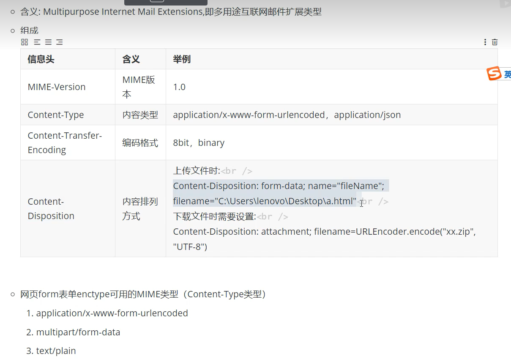
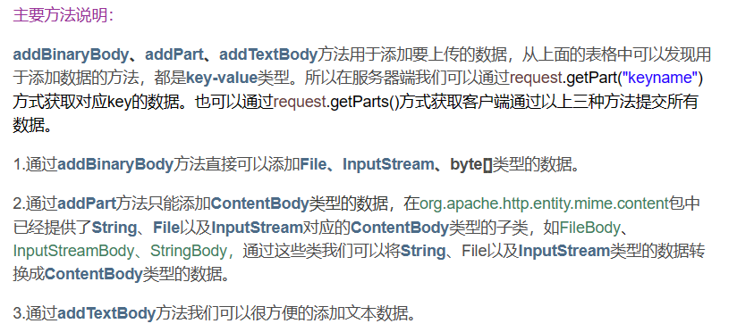
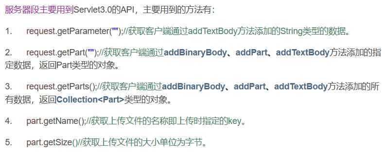

# HttpClient

## 使用场景

1. 爬虫
2. 多系统之间接口交互

## 环境搭建

```xml
<!--httpClient依赖-->
<dependency>
    <groupId>org.apache.httpcomponents</groupId>
    <artifactId>httpclient</artifactId>
    <version>4.5.13</version>
</dependency>


<!--fastjson-->
<dependency>
    <groupId>com.alibaba</groupId>
    <artifactId>fastjson</artifactId>
    <version>1.2.79</version>
</dependency>

<dependency>
      <groupId>org.apache.httpcomponents</groupId>
      <artifactId>httpmime</artifactId>
      <version>4.5.13</version>
    </dependency>

```

## jdk原生api发送http请求

```java
public class HttpClient01 {
  public static void main(String[] args) throws Exception {
    String url = "https://www.baidu.com/";
    URL url2 = new URL(url);
    URLConnection openConnection = url2.openConnection();
    HttpURLConnection httpURLConnection = (HttpURLConnection) openConnection;
    //设置请求类型
    httpURLConnection.setRequestMethod("GET");
    //设置请求头
    httpURLConnection.setRequestProperty("Accept-Charset", "utf-8");
    // 获取httpURLConnection的输入流

    try (InputStream inputStream = httpURLConnection.getInputStream();
        InputStreamReader inputStreamReader = new InputStreamReader(inputStream, StandardCharsets.UTF_8);
        BufferedReader br = new BufferedReader(inputStreamReader);) {
      String line;
      while ((line = br.readLine()) != null) {
        System.out.println(line);
      }
    }

  }
}
```

## 发送get请求

### 无参

```java
class h01 {
  public static void main(String[] args) throws IOException {
    // 可关闭的HttpClient客户端，相当于一个打开的浏览器
    CloseableHttpClient closeableHttpClient = HttpClients.createDefault();
    String url = "https://www.baidu.com/";
    // 获取响应结果
      // DecompressingEntity 解压缩
      // HttpEntity 不仅可以作为结果，也可以作为请求的参数实体，有很多实现
    HttpGet httpGet = new HttpGet(url);

    // 响应
    CloseableHttpResponse response = null;

    try {
      response = closeableHttpClient.execute(httpGet);
      // 获取响应结果
      HttpEntity entity = response.getEntity();
      // 工具类 对HttpEntity操作
      String toStringResult = EntityUtils.toString(entity, StandardCharsets.UTF_8);
      //打印结果
      System.out.println(toStringResult);
      //确保流关闭
      EntityUtils.consume(entity);
    } catch (Exception e) {
      // TODO: handle exception
    } finally{
      if (closeableHttpClient !=null) {
        closeableHttpClient.close();
      }
      if (response != null) {
        response.close(); 
      }
    }

  }
}
```

### 请求头防爬虫 防盗链

```java
HttpGet httpGet = new HttpGet(url);
//真人认证
httpGet.addHeader("User-Agent", "浏览器类型（自己抄）");
//访问时来源网站
httpGet.addHeader("Referer", "https://www.baidu.com/");
```

### 有参

【浏觉器】没有指定content-type自动进行urLencode，web 容器(如tomcat)会自动解析urLdecode

【自己】没有指定content-type，则会出现预料之外的问题

```java
//模拟get的表单提交
//浏览器会自动进行urLdecode编码
//但如果自己提交 服务器会出现特殊字符变成空格或者报错的问题
String pwd1 = "abc+123";// abc 123
String url = "https://www.baidu.com/?pwd="+pwd1; 
```

解决方案

```java
String pwd1 = "abc+123";// abc 123
pwd1 = URLEncoder.encode(pwd1, StandardCharsets.UTF_8);
```

### 获取响应头

```java
      response = closeableHttpClient.execute(httpGet);
      //代表本次请求的成功、失败的状态
      StatusLine statusLine = response.getStatusLine();
      if (HttpStatus.SC_OK == statusLine.getStatusCode()) {
        System.out.println("成功");
        //获取全部响应头
        Header[] allHeaders = response.getAllHeaders();
        for (Header header : allHeaders) {
          System.out.println(header);
        }
        // 获取响应结果
        // DecompressingEntity 解压缩
        // HttpEntity 不仅可以作为结果，也可以作为请求的参数实体，有很多实现
        HttpEntity entity = response.getEntity();
        //获取content-type
        System.out.println(entity.getContentType());

        // 工具类 对HttpEntity操作
        String toStringResult = EntityUtils.toString(entity, StandardCharsets.UTF_8);
        // 打印结果
        System.out.println(toStringResult);
        // 确保流关闭
        EntityUtils.consume(entity);
      }else{
        System.out.println("失败");
      }
```

### 获取图片到本地

```java
class ph01 {
  public static void main(String[] args) throws IOException {
    CloseableHttpClient closeableHttpClient = HttpClients.createDefault();
    String url = "https://img-operation.csdnimg.cn/csdn/silkroad/img/1683703834483.png";
    HttpGet httpGet = new HttpGet(url);
    CloseableHttpResponse response = null;

    try {
      response = closeableHttpClient.execute(httpGet);
      StatusLine statusLine = response.getStatusLine();
      if (HttpStatus.SC_OK == statusLine.getStatusCode()) {
        System.out.println("成功");
        HttpEntity entity = response.getEntity();
        String contentType = entity.getContentType().getValue();
        String suffix = ".jpg";
        // 图片类型
        if (contentType.contains("jpg") || contentType.contains("jpeg")) {
          suffix = ".jpg";
        } else if (contentType.contains("bmp") || contentType.contains("bitmap")) {
          suffix = ".bmp";
        } else if (contentType.contains("png")) {
          suffix = ".png";
        } else if (contentType.contains("gif")) {
          suffix = ".gif";
        }
        // 获取文件的字节流
        byte[] bytes = EntityUtils.toByteArray(entity);
        String path = "E:/新建文件夹 (2)/aaa" + suffix;
        FileOutputStream fos = new FileOutputStream(path);
        fos.write(bytes);
        fos.close();
        EntityUtils.consume(entity);
      } else {
        System.out.println("失败");
      }

    } catch (Exception e) {
    } finally {
      if (closeableHttpClient != null) {
        closeableHttpClient.close();
      }
      if (response != null) {
        response.close();
      }
    }
  }
}

```

### 设置访问代理

不稳定

```java
CloseableHttpClient closeableHttpClient = HttpClients.createDefault();
    String url = "https://www.baidu.com/";
    HttpGet httpGet = new HttpGet(url);

    String ip = "203.110.176.69";
    int port = 8111;
    // 创建代理
    HttpHost proxy = new HttpHost(ip, port);
    // 对每一个请求进行配置，会覆盖全局的默认请求配置
    RequestConfig config = RequestConfig.custom()
    .setProxy(proxy)
    .build();
    httpGet.setConfig(config);
```

### 连接超时和读取超时

```java
CloseableHttpClient closeableHttpClient = HttpClients.createDefault();
    String url = "https://www.baidu.com/";
    HttpGet httpGet = new HttpGet(url);

    String ip = "203.110.176.69";
    int port = 8111;
    // 创建代理
    HttpHost proxy = new HttpHost(ip, port);
    // 对每一个请求进行配置，会覆盖全局的默认请求配置
    RequestConfig config = RequestConfig.custom()
    //连接超时，tcp三次握手的时间上限
    .setConnectTimeout(5000)
    //读取超时 从请求网址处获得响应数据的时间间隔
    .setSocketTimeout(5000)
    .build();
    httpGet.setConfig(config);
```

## 发送post请求

### MIME type

content-type 的父字段

[MIME 参考手册 (w3school.com.cn)](https://www.w3school.com.cn/media/media_mimeref.asp)



### form

application/x-www-form-urlencoded(默认)

```java
 CloseableHttpClient closeableHttpClient = HttpClients.createDefault();
    String url = "https://www.baidu.com/";
    //创建httpPost
    HttpPost httpPost = new HttpPost(url);
    httpPost.setHeader("Content-Type", "application/x-www-form-urlencoded;charset=utf-8");
    //设置参数
    //NameValuePair input标签的name和value的构成
    List<NameValuePair> list =  new ArrayList<>();
    list.add(new BasicNameValuePair("name", "admin"));
    list.add(new BasicNameValuePair("pwd", "123456"));
    UrlEncodedFormEntity formEntity = new UrlEncodedFormEntity(list, Consts.UTF_8);
    httpPost.setEntity(formEntity);
```

### json

application/json

```java
CloseableHttpClient closeableHttpClient = HttpClients.createDefault();
    String url = "https://www.baidu.com/";
    // 创建httpPost
    HttpPost httpPost = new HttpPost(url);
  
    JSONObject jsonObject = new JSONObject();
    jsonObject.put("pwd", "123456");
    // 设置参数
    StringEntity jsonEntity = new StringEntity(jsonObject.toJSONString(),Consts.UTF_8);
    //也需要给Entity设置内容类型
    //jsonEntity.setContentEncoding(new BasicHeader("Content-Type", "application/json;charset=utf-8"));
    jsonEntity.setContentEncoding("application/json;charset=utf-8");
    //设置Entity编码
    jsonEntity.setContentEncoding(Consts.UTF_8.name());
    httpPost.setEntity(jsonEntity);
```

### 文件上传

multipart/form-data





```java
CloseableHttpClient closeableHttpClient = HttpClients.createDefault();
    String url = "https://www.baidu.com/";
    // 创建httpPost
    HttpPost httpPost = new HttpPost(url);

    // 构建 ContentBody 的实现类对象
    FileBody fileBody = new FileBody(new File("E:/book.xml"));

    MultipartEntityBuilder builder = MultipartEntityBuilder.create();
    // 编码
    builder.setCharset(Consts.UTF_8);
    // 文件上传格式
    builder.setContentType(ContentType.create("multipart/form-data", Consts.UTF_8));
    // 设置浏览器模式
    builder.setMode(HttpMultipartMode.BROWSER_COMPATIBLE);

    StringBody stringBody = new StringBody("张三", ContentType.create("text/plain", Consts.UTF_8));

    HttpEntity httpEntity = builder
        // 两种上传方式
        .addPart("fileName", fileBody)
        // 通过file,byte[],inputstream来上传文件
        .addBinaryBody("fileName", new File("e:/诚信声明.png"))
        // 对于表单数据出现中文不能通过addTextBody ,否则乱码
        //中文乱码方案一
        .addPart("username", stringBody)
        //不能出现中文
        .addTextBody("pwd", "123456")
        // 中文乱码方案二
        .addTextBody("name", "例四", ContentType.APPLICATION_JSON)
        .build();
    // 设置Entity编码
    httpPost.setEntity(httpEntity);
```

## 请求https连接

### 安全的：

类似：https://www.baidu.com

### 不安全的：

类似：[盘点SSL证书(HTTPS)2018年大事件 ? - - 站点公告 - 旭柔网络 (xurou.com)](https://www.xurou.com/notices/content/baoliao/229)

1. 通过认证需要的密钥配置httpClient
2. 配置httpClient绕过https安全认证（定制CloseableHttpClient）

```java
class post01https {

  //另一种方式
  public static SSLContext createIgnoreVerifySSL() throws NoSuchAlgorithmException, KeyManagementException {
    SSLContext sc = SSLContext.getInstance("SSLv3");

    // 实现一个X509TrustManager接口，用于绕过验证，不用修改里面的方法
    X509TrustManager trustManager = new X509TrustManager() {
      @Override
      public void checkClientTrusted(
          java.security.cert.X509Certificate[] paramArrayOfX509Certificate,
          String paramString) throws CertificateException {
      }

      @Override
      public void checkServerTrusted(
          java.security.cert.X509Certificate[] paramArrayOfX509Certificate,
          String paramString) throws CertificateException {
      }

      @Override
      public java.security.cert.X509Certificate[] getAcceptedIssuers() {
        return null;
      }
    };

    sc.init(null, new TrustManager[] { trustManager }, null);
    return sc;
  }

  private static ConnectionSocketFactory trustHttpsCertificates()
      throws NoSuchAlgorithmException, KeyStoreException, KeyManagementException {
    SSLContextBuilder sslContextBuilder = new SSLContextBuilder();
    sslContextBuilder.loadTrustMaterial(null, new TrustStrategy() {
      //判断是否信任
      @Override
      public boolean isTrusted(X509Certificate[] chain, String authType) throws CertificateException {
        return true;
      }
    });
    SSLContext sslContext = createIgnoreVerifySSL();
    // SSLContext sslContext = sslContextBuilder.build();
    SSLConnectionSocketFactory sslConnectionSocketFactory = new SSLConnectionSocketFactory(sslContext,
        //支持的协议
        new String[] { "SSLv2Hello", "SSLv3", "TLSv1", "TLSv1.1", "TLSv1.2" },
        null, NoopHostnameVerifier.INSTANCE);

    return sslConnectionSocketFactory;
  }

  public static void main(String[] args) throws Exception {
    // 绕过https的安全认证
    // 连接池所需的参数
    Registry<ConnectionSocketFactory> registry = RegistryBuilder.<ConnectionSocketFactory>create()
        // http 使用默认的ConnectionSocketFactory
        .register("http", PlainConnectionSocketFactory.INSTANCE)
        // https 使用自己配置的
        .register("https", trustHttpsCertificates())
        .build();

    // 创建连接池
    PoolingHttpClientConnectionManager pool = new PoolingHttpClientConnectionManager(registry);
    // 定制CloseableHttpClient 此处setConnectionManager为连接池
    HttpClientBuilder httpClientBuilder = HttpClients.custom().setConnectionManager(pool);
    // 配置好HttpClientBuilder 通过build方法获取
    CloseableHttpClient closeableHttpClient = httpClientBuilder.build();
    String url = "https://www.xurou.com/notices/content/baoliao/229";
    // 创建httpPost
    HttpPost httpPost = new HttpPost(url);
    httpPost.setHeader("Content-Type", "application/x-www-form-urlencoded;charset=utf-8");

    // 设置参数
    // NameValuePair input标签的name和value的构成
    List<NameValuePair> list = new ArrayList<>();
    list.add(new BasicNameValuePair("name", "admin"));
    list.add(new BasicNameValuePair("pwd", "123456"));
    UrlEncodedFormEntity formEntity = new UrlEncodedFormEntity(list, Consts.UTF_8);
    httpPost.setEntity(formEntity);

    CloseableHttpResponse response = null;

    try {
      response = closeableHttpClient.execute(httpPost);
      StatusLine statusLine = response.getStatusLine();
      if (HttpStatus.SC_OK == statusLine.getStatusCode()) {
        System.out.println("成功");
        HttpEntity entity = response.getEntity();
        // 工具类 对HttpEntity操作
        String toStringResult = EntityUtils.toString(entity, StandardCharsets.UTF_8);
        // 打印结果
        System.out.println(toStringResult);
        EntityUtils.consume(entity);
      } else {
        System.out.println("失败");
      }

    } catch (Exception e) {
    } finally {
      if (closeableHttpClient != null) {
        closeableHttpClient.close();
      }
      if (response != null) {
        response.close();
      }
    }
  }

}
```

## 使用httpclient连接池

1. 性能
2. 可复用性

## 封装通用的HttpClientUtil

```java
package org.example.utils;

import com.alibaba.fastjson.JSON;
import org.apache.http.HttpEntity;
import org.apache.http.HttpResponse;
import org.apache.http.NameValuePair;
import org.apache.http.StatusLine;
import org.apache.http.client.ServiceUnavailableRetryStrategy;
import org.apache.http.client.config.RequestConfig;
import org.apache.http.client.entity.UrlEncodedFormEntity;
import org.apache.http.client.methods.CloseableHttpResponse;
import org.apache.http.client.methods.HttpGet;
import org.apache.http.client.methods.HttpPost;
import org.apache.http.client.utils.URIBuilder;
import org.apache.http.config.Registry;
import org.apache.http.config.RegistryBuilder;
import org.apache.http.conn.socket.ConnectionSocketFactory;
import org.apache.http.conn.socket.PlainConnectionSocketFactory;
import org.apache.http.conn.ssl.NoopHostnameVerifier;
import org.apache.http.conn.ssl.SSLConnectionSocketFactory;
import org.apache.http.conn.ssl.TrustSelfSignedStrategy;
import org.apache.http.entity.StringEntity;
import org.apache.http.impl.client.CloseableHttpClient;
import org.apache.http.impl.client.DefaultHttpRequestRetryHandler;
import org.apache.http.impl.client.HttpClientBuilder;
import org.apache.http.impl.client.HttpClients;
import org.apache.http.impl.conn.PoolingHttpClientConnectionManager;
import org.apache.http.message.BasicNameValuePair;
import org.apache.http.protocol.HttpContext;
import org.apache.http.ssl.SSLContextBuilder;
import org.apache.http.ssl.TrustStrategy;
import org.apache.http.util.EntityUtils;

import javax.net.ssl.SSLContext;
import java.io.IOException;
import java.net.URI;
import java.security.cert.CertificateException;
import java.security.cert.X509Certificate;
import java.util.ArrayList;
import java.util.HashMap;
import java.util.Iterator;
import java.util.Map;


public class HttpClientUtil {

  /***
   * 编码集
   */
  private final static String CHAR_SET = "UTF-8";
  /***
   * Post表单请求形式请求头
   */
  private final static String CONTENT_TYPE_POST_FORM = "application/x-www-form-urlencoded";
  /***
   * Post Json请求头
   */
  private final static String CONTENT_TYPE_JSON = "application/json";
  /***
   * 连接管理器
   */
  private static PoolingHttpClientConnectionManager poolManager;
  /***
   * 请求配置
   */
  private static RequestConfig requestConfig;

  static {
    // 静态代码块,初始化HtppClinet连接池配置信息,同时支持http和https
    try {
      System.out.println("初始化连接池-------->>>>开始");
      // 创建SSL连接工厂
      Registry<ConnectionSocketFactory> socketFactoryRegistry = RegistryBuilder.<ConnectionSocketFactory>create()
          .register("http", PlainConnectionSocketFactory.getSocketFactory())
          .register("https", trustHttpsCertificates()).build();
      // 初始化连接管理器
      poolManager = new PoolingHttpClientConnectionManager(socketFactoryRegistry);
      // 设置最大连接数
      poolManager.setMaxTotal(1000);
      // 设置最大路由
      poolManager.setDefaultMaxPerRoute(300);
      // 从连接池获取连接超时时间
      int coonectionRequestTimeOut = 5000;
      // 客户端和服务器建立连接超时时间
      int connectTimeout = 5000;
      // 客户端从服务器建立连接超时时间
      int socketTimeout = 5000;
      requestConfig = RequestConfig.custom().setConnectionRequestTimeout(coonectionRequestTimeOut)
          .setConnectTimeout(connectTimeout)
          .setSocketTimeout(socketTimeout).build();
      System.out.println("初始化连接池-------->>>>结束");

    } catch (Exception e) {
      e.printStackTrace();
      System.out.println("初始化连接池-------->>>>失败");
    }
  }

  private static ConnectionSocketFactory trustHttpsCertificates()
      throws Exception {
    SSLContextBuilder sslContextBuilder = new SSLContextBuilder();
    sslContextBuilder.loadTrustMaterial(null, new TrustStrategy() {
      // 判断是否信任
      @Override
      public boolean isTrusted(X509Certificate[] chain, String authType) throws CertificateException {
        return true;
      }
    });
    // SSLContext sslContext = createIgnoreVerifySSL();
    SSLContext sslContext = sslContextBuilder.build();
    SSLConnectionSocketFactory sslConnectionSocketFactory = new SSLConnectionSocketFactory(sslContext,
        // 支持的协议
        new String[] { "SSLv2Hello", "SSLv3", "TLSv1", "TLSv1.1", "TLSv1.2" },
        null, NoopHostnameVerifier.INSTANCE);

    return sslConnectionSocketFactory;
  }

  public static String doGet(String url, Map<String, String> params) {
    String result = "";
    // 获取http客户端
    // CloseableHttpClient httpClient = getCloseableHttpClient();
    // 获取http客户端从连接池中
    CloseableHttpClient httpClient = getCloseableHttpClientFromPool();
    // 响应模型
    CloseableHttpResponse httpResponse = null;
    try {
      // 创建URI 拼接请求参数
      URIBuilder uriBuilder = new URIBuilder(url);
      // uri拼接参数
      if (null != params) {
        Iterator<Map.Entry<String, String>> it = params.entrySet().iterator();
        while (it.hasNext()) {
          Map.Entry<String, String> next = it.next();
          uriBuilder.addParameter(next.getKey(), next.getValue());
        }

      }
      URI uri = uriBuilder.build();
      // 创建Get请求
      HttpGet httpGet = new HttpGet(uri);
      httpResponse = httpClient.execute(httpGet);
      if (httpResponse.getStatusLine().getStatusCode() == 200) {
        // 获取响应实体
        HttpEntity httpEntity = httpResponse.getEntity();
        if (null != httpEntity) {
          result = EntityUtils.toString(httpEntity, CHAR_SET);
          System.out.println("响应内容:" + result);
          return result;
        }

      }
      StatusLine statusLine = httpResponse.getStatusLine();
      int statusCode = statusLine.getStatusCode();
      System.out.println("响应码:" + statusCode);

    } catch (Exception e) {
      e.printStackTrace();
    } finally {
      try {
        if (null != httpResponse) {
          httpResponse.close();
        }
        if (null != httpClient) {
          httpClient.close();
        }
      } catch (IOException e) {
        e.printStackTrace();
      }
    }
    return result;
  }

  private static CloseableHttpClient getCloseableHttpClient() {
    return HttpClientBuilder.create().build();
  }

  /**
   * 从http连接池中获取连接
   */
  private static CloseableHttpClient getCloseableHttpClientFromPool() {
    //
    ServiceUnavailableRetryStrategy serviceUnavailableRetryStrategy = new ServiceUnavailableRetryStrategy() {
      @Override
      public boolean retryRequest(HttpResponse httpResponse, int executionCount, HttpContext httpContext) {
        if (executionCount < 3) {
          System.out.println("ServiceUnavailableRetryStrategy");
          return true;
        } else {
          return false;
        }
      }

      // 重试时间间隔
      @Override
      public long getRetryInterval() {
        return 3000L;
      }
    };

    // 设置连接池管理
    CloseableHttpClient httpClient = HttpClients.custom().setConnectionManager(poolManager)
        // 设置请求配置策略
        .setDefaultRequestConfig(requestConfig)
        // 设置重试次数
        .setRetryHandler(new DefaultHttpRequestRetryHandler()).build();
    return httpClient;

  }

  /**
   * Post请求,表单形式
   */
  public static String doPost(String url, Map<String, String> params) {
    String result = "";
    // 获取http客户端
    CloseableHttpClient httpClient = getCloseableHttpClientFromPool();
    // 响应模型
    CloseableHttpResponse httpResponse = null;
    try {
      // Post提交封装参数列表
      ArrayList<NameValuePair> postParamsList = new ArrayList<>();
      if (null != params) {
        Iterator<Map.Entry<String, String>> it = params.entrySet().iterator();
        while (it.hasNext()) {
          Map.Entry<String, String> next = it.next();
          postParamsList.add(new BasicNameValuePair(next.getKey(), next.getValue()));
        }
      }
      // 创建Uri
      UrlEncodedFormEntity urlEncodedFormEntity = new UrlEncodedFormEntity(postParamsList, CHAR_SET);
      // 设置表达请求类型
      urlEncodedFormEntity.setContentType(CONTENT_TYPE_POST_FORM);
      HttpPost httpPost = new HttpPost(url);
      // 设置请求体
      httpPost.setEntity(urlEncodedFormEntity);
      // 执行post请求
      httpResponse = httpClient.execute(httpPost);
      if (httpResponse.getStatusLine().getStatusCode() == 200) {
        result = EntityUtils.toString(httpResponse.getEntity(), CHAR_SET);
        System.out.println("Post form reponse {}" + result);
        return result;
      }
    } catch (Exception e) {
      e.printStackTrace();
    } finally {
      try {
        CloseResource(httpClient, httpResponse);
      } catch (Exception e) {
        e.printStackTrace();
      }
    }
    return result;
  }

  private static void CloseResource(CloseableHttpClient httpClient, CloseableHttpResponse httpResponse)
      throws IOException {
    if (null != httpResponse) {
      httpResponse.close();
    }
    if (null != httpClient) {
      httpClient.close();
    }
  }

  /***
   * Post请求,Json形式
   */
  public static String doPostJson(String url, String jsonStr) {
    String result = "";
    CloseableHttpClient httpClient = getCloseableHttpClientFromPool();
    CloseableHttpResponse httpResponse = null;
    try {
      // 创建Post
      HttpPost httpPost = new HttpPost(url);

      // 封装请求参数
      StringEntity stringEntity = new StringEntity(jsonStr, CHAR_SET);
      // 设置请求参数封装形式
      stringEntity.setContentType(CONTENT_TYPE_JSON);
      httpPost.setEntity(stringEntity);
      httpResponse = httpClient.execute(httpPost);
      if (httpResponse.getStatusLine().getStatusCode() == 200) {
        result = EntityUtils.toString(httpResponse.getEntity(), CHAR_SET);
        System.out.println(result);
        return result;
      }
    } catch (Exception e) {
      e.printStackTrace();
    } finally {
      try {
        CloseResource(httpClient, httpResponse);
      } catch (Exception e) {
        e.printStackTrace();
      }
    }
    return result;
  }

  public static void main(String[] args) {
    // String getUrl = "http://127.0.0.1:8080/testHttpClientUtilGet";
    // Map m = new HashMap();
    // m.put("name","小明");
    // m.put("age","123");
    // String result = doGet(getUrl, m);
    // String postUrl = "http://127.0.0.1:8080/testHttpClientUtilPost";
    // String s = doPost(postUrl, m);
    String postJsonUrl = "https://www.xurou.com/notices/content/baoliao/229";
    HashMap<Object,Object> hashMap = new HashMap<>();
  
    String jsonStr = JSON.toJSONString(hashMap);
    doPostJson(postJsonUrl, jsonStr);

    // System.out.println(s);
    // System.out.println(result);
  }

  
}

```
