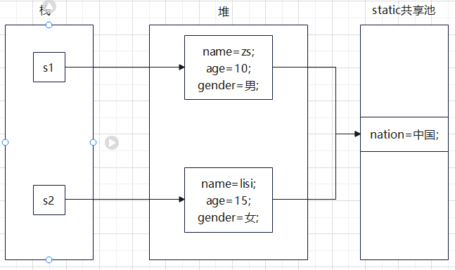

# static

## 类变量(又称静态变量)

类的各个对象共享的变量

### 类变量的写法

```java
private static int num=0;
static private int num=0;
```

### 内存情况



1. static是在类加载的时候生成的
2. 每个对象的静态变量指向同一个内存空间，不区分基本数据类型和引用类型
3. jdk7之前是放在方法区的静态域中
4. jdk8之后是放在堆中的class实例的尾部

### 类变量的使用

类变量是随着类的加载而创建，所以即使没有创建对象实例也可以访问

1. 类.静态变量
2. 对象.静态变量

### 类变量的注意事项

* 什么时候需要用类变量？
  当我们需要让某个类的所有对象都共享一个变量时，就可以考虑使用类变量
* 类变量与实例变量(普通属性)区别类变量是该类的所有对象共享的,而实例变量是每个对象独享的。
* 加上static称为类变量或静态变量，否则称为实例变量/普通变量/非静态变量
* 类变量可以通过类名.类变量名或者对象名.类变量名来访问，但java设计者推荐我们使用类名.类变量名方式访问。前提是满足访问修饰符的访问权限和范围
* 实例变量不能通过类名.类变量名方式访问。
* 类变量是在类加载时就初始化了，也就是说，即使你没有创建对象，只要类加载了,就可以使用类变量了。
* 类变量的生命周期是随类的加载开始,随着类消亡而销毁。

## 类方法(静态方法)

期望做成不创建实例的工具

### 类方法的写法

```java
public static void name(){}
static public void name(){}
```

### 类方法的使用

类变量是随着类的加载而创建，所以即使没有创建对象实例也可以访问

1. 类.静态方法 (常用)
2. 对象.静态方法

### 类方法的使用场景

当方法中不涉及到任何和对象相关的成员，则可以将方法设计成静态方法,提高开发效率。

### 类方法的注意事项

* 类方法和普通方法都是随着类的加载而加载,将结构信息存储在方法区。类方法中无this的参数。普通方法中隐含着this的参数
* 类方法可以通过类名调用，也可以通过对象名调用。
* 普通方法和对象有关,需要通过对象名调用，比如对象名.方法名(参数),但不能通过类名调用。
* 类方法中不允许使用和对象有关的关键建字，比如this和super。普通方法可以。
* 类方法中只能访问静态变量或静态方法。
* 普通成员方法，既可以访问普通变量/方法。也可以访问静态变量/方法。
* 小结:静态方法，只能访问静态的成员，非静态的方法，可以访问静态成员和非静态成员(必须遵守访问权限)
