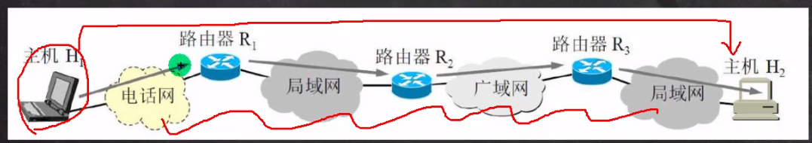
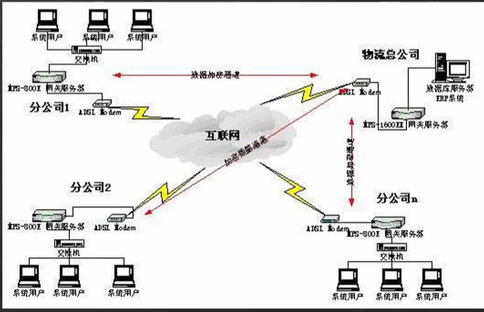
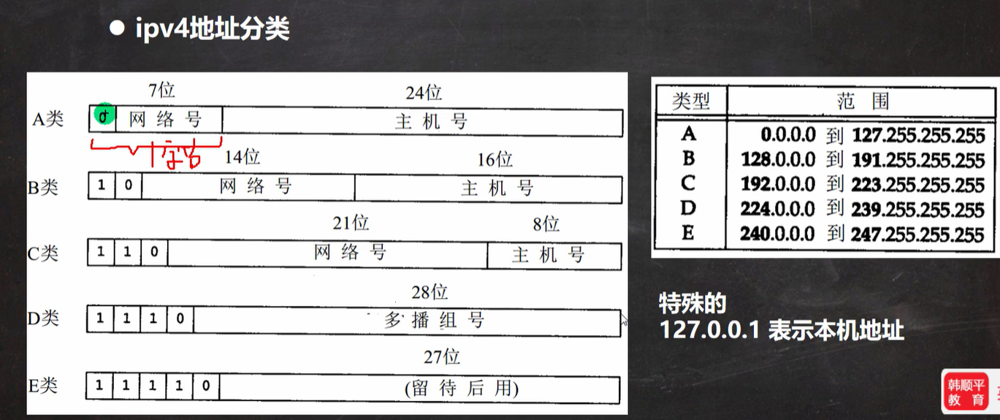
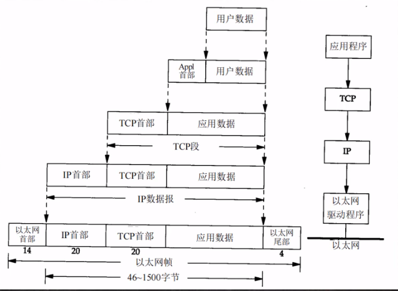
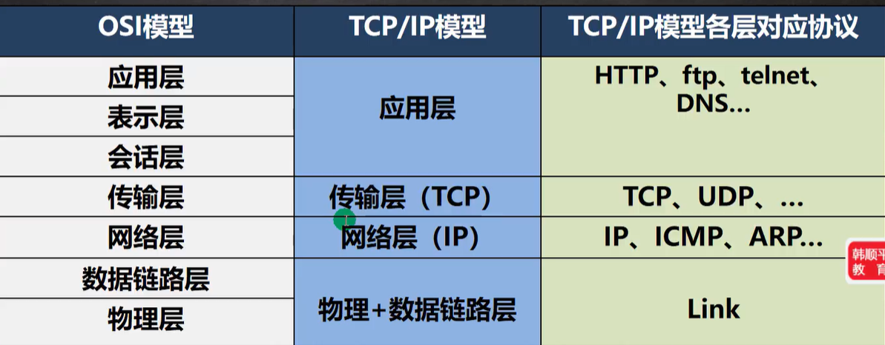

# 网络通信

## 网络通信概念

两台设备之间通过网络实现数据传输，java.net包

## 网络的概念

两台或多台设备通过一定物理设备连接起来构成了网络

## 网络分类:

局域网:覆盖范围最小,仅仅覆盖一个教室或一个机房
城域网:覆盖范围较大，可以覆盖一个城市
广域网:覆盖范围最大，可以覆盖全国，甚至全球,万维网是广域网的代表

## 网络的相关概念

### IP地址

1. 概念:用于唯一标识网络中的每台计算机
2. 查看ip地址: ipconfig
3. ip地址的表示形式:点分十进制XX.XX.XX.XX 。4字节 32位 10进制。常用前三类
   
4. 每一个十进制数的范围:0~255
5. ip地址的组成=网络地址+主机地址，比如:[192.168.16].[69]，一个例子
6. IPv6是互联网工程任务组设计的用于替代IPv4的下一代IP协议,其地址数量号称可以为全世界的每一粒沙子编上一个地址。16字节 128位 16进制
7. 由于IPv4最大的问题在于网络地址资源有限，严重制约了互联网的应用和发展。IPv6的使用，不仅能解决网络地址资源数量的问题，而且也解决了多种接入设备连入互联的障碍

### 域名

www.baidu.com
好处:为了方便记忆,解决记ip的困难
概念:将ip地址映射成域名

### 端口号

概念:用于标识计算机上某个特定的网络程序
表示形式:以整数形式，范围0-65535。2个字节表示
0-1024已经被占用,比如ssh 22, ftp 21, smtp 25 http 80
常见的网络程序端口号:tomcat :8080；mysql:3306；oracle:1521；sqlserver:1433

### 网络通讯协议 即人与人之间的语言

通俗说就是数据的组织形式或约定

#### 协议(tcp/ip)

TCP/IP (Transmission Control Protocol/Internet Protocol)的简写
中文译名为传输控制协议/因特网互联协议,又叫网络通讯协议，这个协议是lnternet最基本的协议、Internet国际互联网络的基础,简单地说，就是由网络层的IP协议和传输层的TCP协议组成的。[示意图]

#### TCP协议 传输控制协议

1. 使用TCP协议前，须先建立TCP连接,形成传输数据通道
2. 传输前，采用"三次握手"方式，确定是可传输数据的情况，是可靠的
   *第一次握手：你在听吗？ 第二次握手：我在听。 第三次握手：下面我将传输数据。
   开始说正事....*
3. TCP协议进行通信的两个应用进程:客户端、服务端
4. 在连接中可进行大数据量的传输
5. 传输完毕，需释放已建立的连接,效率低

#### UDP协议 用户数据协议

1. 将数据、源、目的封装成数据包,不需要建立连接
2. 每个数据报的大小限制在64K内，不适合传输大量数据
3. 因无需连接，故是不可靠的
4. 发送数据结束时无需释放资源(因为不是面向连接的),速度快
5. 举例:开会通知；发短信
   *通知明天上午开会，但有没有收到就不知道了*

### 网络通信协议

