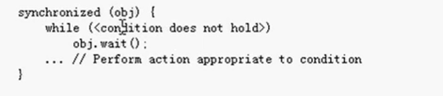
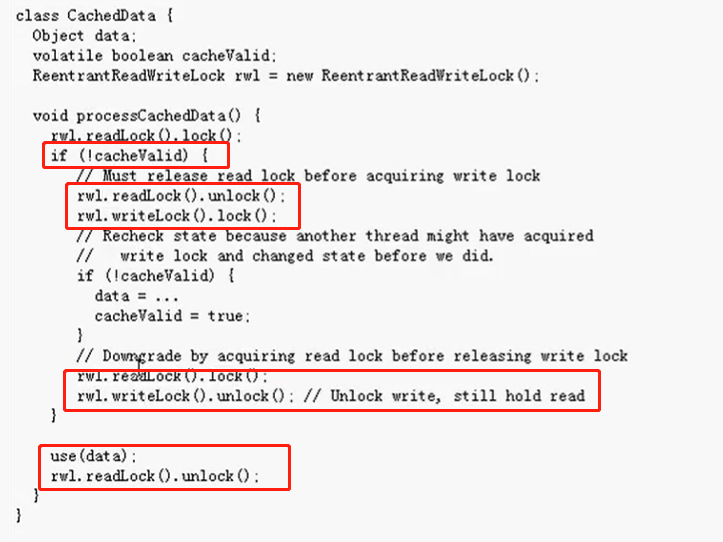

# 传统线程技术回顾

创建线程的两种方式：

1. 创建Thread的子类，重写run方法
2. 给Thread类传入Runnable接口

两种方式的区别：

第二种方式可以实现数据共享，而且更倾向于面向对象的编程思想。一般都是采用第二种方式。

`new Thread().start();`

调用了start方法后，就会运行Thread类的run方法,如下

```java
public void run() {
    if (target != null) {
        targe.run();
    }
}
```

如果target为空，就什么也不做

```java
    new Thread(new Runnable() {
      public void run() { //1
      }
    }) {
      public void run() { //2
      }
    }.start();
```

执行的是2run方法

执行的步骤：

先运行子类的run方法，如果子类没有重写run方法，就去运行父类的run方法，上述代码中子类重写了run方法，所以就不会运行Runnable中的run方法。

# 传统定时器技术回顾

1秒后炸一次，每隔2秒炸一次

```java
    new Timer().schedule(new TimerTask() {
      @Override
      public void run() {
        System.out.println("bombing!");
      }
    }, 1000, 2000);
```

 每隔两秒钟炸一次，注意：每个TimerTask()只能运行一次

```java
    class MyTimerTask extends TimerTask{
      @Override
      public void run() {
        System.out.println("bombing!");
        new Timer().schedule(new MyTimerTask() ,2000);
      }
    }

    new Timer().schedule(new  MyTimerTask(), 2000);
```

先隔一秒炸一次，再隔两秒钟炸一次，再搁一秒钟炸一次，。。。。

```java
private static int count = 0;

class MyTimerTask extends TimerTask {

      @Override
      public void run() {
        count = (count + 1) % 2;
        System.out.println("bombing!");
        new Timer().schedule(new MyTimerTask(), 1000 + count * 1000);
      }
    }

    new Timer().schedule(new MyTimerTask(), 1000);
```

# 传统线程互斥技术

在静态方法中，不能new内部类的实例对象

1. 外部类中的成员变量、方法以及内部类其实三者都在同一个级别上，三者都必须由外部类的实例对象才能调用（举例：当一个方法被调用时，此时肯定已经有了外部类的实例对象。），故而他们三者可以互相引用。
2. 而静态main方法因为其方法为静态，在类编译时，便生成了该静态方法，故而其运行不依赖于外部类的实例对象，因为内部类要依赖于外部类的实例对象才能创建，所以在该静态方法中直接new内部类肯定会报错；而在其他普通方法中可以new内部类，因为其他的普通方法必须有了外部类的实例对象，才能可能会调用该方法，既然有了实例对象，在普通方法中便能直接new内部类了。

判断一个程序是否可能会有线程安全问题：

1. 是否是多线程环境
2. 是否有共享数据
3. 是否有多个线程操作共享数据

线程不安全的本质是：**当有多个线程同时操作同一数据对象时（线程并发），就容易导致数据状态错误的情况，这时的数据就不安全了**

使用synchronized解决线程问题

1. 同步代码块

   ```java
   synchronized(这里填的是想要同步的线程（也就是想要排队的线程）所共享的对象) {
   	//需要同步的代码块（这部分的代码块越少程序执行效率就越高）
   }
   ```
2. 实例方法上使用synchronized

   ```java
   synchronized public boolean buy() {

       if (ticketNums > 0) {
         ticketNums--;
         System.out.println(Thread.currentThread().getName() + "成功出票，剩余票数为" + ticketNums);
         try {
           Thread.sleep(200);
         } catch (InterruptedException e) {
           e.printStackTrace();
         }
         return true;
       } else {
         System.out.println(Thread.currentThread().getName() + "余票不足，停止售票！");
         return false;
       }
     }
   ```
3. 在静态方法上使用synchronized 表示锁对象是类锁（字节码文件对象），类锁永远只有一把（为了保护静态变量的安全）

   注：

   * 局部变量永远都不会存在线程安全问题，因为局部变量在栈中不共享，一个线程一个栈
   * 实例变量在堆内存中，静态变量在方法区内存中，堆内存和方法区内存都是多线程共享的，所以可能存在线程安全问题
   * 同步机制虽然可以解决数据安全问题，但其缺点在于当线程相当多时，因为每个线程都会去判断同步上的锁对象，极其耗费资源，无形中会降低程序的运行效率
   * synchronized在开发中最好不要嵌套使用，可能会导致死锁（指两个或两个以上的线程在执行的过程中，因争夺资源产生的一种相互等待现象）（比如线程1在请求a资源的时候，线程2也在请求b资源，随后线程1需要请求b资源，线程2需要请求a资源，但b资源在线程2手中，a资源在线程1手中，都需要互相等待从而出现死锁）
   * 静态方法的锁是本类的class字节码文件对象，而普通方法上默认使用this关键字作为锁。当使用synchronized关键字修饰普通方法时，默认会对该方法所属对象（即this）进行加锁，确保同一时间只有一个线程可以访问该普通方法。
4. 解决线程问题的方案

* 尽量使用局部变量代替实例变量和静态变量
* 如果必须是实例变量，那么可以考虑创建多个对象，一个线程一个对象，这样实例变量的内存就不共享了(尽量不要去共享对象)
* 如果不能使用局部变量，对象也不能创建多个，这个时候就只能选择synchronized同步机制了

# 传统线程同步通信技术

互斥方案一：（不推荐）

```java
class Test1 {
    public void printThread() {
      new Thread(new Runnable() {
        @Override
        public void run() {
          for (int i = 1; i <= 50; i++) {
            synchronized (TraditionalThread1.class) {
              for (int j = 1; j <= 10; j++) {
                System.out.println("sub thread print " + j + "," + "parent thread loop " + i);
              }
            }
          }
        }
      }).start();
      for (int i = 1; i <= 50; i++) {
        synchronized (TraditionalThread1.class) {
          for (int j = 1; j <= 10; j++) {
            System.out.println("main thread print " + j + "," + "parent thread loop " + i);
          }
        }
      }
    }
  }
```

互斥方案二：



```java
 public static void main(String[] args) {
    new TraditionalThread1().init();
  }

public void init(){
    Test2 test2 = new Test2();
    new Thread(new Runnable() {
      @Override
      public void run() {
        for (int i = 1; i <= 50; i++) {
          test2.printSub(i);
        }
      }
    }).start();

    for (int i = 1; i <= 50; i++) {
      test2.printMain(i);
    }
  }


 public class Test2{
    private boolean bShouldSub = true;
    public synchronized void printSub(int i){
      while (!bShouldSub){
        try {
          this.wait();
        } catch (InterruptedException e) {
          e.printStackTrace();
        }
      }
      for (int j = 1; j <= 10; j++) {
        System.out.println("sub thread print " + j + "," + "parent thread loop " + i);
      }
      bShouldSub = false;
      notify();
    }

    public synchronized void printMain(int i){
      while (bShouldSub){
        try {
          this.wait();
        } catch (InterruptedException e) {
          e.printStackTrace();
        }
      }
      for (int j = 1; j <= 100; j++) {
        System.out.println("main thread print " + j + "," + "parent thread loop " + i);
      }
      bShouldSub = true;
      notify();
    }
  }
```

# 线程范围内变量的概念

线程内部共享数据，线程间数据独立

```java
public class ThreadScopeShareData {

  private static Map<Thread, Integer> threadData = new HashMap<Thread, Integer>();

  public static void main(String[] args) {
    for (int i = 0; i < 2; i++) {
      new Thread(new Runnable() {
        @Override
        public void run() {
          int data = new Random().nextInt();
          System.out.println(Thread.currentThread().getName() + " has put data :" + data);
          threadData.put(Thread.currentThread(), data);
          new A().get();
          new B().get();
        }
      }).start();
    }
  }

  static class A {
    public void get() {
      int data = threadData.get(Thread.currentThread());
      System.out.println("A from " + Thread.currentThread().getName() + " get data :" + data);
    }
  }

  static class B {
    public void get() {
      int data = threadData.get(Thread.currentThread());
      System.out.println("B from " + Thread.currentThread().getName() + " get data :" + data);
    }
  }

}
```

# ThreadLocal类及其应用技巧

ThreadLocal类，实现了线程内部共享数据，线程间数据独立，比05节视频中的更加简化方便

《1》

```java
public class ThreadLocalTest {

  public static void main(String[] args) {
    new ThreadLocalTest().init();
  }

  //init

  private void init() {
    for (int i = 0; i < 2; i++) {
      new Thread(new Runnable() {
        public void run() {
          int data = new Random().nextInt();
          Person.getThreadInstance().setName(Thread.currentThread().getName());
          Person.getThreadInstance().setAge(data);
          new A().get();
          new B().get();
        }
      }).start();
    }
  }

  //A

  class A {
    Person person = Person.getThreadInstance();

    public void get() {
      System.out.println("A：-" + Thread.currentThread().getName() + ":name:" + person.getName() + ":age:" + person.getAge());
    }
  }

  //B

  class B {
    Person person = Person.getThreadInstance();

    public void get() {
      System.out.println("B：-" + Thread.currentThread().getName() + ":name:" + person.getName() + ":age:" + person.getAge());
    }

  }

  //Person   将跟线程相关的绑定，放在共享的数据类的内部实现

  static class Person {
    private static ThreadLocal<Person> threadLocal = new ThreadLocal<ThreadLocalTest.Person>();

    private Person() {
    }

    public static Person getThreadInstance() {
      Person person = threadLocal.get();
      if (person == null) {
        person = new Person();
        threadLocal.set(person);
      }
      return person;
    }

    private String name;

    private int age;

    public String getName() {
      return name;
    }

    public void setName(String name) {
      this.name = name;
    }

    public int getAge() {
      return age;
    }

    public void setAge(int age) {
      this.age = age;
    }
  }

}
```

《2》

```java
public class ThreadLocalTest1 {

  public static final ThreadLocal<Person> threadlocal = new ThreadLocal() {
    @Override
    protected Object initialValue() {
      return new Person();
    }
  };

  public static void main(String[] args) {
    new ThreadLocalTest1().init();
  }

  private void init() {
    for (int i = 0; i < 2; i++) {
      new Thread(new Runnable() {
        public void run() {
          int data = new Random().nextInt();
          threadlocal.get().setName(Thread.currentThread().getName());
          threadlocal.get().setAge(data);
          new A().get();
          new B().get();
        }
      }).start();
    }
  }

  //A

  class A {
    Person person = threadlocal.get();

    public void get() {
      System.out.println("A：-" + Thread.currentThread().getName() + ":name:" + person.getName() + ":age:" + person.getAge());
    }
  }

  //B

  class B {
    Person person = threadlocal.get();

    public void get() {
      System.out.println("B：-" + Thread.currentThread().getName() + ":name:" + person.getName() + ":age:" + person.getAge());
    }
  }

  //Person

  static class Person {
    public Person() {
    }

    private String name;
    private int age;

    public String getName() {
      return name;
    }

    public void setName(String name) {
      this.name = name;
    }

    public int getAge() {
      return age;
    }

    public void setAge(int age) {
      this.age = age;
    }

  }

}
```

# 多个线程之间共享数据的方式的讨论

如果 每个线程执行的代码相同，可以使用同一个Runnable对象，这个Runnable对象中有那个共享数据，例如，买票系统就可以这么做。

如果每个线程执行的代码不同，这时候需要用不同的Runnable对象，有如下两种方式来实现这些Runnable对象之间的数据共享：

第一种： 将共享数据封装在另外一个对象中，然后将这个对象逐一传递给各个Runnable对象。每个线程对共享数据的操作方法也分配到那个对象身上去完成，这样容易实现针对该数据进行的各个操作的互斥和通信。

第二种：将这些Runnable对象作为某一个类中的内部类，共享数据作为这个外部类中的成员变量，每个线程对共享数据的操作方法也分配给外部类，以便实现对共享数据进行的各个操作的互斥和通信，作为内部类的各个Runnable对象调用外部类的这些方法。

上面两种方式的组合：将共享数据封装在另外一个对象中，每个线程对共享数据的操作方法也分配到那个对象身上去完成，对象作为这个外部类中的成员变量或方法中的局部变量，每个线程Runnable对象作为外部类中的成员内部类或局部内部类。

总之，要同步互斥的几段代码最好是分别放在几个独立的方法中，这些方法再放在同一个类中，这样比较容易实现它们之间的同步互斥和通信。

极端且简单的方式，即在任意一个类中定义一个static的变量，这将被所有线程共享。

设计四个线程，其中两个线程每次对j加一，另外两个线程每次对j减一

第一种示例代码

```java
public class MultiThreadShareData {
  private static ShareData shareData = new ShareData();

  public static void main(String[] args) {
    MyRunnable1 runNable1 = new MyRunnable1(shareData);
    MyRunnable2 runNable2 = new MyRunnable2(shareData);
    new Thread(runNable1).start();
    new Thread(runNable2).start();
  }
}

class ShareData {
  private int j = 0;

  public ShareData() {
  }

  public void increment() {
    j++;
  }

  public void decrement() {
    j--;
  }

}

class MyRunnable1 implements Runnable {
  private ShareData shareData;

  public MyRunnable1(ShareData shareData) {
    this.shareData = shareData;
  }

  public void run() {
    this.shareData.increment();
  }
}

class MyRunnable2 implements Runnable {
  private ShareData shareData;

  public MyRunnable2(ShareData shareData) {
    this.shareData = shareData;
  }

  public void run() {
    this.shareData.decrement();
  }

}
```

或者（怪怪的）

```java
public class MultiThreadShareData1 {

  public static void main(String[] args) {

    MultiThreadShareData1 multiThreadShareData = new MultiThreadShareData1();
    ShareData shareData = multiThreadShareData.new ShareData();
    MyRunnable1 runNable1 = multiThreadShareData.new MyRunnable1(shareData);
    MyRunnable2 runNable2 = multiThreadShareData.new MyRunnable2(shareData);
    new Thread(runNable1).start();
    new Thread(runNable2).start();
  }

  class ShareData {
    private int j = 0;

    public ShareData() {
    }

    public void increment() {
      j++;
    }

    public void decrement() {
      j--;
    }

  }

  class MyRunnable1 implements Runnable {
    private ShareData shareData;

    public MyRunnable1(ShareData shareData) {
      this.shareData = shareData;
    }

    public void run() {
      this.shareData.increment();
    }

  }

  class MyRunnable2 implements Runnable {

    private ShareData shareData;

    public MyRunnable2(ShareData shareData) {
      this.shareData = shareData;
    }

    public void run() {
      this.shareData.decrement();
    }

  }

}
```

**第二种示例代码**

```java
public class MultiThreadShareData2 {

  public static void main(String[] args) {
    final ShareData1 shareData = new ShareData1();
    new Thread(new Runnable() {
      public void run() {
        shareData.increment();
      }

    }).start();

    new Thread(new Runnable() {
      public void run() {
        shareData.decrement();
      }
    }).start();

  }

}

class ShareData1 {

  private int j = 0;

  public ShareData1() {
  }

  public void increment() {
    j++;
  }

  public void decrement() {
    j--;
  }

}
```

# Java5原子性操作类的应用

Java5引入了一些原子性操作类，用于在多线程环境下保证操作的原子性。这些原子性操作类位于java.util.concurrent.atomic包中，主要包括以下几个类：

1. AtomicBoolean：提供了原子性的布尔值操作，可以保证对布尔值的操作是原子性的。
2. AtomicInteger：提供了原子性的整数操作，可以保证对整数的操作是原子性的。
3. AtomicLong：提供了原子性的长整型操作，可以保证对长整型的操作是原子性的。
4. AtomicReference：提供了原子性的对象引用操作，可以保证对对象引用的操作是原子性的。

这些原子性操作类通过使用底层的CAS（Compare and Swap）操作来实现原子性。CAS是一种乐观锁的机制，通过比较并交换的方式来实现对共享变量的原子操作。

使用原子性操作类可以避免使用传统的锁机制（如synchronized关键字）带来的性能开销，提高多线程程序的并发性能。但需要注意，原子性操作类并不能解决所有的线程安全问题，仍然需要根据具体的业务逻辑进行合理的设计和使用。

比如：counter++其实不是一个整体，需要先读再加

在多线程环境下，多个线程同时对counter进行自增操作时，可能会出现竞态条件（Race Condition）。例如，一个线程读取了counter的值，然后另一个线程也读取了相同的值，然后两个线程都执行自增操作，最后写回counter的值。这样会导致最终的counter值不是预期的结果。

AtomicInteger

```java
import java.util.concurrent.atomic.AtomicInteger;

public class AtomicIntegerExample {
    private static AtomicInteger counter = new AtomicInteger(0);

    public static void main(String[] args) {
        Thread thread1 = new Thread(new IncrementTask());
        Thread thread2 = new Thread(new IncrementTask());

        thread1.start();
        thread2.start();

        try {
            thread1.join();
            thread2.join();
        } catch (InterruptedException e) {
            e.printStackTrace();
        }

        System.out.println("Counter: " + counter.get());
    }

    static class IncrementTask implements Runnable {
        @Override
        public void run() {
            for (int i = 0; i < 1000; i++) {
                counter.incrementAndGet();
            }
        }
    }
}
```

AtomicIntegerFieldUpdater

```java
public class AtomicIntegerFieldUpdaterDemo {
 
    public static class Candidate {
        int id;
        volatile int score = 0;
        AtomicInteger score2 = new AtomicInteger();
    }
 
    public static final AtomicIntegerFieldUpdater<Candidate> scoreUpdater =  AtomicIntegerFieldUpdater.newUpdater(Candidate.class, "score");
 
    public static AtomicInteger realScore = new AtomicInteger(0);
 
    public static void main(String[] args) throws InterruptedException {
        final Candidate candidate = new Candidate();
        Thread[] t = new Thread[10000];
        for (int i = 0; i < 10000; i++) {
            t[i] = new Thread() {
                @Override
                public void run() {
                    if (Math.random() > 0.4) {
                        candidate.score2.incrementAndGet();
                        scoreUpdater.incrementAndGet(candidate);
                        realScore.incrementAndGet();
                    }
                }
            };
            t[i].start();
        }
        for (int i = 0; i < 10000; i++) {
            t[i].join();
        }
        System.out.println("AtomicIntegerFieldUpdater Score=" + candidate.score);
        System.out.println("AtomicInteger Score=" + candidate.score2.get());
        System.out.println("realScore=" + realScore.get());
 
    }
}
```

# Java5线程并发库的应用

**线程池的概念与Executors类的应用**

1、创建一个固定线程数量的线程池，内有3个线程，分配给了100个任务，3个线程执行这10个任务，当一个线程执行完一个任务之后，再去执行另一个任务，直到所有的任务执行完毕，但线程池中线程不会销毁。（按线程数量乱序）

```java
public class ExecutorServicePool {

  public static void main(String[] args) {
    ExecutorService threadPool = Executors.newFixedThreadPool(3);
    for (int i = 1; i <= 10; i++) {
      final int taskId = i;
      threadPool.execute(new Runnable() {
        public void run() {
          for (int j = 1; j <= 10; j++) {
            System.out.println(Thread.currentThread().getName() + "----" + j + "次" + "execute task" + taskId);
          }
        }
      });
    }
    //未完成任务就杀死线程
    threadPool.shutdownNow();
  }
}
```

2、创建一个缓存线程池，缓存线程池中线程的数量是不固定的，动态变化，刚开始有3个任务，就只有3个线程，后来又来了6个任务，那就又增加了6个线程，任务执行完后，超时一段时间，多余线程销毁。（按自动变化情况乱序）

```java
public class ExecutorServicePool {

  public static void main(String[] args) {
//    ExecutorService threadPool = Executors.newFixedThreadPool(3);

    ExecutorService threadPool = Executors.newCachedThreadPool();
    for (int i = 1; i <= 10; i++) {
      final int taskId = i;
      threadPool.execute(new Runnable() {
        public void run() {
          for (int j = 1; j <= 10; j++) {
            System.out.println(Thread.currentThread().getName() + "----" + j + "次" + "execute task" + taskId);
          }
        }
      });
    }
    //未完成任务就杀死线程
//    threadPool.shutdownNow();
  }
}

```

3、线程终止

```java
executorService.shutdown();        //当所有线程都空闲的时候，杀死线程，终止程序。

executorService.shutdownNow();//不管线程中的任务有没有执行完，都杀死线程。
```

4、创建一个只含有一个线程的线程池，该线程池只含有一个线程，当线程池里的线程被销毁后，线程池又会创建一个线程，替代原来的线程（顺序执行）

```java
public class ExecutorServicePool {

  public static void main(String[] args) {
//    ExecutorService threadPool = Executors.newFixedThreadPool(3);
//    ExecutorService threadPool = Executors.newCachedThreadPool();
    ExecutorService threadPool = Executors.newSingleThreadExecutor();
    for (int i = 1; i <= 10; i++) {
      final int taskId = i;
      threadPool.execute(new Runnable() {
        public void run() {
          for (int j = 1; j <= 10; j++) {
            System.out.println(Thread.currentThread().getName() + "----" + j + "次" + "execute task" + taskId);
          }
        }
      });
    }
    //未完成任务就杀死线程
//    threadPool.shutdownNow();
  }
}
```

5、创建一个调度线程池，内含有3个线程，实现10秒定时执行功能

```java
class ScheduledExecutorServiceTest{
  public static void main(String[] args) {
    ScheduledExecutorService scheduledExecutorService = Executors.newScheduledThreadPool(3);
    scheduledExecutorService.schedule(new Runnable() {
      public void run() {
        System.out.println("bomb!!!");
      }
    },10, TimeUnit.SECONDS);
  }
}
```

6、创建一个调度线程池，内含有3个线程，实现10秒定时执后，以后每隔2秒执行一次的功能。

```java
class ScheduledExecutorServiceTest{
  public static void main(String[] args) {

    ScheduledExecutorService scheduledExecutorService = Executors.newScheduledThreadPool(3);
    scheduledExecutorService.scheduleAtFixedRate(new Runnable() {
      public void run() {
        System.out.println("bomb!!!");
      }
    },10, 2, TimeUnit.SECONDS);
  }
}
```

# Callable与Future的应用

Future取得的结果类型和Callable返回的结果类型必须一致，这是通过泛型来实现的。

Callable要采用ExecutorSevice的submit方法提交，返回的future对象可以取消任务。

获取结果时还可以超时直接离开

```java
public class CallableTest {
  public static void main(String[] args) {
    System.out.println("主线程：：：："+Thread.currentThread().getName());
    ExecutorService executorService = Executors.newSingleThreadExecutor();
    Future future = executorService.submit(new Callable() {
      public Object call() throws Exception {
        Thread.sleep(2000);
        return Thread.currentThread().getName();
      }
    });
    String string = null;
    try {
      System.out.println("等待开始");
      string = (String) future.get();//没有结果会一直等待，知道有结果为止
      //string = (String) future.get(10, TimeUnit.SECONDS);**//等待10s，没有有结果报异常**
      System.out.println("等待结束");
    } catch (Exception e) {
      e.printStackTrace();
    }
    System.out.println("Callable线程：：：："+string);
  }
}
```

CompletionService用于提交一组Callable任务，其take方法返回已完成的一个Callable任务对应的Future对象。

好比我同时种了几块地的麦子，然后就等待收割。收割时，则是那块先成熟了，则先去收割哪块麦子。

```java
class CallableTest1 {
  public static void main(String[] args) {
    ExecutorService executorService1 = Executors.newFixedThreadPool(10);
    CompletionService completionService = new ExecutorCompletionService(executorService1);
    for (int i = 1; i <= 10; i++) {
      final int taskId = i;
      completionService.submit(new Callable() {
        public Object call() throws Exception {
          Thread.sleep(new Random().nextInt(5000));
          return "执行完的任务的ID::::" + taskId;
        }
      });
    }

    for (int i = 1; i <= 10; i++) {
      try {
        String string1 = (String) completionService.take().get();
        System.out.println(string1);
      } catch (Exception e) {
        e.printStackTrace();
      }
    }
  }
}
```

# java5的线程锁技术

Lock比传统线程模型中的synchronized方式更加面向对象，与生活中的锁类似，锁本身也应该是一个对象。两个线程执行的代码片段要实现同步互斥的效果，它们必须用同一个Lock对象。

```java
public class LockTest {
  public static void main(String[] args) {
    new LockTest().action();
  }

  private void action() {
    final Outputer outputer = new Outputer();
    new Thread(new Runnable() {
      public void run() {
        for (int i = 0; i < 10; i++) {
          outputer.output("zhangxiaoxiang\n");
        }
      }
    }).start();

    new Thread(new Runnable() {
      public void run() {
        for (int i = 0; i < 10; i++) {
          outputer.output("lihuoming\n");
        }
      }
    }).start();
  }

  private class Outputer {
    private Lock lock = null;

    public Outputer() {
      lock = new ReentrantLock();
    }

    public void output(String name) {

      lock.lock();
      try {
        for (int i = 0; i < name.length(); i++) {
          System.out.print(name.charAt(i));
        }
        ;

      } finally {
        lock.unlock();
      }
    }

  }
}
```

# java5读写锁技术的妙用

读写锁：在同一时刻允许多个读线程访问，但是当写线程访问，所有的写线程和读线程均被阻塞。读写锁维护了一个读锁加一个写锁，通过读写锁分离的模式来保证线程安全，性能高于一般的排他锁。

readLock()和writeLock()，分别返回读锁和写锁。读锁和写锁是互斥的，即在同一时间只能有一个线程持有读锁或写锁。当读锁被持有时，其他线程可以继续持有读锁，但是不能持有写锁。当写锁被持有时，其他线程既不能持有读锁，也不能持有写锁。

```java
public class ReadWriteLockTest {
  public static void main(String[] args) {
    final Queue3 q3 = new Queue3();
    for (int i = 0; i < 3; i++) {
      new Thread() {
        public void run() {
          while (true) {
            q3.get();
          }
        }
      }.start();
      new Thread() {
        public void run() {
          while (true) {
            q3.put(new Random().nextInt(10000));
          }
        }
      }.start();
    }
  }
}

class Queue3 {
  private Object data = null;//共享数据，只能有一个线程能写该数据，但可以有多个线程同时读该数据。
  ReadWriteLock rwl = new ReentrantReadWriteLock();

  public void get() {
    rwl.readLock().lock();
    try {
      System.out.println(Thread.currentThread().getName() + " be ready to read data!");
      Thread.sleep((long) (Math.random() * 1000));
      System.out.println(Thread.currentThread().getName() + "have read data :" + data);
    } catch (InterruptedException e) {
      e.printStackTrace();
    } finally {
      rwl.readLock().unlock();
    }
  }

  public void put(Object data) {
    rwl.writeLock().lock();
    try {
      System.out.println(Thread.currentThread().getName() + " be ready to write data!");
      Thread.sleep((long) (Math.random() * 1000));
      this.data = data;
      System.out.println(Thread.currentThread().getName() + " have write data: " + data);
    } catch (InterruptedException e) {
      e.printStackTrace();
    } finally {
      rwl.writeLock().unlock();
    }
  }
}
```

缓存系统示例代码

在ReentrantReadWriteLock读写锁中，只支持写锁降级为读锁，而不支持读锁升级为写锁（）



```java
public class CacheDemo {

  private Map cacheMap = new HashMap<String, Object>();

  public static void main(String[] args) throws Exception {
    Object o = new CacheDemo().get(1);
    System.out.println(o);
  }

  private ReadWriteLock rwl = new ReentrantReadWriteLock();

  public Object get(int key) throws Exception {
    rwl.readLock().lock();
    Object value = null;
    try {
      value = cacheMap.get(key);
      if (value == null) {
        rwl.readLock().unlock();
        rwl.writeLock().lock();
        try {
          value = "aaaa";//实际上是queryDB()
          if (value == null) {
            throw new Exception();
          }
          cacheMap.put(key, value);
        } finally {
	  rwl.readLock().lock();
          rwl.writeLock().unlock();
        }
      }

    } finally {
      rwl.readLock().unlock();
    }
    return value;
  }
}
```

# java5条件阻塞Condition的应用

阻塞队列

```java
public class BoundedBuffer {

  final Lock lock = new ReentrantLock();

  final Condition notFull = lock.newCondition();// notFull  缓存不满

  final Condition notEmpty = lock.newCondition();//notEmpty 缓存非空

  final Object[] items = new Object[100];

  int putptr, takeptr, count;

  public void put(Object x) throws InterruptedException {
    lock.lock();
    try {
      while (count == items.length) {
        notFull.await();//缓存不满这个条件是假的 及意思是 缓存是满的
      }
      items[putptr] = x;
      if (++putptr == items.length) {
        putptr = 0;
      }
      ++count;
      notEmpty.signal();//缓存非空这个条件是真的
    } finally {
      lock.unlock();
    }

  }

  public Object take() throws InterruptedException {

    lock.lock();
    try {
      while (count == 0) {
        notEmpty.await();//缓存非空这个条件是假的   及意思是  现在缓存是空的
      }
      Object x = items[takeptr];
      if (++takeptr == items.length) {
        takeptr = 0;
      }
      --count;
      notFull.signal();//缓存不满这个条件是真的
      return x;
    } finally {
      lock.unlock();
    }
  }
}

```

# java5 Semaphere同步工具

Semaphore可以维护当前访问自身的线程个数，并提供了同步机制。使用Semaphore可以控制同时访问资源的线程个数，例如，实现一个文件允许的并发访问数。

Semaphore实现的功能就类似厕所有5个坑，假如有十个人要上厕所，那么同时能有多少个人去上厕所呢？同时只能有5个人能够占用，当5个人中的任何一个人让开后，其中在等待的另外5个人中又有一个可以占用了。 另外等待的5个人中可以是随机获得优先机会，也可以是按照先来后到的顺序获得机会，这取决于构造Semaphore对象时传入的参数选项。

单个信号量的Semaphore对象可以实现互斥锁的功能，并且可以是由一个线程获得了“锁”，再由另一个线程释放“锁”，这可应用于死锁恢复的一些场合。

```java
public class TwoTest {

  public static void main(String[] args) {
    ExecutorService executorService = Executors.newCachedThreadPool();
    final Semaphore semaphore = new Semaphore(3);
    for (int i = 0; i < 10; i++) {
      Runnable runnable = new Runnable() {
        public void run() {
          try {
            semaphore.acquire();
            System.out.println("线程" + Thread.currentThread().getName() + "进入，当前已有" + (3 - semaphore.availablePermits()) + "个并发");
            Thread.sleep((long) (Math.random() * 10000));
            System.out.println("线程" + Thread.currentThread().getName() + "即将离开");
            semaphore.release();
            //下面代码有时候执行不准确，因为其没有和上面的代码合成原子单元
            System.out.println("线程" + Thread.currentThread().getName() + "已离开，当前已有" + (3 - semaphore.availablePermits()) + "个并发");
          } catch (InterruptedException e) {
            e.printStackTrace();
          }
        }
      };
      executorService.execute(runnable);
    }
  }
}
```

# java5 CyclicBarrier同步工具

表示大家彼此等待，大家集合好后才开始出发，分散活动后又在指定地点集合碰面，这就好比整个公司的人员利用周末时间集体郊游一样，先各自从家出发到公司集合后，再同时出发到公园游玩，在指定地点集合后再同时开始就餐，…。

```java
public class CyclicBarrierTest {

  public static void main(String[] args) {
    ExecutorService executorService = Executors.newCachedThreadPool();
    final CyclicBarrier cyclicBarrier = new CyclicBarrier(3);
    for (int i = 1; i <= 3; i++) {
      Runnable runnable = new Runnable() {
        public void run() {
          try {
            Thread.sleep((long) (Math.random() * 10000));

            System.out.println("线程" + Thread.currentThread().getName() + "即将到达集合点1" +
                    "，当前已有" + (cyclicBarrier.getNumberWaiting() + 1) + "个到达集合点," +
                    (cyclicBarrier.getNumberWaiting() == 2 ? "都到齐了，继续走啊" : "正在等候"));
            cyclicBarrier.await();
            Thread.sleep((long) (Math.random() * 10000));
            System.out.println("线程" + Thread.currentThread().getName() +
                    "即将到达集合地点2，当前已有" + (cyclicBarrier.getNumberWaiting() + 1) + "个已经到达，" + (cyclicBarrier.getNumberWaiting() == 2 ? "都到齐了，继续走啊" : "正在等候"));
            cyclicBarrier.await();
            Thread.sleep((long) (Math.random() * 10000));
            System.out.println("线程" + Thread.currentThread().getName() +
                    "即将到达集合地点3，当前已有" + (cyclicBarrier.getNumberWaiting() + 1) + "个已经到达，" + (cyclicBarrier.getNumberWaiting() == 2 ? "都到齐了，继续走啊" : "正在等候"));
            cyclicBarrier.await();
          } catch (Exception e) {
            e.printStackTrace();
          }
        }
      };
      executorService.execute(runnable);
    }
    executorService.shutdown();
  }
}
```

# java5 CountDownLatch同步工具

犹如倒计时计数器，调用CountDownLatch对象的countDown方法就将计数器减1，当计数到达0时，则所有等待者或单个等待者开始执行。这直接通过代码来说明CountDownLatch的作用，这样学员的理解效果更直接。

可以实现一个人（也可以是多个人）等待其他所有人都来通知他，这犹如一个计划需要多个领导都签字后才能继续向下实施。还可以实现一个人通知多个人的效果，类似裁判一声口令，运动员同时开始奔跑。用这个功能做百米赛跑的游戏程序不错哦！

import java.util.concurrent.ExecutorService;

import java.util.concurrent.Executors;

public class CountDownLatch {

    public static void main(String[] args) {

    ExecutorService executorService = Executors.newCachedThreadPool();

    final java.util.concurrent.CountDownLatch orderCount = new java.util.concurrent.CountDownLatch(1);

    final java.util.concurrent.CountDownLatch ansCount = new java.util.concurrent.CountDownLatch(3);

    for(int i=1;i<=3;i++){

    Runnable runnable = new Runnable() {

    public void run() {

    System.out.println("线程" + Thread.currentThread().getName() +"正准备接受命令");

    try {

    orderCount.await();

    System.out.println("线程" + Thread.currentThread().getName() +  "已接受命令");

    Thread.sleep((long)(Math.random()*10000));

    System.out.println("线程" + Thread.currentThread().getName() +   "回应命令处理结果");

    ansCount.countDown();

    } catch (InterruptedException e) {

    e.printStackTrace();

    }

    }

    };

    executorService.execute(runnable);

    }

    try {

    Thread.sleep((long)(Math.random()*10000));

    System.out.println("线程" + Thread.currentThread().getName() +  "即将发布命令");

    orderCount.countDown();

    System.out.println("线程" + Thread.currentThread().getName() +"已发送命令，正在等待结果");

    ansCount.await();

    System.out.println("线程" + Thread.currentThread().getName() +"已收到所有响应结果");

    } catch (InterruptedException e) {

    e.printStackTrace();

    }

    executorService.shutdown();

  }

}

/********* 17张孝祥java5的Exchanger同步工具 *************/
用于实现两个人之间的数据交换，每个人在完成一定的事务后想与对方交换数据，第一个先拿出数据的人将一直等待第二个人拿着数据到来时，才能彼此交换数据。

import java.util.concurrent.Exchanger;

import java.util.concurrent.ExecutorService;

import java.util.concurrent.Executors;

public class ExchangerTest {

    public static void main(String[] args) {

    ExecutorService executorService = Executors.newCachedThreadPool();

    final Exchanger exchanger = new Exchanger();

    executorService.execute(new Runnable() {

    public void run() {

    try {

    String data1 = "毒品";

    System.out.println("线程" + Thread.currentThread().getName() +"正在把" + data1 +"换出去");

    Thread.sleep((long) (Math.random()*10000));

    String data2 = (String) exchanger.exchange(data1);

    System.out.println("线程" + Thread.currentThread().getName() + "换回" + data2);

    } catch (InterruptedException e) {

    e.printStackTrace();

    }

    }

    });

    executorService.execute(new Runnable() {

    public void run() {

    try {

    String data1 = "美金";

    System.out.println("线程" + Thread.currentThread().getName() +"正在把" + data1 +"换出去");

    Thread.sleep((long) (Math.random()*10000));

    String data2 = (String) exchanger.exchange(data1);

    System.out.println("线程" + Thread.currentThread().getName() + "换回" + data2);

    } catch (InterruptedException e) {

    // TODO Auto-generated catch block

    e.printStackTrace();

    }

    }

    });

    }

}

/*************** 18张孝祥java5阻塞队列的应用 ****************/

什么是可阻塞队列，阻塞队列的作用与实际应用，阻塞队列的实现原理。

阻塞队列与Semaphore有些相似，但也不同，阻塞队列是一方存放数据，另一方释放数据，Semaphore通常则是由同一方设置和释放信号量。

ArrayBlockingQueue 只有put方法和take方法才具有阻塞功能

用3个空间的队列来演示阻塞队列的功能和效果。

import java.util.concurrent.ArrayBlockingQueue;

import java.util.concurrent.BlockingDeque;

import java.util.concurrent.BlockingQueue;

public class BlockQueueTest {

 /**

* @param args

  */

 public static void main(String[] args) {

    final BlockingQueue blockingQueue = new ArrayBlockingQueue(3);

    for(int i=1;i<=2;i++){

    new Thread(new Runnable() {

    public void run() {

    while(true){

    try {

    Thread.sleep((long) (Math.random()*10000));

    System.out.println(Thread.currentThread().getName()+"准备放数据");

    blockingQueue.put(1);

    System.out.println(Thread.currentThread().getName()+"放数据成功"+"当前队列有"+blockingQueue.size()+"个数据");

    } catch (Exception e) {

    e.printStackTrace();

    }

    }

    }

    }).start();

    }

    new Thread(new Runnable() {

    public void run() {

    while(true){

    try {

    Thread.sleep((long) (Math.random()*10000));

    System.out.println(Thread.currentThread().getName() + "准备取数据!");

    blockingQueue.take();

    System.out.println(Thread.currentThread().getName()+"取数据成功"+"当前队列有"+blockingQueue.size()+"个数据");

    } catch (InterruptedException e) {

    e.printStackTrace();

    }

    }

    }

    }).start();

   }

}

用两个具有1个空间的队列来实现同步通知的功能。

import java.util.concurrent.ArrayBlockingQueue;

import java.util.concurrent.BlockingQueue;

public class BlockingQueueCommunicationTest {

    public static void main(String[] args) {

    new BlockingQueueCommunicationTest().execute();

    }

    private void execute(){

    final Business business = new Business();

    new Thread(new Runnable() {

    public void run() {

    for(int j=1;j<=100;j++){

    business.sub(j);

    }

    }

    }).start();

    for(int j=1;j<=100;j++){

    business.main(j);

    }

    }

    private class Business{

    BlockingQueue blockingQueue1 = new ArrayBlockingQueue(1);

    BlockingQueue blockingQueue2 = new ArrayBlockingQueue(1);

    //匿名构造方法，先于非匿名构造方法执行

    {

    try {

    blockingQueue2.put(1);

    } catch (InterruptedException e) {

    e.printStackTrace();

    }

    }

    public void sub(int j){

    try {

    blockingQueue1.put(1);

    } catch (InterruptedException e) {

    e.printStackTrace();

    }

    for(int i=1;i<=10;i++){

    System.out.println("sub thread sequece of " + i + ",loop of " + j);

    }

    try {

    blockingQueue2.take();

    } catch (InterruptedException e) {

    e.printStackTrace();

    }

    }

    public void main(int j){

    try {

    blockingQueue2.put(1);

    } catch (InterruptedException e) {

    e.printStackTrace();

    }

    for(int i=1;i<=10;i++){

    System.out.println("main thread sequece of " + i + ",loop of " + j);

    }

    try {

    blockingQueue1.take();

    } catch (InterruptedException e) {

    e.printStackTrace();

    }

    }

  }

}
