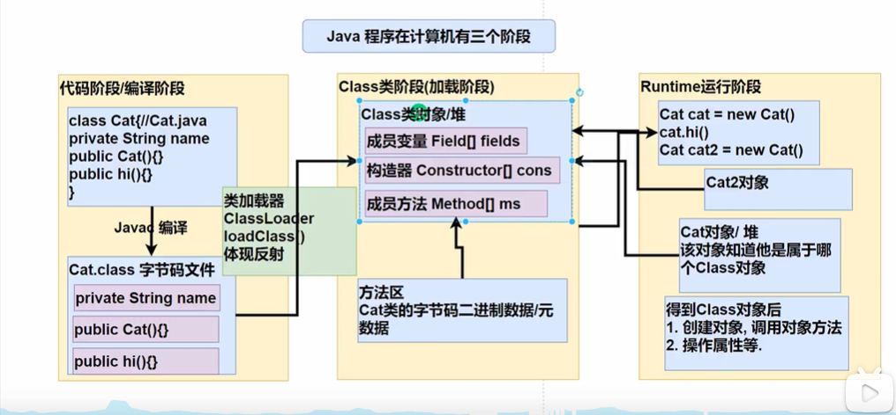

# 反射

## 反射的介绍

反射就是通过字节码文件对象把java类中的各种成分（变量、方法、构造方法）通过类加载器映射成一个java对象（class对象），实际上是通过class对象反向获取该类的信息，即通过类的字节码文件动态的解析类

## 反射机制的介绍

 Java反射说的是在运行状态中，对于任何一个类，我们都能够知道这个类有哪些方法和属性。 对于任何一个对象，我们都能够对它的方法和属性进行调用。 我们把这种动态获取对象信息和调用对象方法的功能称之为反射机制。



## 获取Class对象的六种方式

```java
//方式一：会导致类加载，类加载静态代码块执行
Class c = Class.forName("带有包名的完整类名");

//方式二：会执行静态代码块
Class c = 对象.getClass();

//方式三：java语言中任何一种类型，包括基本数据类型都有.class属性 不会执行静态代码块（不会静态初始化）
Class c = 任何类型.class;

//方式四：通过类加载器获取这个Class对象(4种类的 加载器)
ClassLoader classLoader = Student01.class.getClassLoader(); 
Class loadClass = classLoader.loadClass("com.bobo.study.demo.classLoader_.Student01");

//方式五：基本数据类型的class对象获取
Class cls = 基本数据类.class;

//方式六：基本数据类型的包装类的class对象获取
Class cls = 包装类.TYPE;
```

注：在运行期间，一个类只有一个class对象产生 类似一个模板

## 哪些类有class对象

1. 外部类,成员内部类,静态内部类,局部内部类,匿名内部类
2. interfac:接口
3. 数组
4. enum:枚举
5. annotation:注解
6. 基本数据类型
7. void

## 静态加载和静态加载

1. 静态加载:编译时加载相关的类，如果没有则报错，依赖性太强（直接new）
2. 动态加载:运行时加载需要的类，如果运行时不用该类，则不报错，降低了依赖性（通过反射）

## 类加载的五个阶段

1. 加载  JVM在该阶段的主要目的是将字节码从不同的数据源（可能是class文件、也可能是jar包，甚至网络）转化为二进制字节流加载到内存中，并生成一个代表该类的java.lang.Class对象
2. 连接：验证  目的是为了确保Class文件的字节流中包含的信息符合当前虚拟机的要求，并且不会危害虚拟机自身的安全。包括:文件格式验证(是否以魔数ox cafebabe开头)、元数据验证、字节码验证和符号引用验证，可以考虑使用-Xverify:none 参数来关闭大部分的类验证措施，缩短虚拟机类加载的时间。
3. 连接：准备  JVM会在该阶段对静态变量，分配内存并初始化(对应数据类型的默认初始值,如0、OL、null、false等)。这些变量所使用的内存都将在方法区中进行分配,常量会直接赋值
   连接：解析  虚拟机将常量池内的符号引用替换为直接引用的过程。符号引用变成地址引用的过程
4. 初始化  到初始化阶段,才真正开始执行类中定义的Java程序代码，此阶段是执行 `<clinit>`()方法的过程。
   `<clinit>`()方法是由编译器按语句在源文件中出现的**顺序**，依次自动收集类中的所有[**静态变量的赋值动作**]和[**静态代码块**]中的语句,并进行合并。
   虚拟机会保证一个类的 `<clinit>`()方法在多线程环境中被正确地**加锁、同步**，如果多个线程同时去初始化一个类，那么**只会有一个线程去执行这个类的 `<clinit>`()方法**，其他线程都需要阻塞等待，直到活动线程执行 `<clinit>`()方法完毕,其他线程也会执行 `<clinit>`()，但内部判断是否已经加载了class类

## 常用方法

**以下所有方法中若要直接获取私有成员时就在Declared之后调用解除私有限定（安全检查管理器）方法，也可以用来实行反射的优化（有一点效果）（可以用来做暴破加载，即无视修饰符直接调用）**

```java
public void setAccessible(boolean flag);
//flag为true时表示关闭检查，可调用私有
//flag为false时表示打开检查，不可调用私有
// 1.Method和Field、Constructor对象都有setAccessible()方法
// 2.setAccessible作用是启动和禁用访问安全检查的开关
// 3．参数值为true表示反射的对象在使用时取消访问检查，提高反射的效率。
// 参数值为false则表示反射的对象执行访问检查
```

通过class对象获取构造方法对象

```java
//获取单个指定的公有构造方法
public Constructor<T> getConstructor(Class<?>... parameterTypes);
//获取单个指定不限修饰符的构造方法
public Constructor<T> getDeclaredConstructor(Class<?>... parameterTypes);
//获取公有无参构造器
Constructor constructor = c.getConstructor();
//获取参数为String int的公有构造器
Constructor constructor1 = c.getConstructor(String.class, int.class);

//获取批量的构造方法对象
public Constructor<?>[] getConstructors();//所有公有的构造方法
public Constructor<?>[] getDeclaredConstructors();//获取所有的构造方法（包括私有、受保护、默认、公有）
//括号里的是填实际参数（实例化）
public T newInstance(Object... initargs);
Object obj = constructor.newInstance();
```

通过class对象获取成员变量对象

```java
//获取批量的成员变量对象
public Field[] getFields();//获取公有的成员变量
public Field[] getDeclaredFields();//获取所有成员变量，包括：私有、受保护、默认、公有
Field[] fields = c.getFields();// 只能获取公共属性
Field[] declaredFields = c1.getDeclaredFields();// 暴破所有字段

//通过变量名获取单个指定的成员变量对象
public Field getField(String name);//获取指定公有的成员变量
public Field getDeclaredField(String name);//获取单个指定成员变量、不限修饰符
Field field= c.getField("name");
Field field= c.getDeclaredField("name");

//获取变量的值，如果是私有就需要关闭安全检查
public Object get(Object obj);//括号里表示对象,返回该对象的某个变量的值
Object object = field.get(s1);

//给获取的变量赋值
public void set(Object obj, Object value);//obj表示变量所在的对象，value表示要为变量赋的值
field.set(c, "bobo");
```

通过class对象获取成员方法对象

```java
//获取批量的成员方法对象
public Method[] getMethods();//获取公有的成员方法，包含了父类的公有成员方法
public Method[] getDeclaredMethods();//获取所有的成员方法，包含了私有成员方法，不包括继承的
Method[] methods = c.getMethods();
Method[] methods1 = c.getDeclaredMethods();

//获取单个指定成员方法对象
public Method getMethod(String name, Class<?>... parameterTypes);//获取公有的指定成员方法，name是方法名，后面填的是形参类型字节码
public Method getDeclaredMethod(String name, Class<?>... parameterTypes);//获取指定的成员方法（任何修饰符）
Method toString = c.getMethod("toString");// 无参
Method toString = c.getDeclaredMethod("toString",String.class);// string参数的

//调用该成员方法
public Object invoke(Object obj, Object... args);//obj表示要调用方法的对象，args表示调用方法时传递的实际参数
toString.invoke(c, args);
//如果是可变参数
Object[] cParams = { args };
toString.invoke(s1, cParams);

```

```java
//获取类的父类对象
public Class<? super T> getSuperclass();
```

```java
//获取类实现的所有接口对象
public Class<?>[] getInterfaces();
```

**反射的核心是：JVM 在运行时才动态加载类或调用方法/访问属性，它不需要事先（写代码的时候或编译期）知道运行对象是谁**

## 反射的优点

* 可扩展性特性：应用程序可以通过使用它们的完全限定名称创建可扩展性对象的实例来使用外部的、用户定义的类。
* 类浏览器和可视化开发环境：类浏览器需要能够枚举类的成员。可视化开发环境可以受益于利用反射中可用的类型信息来帮助开发人员编写正确的代码。
* 调试器和测试工具：调试器需要能够检查类的私有成员。测试工具可以利用反射来系统地调用定义在类上的可发现集 API，以确保测试套件中的高水平代码覆盖率

## 反射的缺点

* 性能开销：由于反射涉及动态解析的类型，因此无法执行某些 Java 虚拟机优化。因此，反射操作的性能比非反射操作慢，应避免在对性能敏感的应用程序中频繁调用的代码段中使用。
* 安全问题：反射调用方法时可以忽略权限检查，因此可能会破坏封装性而导致安全问题。
* 内部暴露：由于反射允许代码执行非反射代码中非法的操作，例如访问私有字段和方法，使用反射会导致意想不到的副作用，这可能会使代码功能失调并可能破坏可移植性.反射代码打破了抽象，因此可能会随着平台的升级而改变行为。
