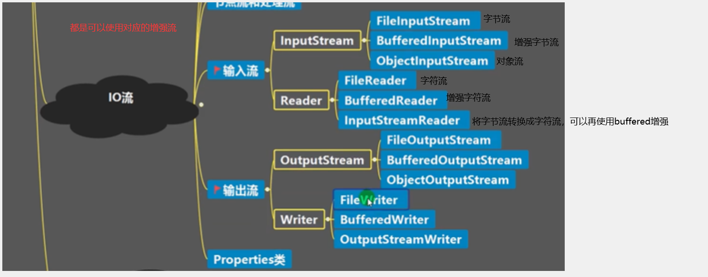

# IO流

## 常用io流



## 字节流

### 字节流介绍

它处理单元为1个字节（byte），操作字节和字节数组，存储的是二进制文件，如果是音频文件、图片、歌曲，就用字节流好点（1byte = 8位）；

### 字节输出流 FileOutputStream

```java
// 第二个参数表示是追加还是直接覆盖
FileOutputStream out = new FileOutputStream("E:/abc.txt", true);
//先写到缓冲区。在输出流关闭之前是可以一直写的的
//此处单个字符输出要转ascll码
out.write((int)'h');
out.write((int)'s');
out.write((int)'o');

//如果是多个字符需要传入他的byte值
out.write("null".getBytes());
out.write("\n".getBytes());
out.write("null".getBytes());

byte[] bytes = {65,66,67,68,69};
/**
* public void write(byte[] b,int off,int len)throws IOException
* 从指定的字节数组写入len字节，从偏移off开始输出到此输出流。
*/
out.write(bytes,1,2);

//刷新 立即执行写操作
out.flush();
//记得关闭
out.close();
```

### 字节输入流 FileInputStream

```java
FileInputStream inputStream = new FileInputStream("E:/abc.txt");
// reaad()方法，表示一次只读取一个字节
// 每次可以读取一个字节的数据，转为为int类型，读取到文件末尾，返回 -1
int i = inputStream.read();
//如果是数字或者字母，则可以转char输出（查询ascll码） 
System.out.println((char)i);

// read(byte[] b) ，每次读取b的长度个字节到数组中，返回读取到的有效字节个数
// 读取到末尾时，返回 -1 
byte[] b = new byte[4];
int count;
// inputStream.read(b)返回每次读取到的有效字节个数
while((count=inputStream.read(b))!=-1){
  System.out.println(new String(b,0,count));
}

byte[] b = new byte[4];
int count;
//每次读取3个，读取后放到b中下标为1往后的位置，需要防止越界
while((count=inputStream.read(b , 1 , 3))!=-1){
  System.out.println(new String(b, 1, count));
}

//记得关闭
inputStream.close();

```

### 利用FileInputStream和FileOutputStream实现文件的拷贝

```java
FileInputStream in = new FileInputStream("E:/abc.txt");
FileOutputStream out = new FileOutputStream("E:/abc11.txt");
byte[] b1 = new byte[4];
  
int count;
while ((count = in.read(b1))!=-1) {
  //此处使用count 要防止b1内部分数据是旧数据
  out.write(b1,0,count);
}
out.flush();
in.close();
out.close();

```

### 处理流 BufferedInputStream和BufferedOutputStream实现拷贝

```java
BufferedInputStream in = new BufferedInputStream(new FileInputStream("E:/abc.txt"));
BufferedOutputStream out = new BufferedOutputStream(new FileOutputStream("E:/abc112.txt"));
byte[] b = new byte[1024];

int count;  
while ((count = in.read(b)) != -1) {
  out.write(b, 0, count);
}

//关闭时，只需要关闭外层流即可,会调用内层的close
in.close();
out.flush();
out.close();

    // public void close() throws IOException {
    //     synchronized (lock) {
    //         if (in == null)
    //             return;
    //         try {
      //此处关闭了内层流
    //             in.close();
    //         } finally {
    //             in = null;
    //             cb = null;
    //         }
    //     }
    // }
```

### 处理流的功能主要体现在以下两个方面:

1. 性能的提高:主要以增加缓冲的方式来提高输入输出的效率。
2. 操作的便捷:处理流可能提供了一系列便捷的方法来一次输入输出大批量的数据,使用更加灵活方便

### 节点流和处理流区别

1. 节点流是底层流/低级流,直接跟数据源相接。
2. 处理流(包装流)包装节点流，既可以消除不同节点流的实现差异，也可以提供更方便的方法来完成输入输出 。
3. 处理流(也叫包装流)对节点流进行包装，使用了修饰器设计模式，不会直接与数据源相连

### 对象流 ObjectOutputStream

也是属于处理流的一种

修饰器模式：修饰器的作用在于对已有类的功能的增强

1. ObjectInputStream 提供序列化
2. ObjectOutputStream 提供反序列化

数据存储不能只存储数据，还要保存他的类型。序列化就是在保存数据时,保存数据的值和数据类型。反序列化就是在恢复数据时，恢复数据的值和数据类型，需要让某个对象支持序列化机制，则必须让其类是可序列化的，为了让某个类是可序列化的，

该类必须实现如下两个接口之一:

1. Serializable//这是一个标记接口 推荐
2. Externalizable//需要实现方法

```java
// 保存后缀随意，序列化后保存格式不是文本，而是他的特定格式
String filePath = "E:/abc22.dat";
ObjectOutputStream outputStream = new ObjectOutputStream(new FileOutputStream(filePath));
outputStream.writeInt(100);
outputStream.writeBoolean(false);
outputStream.writeChar('a');
outputStream.writeDouble(0.5);
outputStream.writeUTF("bobo");

//存储对象需要实现序列化Serializable
outputStream.writeObject(new Dog("bobo's dog"));

outputStream.close();
```

```java
class Dog implements Serializable{
  private String name;
  private static String age;
  // transient 短暂的
  private transient String color;
  // 3)序列化的类中建议添加SerialVersionUID.是序列化的版本号，为了提高版本的兼容性
  private static final long serialVersionUID = 1L;

  //会报错，需要Master进行序列化
  private Master master;
  
  public Dog(String name) {
    this.name = name;
  }

  public String getName() {
    return name;
  }

  public void setName(String name) {
    this.name = name;
  }

  @Override
  public String toString() {
    return "Dog [name=" + name + "]";
  }

}
```

### 对象流 ObjectInputStream

```java
// 指定反序列文件
String filePath = "E:/abc22.dat";  
ObjectInputStream ois = new ObjectInputStream(new FileInputStream(filePath));

// 读取要和保存的顺序一致,否则会出现异常
System.out.println(ois.readInt());
System.out.println(ois.readBoolean());
System.out.println(ois.readChar());
System.out.println(ois.readDouble());
System.out.println(ois.readUTF());

Object obj = ois.readObject();
// 此处调用dog方法需要向下转型
Dog dog = (Dog) obj;
System.out.println(dog.getName());

ois.close();
```

使用对象流的注意事项

1. 读写顺序要一致
2. 要求序列化或反序列化的对象,需要实现Serializable
3. 序列化的类中建议添加SerialVersionUID.为了提高版本的兼容性（自定义版本）
4. 序列化对象时，默认将里面所有属性都进行序列化，但除了static或transient修饰的成员，static或transient修饰的成员不会保存到文件中
5. 序列化对象时,要求里面属性的类型也需要实现序列化接口
6. 序列化具备可继承性,也就是如果某类已经实现了序列化，则它的所有子类也已经默认实现了序列化

## 字符流

### 字符流介绍

它处理的单元为2个字节的Unicode字符，分别操作字符、字符数组或字符串，字符流是由Java虚拟机将字节转化为2个字节的Unicode字符为单位的字符而成的，如果是关系到中文（文本）的，用字符流好点（1Unicode = 2字节 = 16位）；

### 字符流 FileReader

```java
String filePath = "E:/abc.txt";
FileReader fileReader = new FileReader(filePath);

// 单个字符读取
int count;
while ((count = fileReader.read())!=-1) {
  System.out.println((char)count);
}

char[] buffer = new char[4];
int count;
// 返回读取到的个数
while ((count = fileReader.read(buffer)) != -1) {
  System.out.println(new String(buffer,0,count));
}

fileReader.close();
```

### 字符流 FileWriter

```java
String filePath = "E:/abc.txt";
FileWriter fileWriter = new FileWriter(filePath);

// 写入单个字符
fileWriter.write('H');
// 写入单个字符串
fileWriter.write("xin");
//指定字符下标
fileWriter.write("xin",1,2);
// 写入指定char数组
char[] chars = { 'a', 'b' };
fileWriter.write(chars);
//自定数组下标
fileWriter.write(chars, 0, 2);

fileWriter.flush();
fileWriter.close();
```

### 处理流 BufferedReader

```java
BufferedReader bReader = new BufferedReader(new FileReader("E:/abc.txt"));

//按行读取
String line;
// 当返回一个null时则读取完毕
  
while ((line = bReader.readLine())!=null) {
  System.out.println(line);
}

bReader.close();

```

### 处理流 BufferedWriter

```java
//如果要追加，需要写在FileWriter上
BufferedWriter bWriter = new BufferedWriter(new FileWriter("E:/abc.txt"));
bWriter.write("这是1");
bWriter.write("这是1");
//根据系统插入换行
bWriter.newLine();
bWriter.write("这是2");
bWriter.write("这是3");
bWriter.write("这是3");
bWriter.write("这是3");

bWriter.close();
```

### 字节流转字符流

```java
// lnputStreamReader:Reader的子类，可以将InputStream(字节流)包装成(转换)Reader(字符流)
// OutputStreamWriter:Writer的子类，实现将OutputStream(字节流)包装成Writer(字符流)
// 当处理纯文本数据时，使用字符流效率更高，并且可以有效解决中文问题,所以建议将字节流转换成字符流
// 可以在使用时指定编码格式(比如utf-8, gbk , gb2312, ISO8859-1等)

// InputStreamReader重要构造器
// public InputStreamReader(InputStream in, Charset cs)
// 可以传入InputStream对象(字节输入流的顶级对象)和其指定处理编码
String filePath = "E:/abc.txt";
// FileInputStream转成 InputStream
// 同时指定了编码
//希望使用bufferedReader进行操作（强大）
BufferedReader br = new BufferedReader(new InputStreamReader(new FileInputStream(filePath), "gbk"));
String readLine = br.readLine();
System.out.println(readLine);

br.close();

// OutputStreamWriter重要构造器
// public OutputStreamWriter(OutputStream out, Charset cs)
// 可以传入OutputStream对象(字节输出流的顶级对象)和其指定处理编码
BufferedWriter bw = new BufferedWriter(new OutputStreamWriter(new FileOutputStream(filePath, false),"gbk"));
  
bw.write("狗贼");
bw.newLine();
bw.write("狗贼");

bw.close();
```

## Print 打印流

### 字节流 PrintStream

```java
// System.out本身是一个字节流
PrintStream out = new PrintStream(System.out);

// public static final PrintStream out = null;
// System.out 本身就是PrintStream可以直接引用
// PrintStream out = System.out;

out.print("nul111l");
/*
 * public void print(String s) { //jdk11
 * write(String.valueOf(s));
 * }
*/

out.close();
// 我们可以修改打印流的位置或设备
System.setOut(new PrintStream("E:/abc.txt"));
System.out.println("HEOOL FUCK");
```

### 字节转字符 PrintWriter

```java
//字节流转字符流
/*
 * public PrintWriter(OutputStream out) {
 *  this(out, false);
 * }
*/
// 传参只要是 OutputStream的子类就可以 这里System.out是当前设备输出
// PrintWriter printWriter = new PrintWriter(System.out);
PrintWriter printWriter = new PrintWriter(new FileWriter("E:/abc.txt"));
printWriter.print("HI FUCCO111");

printWriter.close();
```

### 区别

PrintStream在输出字符，将字符转换为字节时采用的是系统默认的编码格式，这样当数据传输另一个平台，而另一个平台使用另外一个编码格式解码时就会出现问题，存在不可控因素。而PrintWriter可以在传入Writer时可由程序员指定字符转换为字节时的编码格式，这样兼容性和可控性会更好。

```java
public PrintWriter(String fileName, Charset charset)
```

## Properties

### 配置文件

```properties
charset=utf-8
password=123456
user=\u6C64\u59C6
```

### 旧方式读取配置

```java
// 旧方式读取Properties文件
BufferedReader bufferedReader = new BufferedReader(new FileReader("E:\\Visual Studio Code\\java\\java_study\\package_java\\work\\src/db.properties"));

String line = "";
while ((line = bufferedReader.readLine()) != null) {
  String[] split = line.split("=");
  System.out.println(split[1]);
}

bufferedReader.close();
```

### 新方式读取配置

```java
// load: 加载配置文件的键值对到Properties对象
// list:将数据显示到指定设备
// getProperty(key):根据键获取值
// setProperty(key,value):设置键值对到Properties对象
// store:将Properties中的键值对存储到配置文件,在idea中，保存信息到配置文件,如果含有中文，会存储为unicode码

// 实现的是Hashtable
Properties properties = new Properties();
properties.load(new FileInputStream("E:\\Visual Studio Code\\java\\java_study\\package_java\\work\\src/db1.properties"));

properties.list(System.out);

String property = properties.getProperty("password");
System.out.println(property);
```

### 设置配置文件

```java
//新建properties文件
Properties properties = new Properties();
properties.setProperty("charset","utf-8");
properties.setProperty("user","汤姆");
properties.setProperty("password","123456");

//如果存在，则会被替换
properties.store(new FileOutputStream("E:\\Visual Studio Code\\java\\java_study\\package_java\\work\\src/db1.properties"), "这是一个注释");

System.out.println("success");
```
