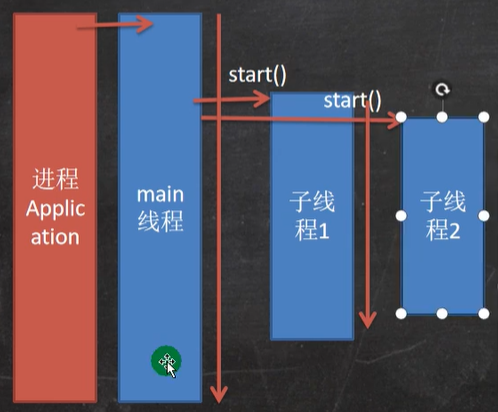
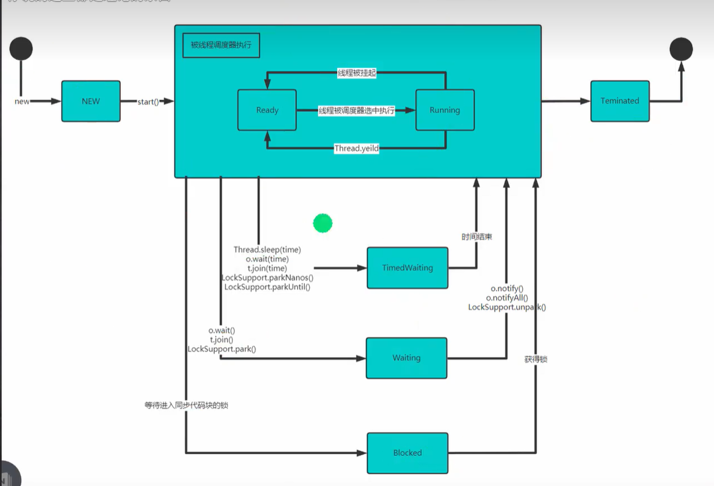

# **多线程**

## 名词释义

  [程序]：为完成特定任务，用多种语言编写的一组指令的集合，简单说就是我们的代码

  [进程]：程序的一次执行过程，或是正在运行的一个程序，是一个动态的过程
  [线程]：进程可进一步细化为线程，是一个程序内部的一条执行路径，同时它也是程序使用CPU的最基本单位（进程中要同时干几件事情，每一件事情的执行路径就是线程）

  [并发]：一个CPU交替执行多个任务，可理解为单个cpu在同一时间，多个任务交替执行，“貌似同时执行”
  [并行]：多个CPU同时执行多个任务，可理解为多个cpu在同一时间，做不同的事情，注：并行中还存在着并发

  [单线程]：一个进程只用一条执行路径
  [多线程]：一个进程有多条执行路径

## 获取cpu内核数

```java
Runtime runtime = Runtime.getRuntime();
//cpu内核数
System.out.println(runtime.availableProcessors());
```

## 多线程机制



## 什么叫start


```java
public synchronized void start() {
        /**
         * This method is not invoked for the main method thread or "system"
         * group threads created/set up by the VM. Any new functionality added
         * to this method in the future may have to also be added to the VM.
         *
         * A zero status value corresponds to state "NEW".
         */
        if (threadStatus != 0)
            throw new IllegalThreadStateException();

        /* Notify the group that this thread is about to be started
         * so that it can be added to the group's list of threads
         * and the group's unstarted count can be decremented. */
        group.add(this);

        boolean started = false;
        try {
	    //关键
            start0();
            started = true;
        } finally {
            try {
                if (!started) {
                    group.threadStartFailed(this);
                }
            } catch (Throwable ignore) {
                /* do nothing. If start0 threw a Throwable then
                  it will be passed up the call stack */
            }
        }
    }

//由jvm机调用的本地方法，底层是c或c++实现的
//真正实现多线程的是start0方法
private native void start0();
```

## 多线程实现

### 1.继承Thread，重写run方法

```java
// 当一个类继承了Thread，该类就可以做线程使用
// 重写run方法，协商自己的业务代码
// Thread实现了Runnable的run方法
public class ExtendThread extends Thread{

  @Override
  public void run() {
    //需要执行的代码
  }
  
}

ExtendThread extendThread = new ExtendThread();
extendThread.start();
```

### 使用Thread来实现车票售卖

```java
SellTick01 ticket = new SellTick01();
new Thread(ticket, "张三").start();
new Thread(ticket, "里斯").start();
new Thread(ticket, "王五").start();

class SellTick01 extends Thread {
  private int num = 10;

  @Override
  public void run() {
    while (true) {
      if (num <= 0) {
        System.out.println("售票结束");
        break;
      }
      try {
        Thread.sleep(50);
      } catch (InterruptedException e) {
        // TODO Auto-generated catch block
        e.printStackTrace();
      }
      System.out.println("剩余票数=" + (--num));
    }
  }
}

运行结果：
剩余票数=9
剩余票数=8
剩余票数=9
剩余票数=7
剩余票数=6
剩余票数=5
剩余票数=4
剩余票数=3
剩余票数=2
剩余票数=0
售票结束
剩余票数=1
售票结束
剩余票数=-1
售票结束
出现线程问题
```

### 2.实现Runnable，重写run方法（无返回值）

1. java是单继承的，在某些情况下一个类可能已经继承了某个父类,这时在用继承Thread类方法来创建线程显然不可能了。
2. java设计者们提供了另外一个方式创建线程,就是通过实现Runnable接口来创建线程

Runnable接口只有一个run()方法能实现，所以需要 new Thread(new ImplRunnable())  ，来调用start()方法，此处底层使用了代理模式（设计模式）

```java
Thread thread = new Thread(new ImplRunnable());
thread.start();
```

```java
public class ImplRunnable implements Runnable{

  @Override
  public void run() {
	//需要执行的代码
  }
  
}
```

### 使用Runnable来实现车票售卖

```java
SellTick02 ticket = new SellTick02();
new Thread(ticket, "张三").start();
new Thread(ticket, "里斯").start();
new Thread(ticket, "王五").start();

class SellTick02 implements Runnable {
  private int num = 10;

  @Override
  public void run() {
    while (true) {
      if (num <= 0) {
        System.out.println("售票结束");
        break;
      }
      try {
        Thread.sleep(50);
      } catch (InterruptedException e) {
        // TODO Auto-generated catch block
        e.printStackTrace();
      }
      System.out.println("剩余票数=" + (--num));
    }
  }
}
运行结果：
剩余票数=9
剩余票数=7
剩余票数=8
剩余票数=6
剩余票数=5
剩余票数=4
剩余票数=3
剩余票数=2
剩余票数=1
剩余票数=0
售票结束
剩余票数=-1
售票结束
剩余票数=-2
售票结束
出现线程问题
```

### Thread和Runnable区别

1. 从java的设计来看,通过继承Thread或者实现Runnable接口来创建线程本质上没有区别,从jdk帮助文档我们可以看到Thread类本身就实现了
   Runnable接口start()->start0()
2. 实现Runnable接口方式更加适合多个线程共享一个资源的情况，并且避免了单继承的限制，建议使用Runnable接口

### 3.实现Callable（有返回值）

```java
public class ImplCallable {
  public static void main(String[] args) {
    MyThread1 mt = new MyThread1();
    // 创建一个“未来类”对象
    FutureTask task = new FutureTask(mt);
    // 创建线程对象
    Thread t = new Thread(task);
    t.start();
    try {

      // 通过get()方法获取线程返回值
      System.out.println(task.get());
    } catch (InterruptedException e) {
      e.printStackTrace();
    } catch (ExecutionException e) {
      e.printStackTrace();
    }

    // get()方法会导致当前线程阻塞，所以此方法效率比较低
    // 因为get()方法需要等线程结束后拿到线程返回值
    // 所以main()方法这里的代码需要等get()方法结束才能执行，也就是要等以上线程结束后才执行
    System.out.println("结束了");
  }

}

class MyThread1 implements Callable {

  // 这里的call()方法就相当于run()方法
  public String call() throws Exception {
    String str = "hhhh";
    Thread.sleep(5000);
    return str;
  }

}
```

## 线程终止

1. 当线程完成任务后,会自动退出
2. 还可以通过使用变量来控制run方法退出的方式停止线程，即**通知方式**

```java
T t1 = new T();
t1.start();
Thread.sleep(5*1000);
t1.setLoop(false);

class T extends Thread{

  private boolean loop = true;
  @Override
  public void run() {
    while (loop) {
      try {
        Thread.sleep(50);
      } catch (InterruptedException e) {
        e.printStackTrace();
      }
      System.out.println("run....");
    }
  }
  public void setLoop(boolean loop) {
    this.loop = loop;
  }
}
```

## 线程常用方法一

1. setName //设置线程名称,使之与参数name 相同
2. getName //返回该线程的名称
3. start //使该线程开始执行;Java虚拟机底层调用该线程的startO方法
4. run //调用线程对象run方法;
5. setPriority //更改线程的优先级 1-10之间
6. getPriority //获取线程的优先级
7. sleep/ /在指定的毫秒数内让当前正在执行的线程休眠(暂停执行)
8. interrupt  //中断线程，不是终止线程，让他抛出一个InterruptedException异常，然后再重新执行while的语句，即提前结束休眠

```java
    while (true) {
      try {
        Thread.sleep(50);
      } catch (InterruptedException e) {
        e.printStackTrace();
      }
      System.out.println("run....");
    }
```

注意细节：

1. start底层会创建新的线程，调用run, run 就是一个简单的方法调用，不会启动新线程
2. 线程优先级的范围
3. interrupt，中断线程，但并没有真正的结束线程。所以一般用于中断正在休眠线程
4. sleep:线程的静态方法，使当前线程休眠

## 线程常用方法二

yield:线程的礼让。让出cpu,让其他线程执行,但礼让的时间不确定，所以也不一定礼让成功

join:线程的插队。对线程的阻塞，只有执行完调用join的线程的内容，才往下执行
案例:创建一个子线程，每隔1s输出hello,输出20次,主线程每隔1秒,输出hi，输出20次.要求:两个线程同时执行，当主线程输出5次后，就让子线程运行完毕，主线程再继续

```java
    T t = new T();
    t.start();
  
    for (int i = 1; i <= 20; i++) {
      try {
        Thread.sleep(1000);
      } catch (InterruptedException e) {
        e.printStackTrace();
      }
      System.out.println("主线程线程" + i);
      if (i==5) {
        //礼让
        Thread.yield();
        //插队
        t.join();
      }
    }

class T extends Thread {

  @Override
  public void run() {
    for (int i = 1; i <= 20; i++) {
      try {
        Thread.sleep(1000);
      } catch (InterruptedException e) {
        e.printStackTrace();
      }
      System.out.println("子线程" + i);
    }
  }

}
```

## 守护线程

1. 用户线程:也叫工作线程,当线程的任务执行完或通知方式结束
2. 守护线程:一般是为工作线程服务的，当所有的用户线程结束，守井线程自动结束
3. 常见的守护线程:垃圾回收机制

守护线程的特点：**一般的守护线程是一个死循环，所有的用户线程只要结束，守护线程就自动结束**
将该线程标记为守护线程或用户线程，当正在运行的线程都是守护线程时，Java 虚拟机退出。
自定义线程默认是非守护线程，通过下面的方法将其设置为守护线程

```java
ThreadDaemon01 runnable = new ThreadDaemon01();
Thread t1 = new Thread(runnable);
t1.setDaemon(true);
```

## 线程的生命周期

1. new 新建的
2. runnable 可运行的
   Ready 就绪
   Running 运行中的
3. blocked 阻塞的
4. watting 等待的
5. time_watting 超时等待的
6. terminated 终止的



## 线程同步机制

1. 在多线程编程，一些敏感数据不允许被多个线程同时访何,此时就使用同步访问技术，保证数据在任何时刻，最多有一个线程访问,以保证数据的完整性。
2. 也可以这里理解:线程同步，即当有一个线程在对内存进行操作时，其他线程都不可以对这个内存地址进行操作，直到该线程完成操作,其他线程才能对该内存地址进行操作.

同步方法：

1. 同步代码块

   ```java
   synchronized(这里填的是想要同步的线程（也就是想要排队的线程）所共享的对象) {
   	//需要同步的代码块（这部分的代码块越少程序执行效率就越高）
   }
   ```
2. 实例方法上使用synchronized

   ```java
   synchronized public boolean sell() {
       //代码块（这部分的代码块越少程序执行效率就越高）
     }
   ```

## 互斥锁

1. Java在Java语言中，引入了对象互斥锁的概念，来保证共享数据操作的完整性。
2. 每个对象都对应于一个可称为“互斥锁”的标记，这个标记用来保证在任一时刻，只能有一个线程访问该对象。
3. 关键字synchronized来与对象的互斥锁联系。当某个对象用synchronized修帅时,表明该对象在任一时刻只能由一个线程访问
4. 同步的局限性:导致程序的执行效率要降低
5. 同步方法(非静态的)的锁可以是this,也可以是其他对象(要求是同一个对象)
6. 同步方法(静态的)的锁为当前类本身。类.class的这个类上
   ```java
     public synchronized static void m1() {
       System.out.println("m1");
     }

     public static void m2() {
       synchronized (T.class){
         System.out.println("m2");
       }
     }
   ```

互斥锁注意事项

1. 同步方法如果没有使用static修饰:默认锁对象为this
2. 如果方法使用static修饰,默认锁对象:当前类.class
3. 实现的落地步骤:
   需要先分析上锁的代码
   选择同步代码块(首选)或同步方法
   要求多个线程的锁对象为同一个即可!

## 线程的死锁

多个线程者占用了对方的锁资源,但不肯相让，导致了死锁,在编程是一定要避免死锁的发生.

```java
/**
 * 一个简单的死锁类
 * 当DeadLock类的对象flag==1时（td1），先锁定o1,睡眠500毫秒
 * 而td1在睡眠的时候另一个flag==0的对象（td2）线程启动，先锁定o2,睡眠500毫秒
 * td1睡眠结束后需要锁定o2才能继续执行，而此时o2已被td2锁定；
 * td2睡眠结束后需要锁定o1才能继续执行，而此时o1已被td1锁定；
 * td1、td2相互等待，都需要得到对方锁定的资源才能继续执行，从而死锁。
 */
public class DeadLock implements Runnable {
  public int flag = 1;
  // 静态对象是类的所有对象共享的
  private static Object o1 = new Object(), o2 = new Object();

  @Override
  public void run() {
    System.out.println("flag=" + flag);
    if (flag == 1) {
      synchronized (o1) {
        try {
          Thread.sleep(500);
        } catch (Exception e) {
          e.printStackTrace();
        }
        synchronized (o2) {
          System.out.println("1");
        }
      }
    }
    if (flag == 0) {
      synchronized (o2) {
        try {
          Thread.sleep(500);
        } catch (Exception e) {
          e.printStackTrace();
        }
        synchronized (o1) {
          System.out.println("0");
        }
      }
    }
  }

  public static void main(String[] args) {

    DeadLock td1 = new DeadLock();
    DeadLock td2 = new DeadLock();
    td1.flag = 1;
    td2.flag = 0;
    // td1,td2都处于可执行状态，但JVM线程调度先执行哪个线程是不确定的。
    // td2的run()可能在td1的run()之前运行
    new Thread(td1).start();
    new Thread(td2).start();

  }
}

```

## 释放锁

1. 当前线程的同步方法、同步代码块执行结束
2. 当前线程在同步代码块、同步方法中遇到break、return。
3. 当前线程在同步代码块、同步方法中出现了未处理的Error或Exception，导致异常结束
4. 当前线程在同步代码块、同步方法中执行了线程对象的wait()方法，当前线程暂停，并释放锁。

不会释放锁的情况

1. 线程执行同步代码块或同步方法时，程序调用Thread.sleep()、Thread.yield()万法暂停当前线程的执行,不会释放锁
2. 线程执行同步代码块时，其他线程调用了该线程的suspend()方法将该线程挂起（使其回到就绪状态），该线程不会释放锁。
   提示:应尽量避免使用suspend()和resume()来控制线程,方法不再推荐使用

## 线程的调度模型

    抢占式调度模型：优先级越高的线程抢到CPU时间片的概率就越大，Java采用的就是抢占式调度模型

    均分布式调度模型：平均分配CPU时间片，每个线程占有的CPU时间片时间长度一样

## 如何预防线程不安全

判断一个程序是否可能会有线程安全问题：

1. 是否是多线程环境
2. 是否有共享数据
3. 是否有多个线程操作共享数据

线程不安全的本质是：**当有多个线程同时操作同一数据对象时（线程并发），就容易导致数据状态错误的情况，这时的数据就不安全了**

1. 使用synchronized解决线程问题
2. 在静态方法上使用synchronized 表示锁对象是类锁（字节码文件对象），类锁永远只有一把（为了保护静态变量的安全）
   注：局部变量永远都不会存在线程安全问题，因为局部变量在栈中不共享，一个线程一个栈
   实例变量在堆内存中，静态变量在方法区内存中，堆内存和方法区内存都是多线程共享的，所以可能存在线程安全问题
   同步机制虽然可以解决数据安全问题，但其缺点在于当线程相当多时，因为每个线程都会去判断同步上的锁对象，极其耗费资源，无形中会降低程序的运行效率
   synchronized在开发中最好不要嵌套使用，可能会导致死锁（指两个或两个以上的线程在执行的过程中，因争夺资源产生的一种相互等待现象）
3. 预防线程问题的方案
   尽量使用局部变量代替实例变量和静态变量
   如果必须是实例变量，那么可以考虑创建多个对象，一个线程一个对象，这样实例变量的内存就不共享了(尽量不要去共享对象)
   如果不能使用局部变量，对象也不能创建多个，这个时候就只能选择synchronized同步机制了

## 定时器

定时器的作用：间隔特定的时间，执行特定的程序

```java
import java.util.Date;
import java.util.Timer;
import java.util.TimerTask;

public class ThreadTest
{
	public static void main(String[] args)
	{
		//创建定时器对象
		Timer ti = new Timer();

		//创建定时任务对象
		TimerTask task = new MyThread();

		//任务第一次执行的时间
		Date firstTime = new Date();

		//任务task从时间date开始执行，每隔2000ms执行一次
		ti.schedule(task, firstTime, 2000);

	}
}


//定时任务类
//TimerTask实现了Runnable
class MyThread extends TimerTask
{
	//指定定时任务run()代码块
	public void run()
	{
		System.out.println("hhhh");
	}
}
```

## Object中的wait方法和notify方法

wait()和notify()不是线程对象的方法，是Java中任何一个Java对象都有的方法，因为这两个方法是Object类中自带的

* wait()：让对象上活动的线程进入等待状态，并释放对象锁，但只是释放锁，暂停代码执行
* wait(long timeout)方法可以指定一个超时时间，过了这个时间如果没有被notify()唤醒，则函数还是会返回。如果传递一个负数timeout会抛出IllegalArgumentException异常。
* notify()：唤醒对象上等待的单个线程（若有多个线程等待，则随机选择一个线程唤醒），不释放锁，执行了notify()方法后，会通知其他正在等待线程得到锁，且会继续执行完自己锁内的代码之后，才会交出锁的控制权。
* notifyAll()：唤醒对象上等待的所有线程，不释放锁
* **sleep()与wait()的区别** ：sleep()只能通过线程对象调用，且必须指定睡眠时间，不释放锁。wait()方法可以通过任意对象调用，且可指定时间，也可不指定时间，释放锁

## 为什么wait方法和notify方法需要搭配synchonized使用

* wait()和notify()需要搭配synchonized关键字使用,用于线程同步,synchonized任意时刻只能被唯一的一个获得了对象实例锁的线程调用。
* wait()总是在一个循环中被调用，挂起当前程来等待一个条件的成立。 Wait调用会一直等到其他线程调用 `notifyAll()`时才返回。
* 当一个线程在执行 `synchronized` 的方法内部，调用了 `wait()`后， 该线程会释放该对象的锁， 然后该线程会被添加到该对象的等待队列中（waiting queue）, 只要该线程在等待队列中， 就会一直处于闲置状态， 不会被调度执行。 要注意 `wait()`方法会强迫线程先进行释放锁操作，所以在调用 `wait()`时， 该线程必须已经获得锁，否则会抛出异常。由于 `wait()`在synchonized的方法内部被执行， 锁一定已经获得， 就不会抛出异常了。

```java
// 线程 A 的代码
synchronized(obj_A){
   while(!condition){ 
      obj_A.wait();
   }
   // do something 
}
```

```java
// 线程 B 的代码
synchronized(obj_A){
    if(!condition){ 
       // do something ...
       condition = true;
       obj_A.notify();
    }
}
```
