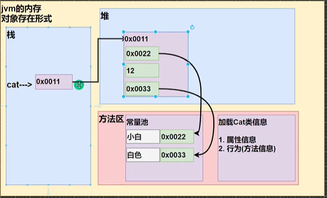

# 类

## 介绍

一类具有相同的属性和行为的事物的抽象

## 类的描述

对一个事物的描述：

1. 属性：该事物的描述信息行为：该事物能够做什么
2. 类是一组相关的属性和行为的集合，是构造对象的模板和蓝图，是一个抽象的概念
3. 由类构造对象的过程称为类的实例化

## 类的组成部分

属性、构造器、成员方法、代码块

## 类的属性

1. 成员变量=属性=字段(field)
2. 属性是类的一个组成部分，一般是基本数据类型，也可是引用类型

### 属性访问修饰符

访问修饰符主要用来控制访问范围，主要修饰类、属性、方法

* public
* proctected
* 默认
* private

```java

class Persion {
  public String name;
  protected String name1;
  String name2;
  private String name3;
}
```

### 属性数据类型

数据类型为任意（看需求），包含基本数据类型和引用类型。在不赋值的情况有默认值，规则和数组一致

### 访问属性

访问属性：对象.属性；

### 对属性赋值

对象.属性="内容"；

## 对象

**对象是该类事物的具体表现形式，具体存在的个体** ，如：猫是一个类，那么，奶奶家的猫就是一个对象

### 创建对象

* 先声明再创建

  ```java
  Cat cat ;
  cat = new Cat();
  ```
* 直接创建

  ```java
  Cat cat = new Cat();
  new Cat();//匿名对象，用完后就被回收了
  ```

### new一个对象的加载过程



1. 先方法区加载类的信息
2. 从[堆]中分配空间，进行[默认初始化]
3. 对象的引用
4. 进行[指定初始化],比如属性赋值等
5. 注：先开辟后赋予变量地址

## 单例多例

### 单例介绍

不同引用指向同一个堆内存的对象（不希望有成员变量）

```java
Persion p1 = new Persion();
Persion p3 = p1;
```

### 多例介绍

不同引用指向不同堆内存的对象

```java
Persion p1 = new Persion();
Persion p3 = new Persion();
```

## 引用和this

### 引用

如果直接打印引用，会直接输出一个包名+类名+十六进制的hashCode

其原因是类都继承了Object，直接打印引用时，如果没有重写toString，则会调用父类的toString方法，会返回getClass().getName() + "@" + Integer.toHexString(hashCode())

因单例是指向同一个堆地址 所以不同引用打印结果一致

### this

区分同名的成员变量和局部变量（就近原则），在对象创建完成后会有一个this隐藏属性，指向着对象本身，就是该对象的引用

1. this关键字可以用来访问本类的属性、方法、构造器
2. this用于区分当前类的变量和局部变量
3. 访问成员方法的语法: this.方法名(参数列表);
4. 访问构造器语法:this(参数列表)，注意只能在构造器中使用，且必须是第一条语句
5. this不能在类定义的外部使用,只能在类定义的方法中使用。

   ```java
   public class CatObject {

     private String catName; 

     public void setCatName(String catName) {
       this.catName = catName;
     }
   }
   ```

## 构造方法

是什么 类的组成部分

为什么 new对象的时候赋初始值

怎么用 new Cat();

基本语法

```java
[修饰符] 方法名(形参列表){
      方法体;
    }
```

构造方法细节

1. 构造器的修饰符可以默认，也可以是其他的
2. 构造器没有返回值 不能有void
3. 构造方法名和类名字必须一样
4. 参数列表和成员方法一样的规则（下面有讲）
5. 构造器的调用由系统完成，系统会自动的调用该类的构造器完成对象的初始化，但并不是创建对象
6. 构造方法也是方法，也可以重载和可变参数
7. 如果程序员没有定义构造方法，系统会自动给类生成一个默认无参构造方法，可以使用javap指令反编译查看
8. 一旦定义了自己的构造器,默认的构造器就覆盖了，就不能再使用默认的无参构造器,除非显式的定义一下，即重载一下默认无参构造器

构造方法的定义和重载

```java
public class CatObject {
  
  private String catName; 
  private int catAge;
  private String catColor;
  public CatObject() {
  }

  public CatObject(String catName, int catAge, String catColor) {
    this.catName = catName;
    this.catAge = catAge;
    this.catColor = catColor;
  }
}
//new对象
new CatObject();
new CatObject("小猫",3,"红色");
```

## 方法

### 方法概述

在Java中，所有的方法都必须在类的内部定义，目的是为了减少冗余，提高复用

### 成员方法的定义形式

```java
public 返回数据类型 方法名(形参列表..)//方法体
   //执行语句;
   return 返回值;
}
```

### 访问成员方法

访问属性：对象.方法名(参数)；

### 成员方法的修饰符

同属性的修饰符的使用

```java
class Persion {
  public String name;
  protected String name1;
  String name2;
  private String name3;
  public void setName(String name) {
    this.name = name;
  }
  public String getName() {
    return name;
  }
}
```

### 成员方法的形参列表

1. 一个方法可以有0个参数，也可以有多个参数，中间用逗号隔开,比如getSum(int n1,int n2)
2. 参数类型可以为任意类型，包含基本类型或引用类型(传递的是内存地址，会影响到原数据)，比如 printArr(int[]  map)
3. 调用带参数的方法时，一定对应着参数列表传入相同类型或兼容类型的参数!
4. 方法定义时的参数称为形式参数，简称形参;方法调用时的参数称为实际参数，简称实参，实参和形参的类型要一致或兼容、个数、顺序必须一致!

```java
class MyCalculator {
  //此处用了重载
  public String calculate(String m1, int n2) {
    return m1 + n2;
  }
  public int calculate(int m1) {
    return m1;
  }
  public void calculate() {
    System.out.println(1);
  }
}

MyCalculator myCalculator = new MyCalculator();
myCalculator.calculate("2", 1);
myCalculator.calculate(1);
myCalculator.calculate();
```

### 成员方法的方法体

1. 里面写完成功能的具体的语句,可以为输入、输出、变量、运算、分支、循环、方法调用，但里面不能再定义方法!
2. 同一个类中的方法调用:直接调用即可。比如print(参数);
3. 跨类中的方法A类调用B类方法:需要通过对象名调用。比如对象名.方法名(参数);
4. 特别说明一下:跨类的方法调用和方法的访问修饰符相关

### 成员方法的注意事项

1. 形参列表:表示成员方法输入method(int n)
2. 数据类型(返回类型):表示成员方法输出, void表示没有返回值
3. 方法主体:表示为了实现某一功能代码块
4. return语句不是必须的，但一个方法最多有一个返回值，返回类型可以为任意类型，包含基本类型或引用类型(数组，对象)，
5. 如果方法要求有返回数据类型，则方法体中最后的执行语句必须为return值;而且要求返回值类型必须和return的值类型一致或兼容。
6. 如果方法是void，则方法体中可以没有return语句,或者只写 return

### 方法调用执行机制


