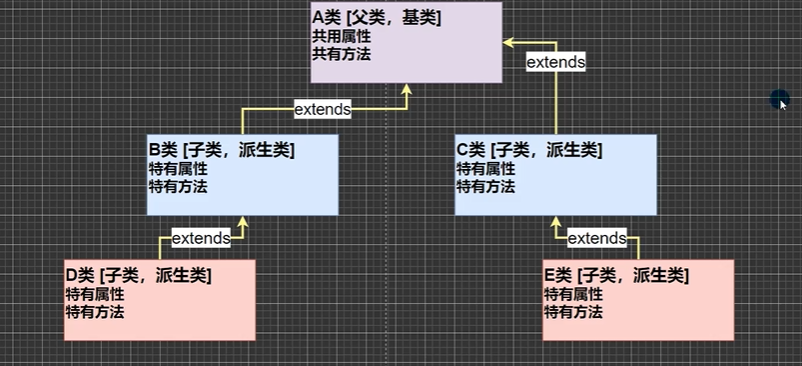
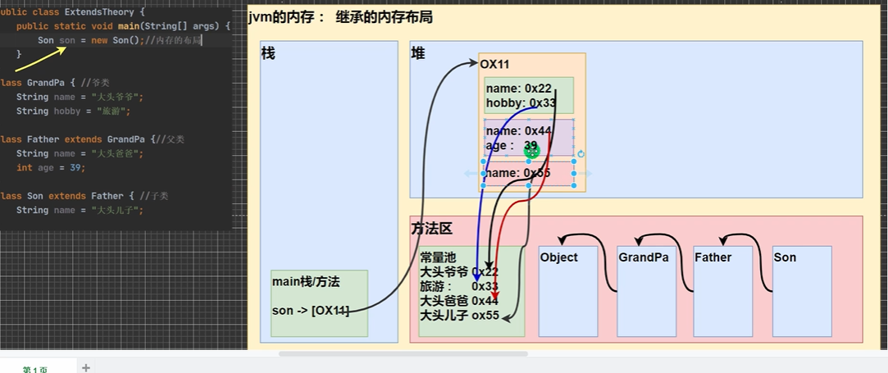

# 继承

## 继承介绍

    继承可以解决代码复用,让我们的编程更加靠近人类思维.当多个类存在相同的属性和方法时,可以从这些类中抽象出父类,在父类中定义这些相同的属性和方法，所有的子类不需要重新定义这些属性和方法，只需要通过extends来声明继承父类即可。

## 继承的基本语法

```java
class 子类 extends 父类 {}
```

## 继承的概念



1. 子类就会自动拥有父类定义的属性和方法
2. 父类又叫超类，基类。
3. 子类又叫派生类。

## 代码实现

```java
public class Animal {
  private String name = "动物";

  public void setName(String name) {
    this.name = name;
  }

  public String getName() {
    return name;
  }

  public void cry() {
    System.out.println("Animal 动物在叫");
  }

  public void aaa() {
    System.out.println("Animal 动物在aaa");
  }

}
public class Cat extends Animal{
  private int age;

  public void setAge(int age) {
    this.age= age;
  }

  public int getAge() {
    return age;
  }
}
public class Dog extends Animal{

  private int num=0;

  public void setNum(int num) {
    this.num= num;
  }

  public int getNum() {
    return num;
  }

}

```

## 继承的细节

1. 子类继承了所有的属性和方法，非私有的属性和方法可以直接访问，但是私有属性和方法不能在子类直接访问，要通过父类提供的公共方法去访问
2. 子类初始化时必须先完成父类的初始化。
3. 当创建子类对象时，不管使用子类的哪个构造器，默认情况下总会去调用父类的无参构造器，如果父类没有提供无参构造器，则必须在子类的构造器中用super去指定使用父类的哪个构造器完成对父类的初始化工作，否则，编译不会通过
4. 如果希望指定去调用父类的某个构造器，则显式的调用一下,super(参数列表)。但不能继承父类的构造器。
5. super()和this()都只能放在构造器第一行，因此这两个方法不能共存在一个构造器，如果使用this()，则被调用的构造器同样会执行super()
6. java所有类都是Object类的子类
7. 父类构造器的调用不限于直接父类!将一直往上追溯直到Object类(顶级父类)
8. 子类最多只能继承一个父类(指直接继承)，即java中是单继承机制。但可以多层继承达到多继承的形式
9. 不能滥用继承，子类和父类之间必须满足is-a的逻辑关系

## [本质]内存情况



1. 在new的时候会逐层查找父类，由上到下逐一加载类信息，Object > Father > Son
2. 堆开辟一块空间，被加载类的信息会从上到下存放入该空间，相同名称不冲突
3. 该空间被son指向
4. 输出属性时会按照从子类到父类向上查找且输出最近的属性值
