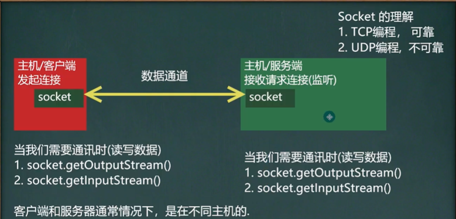
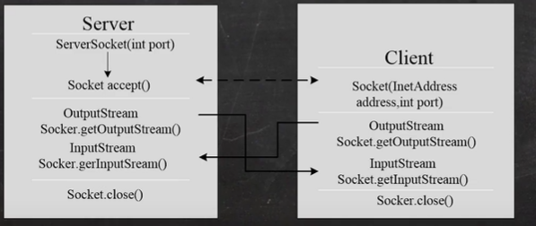
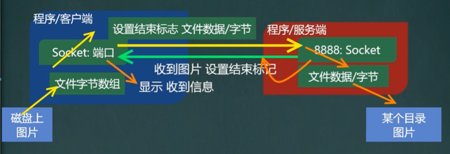

# Socket

## 基本介绍

1. 套接字(Socket)开发网络应用程序被广泛采用，以至于成为事实上的标准。
2. 通信的两端都要有Socket，是两台机器间通信的端点
3. 网络通信其实就是Socket间的通信。
4. Socket允许程序把网络连接当成一个流，数据在两个Socket间通过IO传输。
5. 一般主动发起通信的应用程序属客户端，等待通信请求的为服务端

## 示意图



## TCP和UDP网络通信编程

### TCP网络通信编程

1. 基于客户端—服务端的网络通信
2. 底层使用的是TCP/IP协议
3. 应用场景举例:客户端发送数据，服务端接受并显示
4. 基于Socket的TCP编程



#### 字节流代码实现

##### 服务端

```java
    // 1.在本机的9999端口监听，等待连接
    // 要求没有被占用端口
    // serverSocket可以创建多个socket[多客户端连接]
    ServerSocket serverSocket = new ServerSocket(9999);
    // 2.当没有客户端连接9999端口，程序会阻塞，等待连接
    // 如果有客户端连接，则会返回Socket对象，程序继续
    Socket socket = serverSocket.accept();

    System.out.println("有客户端连接");

    // 3.通过socket.getInputStream() 读取客户端写入到数据通道的数据，显示
  
    InputStream inputStream = socket.getInputStream();
    byte[] buf = new byte[1024];
    int readLength = 0;
    while ((readLength = inputStream.read(buf)) != -1) {
      System.out.println(new String(buf, 0, readLength));
    }

  
    OutputStream outputStream = socket.getOutputStream();
    outputStream.write("hello".getBytes());
    // 注意：需要一个输出结束标记
    socket.shutdownOutput();

    outputStream.close();
    inputStream.close();
    socket.close();
    serverSocket.close();
```

##### 客户端

```java
    // 1.连接服务端 （ip，端口）
    // 连接127.0.0.1(本机)的9999端口,如果连接成功则返回Socket对象
    Socket socket = new Socket("127.0.0.1", 9999);

    // 2.连接后，生成socket，通过socket.getOutputStream()
    // 得到和socket关联的输出流对象
    OutputStream outputStream = socket.getOutputStream();
    outputStream.write("hello".getBytes());
    // 注意：需要一个输出结束标记
    socket.shutdownOutput();

    InputStream inputStream = socket.getInputStream();
    byte[] buf = new byte[1024];
    int readLength = 0;
    while ((readLength = inputStream.read(buf)) != -1) {
      System.out.println(new String(buf, 0, readLength));
    }

  
    outputStream.close();
    inputStream.close();
    socket.close();
```

#### 字符流代码实现

##### 服务端

```java
    // 1.在本机的9999端口监听，等待连接
    // 要求没有被占用端口
    // serverSocket可以创建多个socket[多客户端连接]
    ServerSocket serverSocket = new ServerSocket(9999);
    // 2.当没有客户端连接9999端口，程序会阻塞，等待连接
    // 如果有客户端连接，则会返回Socket对象，程序继续
    Socket socket = serverSocket.accept();

    System.out.println("有客户端连接");

    // 3.通过socket.getInputStream() 读取客户端写入到数据通道的数据，显示

    InputStream inputStream = socket.getInputStream();

    //3.5 字节流转字符流
    BufferedReader bufferedReader = new BufferedReader(new InputStreamReader(inputStream));
    String str = bufferedReader.readLine();
    System.out.println(str);

    //
    OutputStream outputStream = socket.getOutputStream();
    BufferedWriter bufferedWriter = new BufferedWriter(new OutputStreamWriter(outputStream));
    bufferedWriter.write("hello 字符流");
    // 另一种结束标记，但需要另一端使用readLine()!!!来标识要结束
    bufferedWriter.newLine();
    // 需要刷新一下 否则不会写入
    bufferedWriter.flush();

    bufferedWriter.close();
    bufferedReader.close();
    socket.close();
    serverSocket.close();
```

##### 客户端

```java
    // 1.连接服务端 （ip，端口）
    // 连接127.0.0.1(本机)的9999端口,如果连接成功则返回Socket对象
    Socket socket = new Socket("127.0.0.1", 9999);

    // 2.连接后，生成socket，通过socket.getOutputStream()
    // 得到和socket关联的输出流对象
    OutputStream outputStream = socket.getOutputStream();
    // 2.5 转成字符流
    BufferedWriter bufferedWriter = new BufferedWriter(new OutputStreamWriter(outputStream));
    bufferedWriter.write("hello 字符流");
    // 另一种结束标记，但需要另一端使用readLine()!!!来标识要结束
    bufferedWriter.newLine();
    // 需要刷新一下 否则不会写入
    bufferedWriter.flush();

    // 注意：需要一个输出结束标记
    // socket.shutdownOutput();

    InputStream inputStream = socket.getInputStream();
    BufferedReader bufferedReader = new BufferedReader(new InputStreamReader(inputStream));
    String str = bufferedReader.readLine();
    System.out.println(str);

    bufferedReader.close();
    bufferedWriter.close();
    socket.close();
```

#### TCP上传文件

##### 客户端

```java
    Socket socket = new Socket("127.0.0.1", 9999);

    //边读边写
    // BufferedInputStream bufferedInputStream = new BufferedInputStream(new FileInputStream("E:/诚信声明.png"));
    // OutputStream outputStream = socket.getOutputStream();
    // BufferedOutputStream bufferedOutputStream = new BufferedOutputStream(outputStream);
    // byte[] buf_file = new byte[1024];
    // int readLength_file = 0;
    // while ((readLength_file = bufferedInputStream.read(buf_file)) != -1) {
    //   bufferedOutputStream.write(buf_file, 0, readLength_file);
    // }
    // socket.shutdownOutput();
    // bufferedInputStream.close();

    //一次性读写
    BufferedInputStream bufferedInputStream = new BufferedInputStream(new FileInputStream("E:/诚信声明.png"));
    //获取整个文件的byte数据
    byte[] bytes = StreamUtils.streamToByteArray(bufferedInputStream);
    OutputStream outputStream = socket.getOutputStream();
    BufferedOutputStream bufferedOutputStream = new BufferedOutputStream(outputStream);
    bufferedOutputStream.write(bytes);
    bufferedOutputStream.flush();
    socket.shutdownOutput();
    bufferedInputStream.close();


    InputStream inputStream = socket.getInputStream();
    String streamToString = StreamUtils.streamToString(inputStream);
    System.out.println(streamToString);

    bufferedOutputStream.close();
    inputStream.close();
    socket.close();
```

##### 服务端

```java
    ServerSocket serverSocket = new ServerSocket(9999);
    Socket socket = serverSocket.accept();

    System.out.println("有客户端连接");

    //边读边写
    // InputStream inputStream = socket.getInputStream();
    // BufferedInputStream bufferedInputStream = new BufferedInputStream(inputStream);
    // BufferedOutputStream bufferedOutputStream = new BufferedOutputStream(new FileOutputStream("E:/诚信声明-1.png"));
    // byte[] buf = new byte[1024];
    // int readLength = 0;
    // while ((readLength = inputStream.read(buf)) != -1) {
    //   bufferedOutputStream.write(buf, 0, readLength);
    // }
    // bufferedOutputStream.close();

    //一次性读写
    InputStream inputStream = socket.getInputStream();
    BufferedInputStream bufferedInputStream = new BufferedInputStream(inputStream);
    BufferedOutputStream bufferedOutputStream = new BufferedOutputStream(new FileOutputStream("E:/诚信声明-1.png"));
    byte[] bytes = StreamUtils.streamToByteArray(bufferedInputStream);
    bufferedOutputStream.write(bytes);
    bufferedOutputStream.close();

    OutputStream outputStream = socket.getOutputStream();
    BufferedWriter bufferedWriter = new BufferedWriter(new OutputStreamWriter(outputStream));
    bufferedWriter.write("收到图片");
    bufferedWriter.flush();

    socket.shutdownOutput();

    bufferedWriter.close();
    bufferedInputStream.close();
    socket.close();
    serverSocket.close();
```

##### 工具类StreamUtils

```java
public class StreamUtils {
  public static byte[] streamToByteArray(InputStream is) throws Exception {
    // 创建输出流对象
    ByteArrayOutputStream bos = new ByteArrayOutputStream();
    // 字节数组
    byte[] b = new byte[1024];
    int len;
    while ((len = is.read(b)) != -1) {
      // 循环读取
      // 把读取到的数据，写入 bos
      bos.write(b, 0, len);
    }
    byte[] array = bos.toByteArray();
    bos.close();
    return array;
  }

  public static String streamToString(InputStream is) throws Exception {
    BufferedReader reader = new BufferedReader(new InputStreamReader(is));
    StringBuilder builder = new StringBuilder();
    String line;
    while ((line = reader.readLine()) != null) {
      builder.append(line + "\r\n");
    }
    return builder.toString();
  }
}
```

#### TCP下载文件

##### 客户端

```java
    Socket socket = new Socket("127.0.0.1", 9999);

    OutputStream outputStream = socket.getOutputStream();
    BufferedOutputStream bufferedOutputStream = new BufferedOutputStream(outputStream);
    bufferedOutputStream.write("难却DJ".getBytes());
    bufferedOutputStream.flush();
    socket.shutdownOutput();

    InputStream inputStream = socket.getInputStream();
    BufferedInputStream bufferedInputStream = new BufferedInputStream(inputStream);
    byte[] bytes = StreamUtils.streamToByteArray(bufferedInputStream);
    BufferedOutputStream bufferedOutputStream2 = new BufferedOutputStream(new FileOutputStream("E:/难却DJ-1.mp3"));
    bufferedOutputStream2.write(bytes);
    bufferedOutputStream2.close();
    bufferedInputStream.close();

    bufferedOutputStream.close();
    socket.close();
```

##### 服务端

```java
    ServerSocket serverSocket = new ServerSocket(9999);
    Socket socket = serverSocket.accept();

    System.out.println("有客户端连接");

    // 一次性读写
    InputStream inputStream = socket.getInputStream();
    BufferedInputStream bufferedInputStream = new BufferedInputStream(inputStream);
    byte[] bytes = StreamUtils.streamToByteArray(bufferedInputStream);
    String str = new String(bytes, 0, bytes.length);
    String resFileName = "";
    if ("难却DJ".equals(str)) {
      resFileName = "E:/难却DJ.mp3";
    }else{
      resFileName = "E:/诚信声明-1.mp3";
    }


    OutputStream outputStream = socket.getOutputStream();
    BufferedOutputStream bufferedOutputStream = new BufferedOutputStream(outputStream);
    BufferedInputStream bufferedInputStream2 = new BufferedInputStream(new FileInputStream(resFileName));
    byte[] bytes1 = StreamUtils.streamToByteArray(bufferedInputStream2);
    bufferedOutputStream.write(bytes1);
    bufferedOutputStream.flush();

    socket.shutdownOutput();

    bufferedOutputStream.close();
    bufferedInputStream.close();
    socket.close();
    serverSocket.close();
```

#### netstat指令

1. netstat -an可以查看当前主机网络情况，包括端口监听情况和网络连接情况
2. netstat -an | more可以分页显示
3. 要求在dos控制台下执行win+r

说明：Listening表示某个端口在监听。如果有一个外部程序(客户端)连接到该端口，就会显示一条连接信息.

#### TCP秘密

当客户端连接到服务端后，实际上客户端也是通过一个端口和服务端进行通讯的，这个端口是TCP/IP来分配的（随机的）

客户端也是存在端口的，不过是随机分配的




### UDP网络通信编程（了解）

1. 类 DatagramSocket（数据报套接字）和 DatagramPacket（数据包/数据报）实现了基于UDP协议网络程序。
2. UDP数据报通过数据报套接字DatagramSocket发送和接收，系统不保证UDP数据报一定能够安全送到目的地，也不能确定什么时候可以抵达。
3. DatagramPacket对象封装了UDP数据报，在数据报中包含了发送端的IP地址和端口号以及接收端的IP地址和端口号。
4. UDP协议中每个数据报都给出了完整的地址信息，因此无须建立发送方和接收方的连接

#### 基本流程

1. 核心的两个类/对象 DatagramSocket与DatagramPacket
2. 建立发送端，接收端
3. 建立数据包
4. 调用DatagramSocket的发送、接收方法
5. 关闭DatagramSocket

#### udp代码实现

##### 发送端/接收端

```java
    // 1.创建一个DatagramSocket对象，准备在端口9999接收数据
    DatagramSocket socket = new DatagramSocket(9999);
    // 2.构建一个DatagramPacket对象，准备接收数据
    // 最大64k
    byte[] b = new byte[1024];
    DatagramPacket packet = new DatagramPacket(b, b.length);
    // 3.调用接收方法，将DatagramPacket对象填充到packet中
    // 当有数据包发送到本机的9999端口，就会接收数据
    // 如果没有数据包发送，则会阻塞等待
    System.out.println("等待执行");
    socket.receive(packet);

    // 拆包，取出数据
    int length = packet.getLength();// 数据字节长度
    byte[] data = packet.getData();// 接收数据
    String string = new String(data, 0, length);
    System.out.println(string);

    byte[] data1 = "吃饭啦".getBytes();
    // 数据，数据长度，主机ip，端口
    DatagramPacket packet1 = new DatagramPacket(data1, data1.length, InetAddress.getByName("127.0.0.1"), 8888);
    socket.send(packet1);
  
    socket.close();
```

##### 接收端/发送端

```java
// 创建一个DatagramSocket 对象，准备在8888端口接收数据
    DatagramSocket socket = new DatagramSocket(8888);
    //2.需要发送的数据
    byte[] data = "吃饭啦".getBytes();
    //数据，数据长度，主机ip，端口
    DatagramPacket packet = new DatagramPacket(data, data.length,InetAddress.getByName("127.0.0.1"), 9999);
    socket.send(packet);

    byte[] b = new byte[1024];
    DatagramPacket packet1 = new DatagramPacket(b, b.length);
    System.out.println("等待接收");
    socket.receive(packet);

    // 拆包，取出数据
    int length = packet.getLength();// 数据字节长度
    byte[] data1 = packet.getData();// 接收数据
    String string = new String(data1, 0, length);
    System.out.println(string);

    socket.close();
```
