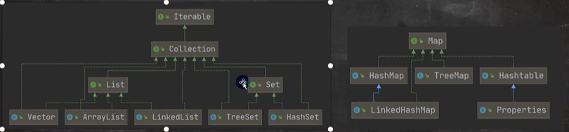
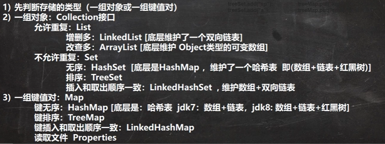

# 集合

## 集合的好处

### 数组的缺点

1. 长度开始时必须指定，而且一旦指定,不能更改
2. 保存的必须为同一类型的元素
3. 使用数组进行增加元素的示意代码-比较麻烦

### 集合的优点

1. 可以[动态保存任意多个对象],使用比较方便!
2. 提供了一系列方便的操作对象的方法:[add、remove,set,get]等
3. 使用集合[添加,删除]新元素的示意代码-简洁了

## 常用集合



### Collection：单列集合

#### Collection接口的特点 

```java
public interface Collection <E> extends Iterable <E>
```

1. collection实现子类可以存放多个元素，每个元素可以是Object
2. 有些Collection的实现类，可以存放重复的元素，有些不可以
3. 有些Collection的实现类，有些是有序的List，有些不是有序的Set
4. Collection接口没有直接的实现子类，是通过它的子接口Set和List来实现的

#### Collection常用方法

1. add:添加单个元素
2. remove:删除指定元素(List可以按下标，也可以删除某个对象)
3. contains:查找元素是否存在
4. size:获取元素个数
5. isEmpty:判断是否为空
6. clear:清空
7. addAll:添加多个元素(参数为集合)
8. containsAll:查找多个元素是否同时存在(参数为集合)
9. removeAll:删除多个元素(参数为集合)

#### Collection接口遍历元素

方式1-使用lterator

1. lterator对象称为迭代器，主要用于遍历集合中的元素。
2. 所有实现了Collection接口的集合类都有一个iterator()方法，用以返回一个实现了lterator接口的对象，即可以返回一个迭代器。
3. Iterator的结构.
4. Iterator仅用于遍历集合，Iterator 本身并不存放对象。

迭代器的执行原理：
    在调用iterator.next()方法之前必须要调用iterator.hasNext()进行检测。
    若不调用，且下一条记录无效时直接调用iterator.next()会抛出NoSuchElementException异常。

```java
lterator iterator = coll.iterator();//得到一个coll集合的迭代器
while(iterator.hasNext(){  //hasNext(:判断是否还有下一个元素
   Object next = iterator.next();//next():1.下移2.将下移以后集合位置上的[元素返回]
}//如果再次遍历 需要[重置迭代器] 方法iterator = coll.iterator();
```

方式2-for循环增强.
增强for循环，可以代替iterator迭代器
特点:增强for就是简化版的iterator，本质仍然是迭代器。只能用于遍历集合或数组。
基本语法

```java
for(元素类型元素名:集合名或数组名){
    访问元素
}
```

#### List接口

##### List接口介绍

1. List集合类中元素有序、可重复
2. List集合中的每个元素都有其对应的顺序索引。
3. List容器中的元素都对应一个整数型的序号记载其在容器中的位置，可以根据序号存取容器中的元素。
4. JDK API中List接口的常用实现类有:ArrayList LinkedList Vector

##### List接口的常用方法 相对Collection额外的接口

1. add(index,object)  在index位置插入object
2. addAll(index,collection)  在index位置插入collection
3. get(index)  获取index位置的元素
4. indexOf(object)  返回首次出现的位置
5. lastIndexOf(object)  返回最后出现的位置
6. remove(index)  删除下标的元素
7. set(index,object)  替换index的元素为object
8. subList(fromIndex,toIndex)  获取从fromIndex到toIndex-1的元素

##### 三种遍历List

1. iterator
2. 增强for
3. 普通for

##### ArrayList

###### ArrayList介绍

1. ArrayList可以加入null，并且多个
2. ArrayList是由数组来实现数据存储的
3. ArrayList 基本等同于Vector，除了ArrayList是线程不安全，但执行效率高。

###### ArrayList的扩容机制

1. ArrayList中维护了一个Object类型的数组elementData.

   ```java
   [transient] Object[] elementData;//transient表示瞬间的、短暂的。表示该属性[不会被序列化]
   ```
2. 当创建ArrayList对象时，如果使用的是无参构造器，则初始elementData容量为0，第1次添加，扩容elementData为10，如需要再次扩容，则扩容elementData为1.5倍。
3. 如果使用的是指定大小的构造器，则初始elementData容量为指定大小，如果需要扩容，则[直接扩容elementData为1.5倍。

##### Vector

###### Vector介绍

1. Vector底层也是一个对象数组
   ```java
   protected Object[] elementData;
   ```
2. Vector 是线程同步的，即线程安全，Vector类的操作方法带有synchronized
3. 在开发中，需要线程同步安全时，考虑使用Vector

###### Vector的扩容机制

1. 无参默认初始容量10，满后2倍扩容
2. 单参构造器指定初始容量大小，满后2倍扩容

##### LinkedList

###### LinkedList介绍

1. LinkedList底层实现了 双向链表 和 双端队列 特点
2. 可以添加任意元素，包括null
3. 线程不安全，没有实现同步

###### LinkedList底层操作机制

1. LinkedList底层维护了一个双向链表。
2. LinkedList中维护了两个属性first和last分别指向首节点和尾节点
3. 每个节点([Node对象])，里面又维护了prev、next、item三个属性,其中通过prev指向前一个，通过next指向后一个节点。最终实现双向链表.
4. 所以LinkedList的元素的添加和删除，不是通过数组完成的，相对来说效率较高。
5. 模拟一个简单的双向链表走代码

##### ArrayList和LinkedList的选择

ArrayList     可变数组    增删效率低    查改效率高
LinkedList    双向链表    增删效率高    查改效率低

#### Set接口

##### Set介绍

1. 无序，无索引、
2. 不允许存放重复元素，所以最多包含一个null，但可以添加。
3. 存放时无序，输出时固定一个数组+链表的形式
4. JDK API中Set接口的实现类有:HashSet TreeSet

##### Set接口的常用方法

和List接口一样,Set接口也是Collection的子接口，因此,常用方法和Collection接口一样.

##### Set接口的遍历方式

同Collection的遍历方式一样,因为Set接口是Collection接口的子接口。

1. 可以使用迭代器
2. 增强for
3. 但不能使用索引的方式来获取.

##### HashSet

###### HashSet介绍

1. HashSet实现了Set接口
2. HashSet实际上是HashMap
3. 可以存放null值，但是只能有一个null
4. HashSet不保证元素存放时和取出时的顺序是一致的，取决于hash后，再确定索引的结果
5. 不能有重复元素/对象。在前面Set 接口使用已经讲过
   特殊：正常下只要地址不同就可以存入，但对于String的对象存入的是常量池的地址

###### HashSet底层机制说明

首先分析HashSet底层是HashMap, HashMap底层是(数组+链表+红黑树)
1.HashSet底层是HashMap
2.添加一个元素时，先得到[hash值-->索引值]
3.找到存储数据表table,看这个索引位置是否已经存放的有元素
4.如果[没有，直接加入]
5.如果[有,调用equals比较](按照链表查找比较)，如果相同，就放弃添加,如果不相同，则添加到最后
6.在Java8中,如果一条[链表的元素个数到达了TREEIFY_THRESHOLD(默认是8)]，且[table的大小>=MINTREEIFY_CAPACITY(默认64)],[这条链表就会进行树化(红黑树)]


###### HashSet扩容机制

1. HashSet底层是HashMap，第一次添加时，table数组扩容到16，第一次添加后临界值是16*临界因子= 12 。每加入一个节点size都会+1，临界值是比较的元素个数，而不是数组长度
2. 如果元素个数大于临界值，就会扩容到16*2=32，新的临界值就是32*0.75 = 24，依次类推
3. 在Java8中，如果一条链表的元素个数到达TREEIFY_THRESHOLD：默认是8，且table的大小>=MIN TREEIFY CAPACITY：默认64.这条链表就会进行红黑树化，如果table小于64，则仍然采用数组扩容机制
4. 即扩容的时机为：要么元素个数大于临界值，要么某个链表添加新元素后长度大于等于8

###### HashSet 添加情况源码解读

```java
//1.执行构造器
public HashSet() {
    map = new HashMap<>();
}

//2.执行add()方法，其中会执行put()方法。
public boolean add(E e) {
    return map.put(e, PRESENT)==null; //如果返回一个空则表示成功
}

//3.put(e, PRESENT) 其中e是要存放的数据,PRESENT是hashset的一个静态的对象，只起到占位的目的
public V put(K key, V value) {
    return putVal(hash(key), key, value, false, true);
}

//4.此时先处理hash(key)，即计算hash值（不等价于hashcode）
static final int hash(Object key) {
    int h;
    return (key == null) ? 0 : (h = key.hashCode()) ^ (h >>> 16);//null放在第0位 ，[非null数据先获取hashCode，与其无符号右移16位进行异或操作（因为长度不为素数防止冲突）]
}

//5.执行putVal()
	final V putVal(int hash, K key, V value, boolean onlyIfAbsent,
                   boolean evict) {
        Node<K,V>[] tab; Node<K,V> p; int n, i;
	//如果当前table为空，或者大小等于0，进行第一次扩容。 注table是hashmap的一个数组，类型是Node[]
        if ((tab = table) == null || (n = tab.length) == 0)
            n = (tab = resize()).length;
	//根据传入的key得到的hash值来计算key应该放到table表的哪个[索引位置]
	//如果该处没有元素，直接添加
        if ((p = tab[i = (n - 1) & hash]) == null)
            tab[i] = newNode(hash, key, value, null);
	//如果该处有元素，则判断链表是否有相同的
        else {
            Node<K,V> e; K k;
	    //相同的对象，hash值一定一样。但hash一样，对象不一定一样
            //如果当前索引位置对应的链表的第一个元素的hash值和准备添加的[key的hash值]一样
            //且下面条件至少满足一个
            //  (1)如果当前索引元素与准备添加的key对象的hash值一样
            //  (2)如果key不为空，且equals为true
            if (p.hash == hash && ((k = p.key) == key || (key != null && key.equals(k))))
                e = p;
	    //如果是红黑树
            else if (p instanceof TreeNode)
                e = ((TreeNode<K,V>)p).putTreeVal(this, tab, hash, key, value);
	    //如果跟第一个元素不同，且又不是红黑树
            else {
                for (int binCount = 0; ; ++binCount) {
		    //如果链表当前位置的下一个元素为空，添加到链尾
                    if ((e = p.next) == null) {
                        p.next = newNode(hash, key, value, null);
		 	//尝试树化
                        if (binCount >= TREEIFY_THRESHOLD - 1) // -1 for 1st
                            treeifyBin(tab, hash);
                        break;
                    }
		    //如果存在相同的直接跳出
                    if (e.hash == hash && ((k = e.key) == key || (key != null && key.equals(k))))
                        break;
		    //指向下一个链表元素
                    p = e;
                }
            }
	    //此处是hashMap的值替换
            if (e != null) { // existing mapping for key
                V oldValue = e.value;
                if (!onlyIfAbsent || oldValue == null)
                    e.value = value;
                afterNodeAccess(e);
                return oldValue;
            }
        }
        ++modCount;
	//如果当前元素个数大于预计临界值，将进行扩容
        if (++size > threshold)
            resize();
	//空方法，留给子类去实现
        afterNodeInsertion(evict);
        return null;
    }
```

##### LinkedHashSet

###### LinkedHashSet介绍

1. LinkedHashSet是HashSet的子类
2. LinkedHashSet是一个LinkedHashMap，底层维护了一个数组+双向链表
3. LinkedHashSet根据元素的hashCode值来决定元素的存储位置，同时使用双向链表维护元素的次序，这使得元素看起来是以插入顺序保存的。
4. LinkedHashSet不允许添重复元素

###### LinkedHashSet详细说明

1. 在LinkedHastSet中维护了一个数组和双向链表 (LinkedHashSet有head 和tail )
2. 每一个节点有[pre和next]属性,这样可以形成双向链表
3. 在添加一个元素时，先求hash值，再求索引，确定该元素在数组的位置，然后将添加的元素加入到双向链表，如果已经存在，不添加[原则和hashset一样
4. 这样的话，我们遍历LinkedHashSet也能确保插入顺序和遍历顺序一致

###### LinkedHashSet详细解读**

1. LinkedHashSet加入顺序和取出元素/数据的顺序一致
2. LinkedHashSet底层维护的是一个LinkedHashMap(是HashMap的子类)，是在new的过程中调用了HashSet的构造器， new了一个LinkedHashMap

   ```java
   public LinkedHashSet() {
       super(16, .75f, true);
   }
   HashSet(int initialCapacity, float loadFactor, boolean dummy) {
      map = new LinkedHashMap<>(initialCapacity, loadFactor);
   }
   ```
3. LinkedHashSet底层结构〔数组table+双向链表)
4. 添加第一次时，直接将数组table 扩容到16，存放的结点类型是 LinkedHashHap$Entry
5. 链表是 LinkedHashMap.Entry 多态数组
6. 对于双向链表部分是在newNode此时调用的是LinkedHashMap的newNode方法的规程中完成的

```java
    Node<K,V> newNode(int hash, K key, V value, Node<K,V> e) {
        LinkedHashMap.Entry<K,V> p = new LinkedHashMap.Entry<K,V>(hash, key, value, e);
        linkNodeLast(p);//[此处完成了双向链表的操作]
        return p;
      }

      private void linkNodeLast(LinkedHashMap.Entry<K,V> p) {
        LinkedHashMap.Entry<K,V> last = tail;
        tail = p;
        if (last == null)
            head = p;
        else {
            p.before = last;
            last.after = p;
        }
      }
```

##### TreeSet 

###### TreeSet介绍

可以排序的集合 底层是treemap

1. 无参构造器下，只是new了一个treemap，不会进行排序操作
2. 有参构造器下，要传入一个比较器的对象，在每次插入时进行比较，实现排序操作
3. TreeSet/TreeMap底层都采用的是自平衡二叉树: 遵循左小右大的原则存放，存放的过程也就是排序的过程

###### 防止重复

1. 有参构造器下使用的比较器
2. 无参构造器下传入元素所实现的Comparable接口的compareTo方法

###### 排序解读

1. 构造器传出比较器对象，赋给了父类TreeMap的this.comparator属性
2. 在比较过程中按照平衡二叉树的方式进行插入

```java
	//第一次添加，直接添加
        if (t == null) {
	    // 第一次添加自己比较自己 但无返回值，对后续没有影响，[主要检查是否为空值]
            compare(key, key); 
            root = new Entry<>(key, value, null); //Entry类型
            size = 1;
            modCount++;
            return null;
        }
      //第二次添加，进行比较
        if (cpr != null) {
          do {
            parent = t;
            cmp = cpr.compare(key, t.key);
            if (cmp < 0)
              t = t.left;
            else if (cmp > 0)
              t = t.right;
            else
	      //[此处作用时=是进行值替换，在TreeMap中使用]
              return t.setValue(value); 
        } while (t != null);
      }
```

### Map：双列集合

#### map接口实现类的特点

1. Map用于保存具有映射关系的数据:Key-Value
2. Map中的key和value可以是任何引用类型的数据，会封装到HashMap$Node对象中
3. Map中的key不允许重复，原因和HashSet一样
4. Map中的value可以重复
5. Map的key可以为null，value也可以为null，注意key为null，只能有一个，value为null，可以多个.
6. 常用String类作为Map的key
7. key和value之间存在单向一对一关系，即通过指定的key 总能找到对应的value
8. Map存放数据的key-value，一对k-v是放在一个HashMap$Node中的，又因为Node实现了Entry 接口，有些书上也说一对k-v就是一个Entry

#### EntrySet解读

1. key-value是存放在HashMap$Node中的
2. 为了方便程序员的遍历，还会创建entrySet集合，该集合存放的元素类型是Map.Entry，而一个Map.Entry对象就包含了k,v
   ```java
   transient Set<Map.Entry<K,V>> entrySet;
   ```
3. entrySet中，定义的类型是Map.Entry，但是实际上存放的还是HashMap.Node是Map.Entry的实现类，可以通过向上转型，赋给Map.Entry
4. 在使用[增强for获取entrySet]集合元素[Object]的时候，可以[先向下转型到Map.Entry]，然后通过动态绑定来调用HashMap.
5. Node对象存放到entrySet(本身是个Set类型),就方便我们的遍历 ，因为Map.Entry提供了两个接口，K getKey(); V getValue();
6. entrySet集合的每一个元素都是HashMap$Node对象的引用
7. keySet 同entrySet一样是一个Set集合，不过内部只存放着对K的引用
8. values 是一个Collection集合，内部之存放着对V的引用

#### Map接口和常用方法

1. put:添加
2. remove:根据键删除映射关系
3. get:根据键获取值
4. size:获取元素个数
5. isEmpty:判断个数是否为0
6. clear:清除
7. containsKey:查找键是否存在

#### Map的遍历方式

1. containsKey:查找键是否存在
2. keySet:获取所有的键
3. entrySet:获取所有关系
4. values:获取所有的值

增强for和迭代器

#### HashMap

##### HashMap介绍

1. Map接口的常用实现类:HashMap、Hashtable和Properties。
2. HashMap是Map接口使用频率最高的实现类。
3. HashMap是以key-val对的方式来存储数据
4. key不能重复,但是是值可以重复,允许使用null键和null值。
5. 如果添加相同的key，则会覆盖原来的key-val ,等同于修改.(key不会替换, val会替换)
6. 与HashSet一样，不保证映射的顺序，因为底层是以hash表的方式来存储的.
7. HashMap没有实现同步，因此是线程不安全的

##### HashMap底层机制及源码剖析

扩容机制[和HashSet相同]

#### HashTable

##### HashTable基本介绍

1. 存放的元素是键值对:即K-V
2. hashtable的键和值都不能为null
3. hashTable使用方法基本上和HashMap一样
4. hashTable是[线程安全]的，hashMap是线程不安全的

##### HashTable底层机制

1. 底层有数组Hashtable$Entry[]初始化大小为11
2. 临界值threshold 8 = 11 *0.75   [需要大于等于临界值]
3. 扩容:按照自己的方式扩容
4. 执行方法 addEntry(hash,key,value,index);添加K-V封装到Entry
5. 当if (count >= threshold)满足时，就进行扩容  []
6. 按照int newCapacity = (oldCapacity << 1) +1;的大小扩容.

#### HashMap和Hashtable的比较

  HashMap   JDK1.2   线程不安全    效率高    null k-v可以
  Hashtable  JDK1.0   线程安全      效率较低  null k-v不可以

#### TreeMap

##### TreeMap介绍

    跟TreeSet类似

##### 排序解读

    只与TreeSet的相等的情况下替换值有所不同

### Properties

#### Properties介绍

1. Properties类继承自Hashtable类并且实现了Map接口，也是使用一种键值对的形式来保存数据。
2. 他的使用特点和Hashtable类似，键值不可为空
3. Properties还可以用于从xxx.properties文件中，加载数据到Properties类对象,并进行读取和修改
4. 说明:工作后 xxx.properties文件通常作为配置文件

#### Properties使用

1. put //修改或新增
2. remove  //删除键-值
3. get //通过键获取值
4. getProperty //大致同get

### 集合的选择



### Collections工具类

#### Collections工具类介绍

1. Collections是一个操作 Set、List和Map等集合的工具类
2. Collections中提供了一系列静态的方法对集合元素进行排序、查询和修改等操作
   排序操作:(均为static方法)
   1) reverse(List):反转List中元素的顺序
   2) shuffle(List):对 List集合元素进行随机排序
   3) sort(List):根据元素的自然顺序对指定 List集合元素按升序排序
   4) sort(List, Comparator):根据指定的Comparator 产生的顺序对 List 集合元素进行排序
   5) swap(List,int, int):将指定 list集合中的i处元素和j处元素进行交换

#### 查找替换

1. Object max(Collection):根据元素的自然顺序，返回给定集合中的最大元素    Collections.max(list)
2. Object max(Collection,Comparator):根据Comparator 指定的顺序，返回给定集合中的最大元素
3. Object min(Collection)
4. Object min(Collection,Comparator)
5. int frequency(Collection,Object):返回指定集合中指定元素的出现次数
6. void copy(List dest,List src):将src中的内替换到到dest中,[按下标替换] //因为dest的数组大小可能不足 需要提前扩容
7. boolean replaceAll(List list,Object oldVal,Object newVal):使用新值替换 List 对象的所有旧值
