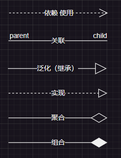
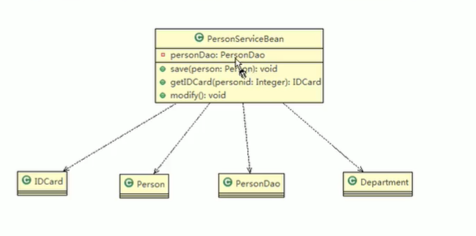
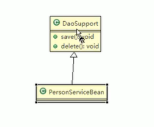
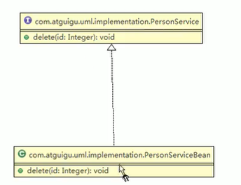
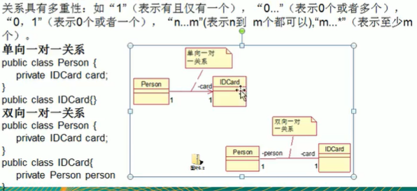
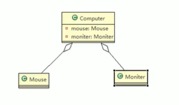
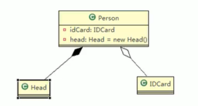

# UML

## UML图示例

## 依赖关系

只要在类中用到了对方，那么他们之间就存在依赖关系。如果没有对方，连编译都过不了

1. 类中使用
2. 成员属性
3. 方法返回类型
4. 方法接收类型
5. 方法中使用到

## 泛化关系

泛化关系实际上就是继承关系，是依赖关系的特例

1. 泛化关系就是继承关系
2. 如果A继承B，就说A和B存在泛化关系

## 实现关系

实现关系实际上就是A类实现B类，是依赖关系的特例

## 关联关系

关联关系实际上就是类与类之间的联系，他是依赖关系的特例。关联具有导航性:即双向关系或单向关系

## 聚合关系

聚合关系(Aggregation）表示的是整体和部分的关系，整体与部分可以分开。是一种特殊的关联关系，它是较强的一种关联关系，强调的是整体与部分之间的关系，从语法上是没办法区分的，只能从语义上区分。

例如雁群和大雁的关系、学校和学生之间的关系。

聚合的整体和部分之间在生命周期上没有什么必然的联系，部分对象可以在整体对象创建之前创建，也可以在整体对象销毁之后销毁。

## 组合关系

组合也是关联关系的一种特例，这种关系比聚合关系更强。它强调了整体与部分的生命周期是一致的，而聚合的整体和部分之间在生命周期上没有什么必然的联系。

例如人和人的脑袋是组合关系，人和身分证是聚合关系

在组合关系中，整体与部分是不可分的，整体的生命周期结束也就意味着部分的生命周期结束。
