# 适配器模式（转换）

适配器模式（Adapter Pattern）：结构型模式之一， 将一个类的接口转换成客户希望的另一个接口。Adapter模式使得原本由于接口不兼容而不能一起工作的哪些类可以一起工作 。

角色职责

* **目标角色**（Target） ：该角色定义把其他类转换为何种接口，也就是我们的期望接口。
* **源角色**（Adaptee） ：你想把谁转换成目标角色，这个“谁”就是源角色，它是已经存在的、运行良好的类或对象。
* **适配器角色**（Adapter） ：适配器模式的核心角色，其他两个角色都是已经存在的角色，而适配器角色是需要新建立的，它的职责非常简单：通过继承或是类关联的方式把源角色转换为目标角色。

工作原理

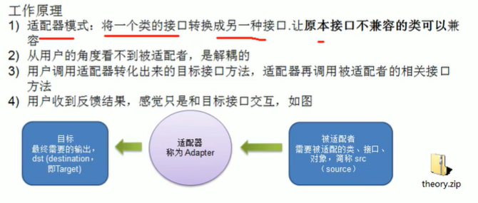

## 类适配器

Adapter类，通过**继承src类**，实现dst类接口，完成src->dst的适配。（继承出现局限性，）

被适配类：Adaptee

```java
public class Adaptee {
    public void adapterRequest(){
        System.out.println("被适配者的方法");
    }
}

```

目标抽象：Target接口

```java
public interface Target {
    void request();
}
```

如果通过一个适配器类，实现 Target 接口，同时继承了 Adaptee 类，然后在实现的 request() 方法中调用父类的 adapteeRequest() 即可实现

```java
public class Adapter extends Adaptee implements Target {
	@Override
    public void request() {
        super.adapterRequest();
    }
}
```

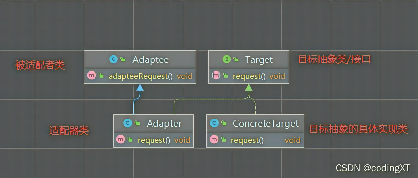

注意：

1. Java是单继承机制，所以类适配器需要继承src类这一点算是一个缺点，因为这要求dst必须是接口，有一定局限性;
2. src类的方法在Adapter中都会暴露出来，也增加了使用的成本。
3. 由于其继承了src类，所以它可以根据需求重写src类的方法，使得Adapter的灵活性增强了。

## 对象适配器（合成复用）

1. 基本思路和类的适配器模式相同，只是将Adapter类作修改，不是继承src类，而是持有src类的实例，以解决兼容性的问题。即:持有src类，实现dst类接口，完成src->dst的适配
2. 根据“合成复用原则”，在系统中尽量使用关联关系来替代继承关系。
3. 对象适配器模式是适配器模式常用的一种

```java
public class Adapter implements Target {
    private Adaptee adaptee = new Adaptee();

    public void request() {
        adaptee.adapterRequest();
    }
}
```

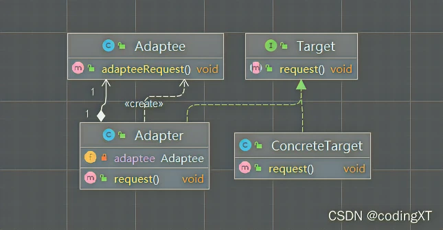

## 接口适配器模式

1. 一些书籍称为:适配器模式(Default Adapter Pattern)或缺省适配器模式。
2. 当不需要全部实现接口提供的方法时，可先设计一个抽象类实现接口，并为该接口中每个方法提供一个默认实现〈空方法)，那么该抽象类的子类可有选择地覆盖父类的某些方法来实现需求
3. 适用于一个接口不想使用其所有的方法的情况。

先写一个接口，里面有三种方法

```java
public interface Team {
    void exploitation();//开发
    void test();//测试
    void products();//产品
}
```

写一个实现类，实现这个接口

```java
public class AbstractAdapter implements Team {
    @Override
    public void exploitation() {
        System.out.println("我是开发");
    }
 
    @Override
    public void test() {
        System.out.println("我是测试");
    }
 
    @Override
    public void products() {
        System.out.println("我是产品");
    }
}
```

再用一个类继承这个实现类，选择要实现的方法即可

```java
public class TeamSocket extends AbstractAdapter {
    @Override
    public void exploitation() {
        System.out.println("全栈小王子");
    }
 
    public static void main(String[] args) {
        TeamSocket teamSocket=new TeamSocket();
        teamSocket.exploitation();
    }
}
```

SpringMvc中的HandlerAdapter，就使用了适配器模式

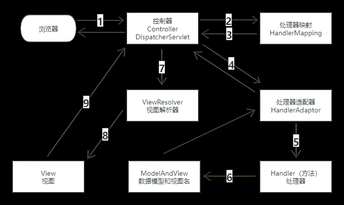

1. 浏览器发送请求到 控制器（DispatcherServlet）
2. 控制器 根据请求地址， 到 HandlerMapping（处理器映射） 寻找对应的 Handler（处理器）
3. HanldlerMapping 返回 找到的Handler
4. DispatcherServlet 根据找到的Handler 找对应的HandlerAdaptor
5. 执行对应的Handler方法
6. Handler 将执行结果 和 要响应的视图名 封装成 ModelAndView 对象
7. 控制器根据返回的 ViewName 找对应的ViewResolver （视图解析ViewResolver 将 Model 渲染到 View 中
8. 将渲染结果 返回给控制器
9. 最终将结果响应给客户端浏览器

可以看出Spring MVC中的适配主要执行Controller的请求处理方法。在Spring MVC中，DispatcherServlet作为用户，HandlerAdapter作为期望接口（目标角色 Target），Controller则为源角色（Adaptee）。Spring MVC中的Controller种类众多，不同类型的Controller通过不同的方法来对请求进行处理。

我们首先看一下HandlerAdapter接口

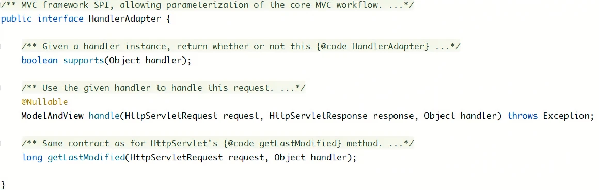

Spring MVC提供的Controler如下。

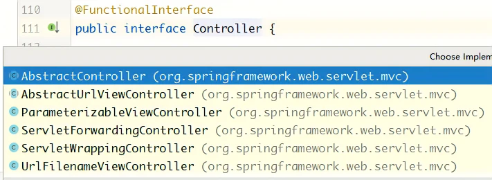

Spring MVC提供的Adapter如下。

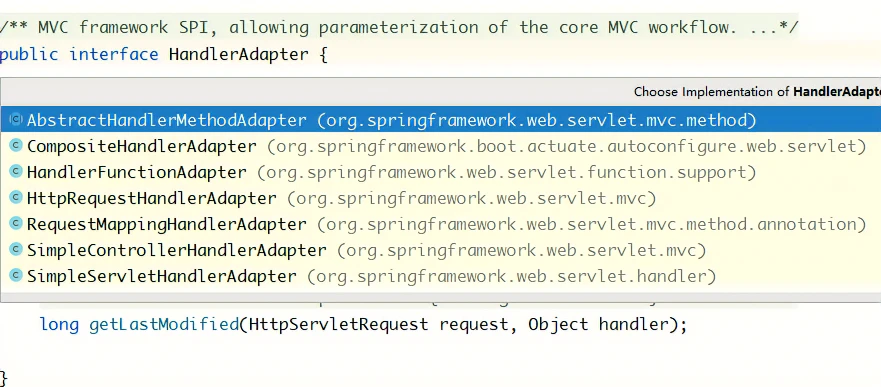

该接口的每一个Controller都有一个适配器与之对应，这样的话，每自定义一个Controller需要定义一个实现HandlerAdapter的适配器。
我们进入DispatcherServlet类，查看是如何获得适配器的。

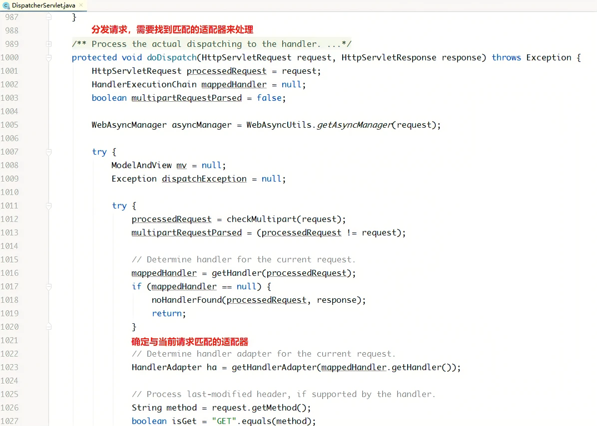

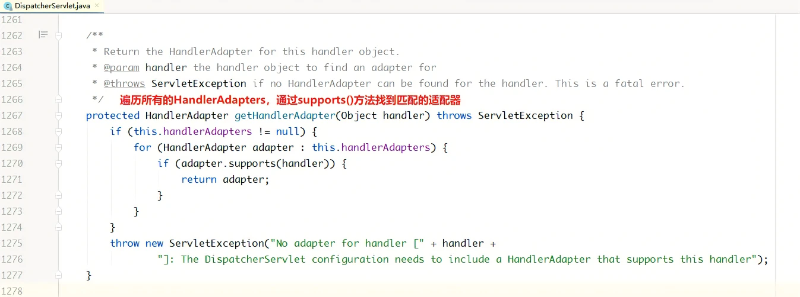

当Spring容器启动后，会将所有定义好的适配器对象存放在一个List集合中，当一个请求来临时，DispatcherServlet会通过 handler的类型找到对应适配器，并将该适配器对象返回给用户，然后就可以统一通过适配器的handle()方法来调用Controller中的用于处理请求的方法。通过适配器模式我们将所有的Controller统一交给 HandlerAdapter 处理，免去了写大量的 if-else 语句对 Controller进行判断，也更利于扩展新的Controller类型。

模拟spring mvc

多种Controler

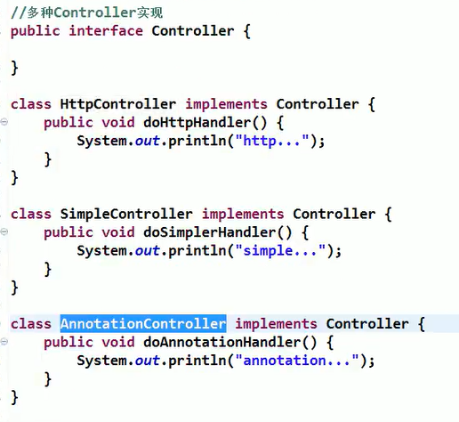

多种Adapter


DispatcherServlet中保存多种Adapter

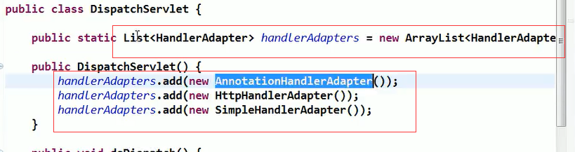

DispatcherServlet中doDispatch的模拟（获取对应适配器，然后调用handle执行）

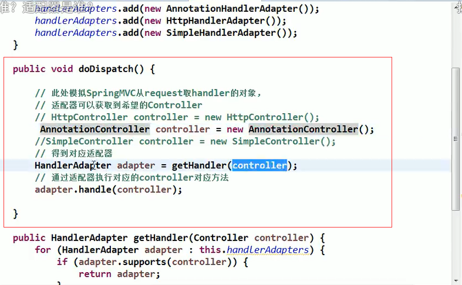

根据得到的Controller（handler），返回对应的适配器

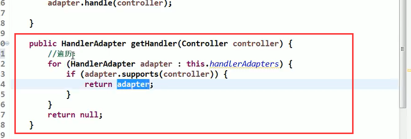

supports作用：判断是否是该类型的Controller

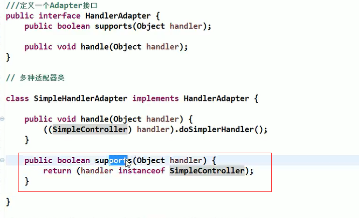

UML图

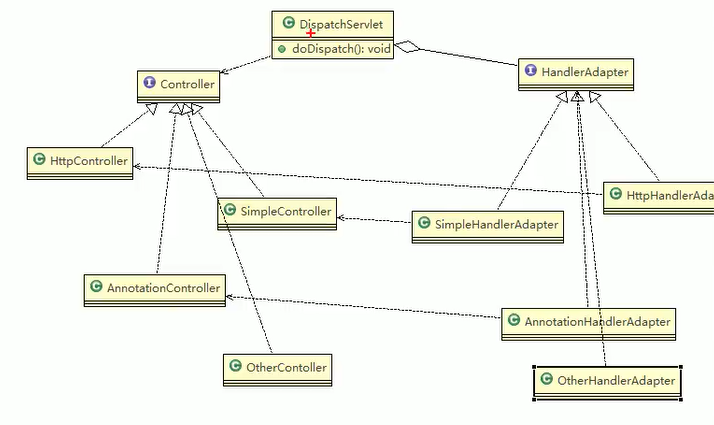

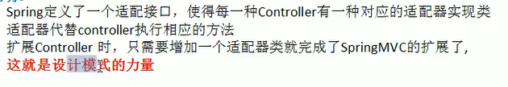

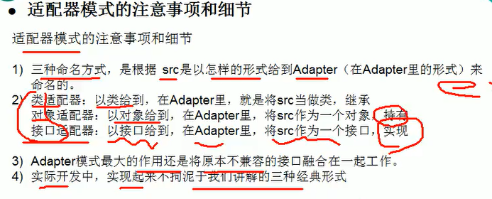

# 桥接模式（不同属性）

在现实生活中，某些类具有两个或多个维度的变化，如图形既可按形状分，又可按颜色分。如何设计类似于 Photoshop 这样的软件，能画不同形状和不同颜色的图形呢？如果用继承方式，m 种形状和 n 种颜色的图形就有 m×n 种，不但对应的子类很多，而且扩展困难。

**桥接模式的定义与特点**

桥接（Bridge）模式的定义如下：将抽象与实现分离，使它们可以独立变化。它是用组合关系代替继承关系来实现，从而降低了抽象和实现这两个可变维度的耦合度。

通过上面的讲解，我们能很好的感觉到桥接模式遵循了里氏替换原则和依赖倒置原则，最终实现了开闭原则，对修改关闭，对扩展开放。这里将桥接模式的优缺点总结如下。

桥接（Bridge）模式的优点是：

* 抽象与实现分离，扩展能力强
* 符合开闭原则
* 符合合成复用原则
* 其实现细节对客户透明

缺点是：由于聚合关系建立在抽象层，要求开发者针对抽象化进行设计与编程，能正确地识别出系统中两个独立变化的维度，这增加了系统的理解与设计难度。

桥接（Bridge）模式包含以下主要角色。

1. 抽象化（Abstraction）角色：定义抽象类，并包含一个对实现化对象的引用。
2. 扩展抽象化（Refined Abstraction）角色：是抽象化角色的子类，实现父类中的业务方法，并通过组合关系调用实现化角色中的业务方法。
3. 实现化（Implementor）角色：定义实现化角色的接口，供扩展抽象化角色调用。
4. 具体实现化（Concrete Implementor）角色：给出实现化角色接口的具体实现。

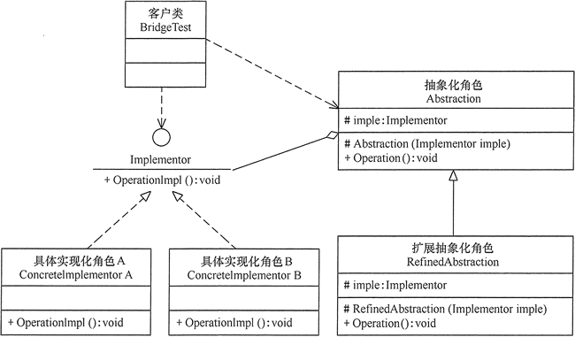

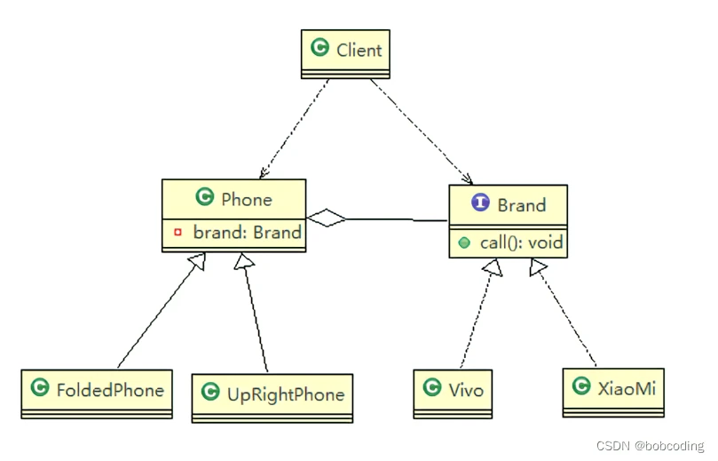

```java
package bridge;/* <---这是包名
-*- coding:utf-8 -*-
作者：bob-coding
日期：2022年10月11日17:23
敲码百遍，其意多见！！冲冲冲！！！*/
 
public class Bridge01 {
    public static void main(String[] args) {
        Phone phone1 = new UpRightPhone(new Vivo());
        phone1.open();
        phone1.call();
        phone1.close();
        System.out.println("=======================");
        Phone phone2 = new FoldedPhone(new XiaoMi());
        phone2.open();
        phone2.call();
        phone2.close();
        Phone phone3 = new FoldedPhone(new Vivo());
        phone3.open();
        phone3.call();
        phone3.close();
        System.out.println("=======================");
        Phone phone4 = new UpRightPhone(new XiaoMi());
        phone4.open();
        phone4.call();
        phone4.close();
    }
}
```

```java
abstract class Phone{
    //组合品牌
    private Brand brand;
    //构造器
    public Phone(Brand brand) {
        super();
        this.brand = brand;
    }
    protected void open(){
        this.brand.open();
    }
    protected void call(){
        brand.call();
    }
    protected void close(){
        brand.close();
    }
}
//直立式手机类，继承 抽象类 Phone
class UpRightPhone extends Phone {
 
    //构造器
    public UpRightPhone(Brand brand) {
        super(brand);
    }
 
    @Override
    public void open() {
        super.open();
        System.out.println(" 直立样式手机 ");
    }
 
    @Override
    public void close() {
        super.close();
        System.out.println(" 直立样式手机 ");
    }
 
    @Override
    public void call() {
        super.call();
        System.out.println(" 直立样式手机 ");
    }
}
 
//折叠式手机类，继承 抽象类 Phone
class FoldedPhone extends Phone{
 
    //构造器
    public FoldedPhone(Brand brand) {
        super(brand);
    }
 
    @Override
    public void open() {
        super.open();
        System.out.println(" 折叠样式手机 ");
    }
 
    @Override
    public void close() {
        super.close();
        System.out.println(" 折叠样式手机 ");
    }
 
    @Override
    public void call() {
        super.call();
        System.out.println(" 折叠样式手机 ");
    }
}
```

```java
//接口
interface Brand{
    void open();
    void call();
    void close();
}

//实现接口
class XiaoMi implements Brand{
 
    @Override
    public void open() {
        System.out.println("xiaomi手机打开");
    }
 
    @Override
    public void call() {
        System.out.println("xiaomi手机打电话");
    }
 
    @Override
    public void close() {
        System.out.println("xiaomi手机关闭");
    }
}
//实现接口
class Vivo implements Brand{
 
    @Override
    public void open() {
        System.out.println("vivo手机打开");
    }
 
    @Override
    public void call() {
        System.out.println("vivo手机打电话");
    }
 
    @Override
    public void close() {
        System.out.println("vivo手机关闭");
    }
}
```

桥接模式在jdbc的源码分析

Jdbc 的 Driver接口，如果从桥接模式来看，Driver就是一个接口，下面可以有 MySQL的Driver，Oracle的Driver，这些就可以当做实现接口类

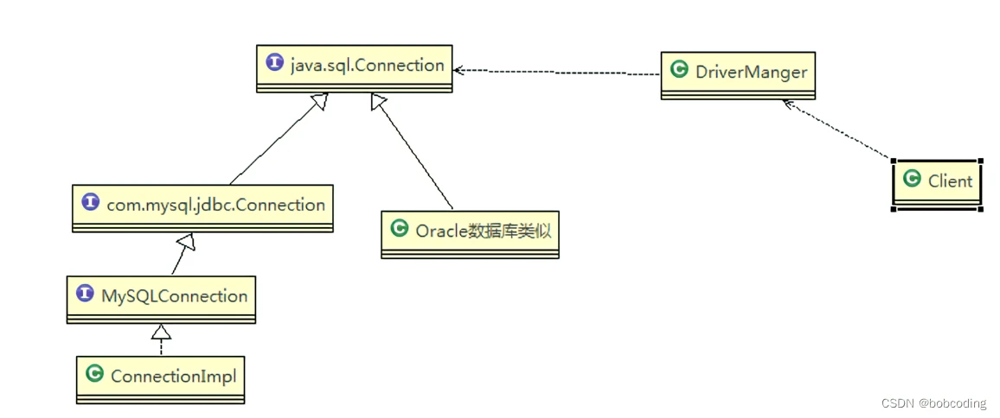

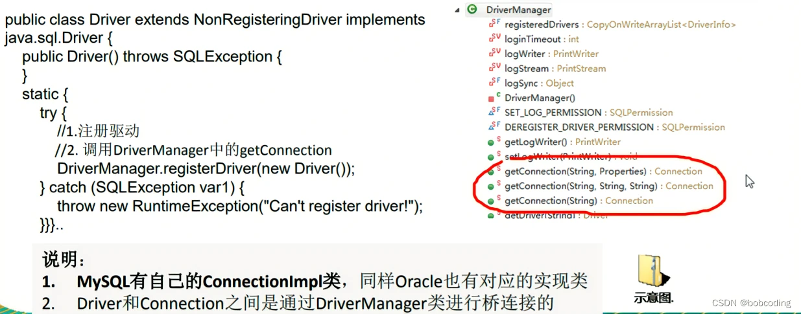

桥接模式的注意事项和细节

1) 实现了抽象和实现部分的分离，从而极大的提供了系统的灵活性，让抽象部分和实 现部分独立开来，这有助于系统进行分层设计，从而产生更好的结构化系统。
2) 对于系统的高层部分，只需要知道抽象部分和实现部分的接口就可以了，其它的部分由具体业务来完成。
3) 桥接模式替代多层继承方案，可以减少子类的个数，降低系统的管理和维护成本。
4) 桥接模式的引入增加了系统的理解和设计难度，由于聚合关联关系建立在抽象层， 要求开发者针对抽象进行设计和编程。
5) 桥接模式要求正确识别出系统中两个独立变化的维度，因此其使用范围有一定的局限性，即需要有这样的应用场景。

# 装饰者模式（额外职责）

通过将对象放入包含行为的特殊封装对象中来为原对象绑定新的行为。（需要与桥接模式区分，桥接模式绑定的是属性，这个是对原有功能的增强）。需要注意的是，装饰对象要与目标对象实现相同的接口，或继承相同的抽象类。

装饰对象需要持有目标对象的引用作为成员变量，而具体的赋能任务往往通过带参构造方法来完成。
