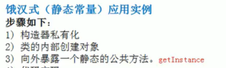
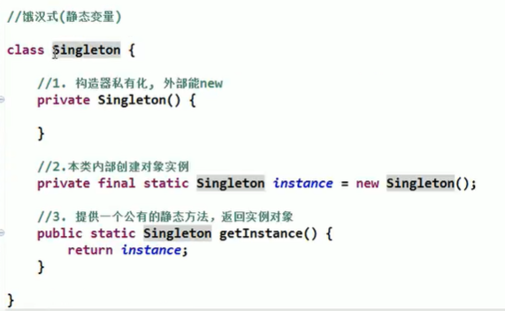
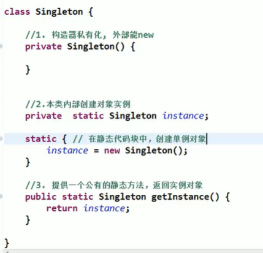
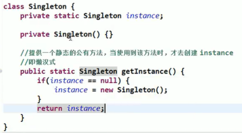
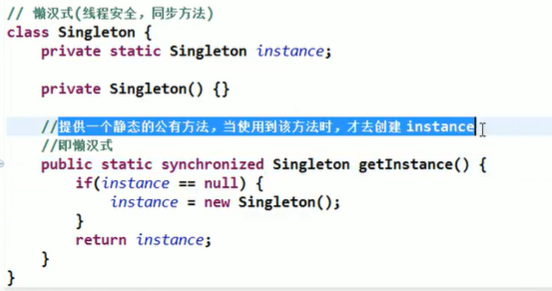
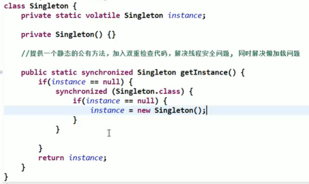
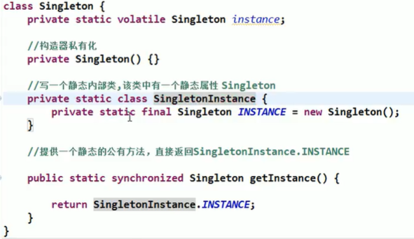
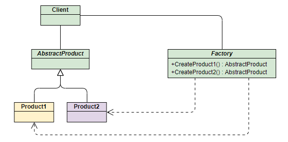
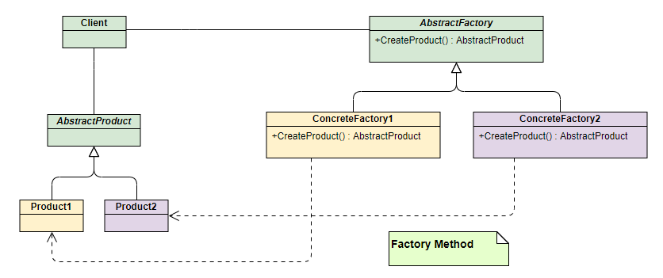

# 设计模式（人机合一）

## 三类设计模式

1. 创建型模式（对象的创建）：单例模式、抽象工厂模式、原型模式、建造者模式、工厂模式
2. 结构型模式（软件结构）：适配器模式、桥接模式、装饰模式、组合模式、外观模式、享元模式、代理模式。
3. 行为型模式（方法角度）：模版方法模式、命令模式、访问者模式、迭代器模式、观察者模式、中介者模式、备忘录模式、解释器模式(Interpreter模式)、状态模式、策略模式、职责链模式(责任链模式)。

## 单例模式

所谓类的单例设计模式，就是采取一定的方法保证在整个的软件系统中，对某个类只能存在一个对象实例，并且该类只提供一个取得其对象实例的（静态）方法。

比如Hibernate的SessionFactory，它充当数据存储源的代理，并负责创建Session对象。SessionFactory并不是轻量级的，一般情况下，一个项目通常只需要一个SessionFactory就够，这是就会使用到单例模式。

1. 饿汉式(静态常量)
2. 饿汉式(静态代码块)
3. 懒汉式(线程不安全)
4. 懒汉式(线程安全，同步方法)
5. 懒汉式(线程安全，同步代码块)
6. 双重检查
7. 静态内部类
8. 枚举

### 饿汉式(静态常量)





优缺点

1. 优点：这种写法比较简单，就是在类装载的时候就完成实例化。避免了线程同步问题。
2. 缺点：在类装载的时候就完成实例化，没有达到Lazy Loading的效果。如果从始至终从未使用过这个实例，则会造成内存的浪费
3. 这种方式基于classloder机制避免了多线程的同步问题，不过，instance在类装载时就实例化，在单例模式中大多数都是调用getlnstance方法，但是**导致类装载的原因有很多种**，因此不能确定有其他的方式（或者其他的静态方法）导致类装载，这时候初始化instance就没有达到lazy loading的效果
4. 结论:这种单例模式可用，可能造成内存浪费

### 饿汉式(静态代码块)

只是初始化位置不同



### 懒汉式(线程不安全)



优缺点

1. 起到了Lazy Loading的效果，但是只能在单线程下使用。
2. 如果在多线程下，一个线程进入了if (singleton == null)判断语句块，还未来得及往下执行，另一个线程也通过了这个判断语句，这时便会产生多个实例。所以在多线程环境下不可使用这种方式
3. 结论:在实际开发中，不要使用这种方式.

### 懒汉式(线程安全，同步方法)



优缺点

1. 解决了线程不安全问题
2. 效率太低了，每个线程在想获得类的实例时候，执行getInstance()方法都要进行同步。而其实这个方法只执行一次实例化代码就够了，后面的想获得该类实例，直接return就行了。方法进行同步效率太低
3. 结论:在实际开发中，不推荐使用这种方式

### 懒汉式(线程不安全，同步代码块)

想法挺好，可惜白搭，笑死


优缺点

1. 这种方式，本意是想对第四种实现方式的改进，因为前面同步方法效率太低，改为同步产生实例化的的代码块
2. 但是这种同步并不能起到线程同步的作用。跟第3种实现方式遇到的情形一致，假如一个线程进入了if (singleton == nul)判断语句块，还未来得及往下执行，另一个线程也通过了这个判断语句，这时便会产生多个实例
3. **结论:在实际开发中，不能使用这种方式**

### 双重检查

volatile是Java提供的轻量级的同步机制，保证了可见性，不保证原子性。



优缺点

1. Double-kcheck概念是多线程开发中常使用到的，如代码中所示，我们进行了两次if (singleton == null)检查，这样就可以保证线程安全了。
2. 这样，实例化代码只用执行一次，后面再次访问时，判断if (singleton == null)，直接return实例化对象，也避免的反复进行方法同步.
3. 线程安全;延迟加载;效率较高
4. 结论:在实际开发中，推荐使用这种单例设计模式

### 静态内部类



优缺点

1. 这种方式采用了类装载的机制来保证初始化实例时只有一个线程。
2. 静态内部类方式在singleton类被装载时并不会立即实例化，而是在需要实例化时，调用getlnstance方法，才会装载SingletonInstance类，从而完成Singleton的实例化。
3. 类的静态属性只会在第一次加载类的时候初始化，所以在这里，VM帮助我们保证了线程的安全性，在类进行初始化时，别的线程是无法进入的。
4. 优点：避免了线程不安全，利用静态内部类特点实现延迟加载，效率高
5. 结论：推荐使用.

### 枚举


优缺点

1. 这借助JDK1.5中添加的枚举来实现单例模式。不仅能避免多线程同步问题，而且还能防止反序列化重新创建新的对象。
2. 这种方式是Effective Java作者Josh Bloch提倡的方式
3. 结论:推荐使用

### 单例模式在jdk的使用

java.lang.Runtime就是经典的单例模式

### 总结和使用场景

1. 单例模式保证了系统内存中该类只存在一个对象，节省了系统资源，对于一些需要频繁创建销毁的对象，使用单例模式可以提高系统性能
2. 当想实例化一个单例类的时候，必须要记住使用相应的获取对象的方法，而不是使用new
3. 单例模式使用的场景:需要频繁的进行创建和销毁的对象、创建对象时耗时过多或耗费资源过多(即:重量级对象)，但又经常用到的对象、工具类对象、频繁访问数据库或文件的对象(比如数据源、session工厂等)

## 简单工厂模式（静态工厂模式）

该模式对对象创建管理方式最为简单，只需要创建一个简单的工厂类然后在里面创建对象。该模式通过向工厂传递类型来指定要创建的对象，其UML类图如下：



**Phone类** ：手机标准规范类(AbstractProduct)

```java
/**
 * 手机接口
 */
public interface Phone {
}
```

**MiPhone类** ：制造小米手机（Product1）

```java
/**
 * 小米手机
 */
public class MiPhone implements Phone {
    public MiPhone(){
        System.out.println("make xiaomi phone!");
    }
}
```

**IPhone类** ：制造苹果手机（Product2）

```java
/**
 * 苹果手机
 */
public class IPhone implements Phone {
    public IPhone(){
        System.out.println("make iphone!");
    }
}
```

**PhoneFactory类** ：手机代工厂（Factory）

```java
/**
 * 简单手机工厂
 */
public class PhoneFactory {
 
    public Phone makePhone(String phoneType) {
        if(phoneType.equalsIgnoreCase("MiPhone")) {
            return new MiPhone();
        } else if(phoneType.equalsIgnoreCase("iPhone")) {
            return new IPhone();
        }
 
        return null;
    }
}
```

**演示：**

```java
public class Client {
    public static void main(String[] arg) {
        PhoneFactory factory = new PhoneFactory();
        Phone miPhone = factory.makePhone("MiPhone");   // make xiaomi phone!
        Phone iPhone = factory.makePhone("iPhone");    // make iphone!
    }
}
```

## 工厂方法模式

和简单工厂模式中工厂负责生产所有产品相比，工厂方法模式将生成具体产品的任务分发给具体的产品工厂，其UML类图如下：



也就是定义一个抽象工厂，其定义了产品的生产接口，但不负责具体的产品，将生产任务交给不同的派生类工厂。这样不用通过指定类型来创建对象了。

接下来继续使用生产手机的例子来讲解该模式。

其中和产品相关的Phone类、MiPhone类和IPhone类的定义不变。

 **AbstractFactory类** ：生产不同产品的工厂的抽象类

```java
public interface AbstractFactory {
    Phone makePhone();
}
```

**XiaoMiFactory类** ：生产小米手机的工厂（ConcreteFactory1）

```java
/**
 * 小米工厂方法
 */
public class XiaoMiFactory implements AbstractFactory {
    @Override
    public Phone makePhone() {
        return new MiPhone();
    }
}
```

**AppleFactory类** ：生产苹果手机的工厂（ConcreteFactory2）

```java
/**
 * 苹果工厂方法
 */
public class AppleFactory implements  AbstractFactory {
    @Override
    public Phone makePhone() {
        return new IPhone();
    }
}
```

**演示：**

```java
public class Client {
    public static void main(String[] arg) {
        AbstractFactory miFactory = new XiaoMiFactory();
        AbstractFactory appleFactory = new AppleFactory();
        miFactory.makePhone();            // make xiaomi phone!
        appleFactory.makePhone();        // make iphone!
    }
}
```

## 抽象工厂模式(Abstract Factory)

此模式是对工厂方法模式的进一步扩展。在工厂方法模式中，一个具体的工厂负责生产一类具体的产品，即一对一的关系，但是，如果需要一个具体的工厂生产多种产品对象，那么就需要用到抽象工厂模式了

上面两种模式不管工厂怎么拆分抽象，都只是针对一类产品 **Phone** （AbstractProduct），如果要生成另一种产品PC，应该怎么表示呢？

最简单的方式是把2中介绍的工厂方法模式完全复制一份，不过这次生产的是PC。但同时也就意味着我们要完全复制和修改Phone生产管理的所有代码，显然这是一个笨办法，并不利于扩展和维护。

抽象工厂模式通过在AbstarctFactory中增加创建产品的接口，并在具体子工厂中实现新加产品的创建，当然前提是子工厂支持生产该产品。否则继承的这个接口可以什么也不干。


**PC类** ：定义PC产品的接口(AbstractPC)

```java
/**
 * 电脑接口
 */
public interface PC {
}
```

**MiPC类** ：定义小米电脑产品(MIPC)

```java
/**
 * 小米电脑
 */
public class MiPC implements PC {
    public MiPC() {
        System.out.println("make xiaomi PC!");
    }
}
```

**MAC类** ：定义苹果电脑产品(MAC)

```java
/**
 * 苹果电脑
 */
public class MAC implements PC {
    public MAC() {
        System.out.println("make MAC!");
    }
}
```

**AbstractFactory类** ：增加PC产品制造接口

```java
/**
 * 抽象工厂
 */
public interface AbstractFactory {
    Phone makePhone();
    PC makePC();
}
```

**XiaoMiFactory类** ：增加小米PC的制造（ConcreteFactory1）

```java
/**
 * 小米工厂
 * 生产小米一族的产品
 */
public class XiaoMiFactory implements AbstractFactory {
    @Override
    public Phone makePhone() {
        return new MiPhone();
    }
 
    @Override
    public PC makePC() {
        return new MiPC();
    }
}
```

**AppleFactory类** ：增加苹果PC的制造（ConcreteFactory2）

```java
/**
 * 苹果工厂
 * 生产苹果一族的产品
 */
public class AppleFactory implements AbstractFactory {
 
    @Override
    public Phone makePhone() {
        return new IPhone();
    }
 
    @Override
    public PC makePC() {
        return new MAC();
    }
}
```

**演示：**

```java
public class Client
{
    public static void main(String[] arg)
    {
        AbstractFactory miFactory = new XiaoMiFactory();
        AbstractFactory appleFactory = new AppleFactory();
 
        miFactory.makePhone();            // make xiaomi phone!
        miFactory.makePC();               // make xiaomi PC!
 
        appleFactory.makePhone();        // make iphone!
        appleFactory.makePC();              // make xiaomi MAC!
    }
}
```
