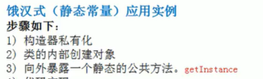
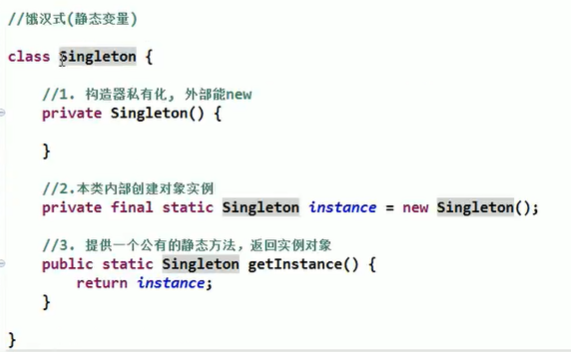
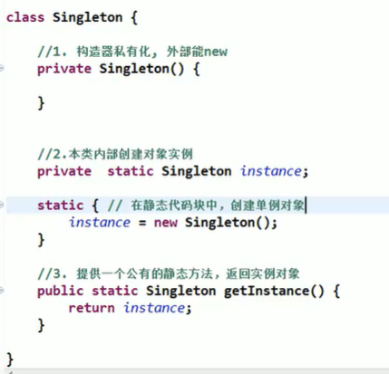
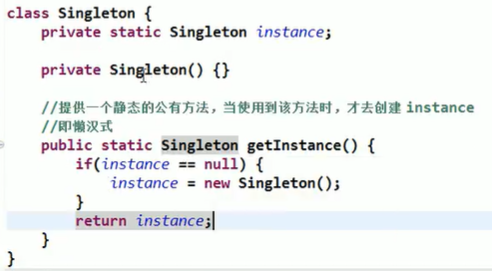
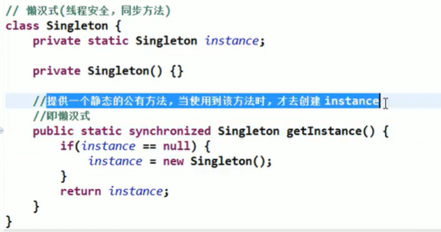
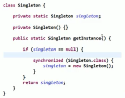
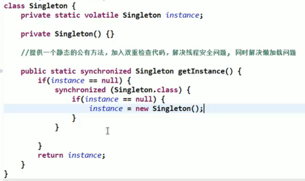
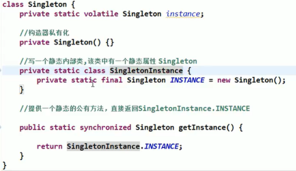
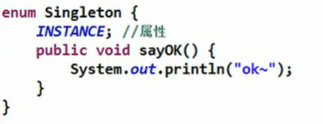

# 单例模式

所谓类的单例设计模式，就是采取一定的方法保证在整个的软件系统中，对某个类只能存在一个对象实例，并且该类只提供一个取得其对象实例的（静态）方法。

比如Hibernate的SessionFactory，它充当数据存储源的代理，并负责创建Session对象。SessionFactory并不是轻量级的，一般情况下，一个项目通常只需要一个SessionFactory就够，这是就会使用到单例模式。

1. 饿汉式(静态常量)
2. 饿汉式(静态代码块)
3. 懒汉式(线程不安全)
4. 懒汉式(线程安全，同步方法)
5. 懒汉式(线程安全，同步代码块)
6. 双重检查
7. 静态内部类
8. 枚举

## 饿汉式(静态常量)

优缺点

1. 优点：这种写法比较简单，就是在类装载的时候就完成实例化。避免了线程同步问题。
2. 缺点：在类装载的时候就完成实例化，没有达到Lazy Loading的效果。如果从始至终从未使用过这个实例，则会造成内存的浪费
3. 这种方式基于classloder机制避免了多线程的同步问题，不过，instance在类装载时就实例化，在单例模式中大多数都是调用getlnstance方法，但是**导致类装载的原因有很多种**，因此不能确定有其他的方式（或者其他的静态方法）导致类装载，这时候初始化instance就没有达到lazy loading的效果
4. 结论:这种单例模式可用，可能造成内存浪费

## 饿汉式(静态代码块)

只是初始化位置不同

## 懒汉式(线程不安全)

优缺点

1. 起到了Lazy Loading的效果，但是只能在单线程下使用。
2. 如果在多线程下，一个线程进入了if (singleton == null)判断语句块，还未来得及往下执行，另一个线程也通过了这个判断语句，这时便会产生多个实例。所以在多线程环境下不可使用这种方式
3. 结论:在实际开发中，不要使用这种方式.

## 懒汉式(线程安全，同步方法)

优缺点

1. 解决了线程不安全问题
2. 效率太低了，每个线程在想获得类的实例时候，执行getInstance()方法都要进行同步。而其实这个方法只执行一次实例化代码就够了，后面的想获得该类实例，直接return就行了。方法进行同步效率太低
3. 结论:在实际开发中，不推荐使用这种方式

## 懒汉式(线程不安全，同步代码块)

想法挺好，可惜白搭，笑死

优缺点

1. 这种方式，本意是想对第四种实现方式的改进，因为前面同步方法效率太低，改为同步产生实例化的的代码块
2. 但是这种同步并不能起到线程同步的作用。跟第3种实现方式遇到的情形一致，假如一个线程进入了if (singleton == nul)判断语句块，还未来得及往下执行，另一个线程也通过了这个判断语句，这时便会产生多个实例
3. **结论:在实际开发中，不能使用这种方式**

## 双重检查

volatile是Java提供的轻量级的同步机制，保证了可见性，不保证原子性。

优缺点

1. Double-kcheck概念是多线程开发中常使用到的，如代码中所示，我们进行了两次if (singleton == null)检查，这样就可以保证线程安全了。
2. 这样，实例化代码只用执行一次，后面再次访问时，判断if (singleton == null)，直接return实例化对象，也避免的反复进行方法同步.
3. 线程安全;延迟加载;效率较高
4. 结论:在实际开发中，推荐使用这种单例设计模式

## 静态内部类

优缺点

1. 这种方式采用了类装载的机制来保证初始化实例时只有一个线程。
2. 静态内部类方式在singleton类被装载时并不会立即实例化，而是在需要实例化时，调用getlnstance方法，才会装载SingletonInstance类，从而完成Singleton的实例化。
3. 类的静态属性只会在第一次加载类的时候初始化，所以在这里，VM帮助我们保证了线程的安全性，在类进行初始化时，别的线程是无法进入的。
4. 优点：避免了线程不安全，利用静态内部类特点实现延迟加载，效率高
5. 结论：推荐使用.

## 枚举

优缺点

1. 这借助JDK1.5中添加的枚举来实现单例模式。不仅能避免多线程同步问题，而且还能防止反序列化重新创建新的对象。
2. 这种方式是Effective Java作者Josh Bloch提倡的方式
3. 结论:推荐使用

单例模式在jdk的使用

java.lang.Runtime就是经典的单例模式

总结和使用场景

1. 单例模式保证了系统内存中该类只存在一个对象，节省了系统资源，对于一些需要频繁创建销毁的对象，使用单例模式可以提高系统性能
2. 当想实例化一个单例类的时候，必须要记住使用相应的获取对象的方法，而不是使用new
3. 单例模式使用的场景:需要频繁的进行创建和销毁的对象、创建对象时耗时过多或耗费资源过多(即:重量级对象)，但又经常用到的对象、工具类对象、频繁访问数据库或文件的对象(比如数据源、session工厂等)
