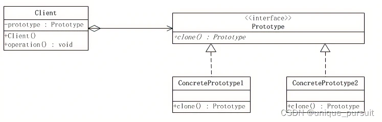
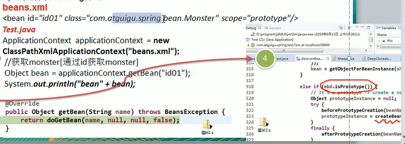
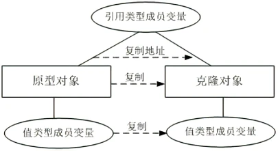
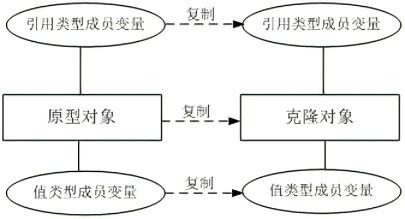
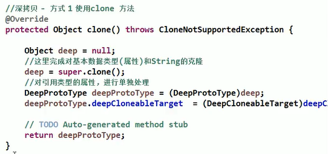
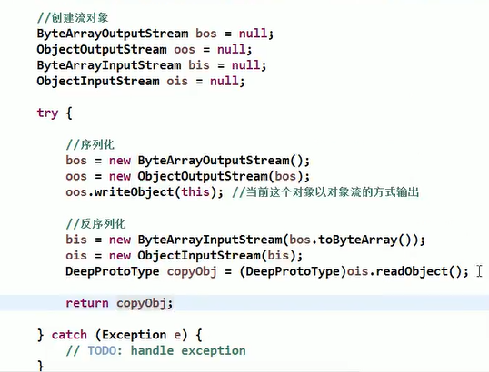

# 原型模式

传统复制克隆

1. 优点是比较好理解，简单易操作。
2. 在创建新的对象时，总是需要重新获取原始对象的属性，如果创建的对象比较复杂时，效率较低
3. 总是需要重新初始化对象，而不是动态地获得对象运行时的状态，不够灵活

改进思路：Java中object类是所有类的根类，Object类提供了一个clone()方法，该方法可以将一个Java对象复制一份，但是需要实现clone的Java类必须要实现一个接口Cloneable，该接口表示该类能够复制且具有复制的能力→原型模式

原型模式（Prototype Pattern）是一种对象创建型模式，它是使用原型实例指定待创建对象的类型，并且通过复制这个原型来创建新的对象。

它的工作原理很简单：将一个原型对象传给要发动创建的对象（即客户端对象），这个要发动创建的对象通过请求原型对象复制自己来实现创建过程。

原型模式包含以下3个角色。

1. Prototype（抽象原型类）：它是声明克隆方法的接口，是所有具体原型类的公共父类，它可以是抽象类也可以是接口，甚至还可以是具体实现类。
2. ConcretePrototype（具体原型类）：它实现在抽象原型类中声明的克隆方法，在克隆方法中返回自己的一个克隆对象。
3. Client（客户类）：在客户类中，让一个原型对象克隆自身从而创建一个新的对象，只需要直接实例化或通过工厂方法等方式创建一个原型对象，再通过调用该对象的克隆方法即可得到多个相同的对象。

原型模式在Spring中的分析

1. Spring中原型bean的创建，就是原型模式的应用
2. 

深克隆与浅克隆

根据在复制原型对象的同时是否复制包含在原型对象中引用类型的成员变量，原型模式的克隆机制可分为两种，即浅克隆（Shallow Clone）和深克隆（Deep Clone）。

在浅克隆中，当对象被复制时只复制它本身和其中包含的值类型的成员变量，而引用类型的成员对象并没有复制。

在深克隆中，除了对象本身被复制外，对象所包含的所有成员变量也将复制。

1. 深拷贝实现方式1:重写clone方法来实现深拷贝
   
2. 深拷贝实现方式2:通过对象序列化实现深拷贝
   
3. 深拷贝的工具类SerializationUtils.clone(sheep)
