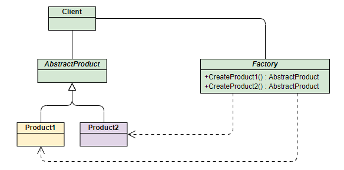
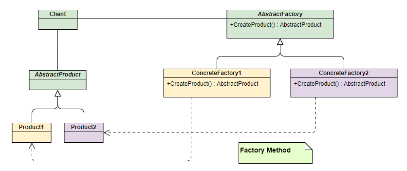

# 工厂模式

## 简单工厂模式（静态工厂模式）

该模式对对象创建管理方式最为简单，只需要创建一个简单的工厂类然后在里面创建对象。该模式通过向工厂传递类型来指定要创建的对象，其UML类图如下：



**Phone类** ：手机标准规范类(AbstractProduct)

```java
/**
 * 手机接口
 */
public interface Phone {
}
```

**MiPhone类** ：制造小米手机（Product1）

```java
/**
 * 小米手机
 */
public class MiPhone implements Phone {
    public MiPhone(){
        System.out.println("make xiaomi phone!");
    }
}
```

**IPhone类** ：制造苹果手机（Product2）

```java
/**
 * 苹果手机
 */
public class IPhone implements Phone {
    public IPhone(){
        System.out.println("make iphone!");
    }
}
```

**PhoneFactory类** ：手机代工厂（Factory）

```java
/**
 * 简单手机工厂
 */
public class PhoneFactory {
 
    public Phone makePhone(String phoneType) {
        if(phoneType.equalsIgnoreCase("MiPhone")) {
            return new MiPhone();
        } else if(phoneType.equalsIgnoreCase("iPhone")) {
            return new IPhone();
        }
 
        return null;
    }
}
```

**演示：**

```java
public class Client {
    public static void main(String[] arg) {
        PhoneFactory factory = new PhoneFactory();
        Phone miPhone = factory.makePhone("MiPhone");   // make xiaomi phone!
        Phone iPhone = factory.makePhone("iPhone");    // make iphone!
    }
}
```

## 工厂方法模式

和简单工厂模式中工厂负责生产所有产品相比，工厂方法模式将生成具体产品的任务分发给具体的产品工厂，其UML类图如下：



也就是定义一个抽象工厂，其定义了产品的生产接口，但不负责具体的产品，将生产任务交给不同的派生类工厂。这样不用通过指定类型来创建对象了。

接下来继续使用生产手机的例子来讲解该模式。

其中和产品相关的Phone类、MiPhone类和IPhone类的定义不变。

 **AbstractFactory类** ：生产不同产品的工厂的抽象类

```java
public interface AbstractFactory {
    Phone makePhone();
}
```

**XiaoMiFactory类** ：生产小米手机的工厂（ConcreteFactory1）

```java
/**
 * 小米工厂方法
 */
public class XiaoMiFactory implements AbstractFactory {
    @Override
    public Phone makePhone() {
        return new MiPhone();
    }
}
```

**AppleFactory类** ：生产苹果手机的工厂（ConcreteFactory2）

```java
/**
 * 苹果工厂方法
 */
public class AppleFactory implements  AbstractFactory {
    @Override
    public Phone makePhone() {
        return new IPhone();
    }
}
```

**演示：**

```java
public class Client {
    public static void main(String[] arg) {
        AbstractFactory miFactory = new XiaoMiFactory();
        AbstractFactory appleFactory = new AppleFactory();
        miFactory.makePhone();            // make xiaomi phone!
        appleFactory.makePhone();        // make iphone!
    }
}
```

## 抽象工厂模式(Abstract Factory)

此模式是对工厂方法模式的进一步扩展。在工厂方法模式中，一个具体的工厂负责生产一类具体的产品，即一对一的关系，但是，如果需要一个具体的工厂生产多种产品对象，那么就需要用到抽象工厂模式了

上面两种模式不管工厂怎么拆分抽象，都只是针对一类产品 **Phone** （AbstractProduct），如果要生成另一种产品PC，应该怎么表示呢？

最简单的方式是把2中介绍的工厂方法模式完全复制一份，不过这次生产的是PC。但同时也就意味着我们要完全复制和修改Phone生产管理的所有代码，显然这是一个笨办法，并不利于扩展和维护。

抽象工厂模式通过在AbstarctFactory中增加创建产品的接口，并在具体子工厂中实现新加产品的创建，当然前提是子工厂支持生产该产品。否则继承的这个接口可以什么也不干。


**PC类** ：定义PC产品的接口(AbstractPC)

```java
/**
 * 电脑接口
 */
public interface PC {
}
```

**MiPC类** ：定义小米电脑产品(MIPC)

```java
/**
 * 小米电脑
 */
public class MiPC implements PC {
    public MiPC() {
        System.out.println("make xiaomi PC!");
    }
}
```

**MAC类** ：定义苹果电脑产品(MAC)

```java
/**
 * 苹果电脑
 */
public class MAC implements PC {
    public MAC() {
        System.out.println("make MAC!");
    }
}
```

**AbstractFactory类** ：增加PC产品制造接口

```java
/**
 * 抽象工厂
 */
public interface AbstractFactory {
    Phone makePhone();
    PC makePC();
}
```

**XiaoMiFactory类** ：增加小米PC的制造（ConcreteFactory1）

```java
/**
 * 小米工厂
 * 生产小米一族的产品
 */
public class XiaoMiFactory implements AbstractFactory {
    @Override
    public Phone makePhone() {
        return new MiPhone();
    }
 
    @Override
    public PC makePC() {
        return new MiPC();
    }
}
```

**AppleFactory类** ：增加苹果PC的制造（ConcreteFactory2）

```java
/**
 * 苹果工厂
 * 生产苹果一族的产品
 */
public class AppleFactory implements AbstractFactory {
 
    @Override
    public Phone makePhone() {
        return new IPhone();
    }
 
    @Override
    public PC makePC() {
        return new MAC();
    }
}
```

**演示：**

```java
public class Client
{
    public static void main(String[] arg)
    {
        AbstractFactory miFactory = new XiaoMiFactory();
        AbstractFactory appleFactory = new AppleFactory();
 
        miFactory.makePhone();            // make xiaomi phone!
        miFactory.makePC();               // make xiaomi PC!
 
        appleFactory.makePhone();        // make iphone!
        appleFactory.makePC();              // make xiaomi MAC!
    }
}
```

后两者区别

1. 工厂方法只有一个抽象产品类和一个抽象工厂类，但可以派生出多个具体产品类和具体工厂类，每个具体工厂类只能创建一个具体产品类的实例。
2. 抽象工厂模式拥有多个抽象产品类（产品族）和一个抽象工厂类，每个抽象产品类可以派生出多个具体产品类；抽象工厂类也可以派生出多个具体工厂类，同时每个具体工厂类可以创建多个具体产品类的实例

工厂模式在jdk的使用

jdk-Calendar应用

总结

1. 将实例化对象的代码提取出来，放到一个类中统一管理和维护，达到和主项目的依赖关系的解耦。从而提高项目的扩展和维护性。
2. 三种工厂模式(简单工厂模式、工厂方法模式、抽象工厂模式
3. 设计模式的依赖抽象原则
4. 创建对象实例时，不要直接 new类,而是把这个new 类的动作放在一个工厂的方法中，并返回。有的书上说，变量不要直接持有具体类的引用。
5. 不要让类继承具体类，而是继承抽象类或者是实现interface(接口)
6. 不要覆盖基类中已经实现的方法。
