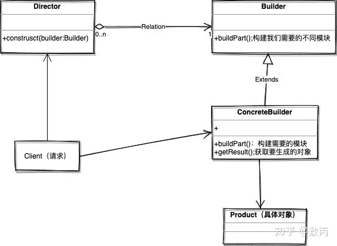
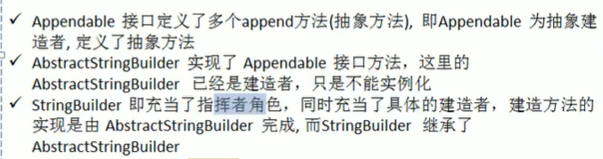

# 建造者模式

建造模式是对象的创建模式。将一个产品的内部表象与产品的生产过程分割开

建造者模式，相当于是对工厂生产产品的一种 装配 ，装配可能随时改变，所以需要抽取出来， 实现产品局部与整体的解耦 （单个孤立产品需要建造者多此一举）。装配，对应在程序中就是相当于调用顺序，以及调用参数问题。

建造者模式四个角色：

* **抽象建造者**（Builder）角色：创建一个Product对象的各个部件指定的接口。
* **具体建造者**（ConcreteBuilder）角色： 实现接口，构建和装配各个部件。
* **指挥者**（Director)：构建一个使用Builder接口的对象。它主要是用于创建一个复杂的对象。它主要有两个作用，一是:隔离了客户与对象的生产过程，二是:负责控制产品对象的生产过程。
* **产品角色**（Product）： 一个具体的产品对象。



```java
public class Builder {//客户端

    public static void main(String[] args) {
        //创建指挥者
        Director director = new Director();
        //传入具体建造者
        director.setAbstractBuilder(new ConcreteBuilder());
        //生产产品并接收
        Product product = director.build();
    }
}

class Director {//指挥者
    public AbstractBuilder abstractBuilder;

    //传入具体建造者，决定创建哪种产品
    public void setAbstractBuilder(AbstractBuilder abstractBuilder) {
        this.abstractBuilder = abstractBuilder;
    }

    //控制产品的生产流程
    public Product build() {
        abstractBuilder.Step0();
	abstractBuilder.Step1();
        return abstractBuilder.finish();
    }
}

abstract class AbstractBuilder {//抽象建造者
    public Product product = new Product();//初始化时是未完成品

    //规范建造方法
    public abstract void Step0();
    public abstract void Step1();

    //建造完成，返回产品
    public Product finish() {
        return product;
    }
}

class ConcreteBuilder extends AbstractBuilder {//Product的具体建造者

    //实现建造方法
    public void Step0() {
    }
    public void Step1() {
    }
}

class Product {//产品
}
```

建造者模式在jdk的StringBuilder



抽象工厂模式、建造者模式

1. 抽象工厂模式：实现对产品家族的创建，一个产品家族是一系列产品，具有不同分类维度的产品组合，采用抽象工厂模式不需要关心构建过程，只关心什么产品由什么工厂生产即可
2. 建造者模式：要求按照指定的规范建造产品，主要目的是通过组装零配件而产生一个新产品

应用场景

1. 需要生成的产品对象有复杂的内部结构，这些产品对象具备共性
2. 隔离复杂对象的创建和使用，并使得相同的创建过程可以创建不同的产品
3. 需要生成的对象内部属性本身相互依赖
