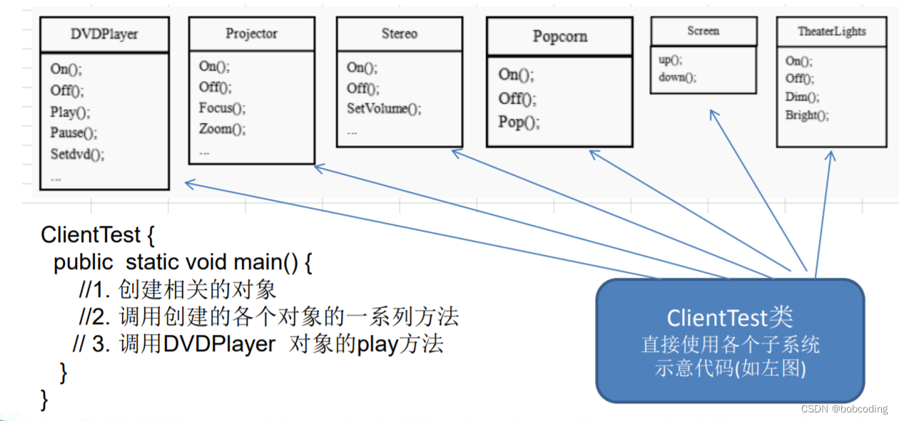
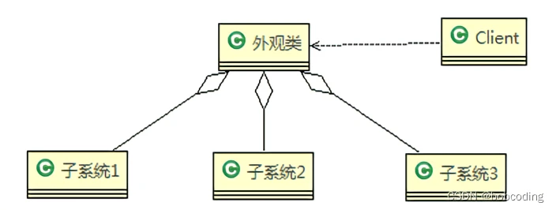
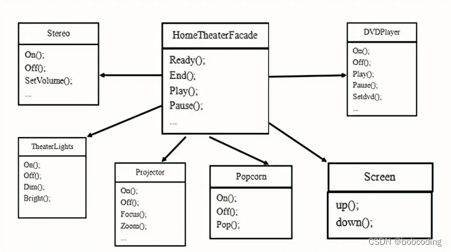
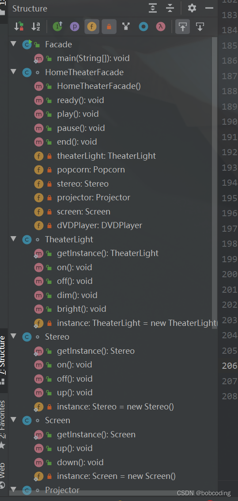
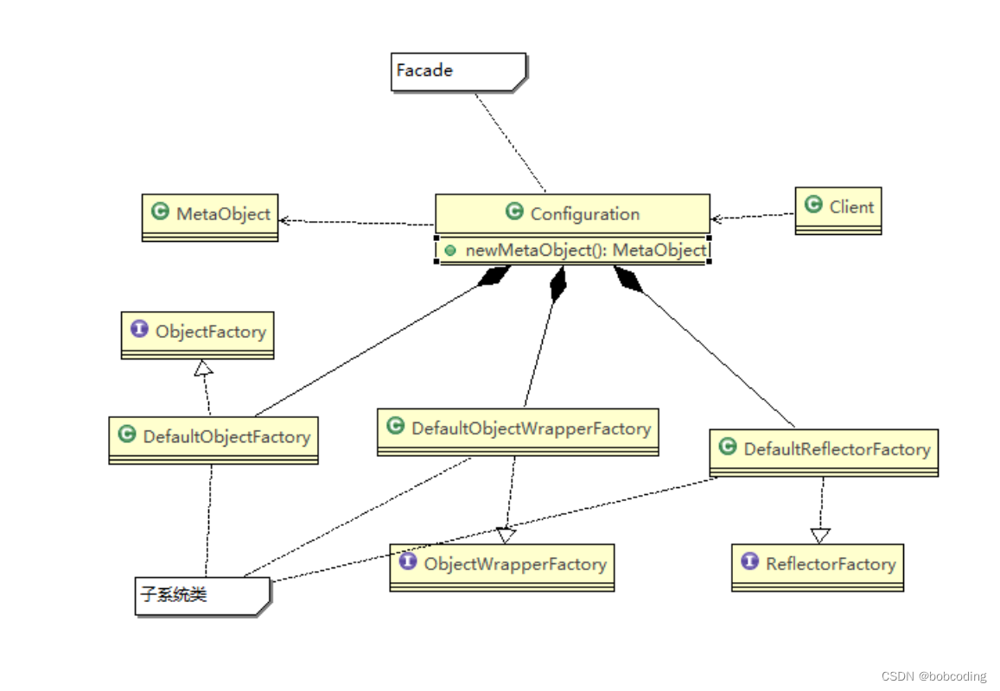
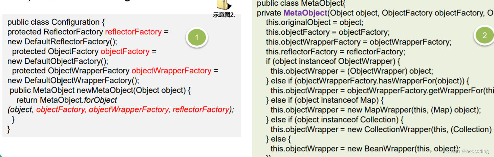

# 外观模式（多系统调度）

组建一个家庭影院： DVD播放器、投影仪、自动屏幕、环绕立体声、爆米花机

要求完成使用家庭影院的 功能，其过程为：

* 直接用遥控器：统筹各设备开关
* 开爆米花机
* 放下屏幕
* 开投影仪
* 开音响
* 开DVD，选dvd
* 去拿爆米花
* 调暗灯光
* 播放
* 观影结束后，关闭各种设备

传统方式：混乱，不易维护

1. 外观类(Facade): 为调用端提供统一的调用接口, 外观类知道哪些子系统负责处理请求,从而将调用端的请求代理给适当 子系统对象
2. 调用者(Client): 外观接口的调用者
3. 子系统的集合：指模块或者子系统，处理Facade 对象指派的任务，他是功能的实际提供者

外观模式在MyBatis框架应用的源码分析

MyBatis 中的Configuration 去创建MetaObject 对象使用到外观模式

1. 外观模式对外屏蔽了子系统的细节，因此外观模式降低了客户端对子系统使用的复 杂性

2) 外观模式对客户端与子系统的**耦合关系进行解耦**，让子系统内部的模块更易维护和扩展
3) 通过合理的使用外观模式，可以帮我们更好的划分访问的层次
4) 当系统需要进行**分层设计**时，可以考虑使用Facade模式
5) 在维护一个遗留的大型系统时，可能这个系统已经变得非常难以维护和扩展，此时可以考虑为新系统开发一个Facade类，来提供遗留系统的比较清晰简单的接口， 让新系统与Facade类交互，提高复用性
6) 不能过多的或者不合理的使用外观模式，使用外观模式好，还是直接调用模块好。 要以让系统有层次，利于维护为目的。
