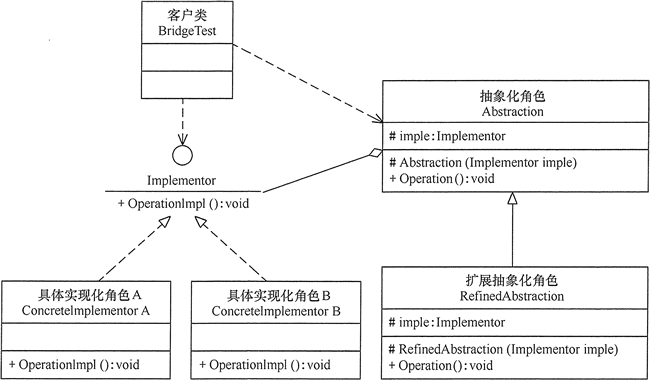
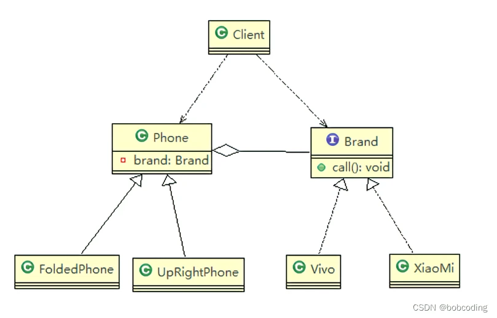
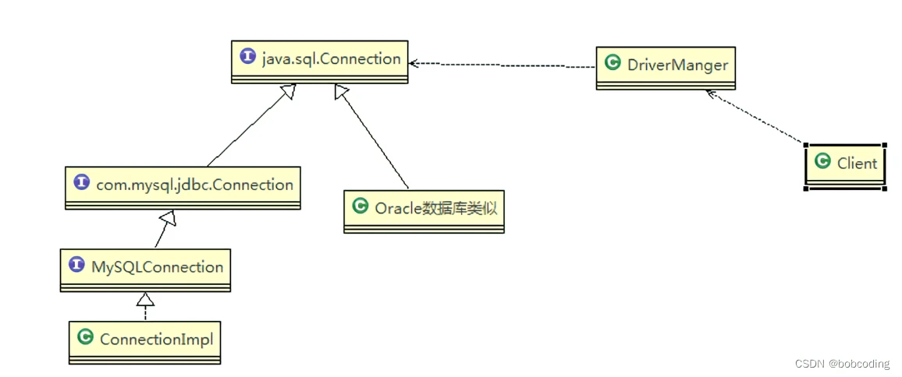
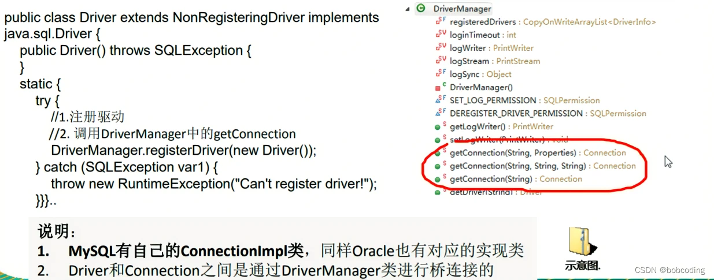

# 桥接模式（不同属性）

在现实生活中，某些类具有两个或多个维度的变化，如图形既可按形状分，又可按颜色分。如何设计类似于 Photoshop 这样的软件，能画不同形状和不同颜色的图形呢？如果用继承方式，m 种形状和 n 种颜色的图形就有 m×n 种，不但对应的子类很多，而且扩展困难。

**桥接模式的定义与特点**

桥接（Bridge）模式的定义如下：将抽象与实现分离，使它们可以独立变化。它是用组合关系代替继承关系来实现，从而降低了抽象和实现这两个可变维度的耦合度。

通过上面的讲解，我们能很好的感觉到桥接模式遵循了里氏替换原则和依赖倒置原则，最终实现了开闭原则，对修改关闭，对扩展开放。这里将桥接模式的优缺点总结如下。

桥接（Bridge）模式的优点是：

* 抽象与实现分离，扩展能力强
* 符合开闭原则
* 符合合成复用原则
* 其实现细节对客户透明

缺点是：由于聚合关系建立在抽象层，要求开发者针对抽象化进行设计与编程，能正确地识别出系统中两个独立变化的维度，这增加了系统的理解与设计难度。

桥接（Bridge）模式包含以下主要角色。

1. 抽象化（Abstraction）角色：定义抽象类，并包含一个对实现化对象的引用。
2. 扩展抽象化（Refined Abstraction）角色：是抽象化角色的子类，实现父类中的业务方法，并通过组合关系调用实现化角色中的业务方法。
3. 实现化（Implementor）角色：定义实现化角色的接口，供扩展抽象化角色调用。
4. 具体实现化（Concrete Implementor）角色：给出实现化角色接口的具体实现。





```java
package bridge;/* <---这是包名
-*- coding:utf-8 -*-
作者：bob-coding
日期：2022年10月11日17:23
敲码百遍，其意多见！！冲冲冲！！！*/
 
public class Bridge01 {
    public static void main(String[] args) {
        Phone phone1 = new UpRightPhone(new Vivo());
        phone1.open();
        phone1.call();
        phone1.close();
        System.out.println("=======================");
        Phone phone2 = new FoldedPhone(new XiaoMi());
        phone2.open();
        phone2.call();
        phone2.close();
        Phone phone3 = new FoldedPhone(new Vivo());
        phone3.open();
        phone3.call();
        phone3.close();
        System.out.println("=======================");
        Phone phone4 = new UpRightPhone(new XiaoMi());
        phone4.open();
        phone4.call();
        phone4.close();
    }
}
```

```java
abstract class Phone{
    //组合品牌
    private Brand brand;
    //构造器
    public Phone(Brand brand) {
        super();
        this.brand = brand;
    }
    protected void open(){
        this.brand.open();
    }
    protected void call(){
        brand.call();
    }
    protected void close(){
        brand.close();
    }
}
//直立式手机类，继承 抽象类 Phone
class UpRightPhone extends Phone {
 
    //构造器
    public UpRightPhone(Brand brand) {
        super(brand);
    }
 
    @Override
    public void open() {
        super.open();
        System.out.println(" 直立样式手机 ");
    }
 
    @Override
    public void close() {
        super.close();
        System.out.println(" 直立样式手机 ");
    }
 
    @Override
    public void call() {
        super.call();
        System.out.println(" 直立样式手机 ");
    }
}
 
//折叠式手机类，继承 抽象类 Phone
class FoldedPhone extends Phone{
 
    //构造器
    public FoldedPhone(Brand brand) {
        super(brand);
    }
 
    @Override
    public void open() {
        super.open();
        System.out.println(" 折叠样式手机 ");
    }
 
    @Override
    public void close() {
        super.close();
        System.out.println(" 折叠样式手机 ");
    }
 
    @Override
    public void call() {
        super.call();
        System.out.println(" 折叠样式手机 ");
    }
}
```

```java
//接口
interface Brand{
    void open();
    void call();
    void close();
}

//实现接口
class XiaoMi implements Brand{
 
    @Override
    public void open() {
        System.out.println("xiaomi手机打开");
    }
 
    @Override
    public void call() {
        System.out.println("xiaomi手机打电话");
    }
 
    @Override
    public void close() {
        System.out.println("xiaomi手机关闭");
    }
}
//实现接口
class Vivo implements Brand{
 
    @Override
    public void open() {
        System.out.println("vivo手机打开");
    }
 
    @Override
    public void call() {
        System.out.println("vivo手机打电话");
    }
 
    @Override
    public void close() {
        System.out.println("vivo手机关闭");
    }
}
```

桥接模式在jdbc的源码分析

Jdbc 的 Driver接口，如果从桥接模式来看，Driver就是一个接口，下面可以有 MySQL的Driver，Oracle的Driver，这些就可以当做实现接口类





桥接模式的注意事项和细节

1) 实现了抽象和实现部分的分离，从而极大的提供了系统的灵活性，让抽象部分和实 现部分独立开来，这有助于系统进行分层设计，从而产生更好的结构化系统。
2) 对于系统的高层部分，只需要知道抽象部分和实现部分的接口就可以了，其它的部分由具体业务来完成。
3) 桥接模式替代多层继承方案，可以减少子类的个数，降低系统的管理和维护成本。
4) 桥接模式的引入增加了系统的理解和设计难度，由于聚合关联关系建立在抽象层， 要求开发者针对抽象进行设计和编程。
5) 桥接模式要求正确识别出系统中两个独立变化的维度，因此其使用范围有一定的局限性，即需要有这样的应用场景。
