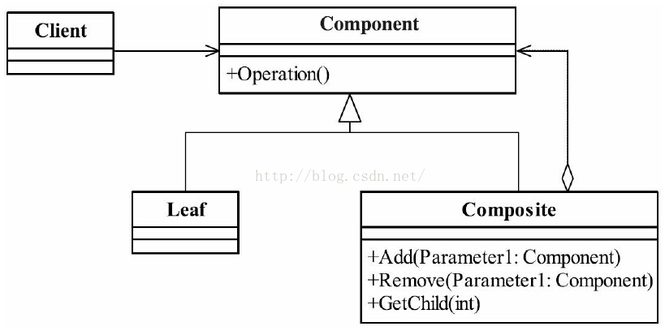

# 组合模式（List内嵌）

将对象组合成树形结构以表示“部分-整体”的层次结构。组合模式使得用户对单个对象和组合对象的使用具有一致性。

组合模式的本质：统一叶子对象和组合对象。

组合模式的目的：让客户端不再区分操作的是组合对象还是叶子对象，而是以一个统一的方式来操作。

1. Component 抽象构件角色：定义参加组合对象的共有方法和属性，可以定义一些默认的行为或属性。
2. Leaf 叶子构件：叶子对象，其下再也没有其他的分支，也就是遍历的最小单位。
3. Composite 树枝构件：树枝对象，它的作用是组合树枝节点和叶子节点形成一个树形结构。



抽象构件

```java
public abstract class Component {
     //个体和整体都具有的共享
     public void doSomething(){
             //编写业务逻辑
     }
}
```

树枝构件

```java

public class Composite extends Component {
     //构件容器
     private ArrayList<Component> componentArrayList = new ArrayList<Component>()
     //增加一个叶子构件或树枝构件
     public void add(Component component){
             this.componentArrayList.add(component);
     }
     //删除一个叶子构件或树枝构件
     public void remove(Component component){
             this.componentArrayList.remove(component);
     }  
 //获得分支下的所有叶子构件和树枝构件
     public ArrayList<Component> getChildren(){
             return this.componentArrayList;
     }
}
```

树叶节点是没有子下级对象的对象，定义参加组合的原始对象行为。

```java
public class Leaf extends Component {
     /*
      * 
可以覆写父类方法
      * public void doSomething(){
      * 
      * }
      */
}
```

测试类负责树状结构的建立，并可以通过递归方式遍历整个树。

```java
public class Client {
     public static void main(String[] args) {
            //创建一个根节点
             Composite root = new Composite();
             root.doSomething();
             //创建一个树枝构件
             Composite branch = new Composite();
             //创建一个叶子节点
             Leaf leaf = new Leaf();
             //建立整体
             root.add(branch);
             branch.add(leaf);  
     }
     //通过递归遍历树
     public static void display(Composite root){
             for(Component c:root.getChildren()){
                  if(c instanceof Leaf){ //叶子节点
                          c.doSomething();
                  }else{ //树枝节点
                          display((Composite)c);
                  }
             }
     }
}
```

组合模式在jdk集合的源码分析（hashMap）


