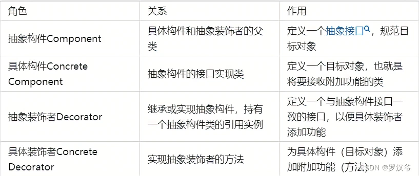
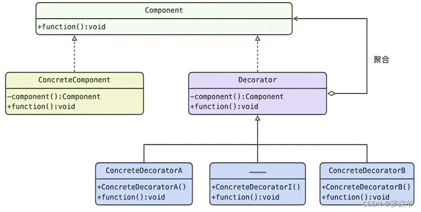
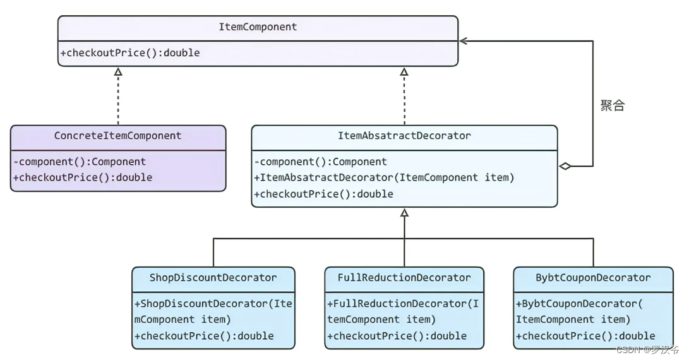
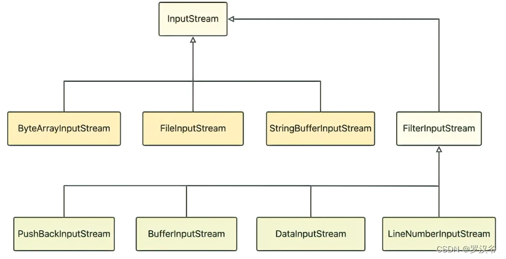

# 装饰者模式（功能增强）

通过将对象放入包含行为的特殊封装对象中来为原对象绑定新的行为。（需要与桥接模式区分，桥接模式绑定的是属性，这个是对原有功能的增强）。需要注意的是，装饰对象要与目标对象实现相同的接口，或继承相同的抽象类。

装饰对象需要持有目标对象的引用作为成员变量，而具体的赋能任务往往通过带参构造方法来完成。

1. 装饰者模式：动态的将新功能附加到对象上。在对象功能扩展方面，它比继承更有弹性，装饰者模式也体现了开闭原则(ocp)
2. 这里提到的动态的将新功能附加到对象和ocp原则，在后面的应用实例上会以代码的形式体现，请同学们注意体会。

**装饰者模式适合应用场景**

1. 如果你希望在无需修改代码的情况下即可使用对象， 且希望在运行时为对象新增额外的行为， 可以使用装饰模式。
2. 如果用继承来扩展对象行为的方案难以实现或者根本不可行， 你可以使用该模式







抽象商品和具体商品

```java
// 定义抽象构件：抽象商品
public interface ItemComponent {
    // 商品价格
    public double checkoutPrice();
}

// 定义具体构件：具体商品
public class ConcreteItemCompoment implements ItemComponent {
    // 原价
    @Override
    public double checkoutPrice() {
        return 200.0;
    }
}
```

抽象装饰者和具体装饰者

```java
// 定义抽象装饰者：创建传参(抽象构件)构造方法，以便给具体构件增加功能
public abstract class ItemAbsatractDecorator implements ItemComponent {
    protected ItemComponent itemComponent;
  
    public ItemAbsatractDecorator(ItemComponent myItem) {
        this.itemComponent = myItem;
    }
  
    @Overrid
    public double checkoutPrice() {
        return this.itemComponent.checkoutPrice();
    }
}

// 定义具体装饰者A：增加店铺折扣八折
public class ShopDiscountDecorator extends ItemAbsatractDecorator {
    public ShopDiscountDecorator(ItemComponent myItem) {
        super(myItem);
    }
  
    @Override
    public double checkoutPrice() {
        return 0.8 * super.checkoutPrice();
    }
} 

// 定义具体装饰者B：增加满200减20功能，此处忽略判断逻辑
public class FullReductionDecorator extends ItemAbsatractDecorator {
    public FullReductionDecorator(ItemComponent myItem) {
        super(myItem);
    }
  
    @Override  
    public double checkoutPrice() {
        return super.checkoutPrice() - 20;  
    }
}

// 定义具体装饰者C：增加百亿补贴券50
public class BybtCouponDecorator extends ItemAbsatractDecorator { 
    public BybtCouponDecorator(ItemComponent myItem) {
        super(myItem);
    }
  
    @Override
    public double checkoutPrice() {
        return super.checkoutPrice() - 50;
    }
}
```

具体调用

```java
//客户端调用
public class userPayForItem() {
    public static void main(String[] args) {
        ItemCompoment item = new ConcreteItemCompoment();
        System.out.println("宝贝原价：" + item.checkoutPrice() + " 元"）; 
        item = new ShopDiscountDecorator(item);
        System.out.println("使用店铺折扣后需支付：" + item.checkoutPrice() + " 元"）;
        item = new FullReductionDecorator(item);
        System.out.println("使用满200减20后需支付：" + item.checkoutPrice() + " 元"）;  
        item = new BybtCouponDecorator(item);
        System.out.println("使用百亿补贴券后需支付：" + item.checkoutPrice() + " 元"）;  
    }
}
```

JDK源码分析

FilterInputStream 就是一个装饰者。
如下图所示，InputStream 相当于抽象构件，FilterInputStream 类似于抽象装饰者，它的四个子类等同于具体装饰者。其中，FilterInputStream 中含有被装饰类 InputStream 的引用，其具体装饰者及各自功能为



FilterInputStream 是所有装饰器类的抽象类，提供特殊的输入流控制。下面源码省略了 skip、available、mark、reset、markSupported 方法，这些方法也都委托给了 InputStream 类。

```java
public class FilterInputStream extends InputStream {
    //维护一个 InputStream 对象
    protected volatile InputStream in;  
  
    //构造方法参数需要一个 inputStream
    protected FilterInputStream(InputStream in) {   
        this.in = in;
    }
 
    //委托给 InputStream
    public int read() throws IOException {
        return in.read();      
    }
  
    //委托给 InputStream
    public void close() throws IOException {   
        in.close();
    }
  
    .......
   
}

```

优点：

1. 提供比继承更加灵活的扩展功能，通过叠加不同的具体装饰者的方法，动态地增强目标类的功能。
2. 装饰者和被装饰者可以独立发展，不会相互耦合

缺点：

1. 多层装饰会产生比继承更多的对象，使查错更加困难，尤其是这些对象都很相似。
2. 而且，当目标类被多次动态装饰后，程序的复杂性也会大大提升，难以维护。

适用场景：

1. 继承关系不利于系统维护，甚至不能使用继承关系的场景。比如，当继承导致类爆炸时、目标类被 final 修饰时，都不宜通过创建目标类的子类来扩展功能。
2. 要求不影响其他对象，为特定目标对象添加功能。
3. 要求动态添加、撤销对象的功能。
