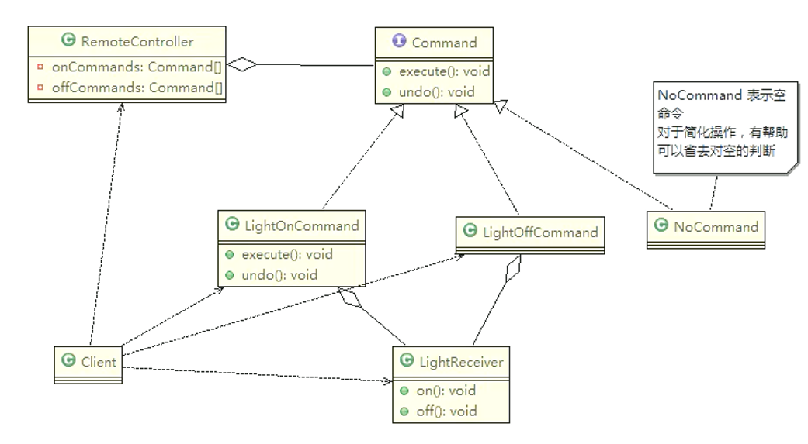

# 命令模式（多种同类进行调度）

* 我们买了一套智能家电，有照明灯、风扇、冰箱、洗衣机，只要在手机上安装 APP 就可以控制这些家电的工作
* 这些智能家电来自不同的厂家，我们不想针对每一种家电都安装一个 APP 分别控制，我们希望只要一个 APP 就可以控制全部智能家电
* 要实现一个 APP 控制所有智能家电的需要，则每个智能家电厂家都要提供一个统一的接口给 APP 调用，这时就可以考虑使用命令模式
* 命令模式可将“动作的请求者”从“动作的执行者”对象中解耦出来
* 在我们的例子中，动作的请求者是手机 APP，动作的执行者是每个厂商的一个家电产品

## 基本介绍

* 命令模式（Command Pattern）：在软件设计中，我们经常需要向某些对象发送请求，但是并不知道请求的接收者是谁，也不知道被请的操作是哪个，我们只需在程序运行时指定具体的请求接收者即可。此时可以使用命令模式来进行设计
* 命令模式使得请求发送者与请求接收者消除彼此之间的耦合，让对象之间的调用关系更加灵活，实现解耦
* 在命令模式中，会将一个请求封装为一个对象，以便使用不同参数来表示不同的请求（即命名），同时命令模式也支持可撤销的操作
* 通俗易懂的理解：将军发布命令，士兵去执行。其中有几个角色：
  * 将军（命令发布者）、士兵（命令的具体执行者）、命令（连接将军和士兵）
  * Invoker是调用者（将军），Receiver是被调用者（士兵），MyCommand是命令，实现了 Command接口，持有接收对象


**命令模式的角色及职责**

* Invoker调用者角色，只需要发布命令就可以控制接收者的行为
* Receiver接收者角色，知道如何实施或执行请求的相关操作
* Command命令角色，需要执行的所有命令都定义在这里，可以是接口或抽象类
* ConcreteCommand具体的命令角色，将一个接收者和一个动作绑定，调用接收者相应的操作，实现 execute




## 代码案例

接收者

```java
/**
 * 接收者
 */
public class LightReceiver {
    public void on() {
        System.out.println("电灯打开了...");
    }

    public void off() {
        System.out.println("电灯关闭了...");
    }
}
```

命令角色

```java
/**
 * 命令角色
 */
public interface Command {
    void execute();
    //撤销动作或某一个操作
    void undo();
}
```

空命令，什么也不干

```java
/**
 * 空命令，什么也不干
 */
public class NonCommand implements Command {
    @Override
    public void execute() {

    }

    @Override
    public void undo() {

    }
}
```

具体的命令角色

```java
/**
 * 具体的命令角色
 */
public class LightOnCommand implements Command{
    private LightReceiver light;

    public LightOnCommand(LightReceiver light) {
        this.light = light;
    }

    @Override
    public void execute() {
        light.on();
    }

    @Override
    public void undo() {
        light.off();
    }
}
public class LightOffCommand implements Command {
    private LightReceiver light;

    public LightOffCommand(LightReceiver light) {
        this.light = light;
    }

    @Override
    public void execute() {
        light.off();
    }

    @Override
    public void undo() {
        light.on();
    }
}
```

调用器

```java
/**
 * 调用者
 */
public class RemoteController {
    private Command[] onCommands;
    private Command[] offCommands;
    private Command restoreCommand;

    public RemoteController() {
        onCommands = new Command[5];
        offCommands = new Command[5];
        for (int i = 0; i < 5; i++) {
            onCommands[i] = new NonCommand();
            offCommands[i] = new NonCommand();
        }
    }

    public void setCommands(int no, Command onCommand, Command offCommand) {
        onCommands[no] = onCommand;
        offCommands[no] = offCommand;
    }

    public void onBtnCommand(int no) {
        restoreCommand = onCommands[no];
        restoreCommand.execute();
    }

    public void offBtnCommand(int no) {
        restoreCommand = offCommands[no];
        restoreCommand.execute();
    }

    public void undoBtnCommand() {
        restoreCommand.undo();
    }
}
```

调用命令

```java
// 初始化遥控器
RemoteController remoteController = new RemoteController();
// 操作电灯
int no = 0;
LightReceiver light = new LightReceiver();
remoteController.setCommands(no, new LightOnCommand(light), new LightOffCommand(light));
remoteController.onBtnCommand(no);
remoteController.offBtnCommand(no);
remoteController.undoBtnCommand();

// 电灯打开了...
// 电灯关闭了...
// 电灯打开了...

```

## Spring 框架 JdbcTemplate 源码分析

以 JdbcTemplate类中 query()方法中为例，我们可以发现其中定义了一个内部类 QueryStatementCallback，而且 QueryStatementCallback类实现了 StatementCallback接口的 doInStatement方法


这就是命令模式在 Spring 框架 JdbcTemplate源码中的应用，其中，

* StatementCallback充当了 Command命令，其下有多个实现
  
* QueryStatementCallback充当了 ConcreteCommand具体的命令角色
* Statement充当了 Receiver接收者角色
* JdbcTemplate本身作为调用者

## 命令模式的注意事项和细节

* 1） 将发起请求的对象与执行请求的对象解耦 。发起请求的对象是调用者，调用者只要调用命令对象的 `execute()`方法就可以让接收者工作，而不必知道具体的接收者对象是谁、是如何实现的，命令对象会负责让接收者执行请求的动作，也就是说：“请求发起者”和“请求执行者”之间的解耦是通过命令对象实现的，命令对象起到了纽带桥梁的作用
* 2） 容易设计一个命令队列 。只要把命令对象放到列队，就可以多线程的执行命令
* 3）容易实现对请求的撤销和重做
* 4） **不足** ：可能导致某些系统有过多的具体命令类， 增加了系统的复杂度 ，这点在使用的时候要注意
* 5） 空命令也是一种设计模式，它为我们省去了判空的操作 。在上面的实例中，如果没有用空命令，我们每按下一个按键都要判空，这给我们编码带来一定的麻烦
* 6）命令模式经典的应用场景：界面的一个按钮对应一条命令、模拟 CMD（DOS命令）订单的撤销/恢复、触发-反馈机制
