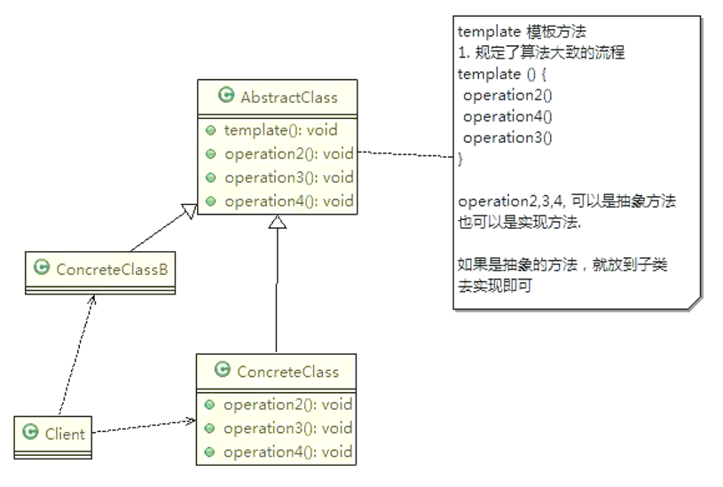
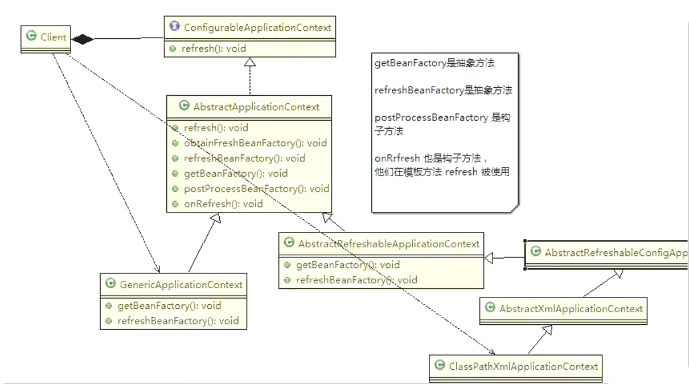

# 模板模式（抽象实现）

## 豆浆制作问题

编写制作豆浆的程序，说明如下：

* 制作豆浆的流程选材 ----> 添加配料 ----> 浸泡 ----> 放到豆浆机打碎
* 通过添加不同的配料，可以制作出不同口味的豆浆
* 选材、浸泡和放到豆浆机打碎这几个步骤对于制作每种口味的豆浆都是一样的

## 基本介绍

* 模板方法模式（Template Method Pattern），又叫模板模式（Template Pattern），在一个抽象类公开定义了执行它的方法的模板。它的子类可以按需要重写方法实现，但调用将以抽象类中定义的方式进行
* 简单说， 模板方法模式定义一个操作中的算法的骨架 ，而将一些步骤延迟到子类中，使得子类可以不改变一个算法的结构，就可以重定义该算法的某些特定步骤
* 这种类型的设计模式属于行为型模式



**对原理类图的说明——即模板方法模式的角色和职责**

* AbstractClass抽象类中实现了模板方法，定义了算法的骨架，具体子类需要去实现其抽象方法或重写其中方法
* ConcreteClass实现了抽象方法，已完成算法中特定子类的步骤

抽象方法模板

```java
/**
 * 抽象方法
 */
public abstract class SoyaMilk {
    /**
     * 模板方法，定义为final禁止覆写
     */
    public final void make() {
        System.out.println(">>>>>>豆浆制作开始<<<<<<");
        useSoyBean();
        addIngredients();
        soak();
        mash();
        System.out.println(">>>>>>豆浆制作结束<<<<<<");
    }

    protected void useSoyBean() {
        System.out.println("Step1. 选用上好的黄豆.");
    }

    protected abstract void addIngredients();

    protected void soak() {
        System.out.println("Step3. 对黄豆和配料进行水洗浸泡.");
    }

    protected void mash() {
        System.out.println("Step4. 将充分浸泡过的黄豆和配料放入豆浆机中，开始打豆浆.");
    }
}
```

具体实现

```java
/**
 * 花生豆浆
 */
public class PeanutSoyaMilk extends SoyaMilk {
    public PeanutSoyaMilk() {
        System.out.println("============花生豆浆============");
    }
    @Override
    protected void addIngredients() {
        System.out.println("Step2. 加入上好的花生.");
    }
}
/**
 * 红豆豆浆
 */
public class RedBeanSoyaMilk extends SoyaMilk {
    public RedBeanSoyaMilk() {
        System.out.println("============红豆豆浆============");
    }
    @Override
    protected void addIngredients() {
        System.out.println("Step2. 加入上好的红豆.");
    }
}
/**
 * 芝麻豆浆
 */
public class SesameSoyaMilk extends SoyaMilk {
    public SesameSoyaMilk() {
        System.out.println("============芝麻豆浆============");
    }
    @Override
    protected void addIngredients() {
        System.out.println("Step2. 加入上好的芝麻.");
    }
}
```

**调用模板方法**

```java
SoyaMilk peanutSoyaMilk = new PeanutSoyaMilk();
peanutSoyaMilk.make();
SoyaMilk redBeanSoyaMilk = new RedBeanSoyaMilk();
redBeanSoyaMilk.make();
SoyaMilk sesameSoyaMilk = new SesameSoyaMilk();
sesameSoyaMilk.make();
```

## 钩子方法

* 在模板方法模式的父类中，我们可以定义一个方法，它默认不做任何事，子类可以视情况要不要覆盖它 ，该方法称为“钩子”
* 还是用上面做豆浆的例子来讲解，比如，我们还希望制作纯豆浆，不添加任何的配料，请使用钩子方法对前面的模板方法进行改造

```java
public abstract class SoyaMilk {
    public final void make() {
        // ...
        if (customAddIngredients()) {
            addIngredients();
        }
        // ...
    }
    // ...
}

/**
 * 纯豆浆
 */
public class PureSoyaMilk extends SoyaMilk {
    public PureSoyaMilk() {
        System.out.println("============纯豆浆============");
    }

    @Override
    protected void addIngredients() {
        // 空实现即可
    }

    @Override
    protected Boolean customAddIngredients() {
        return false;
    }
}
```

## Spring 框架源码分析

AbstractApplicationContext.java中有一个 refresh()方法就是模板方法，其中定义了抽象方法和钩子方法（类似make方法）

```java
// 模板方法
public void refresh() throws BeansException, IllegalStateException {
    synchronized (this.startupShutdownMonitor) {
        prepareRefresh();
        ConfigurableListableBeanFactory beanFactory = obtainFreshBeanFactory();
        prepareBeanFactory(beanFactory);
        try {
            postProcessBeanFactory(beanFactory); // 钩子方法
            invokeBeanFactoryPostProcessors(beanFactory);
            registerBeanPostProcessors(beanFactory);
            initMessageSource();
            initApplicationEventMulticaster();
            onRefresh(); // 钩子方法
            registerListeners();
            finishBeanFactoryInitialization(beanFactory);
            finishRefresh();
        }
        catch (BeansException ex) {
            if (logger.isWarnEnabled()) {
                logger.warn("Exception encountered during context initialization - " +
                            "cancelling refresh attempt: " + ex);
            }
            destroyBeans();
            cancelRefresh(ex);
            throw ex;
        }
        finally {
            resetCommonCaches();
        }
    }
}
protected ConfigurableListableBeanFactory obtainFreshBeanFactory() {
    refreshBeanFactory(); // 抽象方法
    ConfigurableListableBeanFactory beanFactory = getBeanFactory(); // 抽象方法
    if (logger.isDebugEnabled()) {
        logger.debug("Bean factory for " + getDisplayName() + ": " + beanFactory);
    }
    return beanFactory;
}

//钩子
protected void postProcessBeanFactory(ConfigurableListableBeanFactory beanFactory) {
}
protected void onRefresh() throws BeansException {
    // For subclasses: do nothing by default.
}
```


