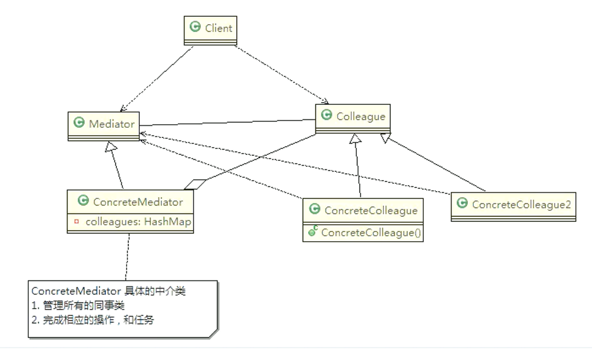
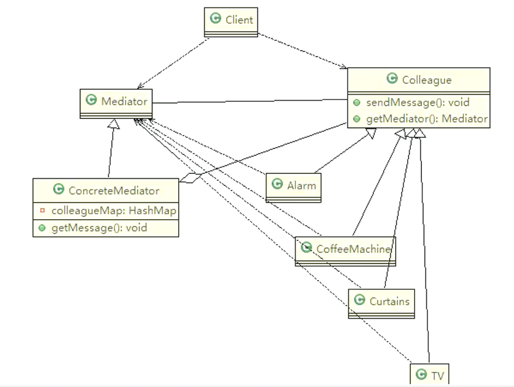
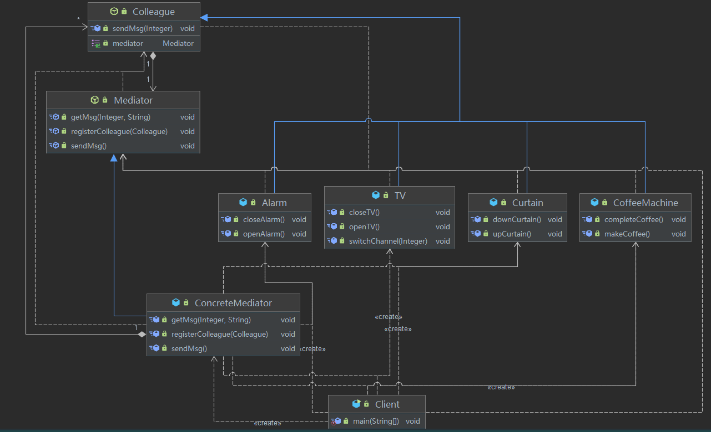

# 中介者模式（管理系统流程）

## 智能家庭管理问题

智能家庭项目：

* 智能家庭包括各种设备，闹钟、咖啡机、电视机、窗帘等
* 主人要看电视时，各个设备可以协同工作，自动完成看电视的准备工作，比如流程为：
  闹铃响起 => 咖啡机开始做咖啡 => 窗帘自动落下 => 电视机开始播放

传统方式问题分析

* 当各电器对象有多种状态改变时，相互之间的调用关系会比较复杂
* 各个电器对象彼此联系，你中有我，我中有你，不利于松耦合
* 各个电器对象之间所传递的消息（参数），容易混乱
* 当系统增加一个新的电器对象时，或者执行流程改变时，代码的可维护性、扩展性都不理想

## 介绍

* 中介者模式（Mediator Pattern），用一个中介对象来封装一系列的对象交互。中介者使各个对象不需要显式地相互引用，从而使其 耦合松散 ，而且可以独立地改变它们之间的交互
* 中介者模式属于 行为型模式 ，使代码易于维护
* 比如 MVC 模式，C（Controller控制器）是M（Model模型）和V（View视图）的中介者，在前后端交互时起到了中间人的作用

**原理类图**



**中介者模式角色及职责**

* Mediator【抽象中介者】：定义了同事对象到中介者对象的接口
* ConcreteMediator【具体的中介者对象】：实现抽象中介者方法，需要知道所有具体的同事类，即以一个集合来管理 HashMap，并接受某个同事对象消息，完成相应的任务
* Colleague【抽象同事类】
* ConcreteColleague【具体的同事类】：会有很多，只知道自己的行为，而不了解其他同事类的行为（方法），但他们都依赖中介者对象





**智能家庭管理操作流程**

* 创建 ConcreMediator对象
* 创建各个同事类对象，比如：Alarm、CoffeeMachine、TV...
* 在创建同事类对象时，直接通过构造器加入到 colleagueMap
* 同事类对象可以调用 sendMessage，最终会去调用 ConcreteMediator的 getMessage方法
* getMessage会根据接收到的同事对象发出的消息，来协调调用其它的同事对象，完成任务
* 可以看到 getMessage是核心方法，完成相应任务

**核心代码**

抽象中介者

```java
public abstract class Mediator {
    public abstract void registerColleague(Colleague colleague);

    public abstract void getMsg(Integer state, String name);

    public abstract void sendMsg();
}
```

具体中介者

```java
public class ConcreteMediator extends Mediator {
    private Map<String, Colleague> colleagueMap;

    public ConcreteMediator() {
        this.colleagueMap = new HashMap<>();
    }

    @Override
    public void registerColleague(Colleague colleague) {
        colleagueMap.put(colleague.getClass().getSimpleName(), colleague);
    }

    @Override
    public void getMsg(Integer state, String name) {
        Colleague colleague = colleagueMap.get(name);
        if (colleague instanceof Alarm) {
            dealAlarm(state);
        } else if (colleague instanceof CoffeeMachine) {
            dealCoffeeMachine(state);
        } else if (colleague instanceof Curtain) {
            dealCurtain(state);
        } else if (colleague instanceof TV) {
            dealTV(state);
        }
    }

    /**
     * 闹铃响起后操作
     *
     * @param state
     */
    private void dealAlarm(Integer state) {
        if (Integer.valueOf(1).equals(state)) {
            ((Alarm) colleagueMap.get(Alarm.class.getSimpleName())).closeAlarm();
            ((CoffeeMachine) colleagueMap.get(CoffeeMachine.class.getSimpleName())).makeCoffee();
        }
    }

    /**
     * 咖啡机煮咖啡完毕后操作
     *
     * @param state
     */
    private void dealCoffeeMachine(Integer state) {
        if (Integer.valueOf(1).equals(state)) {
            ((Curtain) colleagueMap.get(Curtain.class.getSimpleName())).downCurtain();
        }
    }

    /**
     * 窗帘落下后操作
     *
     * @param state
     */
    private void dealCurtain(Integer state) {
        if (Integer.valueOf(0).equals(state)) {
            TV tv = (TV) colleagueMap.get(TV.class.getSimpleName());
            tv.openTV();
            tv.switchChannel(101);
        }
    }

    /**
     * 电视关闭后操作
     *
     * @param state
     */
    private void dealTV(Integer state) {
        if (Integer.valueOf(0).equals(state)) {
            ((Curtain) colleagueMap.get(Curtain.class.getSimpleName())).upCurtain();
        }
    }

    @Override
    public void sendMsg() {
        // Do Nothing...
    }
}
```

抽象同事类

```java
public abstract class Colleague {
    private Mediator mediator;

    public Colleague(Mediator mediator) {
        this.mediator = mediator;
    }

    public Mediator getMediator() {
        return this.mediator;
    }

    public void sendMsg(Integer state) {
        this.getMediator().getMsg(state, this.getClass().getSimpleName());
    }
}
```

具体同事类

```java
/**
 * 闹钟
 */
public class Alarm extends Colleague {
    public Alarm(Mediator mediator) {
        super(mediator);
        this.getMediator().registerColleague(this);
    }

    /**
     * 闹铃响起
     */
    public void openAlarm() {
        System.out.println(">>>闹铃响起");
        try {
            //模拟闹铃耗时
            Thread.sleep(3000);
        } catch (InterruptedException e) {
            e.printStackTrace();
        }
        sendMsg(1);
    }

    /**
     * 闹铃关闭
     */
    public void closeAlarm() {
        System.out.println(">>>闹铃关闭");
        sendMsg(0);
    }
}
/**
 * 咖啡机
 */
public class CoffeeMachine extends Colleague {
    public CoffeeMachine(Mediator mediator) {
        super(mediator);
        this.getMediator().registerColleague(this);
    }

    /**
     * 煮咖啡
     */
    public void makeCoffee() {
        System.out.println(">>>煮咖啡中...");
        sendMsg(0);
        try {
            //模拟煮咖啡耗时
            Thread.sleep(3000);
        } catch (InterruptedException e) {
            e.printStackTrace();
        }
    }

    /**
     * 煮咖啡完毕
     */
    public void completeCoffee() {
        System.out.println(">>>咖啡已煮好");
        sendMsg(1);
    }
}
/**
 * 窗帘
 */
public class Curtain extends Colleague {
    public Curtain(Mediator mediator) {
        super(mediator);
        this.getMediator().registerColleague(this);
    }

    /**
     * 拉起窗帘
     */
    public void upCurtain() {
        System.out.println(">>>拉起窗帘...");
        sendMsg(1);
        try {
            //模拟拉起窗帘耗时
            Thread.sleep(3000);
        } catch (InterruptedException e) {
            e.printStackTrace();
        }
    }

    /**
     * 拉下窗帘
     */
    public void downCurtain() {
        System.out.println(">>>拉下窗帘...");
        sendMsg(0);
        try {
            //模拟拉下窗帘耗时
            Thread.sleep(3000);
        } catch (InterruptedException e) {
            e.printStackTrace();
        }
    }
}
/**
 * 电视机
 */
public class TV extends Colleague {
    public TV(Mediator mediator) {
        super(mediator);
        this.getMediator().registerColleague(this);
    }

    /**
     * 打开电视
     */
    public void openTV() {
        System.out.println(">>>打开电视...");
        sendMsg(1);
    }

    /**
     * 关闭电视
     */
    public void closeTV() {
        System.out.println(">>>关闭电视...");
        sendMsg(0);
    }

    /**
     * 切换频道
     */
    public void switchChannel(Integer state) {
        System.out.println(">>>切换频道：" + state);
        sendMsg(state);
        try {
            //模拟看电视耗时
            Thread.sleep(3000);
        } catch (InterruptedException e) {
            e.printStackTrace();
        }
    }
}
```

测试代码

```java
//创建中介者
Mediator mediator = new ConcreteMediator();

//创建各个同事类，并加入Mediator中介者的Map对象中
Alarm alarm = new Alarm(mediator);
CoffeeMachine coffeeMachine = new CoffeeMachine(mediator);
Curtain curtain = new Curtain(mediator);
TV tv = new TV(mediator);

//闹钟响起
alarm.openAlarm();
coffeeMachine.completeCoffee();
tv.closeTV();

//>>>闹铃响起
//>>>闹铃关闭
//>>>煮咖啡中...
//>>>咖啡已煮好
//>>>拉下窗帘...
//>>>打开电视...
//>>>切换频道：101
//>>>关闭电视...
//>>>拉起窗帘...
```

中介者模式的注意事项和细节

**优点**

* 多个类相互耦合，会形成网状结构，使用=中介者模式将网状结构分离为星型结构，进行解耦=
* 减少类间依赖，降低了耦合，=符合迪米特原则=

**缺点**

* 中介者承担了较多的责任，=一旦中介者出现了问题，整个系统就会受到影响=
* =如果设计不当，中介者对象本身变得过于复杂= ，这点在实际使用时，要特别注意
