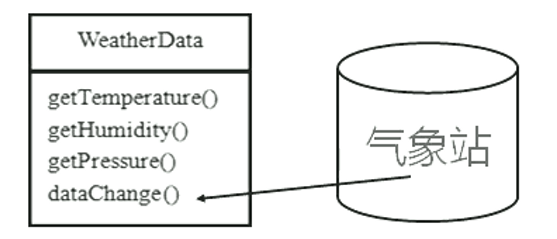
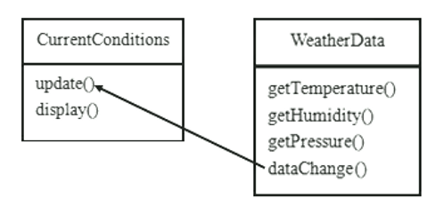
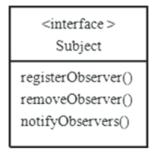
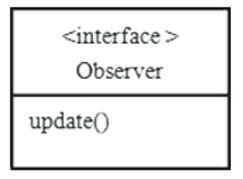
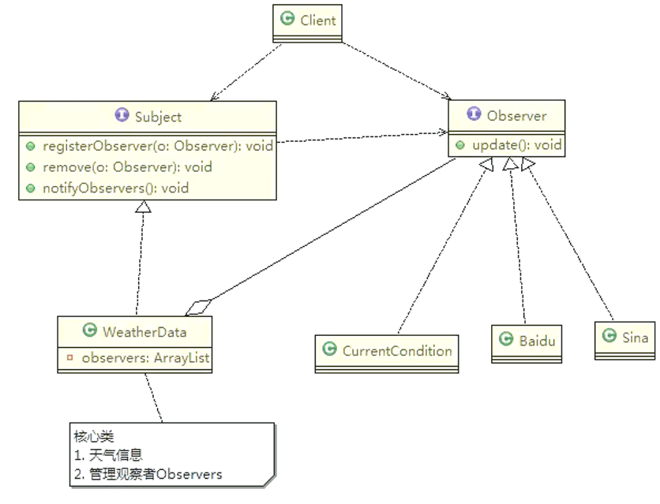
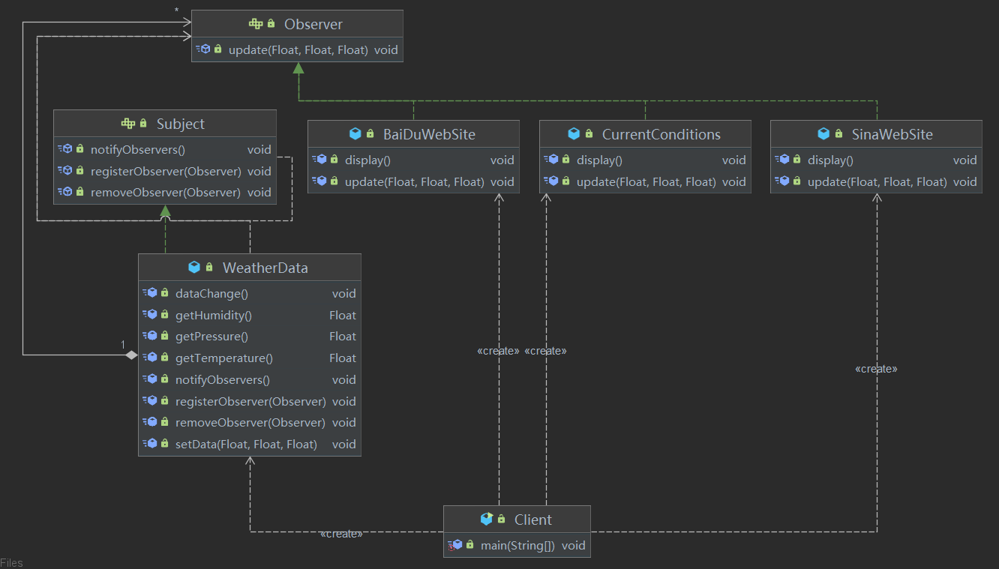

# 观察者模式(改变->通知)

## 天气预报需求

具体要求如下：

* 气象站可以将每天测量到的温度，湿度，气压等等以公告的形式发布出去（比如发布到自己的网站或第三方）
* 需要设计开放型 API，便于其他第三方也能接入气象站获取数据
* 提供温度、气压和湿度的接口
* 测量数据更新时，要能实时的通知给第三方

## 天气预报需求方案之普通方案

**WeatherData类**

通过对气象站项目的分析，我们可以初步设计出一个 WeatherData类



* 通过 getXxx方法，可以让第三方接入，并得到相关信息
* 当数据有更新时，气象站通过调用 dataChange()去更新数据，当第三方再次获取时，就能得到最新数据，当然也可以推送



CurrentConditions（当前的天气情况）可以理解成是我们气象局的网站

**核心代码**

气象网站类

```java
/**
 * 当前的天气情况：可以理解成是气象局的网站
 */
public class CurrentConditions {
    private Float temperature;
    private Float pressure;
    private Float humidity;

    /**
     * 更新天气情况，通过推送的方式，由 WeatherData 调用
     *
     * @param temperature
     * @param pressure
     * @param humidity
     */
    public void update(Float temperature, Float pressure, Float humidity) {
        // 更新最新天气数据
        this.temperature = temperature;
        this.pressure = pressure;
        this.humidity = humidity;
        // 展示最新天气数据
        display();
    }

    /**
     * 公告板展示天气情况
     */
    public void display() {
        System.out.println("============最新天气============");
        System.out.println("*** 当前温度：" + this.temperature + " ℃ ***");
        System.out.println("*** 当前气压：" + this.pressure + " kPa ***");
        System.out.println("*** 当前湿度：" + this.humidity + " %RH ***");
    }
}
```

气象数据类

```java
/**
 * 核心类
 * 1、包含最新的天气信息情况
 * 2、含有 CurrentConditions 对象
 * 3、当数据更新时，主动调用 CurrentConditions 的 update() 方法
 */
public class WeatherData {
    private Float temperature;
    private Float pressure;
    private Float humidity;
    private CurrentConditions conditions;

    /**
     * 传入 CurrentConditions 对象
     *
     * @param conditions
     */
    public WeatherData(CurrentConditions conditions) {
        this.conditions = conditions;
    }

    public Float getTemperature() {
        return temperature;
    }

    public Float getPressure() {
        return pressure;
    }

    public Float getHumidity() {
        return humidity;
    }

    /**
     * 推送天气数据到网站
     */
    public void dataChange() {
        conditions.update(getTemperature(), getPressure(), getHumidity());
    }

    /**
     * 当天气数据发生变化时进行更新
     */
    public void setData(Float temperature, Float pressure, Float humidity) {
        this.temperature = temperature;
        this.pressure = pressure;
        this.humidity = humidity;
        dataChange();
    }
}
```

客户端调用

```java
// 创建气象网站对象
CurrentConditions currentConditions = new CurrentConditions();
// 创建气象数据对象，并传入气象网站对象
WeatherData weatherData = new WeatherData(currentConditions);
// 天气发生变化时，更新最新的气象数据
weatherData.setData(10f, 150f, 40f);
//weatherData.setData(15f, 130f, 60f);
//weatherData.setData(13f, 160f, 20f);
```

**问题分析**

* 其他第三方接入气象站获取数据的问题
* 无法在运行时动态的添加第三方（新浪网站）
* 违反 OCP原则 => 观察者模式

在 WeatherData中增加第三方时，都需要创建对应的第三方公台板对象并加入到 dataChange()方法中，既不是动态加入，也不利于维护

## 观察者模式原理

观察者模式类似订牛奶业务

* 奶站 / 气象局：Subject
* 用户 / 第三方网站：Observer

Subject：登记注册、移除和通知



* 1）registerObserver()：注册
* 2）removeObserver()：移除
* 3）notifyObservers()：通知所有的注册的用户，根据不同需求，可以是更新数据，让用户来取，也可能是实施推送，看具体需求定

Observer：接收输入



观察者模式：对象之间多对一依赖的一种设计方案，被依赖的对象为 Subject，依赖的对象为 Observer，Subject通知 Observer变化，比如这里的奶站是 Subject，是1的一方。用户是 Observer，是多的一方

## 天气预报需求方案之观察者模式





**观察者对象 Observer**

```java
/**
 * 观察者接口
 */
public interface Observer {
    void update(Float temperature, Float pressure, Float humidity);
}
/**
 * 观察者实现
 */
public class CurrentConditions implements Observer {
    private Float temperature;
    private Float pressure;
    private Float humidity;

    @Override
    public void update(Float temperature, Float pressure, Float humidity) {
        // 更新最新天气数据
        this.temperature = temperature;
        this.pressure = pressure;
        this.humidity = humidity;
        // 展示最新天气数据
        display();
    }

    /**
     * 公告板展示天气情况
     */
    public void display() {
        System.out.println("============最新天气============");
        System.out.println("*** 当前温度：" + this.temperature + " ℃ ***");
        System.out.println("*** 当前气压：" + this.pressure + " kPa ***");
        System.out.println("*** 当前湿度：" + this.humidity + " %RH ***");
    }
}
```

**主体对象 Subject**

```java
/**
 * 主体对象接口
 */
public interface Subject {
    void registerObserver(Observer o);

    void removeObserver(Observer o);

    void notifyObservers();
}
/**
 * 主体对象实现
 */
public class WeatherData implements Subject {
    private Float temperature;
    private Float pressure;
    private Float humidity;
    private List<Observer> observerList;

    public WeatherData() {
        observerList = new ArrayList<>();
    }

    public Float getTemperature() {
        return temperature;
    }

    public Float getPressure() {
        return pressure;
    }

    public Float getHumidity() {
        return humidity;
    }

    /**
     * 推送天气数据到网站
     */
    public void dataChange() {
        notifyObservers();
    }

    /**
     * 当天气数据发生变化时进行更新
     *
     * @param temperature
     * @param pressure
     * @param humidity
     */
    public void setData(Float temperature, Float pressure, Float humidity) {
        this.temperature = temperature;
        this.pressure = pressure;
        this.humidity = humidity;
        dataChange();
    }

    @Override
    public void registerObserver(Observer o) {
        observerList.add(o);
    }

    @Override
    public void removeObserver(Observer o) {
        if(o!= null && observerList.contains(o)) {
            observerList.remove(o);
        }
    }

    @Override
    public void notifyObservers() {
        for (Observer observer : observerList) {
            observer.update(temperature, pressure, humidity);
        }
    }
}
```

**调用测试**

```java
// 创建气象网站对象
CurrentConditions currentConditions = new CurrentConditions();
// 创建气象数据对象
WeatherData weatherData = new WeatherData();
// 注册气象网站对象
weatherData.registerObserver(currentConditions);
// 天气发生变化时，更新最新的气象数据
weatherData.setData(10f, 150f, 40f);
//============最新天气============
//*** 当前温度：10.0 ℃ ***
//*** 当前气压：150.0 kPa ***
//*** 当前湿度：40.0 %RH ***
```

**观察者模式的好处**

* 观察者模式设计后，会以集合的方式来管理用户 Observer，包括注册、移除和通知
* 这样，我们增加观察者（这里可以理解成一个新的公告板），就不需要去修改核心类 WeatherData不会修改代码，遵守了 ocp原则

## JDK 源码分析

JDK 中的 Observable就使用到了观察者模式（*Observable是Java内置的观察者模式的主题类*）

```java
public class Observable {
    private boolean changed = false;
    private Vector<Observer> obs = new Vector();

    public Observable() {
    }

    public synchronized void addObserver(Observer var1) {
        if (var1 == null) {
            throw new NullPointerException();
        } else {
            if (!this.obs.contains(var1)) {
                this.obs.addElement(var1);
            }

        }
    }

    public synchronized void deleteObserver(Observer var1) {
        this.obs.removeElement(var1);
    }

    public void notifyObservers() {
        this.notifyObservers((Object)null);
    }
    //...
}

public interface Observer {
    void update(Observable o, Object arg);
}
```

**角色分析和职责说明**

* Observable即充当了 Subject接口及其实现类，其中包括了 Observer的集合，并且包括对观察者相关的注册、移除和通知等方法：addObserver()、deleteObserver()和 notifyObservers()，这些方法就类似于我们上面例子中的 registerObserver()、removeObserver()和 notifyObservers()
* Observer即观察者接口，具有 update()方法
