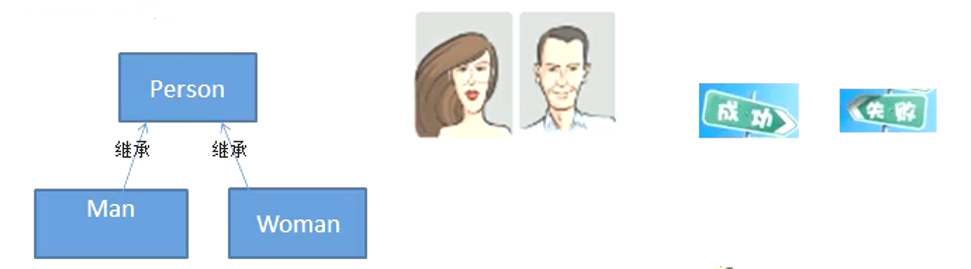
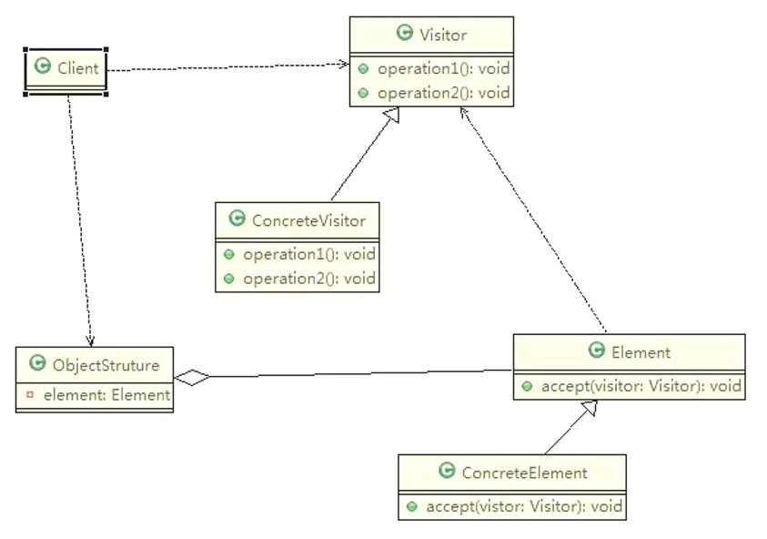
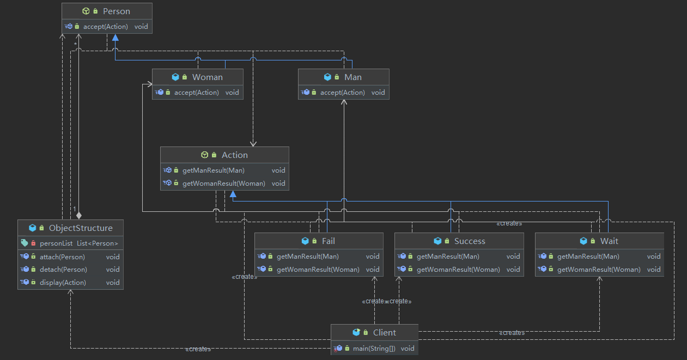

# 访问者模式（系稳功变，依赖类）

## 测评系统

完成测评系统需求

* 将人、观众分为男人和女人，对歌手进行测评，当看完某个歌手表演后，得到他们对该歌手不同的评价（评价有不同的种类，比如成功、失败等）
* 传统方案



**传统方式的问题分析**

* 如果系统比较小，还是 ok 的，但是考虑系统增加越来越多新的功能时，对代码改动较大，违反了 OCP 原则，不利于维护
* 扩展性不好，比如增加了新的人员类型，或者管理方法，都不好做
* 引出我们会使用新的设计模式——访问者模式

## 基本介绍

* 访问者模式（Visitor Pattern），封装一些作用于某种数据结构的各元素的操作，它可以在不改变数据结构的前提下定义作用于这些元素的新的操作
* 主要将数据结构与数据操作分离，=解决数据结构和操作耦合性问题=
* 访问者模式的基本工作原理是：在被访问的类里面加一个对外提供接待访问者的接口
* 访问者模式主要应用场景是：需要对一个对象结构中的对象进行很多不同操作（这些操作彼此没有关联），同时需要避免让这些操作“污染“这些对象的类，可以选用访问者模式解决



**访问者角色及职责**

* Visitor抽象访问者：为该对象结构中每个 ConcreteElement类声明一个 visit操作
* ConcreteVisitor具体访问者：实现 Visitor中声明的操作
* ObjectStructure对象结构：能枚举它的元素，提供一个高层接口，允许访问者访问元素
* Element抽象元素：定义一个 accept方法，接受一个访问者对象
* ConcreteElement具体元素：实现了 accept方法



访问者

```java
/**
 * 抽象访问者
 */
public abstract class Action {
    public abstract void getManResult(Man man);

    public abstract void getWomanResult(Woman woman);
}
/**
 * 具体访问者
 */
public class Success extends Action {
    @Override
    public void getManResult(Man man) {
        System.out.println("男生给了通过");
    }

    @Override
    public void getWomanResult(Woman woman) {
        System.out.println("女生给了通过");
    }
}
public class Fail extends Action {
    @Override
    public void getManResult(Man man) {
        System.out.println("男生给了不通过");
    }

    @Override
    public void getWomanResult(Woman woman) {
        System.out.println("女生给了不通过");
    }
}
public class Wait extends Action {
    @Override
    public void getManResult(Man man) {
        System.out.println("男生给了待定");
    }

    @Override
    public void getWomanResult(Woman woman) {
        System.out.println("女生给了待定");
    }
}
```

元素

```java
/**
 * 抽象元素
 */
public abstract class Person {
    public abstract void accept(Action action);
}
/**
 * 具体元素
 */
public class Man extends Person {
    @Override
    public void accept(Action action) {
        action.getManResult(this);
    }
}
public class Woman extends Person {
    @Override
    public void accept(Action action) {
        action.getWomanResult(this);
    }
}
```

对象结构

```java
/**
 * 对象结构
 */
public class ObjectStructure {
    private List<Person> personList = new ArrayList<>();

    public void attach(Person p) {
        personList.add(p);
    }

    public void detach(Person p) {
        personList.remove(p);
    }

    public void display(Action action) {
        for (Person person : personList) {
            person.accept(action);
        }
    }
}
```

调用

```java
ObjectStructure objectStructure = new ObjectStructure();
objectStructure.attach(new Man());
objectStructure.attach(new Woman());
objectStructure.display(new Success());
System.out.println("============");
objectStructure.display(new Fail());
System.out.println("============");
objectStructure.display(new Wait());
//男生给了通过
//女生给了通过
//============
//男生给了不通过
//女生给了不通过
//============
//男生给了待定
//女生给了待定
```

## 双分派

该例中我们使用到了双分派

* **第一次分派** ：首先在客户端程序中，将具体状态作为参数传递 `Woman`中
* **第二次分派** ：然后 `Woman`类调用作为参数的具体方法 `getWomanResult`，同时将自己 `this`作为参数传入

所谓双分派是指不管类怎么变化，我们都能找到期望的方法运行

双分派意味着得到执行的操作取决于请求的种类和两个接收者的类型

以上述实例为例，假设我们要添加一个 `Wait`的状态类，考察 `Man`类和 `Woman`类的反应

由于使用了双分派，只需增加一个 Action 子类即可在客户端调用即可，不需要改动任何其他类的代码

## 访问者模式的注意事项和细节

**优点**

* 访问者模式符合单一职责原则、让程序具有优秀的扩展性、灵活性非常高
* 访问者模式可以对功能进行统一，可以做报表、UI、拦截器与过滤器，适用于数据结构相对稳定的系统

**缺点**

* 具体元素对访问者公布细节，也就是说访问者关注了其他类的内部细节，这是 迪米特法则所不建议的 ，这样造成了具体元素变更比较困难
* 违背了依赖倒转原则 。访问者依赖的是具体元素，而不是抽象元素
* 因此，如果一个系统有比较稳定的数据结构，又有经常变化的功能需求，那么访问者模式就是比较合适的
