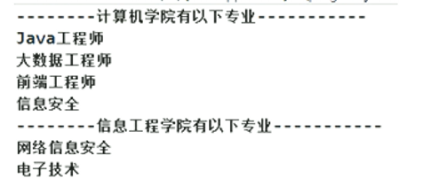
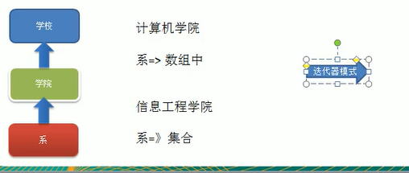
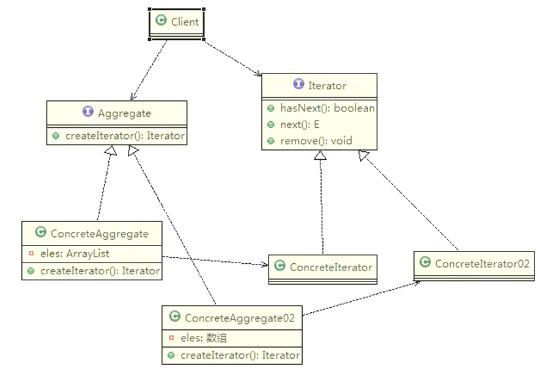
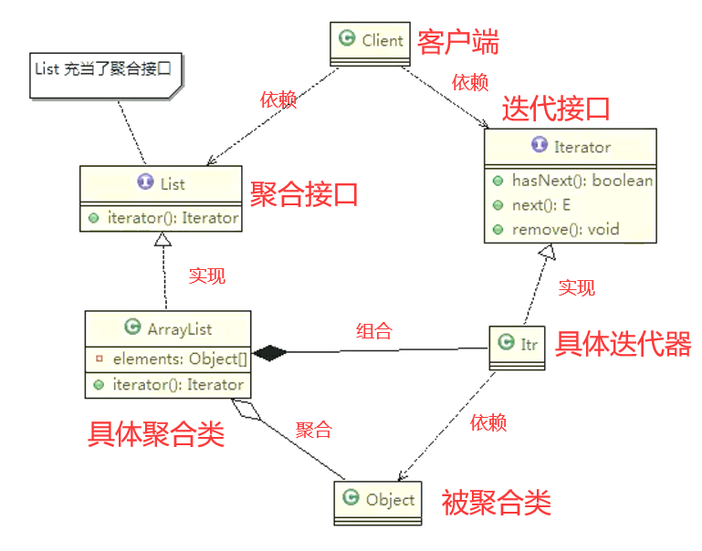

# 迭代器模式（自治遍历）

编写程序展示一个学校院系结构，要在一个页面中展示出学校的院系组成，一个学校有多个学院，一个学院有多个系。如图：





**传统方案分析**

* 将学院看做是学校的子类，系是学院的子类，这样实际上是站在组织大小来进行分层次的
* 实际上我们的要求是：在一个页面中展示出学校的院系组成，一个学校有多个学院，一个学院有多个系，因此这种方案，不能很好实现的遍历的操作
* 解决方案：迭代器模式

## 基本介绍

* 迭代器模式（lterator Pattern）是常用的设计模式，属于行为型模式
* 如果我们的集合元素是用不同方式实现的，有**数组、集合或者其他方式**。当客户端要遍历这些集合元素的时候就要使用多种遍历方式，而且还会暴露元素的内部结构，可以考虑使用迭代器模式解决
* 迭代器模式，提供一种遍历集合元素的统一接口，用一致的方法遍历集合元素，不需要知道集合对象的底层表示，即：不暴露其内部的结构

**原理类图**



**迭代器模式的角色及职责**

* Iterator迭代器接口：系统提供，含有 hasNext、next、remove
* ConcreteIterator具体的迭代器：管理相关的迭代
* Aggregate聚合接口：将客户端和具体的聚合解耦
* ConcreteAggregate具体的聚合类：提供一个方法，返回可以正确遍历集合的迭代器
* Client客户端：通过 Iterator迭代器接口和 Aggregate聚合接口依赖其具体的迭代器和聚合子类

迭代器

```java
/**
 * 计算机学院迭代器类
 */
public class ComputerCollegeIterator implements Iterator {
    private Department[] departments;
    private Integer position = -1;

    public ComputerCollegeIterator(Department[] departments) {
        this.departments = departments;
    }

    @Override
    public boolean hasNext() {
        return position + 1 < departments.length && departments[position + 1] != null;
    }

    @Override
    public Object next() {
        return departments[++position];
    }
}
/**
 * 信息学院迭代器类
 */
public class InfoCollegeIterator implements Iterator {
    private List<Department> departments;
    private Integer position = -1;

    public InfoCollegeIterator(List<Department> departments) {
        this.departments = departments;
    }

    @Override
    public boolean hasNext() {
        return position + 1 < departments.size();
    }

    @Override
    public Object next() {
        return departments.get(++position);
    }
}
```

聚合接口

```java
public interface College {
    String getName();
  
    Iterator<Department> createIterator();
}
```

具体的聚合类

```java
/**
 * 计算机学院
 */
public class ComputerCollege implements College {
    private Department[] departments;
    private Integer position = 0;

    public ComputerCollege() {
        departments = new Department[5];
        departments[position++] = new Department("Java专业");
        departments[position++] = new Department("PHP专业");
        departments[position++] = new Department("Python专业");
    }

    @Override
    public String getName() {
        return "计算机学院";
    }

    @Override
    public Iterator<Department> createIterator() {
        return new ComputerCollegeIterator(departments);
    }
}
/**
 * 信息学院
 */
public class InfoCollege implements College {
    private List<Department> departments;

    public InfoCollege() {
        departments = new ArrayList<>();
        departments.add(new Department("信息安全专业"));
        departments.add(new Department("网络安全专业"));
        departments.add(new Department("服务器安全专业"));
    }

    @Override
    public String getName() {
        return "信息学院";
    }

    @Override
    public Iterator<Department> createIterator() {
        return new InfoCollegeIterator(departments);
    }
}
```

输出类（没有这一层就跟迭代器一样了）

```java
public class OutPutImpl {

    public OutPutImpl() {
    }

    public void printCollege(List<College> collegeList) {
        Iterator<College> iterator = collegeList.iterator();
        while (iterator.hasNext()) {
            College college = iterator.next();
            System.out.println("============" + college.getName() + "============");
            printDepartment(college);
        }
    }

    private void printDepartment(College college) {
        Iterator<Department> iterator = college.createIterator();
        while (iterator.hasNext()) {
            System.out.println(iterator.next().getName());
        }
    }
}
```

调用测试

```java
List<College> collegeList = new ArrayList<>();
collegeList.add(new ComputerCollege());
collegeList.add(new InfoCollege());
new OutPutImpl().printCollege(collegeList);
```

## ArrayList 集合源码分析



**角色分析说明**

* Iterator迭代器接口：由系统提供，定义了 hasNext()和 next()等方法
* Itr具体的迭代器实现类：作为 ArrayList的内部类存在，实现了 Iterator接口的 hasNext()和 next()等方法
* List聚合接口：定义了 iterator()方法，返回一个迭代器接口对象
* ArrayList具体的聚合类：实现了 iterator()方法

迭代器模式提供了一个不同集合类型（如 ArrayList、LinkedList等）的统一遍历解决方案

## 迭代器模式的注意事项和细节

优点

* 提供一个统一的方法遍历对象 ，客户不用再考虑聚合的类型，使用一种方法就可以遍历对象了
* 隐藏了聚合的内部结构 ，客户端要遍历聚合的时候只能取到迭代器，而不会知道聚合的具体组成
* 提供了一种设计思想，就是一个类应该只有一个引起变化的原因（ 单一责任原则 ）。在聚合类中，我们把迭代器分开，就是要把管理对象集合和遍历对象集合的责任分开，这样一来集合改变的话，只影响到聚合对象。而如果遍历方式改变的话，只影响到了迭代器
* 当要展示一组相似对象，或者遍历一组相同对象时使用，适合使用迭代器模式

缺点

* 每个聚合对象都要一个迭代器，会生成多个迭代器不好管理类
