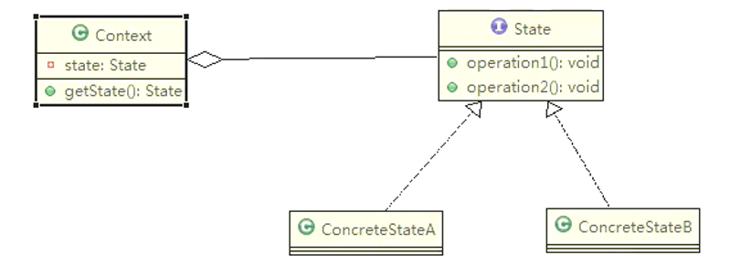
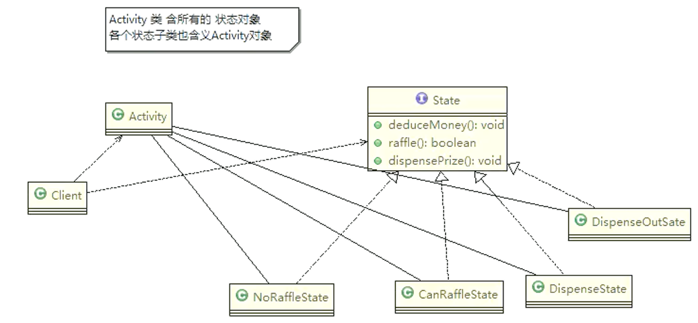
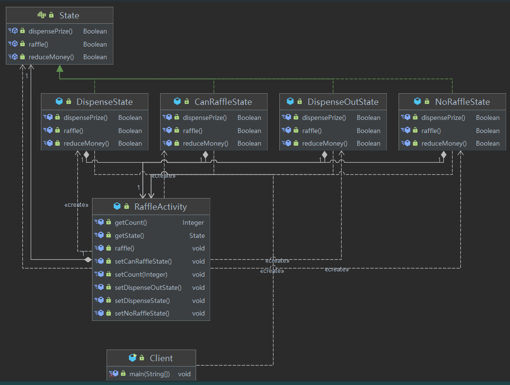
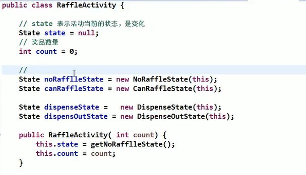
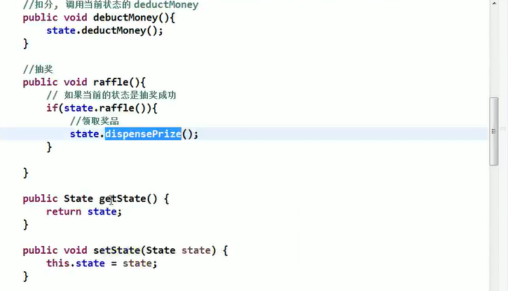
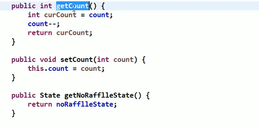
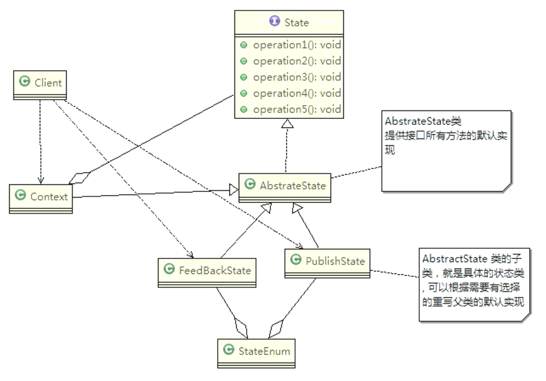

# 状态模式

## APP 抽奖活动问题

请编写程序完成 APP 抽奖活动具体要求如下：

* 假如每参加一次这个活动要扣除用户 50 积分，中奖概率是 10%
* 奖品数量固定，抽完就不能抽奖
* 活动有四个状态：可以抽奖、不能抽奖、发放奖品和奖品领完
* 活动的四个状态转换关系图


## 状态模式基本介绍

* 状态模式（State Pattern）：它主要用来解决对象在多种状态转换时，需要对外输出不同的行为的问题。状态和行为是一一对应的，状态之间可以相互转换
* 当一个对象的内在状态改变时，允许改变其行为，这个对象看起来像是改变了其类

**原理类图**



**角色与职责**

* `Context`环境角色：维护一个 `State`实例，这个实例定义了当前状态
* `State`抽象状态角色：定义一个接口，封装与 `Context`的一个特点接口相关行为
* `ConcreteState`具体状态角色：实现一个与 `Context`的一个状态相关行为

## 状态模式解决 APP 抽奖问题

* 应用实例要求完成 APP 抽奖活动项目，使用状态模式
* 思路分析和图解（类图）
  * 定义出一个接口叫状态接口，每个状态都实现它
  * 接口有扣除积分方法、抽奖方法、发放奖品方法

**UML 类图**





**核心代码**

抽象状态角色

```java
/**
 * 抽象状态角色
 */
public interface State {
//扣除50积分
    Boolean reduceMoney();
//能否抽奖
    Boolean raffle();
//发放奖品
    Boolean dispensePrize();
}
```

不能抽奖状态类

```java
/**
 * 不能抽奖状态类
 */
public class NoRaffleState implements State {
    private RaffleActivity raffleActivity;
    // 模拟数据库积分值
    private int integral = 100;

    public NoRaffleState(RaffleActivity raffleActivity) {
        this.raffleActivity = raffleActivity;
    }

    @Override
    public Boolean reduceMoney() {
        if (integral < 50) {
            System.out.println("您的积分余额不足~");
            return false;
        }
        integral -= 50;
        raffleActivity.setCanRaffleState();
        System.out.println("已扣除50积分，可以进行抽奖啦~");
        return true;
    }

    @Override
    public Boolean raffle() {
        System.out.println("当前无法进行抽奖~");
        return false;
    }

    @Override
    public Boolean dispensePrize() {
        System.out.println("当前无法领取奖品~");
        return false;
    }
}
```

可以抽奖状态类

```java
/**
 * 可以抽奖状态类
 */
public class CanRaffleState implements State {
    private RaffleActivity raffleActivity;

    public CanRaffleState(RaffleActivity raffleActivity) {
        this.raffleActivity = raffleActivity;
    }

    @Override
    public Boolean reduceMoney() {
        System.out.println("已扣除50积分，可以进行抽奖啦~");
        return false;
    }

    @Override
    public Boolean raffle() {
        if (new Random().nextInt(10) == 0) {
            raffleActivity.setDispenseState();
            System.out.println("恭喜您，中奖了~");
            return true;
        }
        raffleActivity.setNoRaffleState();
        System.out.println("很遗憾，您没有中奖~");
        return false;
    }

    @Override
    public Boolean dispensePrize() {
        System.out.println("尚未进行抽奖，无法领取奖品！");
        return false;
    }
}
```

发放奖品状态类

```java
/**
 * 发放奖品状态类
 */
public class DispenseState implements State {
    private RaffleActivity raffleActivity;

    public DispenseState(RaffleActivity raffleActivity) {
        this.raffleActivity = raffleActivity;
    }

    @Override
    public Boolean reduceMoney() {
        System.out.println("已经进行过抽奖啦！");
        return false;
    }

    @Override
    public Boolean raffle() {
        System.out.println("已经进行过抽奖啦！");
        return false;
    }

    @Override
    public Boolean dispensePrize() {
        if (raffleActivity.getCount() <= 0) {
            raffleActivity.setDispenseOutState();
            System.out.println("今日奖品已领完，明天再来吧~");
            return false;
        }
        raffleActivity.setNoRaffleState();
        System.out.println("奖品领取成功~");
        return true;
    }
}
```

奖品领完状态类

```java
/**
 * 奖品领完状态类
 */
public class DispenseOutState implements State {
    private RaffleActivity raffleActivity;

    public DispenseOutState(RaffleActivity raffleActivity) {
        this.raffleActivity = raffleActivity;
    }

    @Override
    public Boolean reduceMoney() {
        System.out.println("今日奖品已领完，明天再来吧~");
        return false;
    }

    @Override
    public Boolean raffle() {
        System.out.println("今日奖品已领完，明天再来吧~");
        return false;
    }

    @Override
    public Boolean dispensePrize() {
        System.out.println("今日奖品已领完，明天再来吧~");
        return false;
    }
}
```

抽奖活动






**测试代码**

```java
RaffleActivity raffleActivity = new RaffleActivity(2);
// 第一次抽奖
System.out.println("======第一次抽奖======");
raffleActivity.raffle();
// 第二次抽奖
System.out.println("======第二次抽奖======");
raffleActivity.raffle();
// 第三次抽奖
System.out.println("======第三次抽奖======");
raffleActivity.raffle();
//======第一次抽奖======
//已扣除50积分，可以进行抽奖啦~
//很遗憾，您没有中奖~
//======第二次抽奖======
//已扣除50积分，可以进行抽奖啦~
//恭喜您，中奖了~
//奖品领取成功~
//======第三次抽奖======
//您的积分余额不足~
```

## 状态模式在实际项目——借贷平台源码剖析

* 借贷平台的订单，有审核-发布-抢单等等步骤，随着操作的不同，会改变订单的状态，项目中的这个模块实现就会使用到状态模式
* 通常通过 `if/else`判断订单的状态，从而实现不同的逻辑，伪代码如下

  ```java
  if(审核){
      //审核逻辑
  }else if(发布){
      //发布逻辑
  }else if(接单){
      //接单逻辑
  }
  ```

  **问题分析** ：这类代码难以应对变化，在添加一种状态时，我们需要手动添加 `if/else`，在添加一种功能时，要对所有的状态进行判断。因此代码会变得越来越臃肿，并且一旦没有处理某个状态，便会发生极其严重的 BUG，难以维护
* 使用状态模式完成借贷平台项目的审核模块 [设计+代码]

### 设计

**借贷平台—流程审批**

状态模式本质上是一种基于状态和事件的状态机，下面是=订单流程的状态图=


通过状态图，我们再设计一张横纵坐标关系表来比较，如下图

| 状态 \ 事件   | 电审（1）   | 电审失败（2） | 定价发布（3） | 接单（4）   | 接单失败（5） | 付款（6）   | 支付失效（7） | 反馈（8）   |
| :------------ | :---------- | :------------ | :------------ | :---------- | :------------ | :---------- | :------------ | :---------- |
| 订单生成（1） | 已审核（2） | 已完结（6）   |               |             |               |             |               |             |
| 已审核（2）   |             |               | 已发布（3）   |             |               |             |               |             |
| 已发布（3）   |             |               |               | 待付款（4） | 已完结（6）   |             |               |             |
| 待付款（4）   |             |               |               |             |               | 已付款（5） | 已完结（6）   |             |
| 已付款（5）   |             |               |               |             |               |             |               | 已完结（6） |
| 已完结（6）   |             |               |               |             |               |             |               |             |

**UML 类图**




### 代码

状态接口

```java
/**
 * 状态接口
 */
public interface State {
    /**
     * 电审
     *
     * @param context
     */
    void electronicAudit(Context context);

    /**
     * 电审失败
     *
     * @param context
     */
    void electronicAuditFail(Context context);

    /**
     * 定价发布
     *
     * @param context
     */
    void releasePricing(Context context);

    /**
     * 接单
     *
     * @param context
     */
    void acceptOrder(Context context);

    /**
     * 接单失败
     *
     * @param context
     */
    void acceptOrderFail(Context context);

    /**
     * 付款
     *
     * @param context
     */
    void payMoney(Context context);

    /**
     * 反馈【下款 或 拒贷】
     *
     * @param context
     */
    void feedback(Context context);

    String getCurrentState();
}
```

抽象状态类

```java
/**
 * 抽象状态类，默认实现
 */
public abstract class AbstractState implements State {
    private static final RuntimeException EXCEPTION = new RuntimeException("操作流程有误");

    @Override
    public void electronicAudit(Context context) {
        throw EXCEPTION;
    }

    @Override
    public void electronicAuditFail(Context context) {
        throw EXCEPTION;

    }

    @Override
    public void releasePricing(Context context) {
        throw EXCEPTION;
    }

    @Override
    public void acceptOrder(Context context) {
        throw EXCEPTION;
    }

    @Override
    public void acceptOrderFail(Context context) {
        throw EXCEPTION;
    }

    @Override
    public void payMoney(Context context) {
        throw EXCEPTION;
    }

    @Override
    public void feedback(Context context) {
        throw EXCEPTION;
    }
}
```

具体状态类

```java
/**
 * 订单生成状态类
 */
public class GeneratedState extends AbstractState {
    @Override
    public void electronicAudit(Context context) {
        context.setState(new AuditedState());
    }

    @Override
    public void electronicAuditFail(Context context) {
        context.setState(new FinishedState());
    }

    @Override
    public String getCurrentState() {
        return StateEnum.GENERATED.name();
    }
}
/**
 * 已审核状态类
 */
public class AuditedState extends AbstractState {
    @Override
    public void releasePricing(Context context) {
        context.setState(new PublishedState());
    }

    @Override
    public String getCurrentState() {
        return StateEnum.AUDITED.name();
    }
}
/**
 * 已发布状态类
 */
public class PublishedState extends AbstractState {
    @Override
    public void acceptOrder(Context context) {
        context.setState(new NotPaidState());
    }

    @Override
    public void acceptOrderFail(Context context) {
        context.setState(new FinishedState());
    }

    @Override
    public String getCurrentState() {
        return StateEnum.PUBLISHED.name();
    }
}
/**
 * 未付款状态类
 */
public class NotPaidState extends AbstractState {
    @Override
    public void payMoney(Context context) {
        context.setState(new PaidState());
    }

    @Override
    public void feedback(Context context) {
        context.setState(new FinishedState());
    }

    @Override
    public String getCurrentState() {
        return StateEnum.NOT_PAID.name();
    }
}
/**
 * 未付款状态类
 */
public class PaidState extends AbstractState {
    @Override
    public void feedback(Context context) {
        context.setState(new FinishedState());
    }

    @Override
    public String getCurrentState() {
        return StateEnum.PAID.name();
    }
}
/**
 * 未付款状态类
 */
public class FinishedState extends AbstractState {
    @Override
    public String getCurrentState() {
        return StateEnum.FINISHED.name();
    }
}
```

状态枚举类

```java
public enum StateEnum {
    GENERATED,
    AUDITED,
    PUBLISHED,
    NOT_PAID,
    PAID,
    FINISHED;
}
```

上下文环境类

```java
/**
 * 上下文环境类
 */
public class Context extends AbstractState {
    private State state;

    public Context() {
        state = new GeneratedState();
    }

    @Override
    public void electronicAudit(Context context) {
        state.electronicAudit(context);
        getCurrentState();
    }

    @Override
    public void electronicAuditFail(Context context) {
        state.electronicAuditFail(context);
        getCurrentState();
    }

    @Override
    public void releasePricing(Context context) {
        state.releasePricing(context);
        getCurrentState();
    }

    @Override
    public void acceptOrder(Context context) {
        state.acceptOrder(context);
        getCurrentState();
    }

    @Override
    public void acceptOrderFail(Context context) {
        state.acceptOrderFail(context);
        getCurrentState();
    }

    @Override
    public void payMoney(Context context) {
        state.payMoney(context);
        getCurrentState();
    }

    @Override
    public void feedback(Context context) {
        state.feedback(context);
        getCurrentState();
    }

    public State getState() {
        return state;
    }

    public void setState(State state) {
        this.state = state;
    }

    @Override
    public String getCurrentState() {
        System.out.println("当前状态：" + state.getCurrentState());
        return state.getCurrentState();
    }
}
```

测试代码

```java
Context context = new Context();
context.electronicAudit(context);
context.releasePricing(context);
context.acceptOrder(context);
context.payMoney(context);

context.electronicAuditFail(context);
context.acceptOrderFail(context);
//当前状态：AUDITED
//当前状态：PUBLISHED
//当前状态：NOT_PAID
//当前状态：PAID
//Exception in thread "main" java.lang.RuntimeException: 操作流程有误
//	at com.vectorx.pattern.t20_state.lendingplatform.AbstractState.<clinit>(AbstractState.java:7)
//	at com.vectorx.pattern.t20_state.lendingplatform.Client.main(Client.java:5)
```

## 态模式的注意事项和细节

**优点**

* 代码有很强的可读性 ：状态模式将每个状态的行为封装到对应的一个类中
* 方便维护 ：将容易产生问题的 `if-else`语句删除了，如果把每个状态的行为都放到一个类中，每次调用方法时都要判断当前是什么状态，不但会产出很多 `if-else`语句，而且容易出错
* 符合 开闭原则，容易增删状态

**缺点**

* 会产生很多类 ：每个状态都要一个对应的类，当状态过多时会产生很多类，加大维护难度

**应用场景**

* 当一个事件或者对象有很多种状态，状态之间会相互转换，对不同的状态要求有不同的行为时，可以考虑使用状态模式
