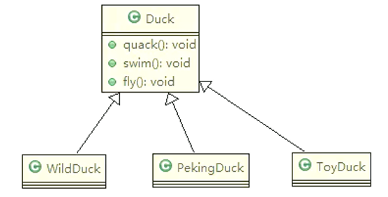
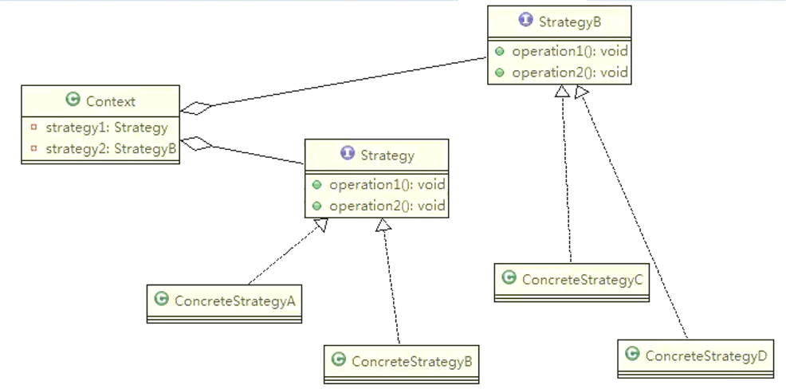

# 策略模式

## 鸭子问题

编写鸭子项目，具体要求如下：

* 有各鸭子（比如野鸭、水鸭等，鸭子有各种行为，比如叫、飞行等）
* 显示鸭子的信息

## 传统方案解决鸭子问题

**UML 类图**



**核心代码**

```java
public abstract class Duck {
    public void quark() {
        System.out.println("鸭子嘎嘎叫~");
    }

    public void swim() {
        System.out.println("鸭子哗哗游~");
    }

    public void fly() {
        System.out.println("鸭子腾腾飞~");
    }

    public abstract void display();
}
public class WildDuck extends Duck {

    @Override
    public void display() {
        System.out.println("野鸭子");
    }
}
public class PekingDuck extends Duck {
    @Override
    public void display() {
        System.out.println("北京鸭~");
    }

    @Override
    public void fly() {
        System.out.println("北京鸭不会飞~");
    }
}
public class ToyDuck extends Duck {
    @Override
    public void display() {
        System.out.println("玩具鸭~");
    }

    @Override
    public void quark() {
        System.out.println("玩具鸭不会叫~");
    }

    @Override
    public void swim() {
        System.out.println("玩具鸭不会游~");
    }

    @Override
    public void fly() {
        System.out.println("玩具鸭不会飞~");
    }
}
```

**传统的方式实现的问题分析和解决方案**

* 其它鸭子，都继承了 `Duck`类，所以 `fly`让所有子类都会飞了，这是不正确的
* 上面说的问题，其实是继承带来的问题：对类的局部改动，尤其超类的局部改动，会影响其他部分，会有溢出效应
* 为了改进问题，我们可以通过覆盖 `fly`方法来解决 => 覆盖解决
* 问题又来了，如果我们有一个玩具鸭子 `ToyDuck`，这样就需要 `ToyDuck`去覆盖 `Duck`的所有实现的方法 => 解决思路：=策略模式=

## 策略模式基本介绍

* 策略模式（Strategy Pattern）中，定义算法族，分别封装起来，让他们之间可以互相替换。此模式让算法的变化独立于使用算法的客户
* 这算法体现了几个设计原则

  * 把变化的代码从不变的代码中分离出来
  * 针对接口编程而不是具体类 （定义了策略接口）
  * 多用组合/聚合，少用继承 （客户通过组合方式使用策略）

**原理类图**



说明：从上图可以看到，客户 `Context`有成员变量 `Strategy`或者其他的策略接口。至于需要使用到哪个策略，可以在构造器中指定

## 策略模式解决鸭子问题

* 应用实例要求：编写程序完成前面的鸭子项目，要求使用策略模式
* 思路分析
  * 策略模式：分别封装行为接口，实现算法族，超类里放行为接口对象，在子类里具体设定行为对象
  * 原则就是：分离变化部分，封装接口，基于接口编程各种功能。此模式让行为的变化独立于算法的使用者
* 代码实现

**UML 类图**


**核心代码**

“叫”的行为

```java
/**
 * “叫”行为策略接口
 */
public interface QuarkBehavior {
    void quark();
}
/**
 * “不会叫”行为策略对象
 */
public class NoQuarkBehavior implements QuarkBehavior {
    @Override
    public void quark() {
        System.out.println("不会叫~");
    }
}
/**
 * “嘎嘎叫”行为策略对象
 */
public class GagaQuarkBehavior implements QuarkBehavior {
    @Override
    public void quark() {
        System.out.println("嘎嘎叫~");
    }
}
/**
 * “咯咯叫”行为策略对象
 */
public class GegeQuarkBehavior implements QuarkBehavior {
    @Override
    public void quark() {
        System.out.println("咯咯叫~");
    }
}
```

“游泳”的行为

```java
/**
 * ”游泳“行为策略接口
 */
public interface SwimBehavior {
    void swim();
}
/**
 * “不会游泳”行为策略对象
 */
public class NoSwimHehavior implements SwimBehavior {
    @Override
    public void swim() {
        System.out.println("不会游泳~");
    }
}
/**
 * “会游泳”行为策略对象
 */
public class CanSwimHehavior implements SwimBehavior {
    @Override
    public void swim() {
        System.out.println("会游泳~");
    }
}
```

“飞”的行为

```java
/**
 * “飞行”行为策略接口
 */
public interface FlyBehavior {
    void fly();
}
/**
 * “不会飞”行为策略对象
 */
public class NoFlyBehavior implements FlyBehavior {
    @Override
    public void fly() {
        System.out.println("不会飞~");
    }
}
/**
 * “不太会飞”行为策略对象
 */
public class BadFlyBehavior implements FlyBehavior {
    @Override
    public void fly() {
        System.out.println("不太会飞~");
    }
}
/**
 * “很会飞”行为策略对象
 */
public class GoodFlyBehavior implements FlyBehavior {
    @Override
    public void fly() {
        System.out.println("很会飞~");
    }
}
```

鸭子类

```java
/**
 * 抽象鸭子类
 */
public abstract class Duck {
    protected QuarkBehavior quarkBehavior;
    protected SwimBehavior swimBehavior;
    protected FlyBehavior flyBehavior;

    public Duck() {
        display();
    }

    public void quark() {
        if (quarkBehavior != null) {
            quarkBehavior.quark();
        }
    }

    public void swim() {
        if (swimBehavior != null) {
            swimBehavior.swim();
        }
    }

    public void fly() {
        if (flyBehavior != null) {
            flyBehavior.fly();
        }
    }

    public void setQuarkBehavior(QuarkBehavior quarkBehavior) {
        this.quarkBehavior = quarkBehavior;
    }

    public void setSwimBehavior(SwimBehavior swimBehavior) {
        this.swimBehavior = swimBehavior;
    }

    public void setFlyBehavior(FlyBehavior flyBehavior) {
        this.flyBehavior = flyBehavior;
    }

    public abstract void display();
}
/**
 * 野鸭子
 */
public class WildDuck extends Duck {
    public WildDuck() {
        super();
        quarkBehavior = new GegeQuarkBehavior();
        swimBehavior = new CanSwimHehavior();
        flyBehavior = new GoodFlyBehavior();
    }

    @Override
    public void display() {
        System.out.println("======野鸭子======");
    }
}
/**
 * 北京鸭
 */
public class PekingDuck extends Duck {
    public PekingDuck() {
        super();
        quarkBehavior = new GagaQuarkBehavior();
        swimBehavior = new CanSwimHehavior();
        flyBehavior = new BadFlyBehavior();
    }

    @Override
    public void display() {
        System.out.println("======北京鸭======");
    }
}
/**
 * 玩具鸭
 */
public class ToyDuck extends Duck {
    public ToyDuck() {
        super();
        quarkBehavior = new NoQuarkBehavior();
        swimBehavior = new NoSwimHehavior();
        flyBehavior = new NoFlyBehavior();
    }

    @Override
    public void display() {
        System.out.println("======玩具鸭======");
    }
}
```

测试代码

```java
Duck wildDuck = new WildDuck();
wildDuck.quark();
wildDuck.swim();
wildDuck.fly();

Duck pekingDuck = new PekingDuck();
pekingDuck.quark();
pekingDuck.swim();
pekingDuck.fly();
System.out.println("===改变策略===");
pekingDuck.setFlyBehavior(new NoFlyBehavior());
pekingDuck.fly();

Duck toyDuck = new ToyDuck();
toyDuck.quark();
toyDuck.swim();
toyDuck.fly();
```

测试结果

```java
//======野鸭子======
//咯咯叫~
//会游泳~
//很会飞~
//======北京鸭======
//嘎嘎叫~
//会游泳~
//不太会飞~
//===改变策略===
//不会飞~
//======玩具鸭======
//不会叫~
//不会游泳~
//不会飞~
```

## 策略模式在 JDK-Arrays 应用的源码分析

JDK 的 `Arrays`的 `Comparator`就使用了策略模式

* 匿名类对象 `new Comparator<Integer>() {}`实现了 `Comparator`接口（策略接口）
* `public int compare(Integer o1, Integer o2) {}`指定具体的处理方式

```java
Comparator<Integer> comparator = new Comparator<Integer>() {
    @Override
    public int compare(Integer o1, Integer o2) {
        return o1 > o2 ? 1 : -1;
    }
};
// 方式1
Arrays.sort(data, comparator);
System.out.println(Arrays.toString(data));
// [1, 2, 3, 4, 8, 9]

//方式2
Arrays.sort(data, (v1, v2) -> v1.compareTo(v2) > 0 ? -1 : 1);
System.out.println(Arrays.toString(data));
//[9, 8, 4, 3, 2, 1]
```

## 策略模式的注意事项和细节

* 策略模式的关键是：=分析项目中变化部分与不变部分=
* 策略模式的核心思想是： =多用组合/聚合，少用继承= ；用行为类组合，而不是行为的继承，更有弹性
* 体现了 =“对修改关闭，对扩展开放”= 原则，客户端增加行为不用修改原有代码，只要添加一种策略（或者行为）即可，避免了使用多重转移语句（`if...else if...else`）
* 提供了可以替换继承关系的办法：策略模式将算法封装在独立的 `Strategy`类中，使得你可以独立于其 `Context`改变它，使它易于切换、易于理解、易于扩展
* 需要注意的是：每添加一个策略就要增加一个类，=当策略过多是会导致类数目庞大=
