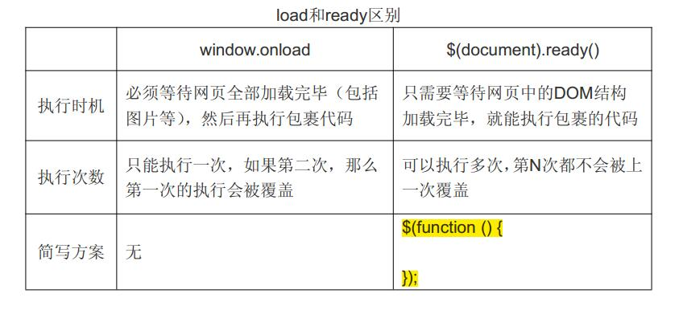

# jQuery简介

jQuery 是一个 JavaScript 库。极大地简化了 JavaScript 编程。jQuery 库可以通过一行简单的标记被添加到网页中。

jQuery 库包含以下功能：

* HTML 元素选取
* HTML 元素操作
* CSS 操作
* HTML 事件函数
* JavaScript 特效和动画
* HTML DOM 遍历和修改
* AJAX
* Utilities

## jQuery **安装**

## 网页中添加 jQuery

可以通过多种方法在网页中添加 jQuery。 您可以使用以下方法：

* 从 [jquery.com](http://jquery.com/download/) 下载 jQuery 库
* 从 CDN 中载入 jQuery, 如从 Google 中加载 jQuery

### 下载 jQuery

有两个版本的 jQuery 可供下载：

* Production version - 用于实际的网站中，已被精简和压缩。
* Development version - 用于测试和开发（未压缩，是可读的代码）

以上两个版本都可以从 [jquery.com](http://jquery.com/download/) 中下载。

jQuery 库是一个 JavaScript 文件，您可以使用 HTML 的 < script > 标签引用它：

```js
<head>
<script src="jquery-1.10.2.min.js"></script>
</head>
```

### 替代方案

如果您不希望下载并存放 jQuery，那么也可以通过 CDN（内容分发网络） 引用它。

Staticfile CDN、百度、又拍云、新浪、谷歌和微软的服务器都存有 jQuery 。

如果你的站点用户是国内的，建议使用百度、又拍云、新浪等国内CDN地址，如果你站点用户是国外的可以使用谷歌和微软。

```html
<head>
<script src="https://cdn.staticfile.org/jquery/1.10.2/jquery.min.js">
</script>
</head>

<head>
<script src="https://apps.bdimg.com/libs/jquery/2.1.4/jquery.min.js">
</script>
</head>

<head>
<script src="https://upcdn.b0.upaiyun.com/libs/jquery/jquery-2.0.2.min.js">
</script>
</head>

<head>
<script src="https://lib.sinaapp.com/js/jquery/2.0.2/jquery-2.0.2.min.js">
</script>
</head>

//不大推荐使用Google CDN来获取版本，因为Google产品在中国很不稳定。
<head>
<script src="https://ajax.googleapis.com/ajax/libs/jquery/1.10.2/jquery.min.js">
</script>
</head>

<head>
<script src="https://ajax.aspnetcdn.com/ajax/jquery/jquery-1.9.0.min.js"></script>
</head>
```

## jQuery **语法**

通过 jQuery，您可以选取（查询，query） HTML 元素，并对它们执行"操作"（actions）。

jQuery 语法是通过选取 HTML 元素，并对选取的元素执行某些操作。

基础语法：

```js
$(selector).action()
```

* 美元符号定义 jQuery
* 选择符（selector）"查询"和"查找" HTML 元素
* jQuery 的 action() 执行对元素的操作

实例:

* $(this).hide() - 隐藏当前元素
* $("p").hide() - 隐藏所有 `<p>` 元素
* $("p.test").hide() - 隐藏所有 class="test" 的 `<p>` 元素
* $("#test").hide() - 隐藏 id="test" 的元素

### 文档就绪事件

您也许已经注意到在我们的实例中的所有 jQuery 函数位于一个 document ready 函数中：

```js
$(document).ready(function(){
 
   // 开始写 jQuery 代码...
 
});
```

这是为了防止文档在完全加载（就绪）之前运行 jQuery 代码，即在 DOM 加载完成后才可以对 DOM 进行操作。

如果在文档没有完全加载之前就运行函数，操作可能失败。下面是两个具体的例子：

* 试图隐藏一个不存在的元素
* 获得未完全加载的图像的大小

 **提示：** 简洁写法（与以上写法效果相同）:

```js
$(function(){
 
   // 开始写 jQuery 代码...
 
});
```



## jQuery **选择器**

jQuery 选择器允许您对 HTML 元素组或单个元素进行操作。

jQuery 选择器允许您对 HTML 元素组或单个元素进行操作。

jQuery 选择器基于元素的 id、类、类型、属性、属性值等"查找"（或选择）HTML 元素。 它基于已经存在的 [CSS 选择器](https://www.runoob.com/cssref/css-selectors.html)，除此之外，它还有一些自定义的选择器。

jQuery 中所有选择器都以美元符号开头：$()。

### 元素选择器

jQuery 元素选择器基于元素名选取元素。

在页面中选取所有 < p > 元素:

```js
$(document).ready(function(){
  $("button").click(function(){
    $("p").hide();
  });
});
```

### #id 选择器

jQuery #id 选择器通过 HTML 元素的 id 属性选取指定的元素。

页面中元素的 id 应该是唯一的，所以您要在页面中选取唯一的元素需要通过 #id 选择器。

通过 id 选取元素语法如下：

```js
$(document).ready(function(){
  $("button").click(function(){
    $("#test").hide();
  });
});
```

### .class 选择器

jQuery 类选择器可以通过指定的 class 查找元素。

语法如下：

```js
$(document).ready(function(){
  $("button").click(function(){
    $(".test").hide();
  });
});
```

### 更多实例

请使用我们的 [jQuery 选择器检测器](https://www.runoob.com/try/trysel.php) 来演示不同的选择器。

| 选择器                                                                                                | 实例                       | 选取                                                                                            |
| ----------------------------------------------------------------------------------------------------- | -------------------------- | ----------------------------------------------------------------------------------------------- |
| [*](https://www.runoob.com/jquery/jq-sel-all.html)                                                       | $("*")                     | 所有元素                                                                                        |
| [#id](https://www.runoob.com/jquery/jq-sel-id.html)                                                      | $("#lastname")             | id="lastname" 的元素                                                                            |
| [.class](https://www.runoob.com/jquery/jq-sel-class.html)                                                | $(".intro")                | class="intro" 的所有元素                                                                        |
| [. class, .class](https://www.runoob.com/jquery/sel-multiple-classes.html)                               | $(".intro,.demo")          | class 为 "intro" 或 "demo" 的所有元素                                                           |
| [element](https://www.runoob.com/jquery/jq-sel-element.html)                                             | $("p")                     | 所有 `<p>` 元素                                                                               |
| [ el1 , el2 ,el3](https://www.runoob.com/jquery/sel-multiple-elements.html)                              | $("h1,div,p")              | 所有 `<h1>`、`<div>` 和 `<p>` 元素                                                        |
| *                                                                                                     |                            |                                                                                                 |
| [:first](https://www.runoob.com/jquery/sel-first.html)                                                   | $("p:first")               | 第一个 `<p>` 元素                                                                             |
| [:last](https://www.runoob.com/jquery/sel-last.html)                                                     | $("p:last")                | 最后一个 `<p>` 元素                                                                           |
| [:even](https://www.runoob.com/jquery/sel-even.html)                                                     | $("tr:even")               | 所有偶数 `<tr>` 元素，索引值从 0 开始，第一个元素是偶数 (0)，第二个元素是奇数 (1)，以此类推。 |
| [:odd](https://www.runoob.com/jquery/sel-odd.html)                                                       | $("tr:odd")                | 所有奇数 `<tr>` 元素，索引值从 0 开始，第一个元素是偶数 (0)，第二个元素是奇数 (1)，以此类推。 |
|                                                                                                       |                            | 选择器默认以 body 作为父标签                                                                    |
| [:first-child](https://www.runoob.com/jquery/jq-sel-firstchild.html)                                     | $("ul li:first-child")     | 选取每个 `<ul>` 元素的第一个 `<li>` 元素                                                    |
| [:first-of-type](https://www.runoob.com/jquery/sel-firstoftype.html)                                     | $("p:first-of-type")       | 属于其父元素的第一个 `<p>` 元素的所有 `<p>` 元素                                            |
| [:last-child](https://www.runoob.com/jquery/sel-lastchild.html)                                          | $("p:last-child")          | 属于其父元素的最后一个子元素的所有 `<p>` 元素                                                 |
| [:last-of-type](https://www.runoob.com/jquery/sel-lastoftype.html)                                       | $("p:last-of-type")        | 属于其父元素的最后一个 `<p>` 元素的所有 `<p>` 元素                                          |
| [:nth-child( *n* )](https://www.runoob.com/jquery/sel-nthchild.html)                                   | $("p:nth-child(2)")        | 属于其父元素的第二个子元素的所有 `<p>` 元素                                                   |
| [:nth-last-child( *n* )](https://www.runoob.com/jquery/sel-nthlastchild.html)                          | $("p:nth-last-child(2)")   | 属于其父元素的第二个子元素的所有 `<p>` 元素，从最后一个子元素开始计数                         |
| [:nth-of-type( *n* )](https://www.runoob.com/jquery/sel-nthoftype.html)                                | $("p:nth-of-type(2)")      | 属于其父元素的第二个 `<p>` 元素的所有 `<p>` 元素                                            |
| [:nth-last-of-type( *n* )](https://www.runoob.com/jquery/sel-nthlastoftype.html)                       | $("p:nth-last-of-type(2)") | 属于其父元素的第二个 `<p>` 元素的所有 `<p>` 元素，从最后一个子元素开始计数                  |
| [:only-child](https://www.runoob.com/jquery/sel-onlychild.html)                                          | $("p:only-child")          | 属于其父元素的唯一子元素的所有 `<p>` 元素                                                     |
| [:only-of-type](https://www.runoob.com/jquery/sel-onlyoftype.html)                                       | $("p:only-of-type")        | 属于其父元素的特定类型的唯一子元素的所有 `<p>` 元素                                           |
| *                                                                                                     |                            |                                                                                                 |
| [parent &gt; child](https://www.runoob.com/jquery/sel-parent-child.html)                                 | $("div > p")               | `<div>` 元素的直接子元素的所有 `<p>` 元素                                                   |
| [parent descendant](https://www.runoob.com/jquery/sel-parent-descendant.html)                            | $("div p")                 | `<div>` 元素的后代的所有 `<p>` 元素                                                         |
| [element + next](https://www.runoob.com/jquery/sel-previous-next.html)                                   | $("div + p")               | 每个 `<div>` 元素相邻的下一个 `<p>` 元素                                                    |
| [element ~ siblings](https://www.runoob.com/jquery/sel-previous-siblings.html)                           | $("div ~ p")               | `<div>` 元素同级的所有 `<p>` 元素                                                           |
| *                                                                                                     |                            |                                                                                                 |
| [:eq( *index* )](https://www.runoob.com/jquery/sel-eq.html)                                            | $("ul li:eq(3)")           | 列表中的第四个元素（index 值从 0 开始）                                                         |
| [:gt( *no* )](https://www.runoob.com/jquery/sel-gt.html)                                               | $("ul li:gt(3)")           | 列举 index 大于 3 的元素                                                                        |
| [:lt( *no* )](https://www.runoob.com/jquery/sel-lt.html)                                               | $("ul li:lt(3)")           | 列举 index 小于 3 的元素                                                                        |
| [:not( *selector* )](https://www.runoob.com/jquery/jq-sel-not.html)                                    | $("input:not(:empty)")     | 所有不为空的输入元素                                                                            |
|                                                                                                       |                            |                                                                                                 |
| [:header](https://www.runoob.com/jquery/sel-header.html)                                                 | $(":header")               | 所有标题元素 `<h1>`, `<h2>` ...                                                             |
| [:animated](https://www.runoob.com/jquery/sel-animated.html)                                             | $(":animated")             | 所有动画元素                                                                                    |
| [:focus](https://www.runoob.com/jquery/jq-sel-focus.html)                                                | $(":focus")                | 当前具有焦点的元素                                                                              |
| [:contains( *text* )](https://www.runoob.com/jquery/sel-contains.html)                                 | $(":contains('Hello')")    | 所有包含文本 "Hello" 的元素                                                                     |
| [:has( *selector* )](https://www.runoob.com/jquery/sel-has.html)                                       | $("div:has(p)")            | 所有包含有 `<p>` 元素在其内的 `<div>` 元素                                                  |
| [:empty](https://www.runoob.com/jquery/jq-sel-empty.html)                                                | $(":empty")                | 所有空元素                                                                                      |
| [:parent](https://www.runoob.com/jquery/sel-parent.html)                                                 | $(":parent")               | 匹配所有含有子元素或者文本的父元素。                                                            |
| [:hidden](https://www.runoob.com/jquery/sel-hidden.html)                                                 | $("p:hidden")              | 所有隐藏的 `<p>` 元素                                                                         |
| [:visible](https://www.runoob.com/jquery/sel-visible.html)                                               | $("table:visible")         | 所有可见的表格                                                                                  |
| [:root](https://www.runoob.com/jquery/jq-sel-root.html)                                                  | $(":root")                 | 文档的根元素                                                                                    |
| [:lang( *language* )](https://www.runoob.com/jquery/jq-sel-lang.html)                                  | $("p:lang(de)")            | 所有 lang 属性值为 "de" 的 `<p>` 元素                                                         |
| *                                                                                                     |                            |                                                                                                 |
| [[ *attribute* ]](https://www.runoob.com/jquery/jq-sel-attribute.html)                                 | $("[href]")                | 所有带有 href 属性的元素                                                                        |
| [[ *attribute* = *value* ]](https://www.runoob.com/jquery/sel-attribute-equal-value.html)            | $("[href='default.htm']")  | 所有带有 href 属性且值等于 "default.htm" 的元素                                                 |
| [[ *attribute* != *value* ]](https://www.runoob.com/jquery/sel-attribute-notequal-value.html)        | $("[href!='default.htm']") | 所有带有 href 属性且值不等于 "default.htm" 的元素                                               |
|                                                                                                       | $='.jpg'                   | 所有带有 href 属性且值以 ".jpg" 结尾的元素                                                      |
|                                                                                                       | 或='Tomorrow'              | 所有带有 title 属性且值等于 'Tomorrow' 或者以 'Tomorrow' 后跟连接符作为开头的字符串             |
| [[ *attribute* ^= *value* ]](https://www.runoob.com/jquery/sel-attribute-beginning-value.html)       | $("[title^='Tom']")        | 所有带有 title 属性且值以 "Tom" 开头的元素                                                      |
| [[ *attribute* ~= *value* ]](https://www.runoob.com/jquery/sel-attribute-contains-value.html)        | $("[title~='hello']")      | 所有带有 title 属性且值包含单词 "hello" 的元素                                                  |
| [[ *attribute** = *value* ]](https://www.runoob.com/jquery/sel-attribute-contains-string-value.html) | $("[title*='hello']")      | 所有带有 title 属性且值包含字符串 "hello" 的元素                                                |
| *                                                                                                     |                            |                                                                                                 |
| [:input](https://www.runoob.com/jquery/sel-input.html)                                                   | $(":input")                | 所有 input 元素                                                                                 |
| [:text](https://www.runoob.com/jquery/sel-input-text.html)                                               | $(":text")                 | 所有带有 type="text" 的 input 元素                                                              |
| [:password](https://www.runoob.com/jquery/sel-input-password.html)                                       | $(":password")             | 所有带有 type="password" 的 input 元素                                                          |
| [:radio](https://www.runoob.com/jquery/sel-input-radio.html)                                             | $(":radio")                | 所有带有 type="radio" 的 input 元素                                                             |
| [:checkbox](https://www.runoob.com/jquery/sel-input-checkbox.html)                                       | $(":checkbox")             | 所有带有 type="checkbox" 的 input 元素                                                          |
| [:submit](https://www.runoob.com/jquery/sel-input-submit.html)                                           | $(":submit")               | 所有带有 type="submit" 的 input 元素                                                            |
| [:reset](https://www.runoob.com/jquery/sel-input-reset.html)                                             | $(":reset")                | 所有带有 type="reset" 的 input 元素                                                             |
| [:button](https://www.runoob.com/jquery/sel-input-button.html)                                           | $(":button")               | 所有带有 type="button" 的 input 元素                                                            |
| [:image](https://www.runoob.com/jquery/sel-input-image.html)                                             | $(":image")                | 所有带有 type="image" 的 input 元素                                                             |
| [:file](https://www.runoob.com/jquery/sel-input-file.html)                                               | $(":file")                 | 所有带有 type="file" 的 input 元素                                                              |
| [:enabled](https://www.runoob.com/jquery/sel-input-enabled.html)                                         | $(":enabled")              | 所有启用的元素                                                                                  |
| [:disabled](https://www.runoob.com/jquery/sel-input-disabled.html)                                       | $(":disabled")             | 所有禁用的元素                                                                                  |
| [:selected](https://www.runoob.com/jquery/sel-input-selected.html)                                       | $(":selected")             | 所有选定的下拉列表元素                                                                          |
| [:checked](https://www.runoob.com/jquery/sel-input-checked.html)                                         | $(":checked")              | 所有选中的复选框选项                                                                            |
| .selector                                                                                             | $(selector).selector       | **在jQuery 1.7中已经不被赞成使用。**返回传给jQuery()的原始选择器                                |
| [:target](https://www.runoob.com/jquery/jq-sel-target.html)                                              | $( "p:target" )            | 选择器将选中ID和URI中一个格式化的标识符相匹配的 `<p>`元素                                     |

```js
$("#id", ".class")  复合选择器

$("div p span")       层级选择器 //div下的p元素中的span元素
$("div>p")            父子选择器 //div下的所有p元素
$("div+p")            相邻元素选择器 //div后面的p元素(仅一个p)
$("div~p")            兄弟选择器  //div后面的所有p元素(同级别)

$("a[href='www.baidu.com']")  属性选择器

$(".p:last")          类选择器 加 过滤选择器  第一个和最后一个（first 或者 last）
$("div p:eq(2)")    索引选择器 div下的第三个p元素（索引是从0开始）
$("#mytable td:odd")      层级选择 加 过滤选择器 奇偶（odd 或者 even）

$("p:contains(test)")        // 内容过滤选择器，包含text内容的p元素
$(":emtyp")        //内容过滤选择器，所有空标签（不包含子标签和内容的标签）parent 相反
$(":hidden")       //所有隐藏元素 visible 
$("input:enabled") //选取所有启用的表单元素
$(":disabled")     //所有不可用的元素
$("input:checked") //获取所有选中的复选框单选按钮等
$("select option:selected") //获取选中的选项元素
```

### 独立文件中使用 jQuery 函数

如果您的网站包含许多页面，并且您希望您的 jQuery 函数易于维护，那么请把您的 jQuery 函数放到独立的 .js 文件中。

当我们在教程中演示 jQuery 时，会将函数直接添加到 `<head>` 部分中。不过，把它们放到一个单独的文件中会更好，就像这样（通过 src 属性来引用文件）：

```html
<head>
<script src="http://cdn.static.runoob.com/libs/jquery/1.10.2/jquery.min.js">
</script>
<script src="my_jquery_functions.js"></script>
</head>
```

## jQuery **事件**

jQuery 是为事件处理特别设计的。

页面对不同访问者的响应叫做事件。

事件处理程序指的是当 HTML 中发生某些事件时所调用的方法。

实例：

* 在元素上移动鼠标。
* 选取单选按钮
* 点击元素

在事件中经常使用术语"触发"（或"激发"）例如： "当您按下按键时触发 keypress 事件"。

常见 DOM 事件：

| 鼠标事件                                                       | 键盘事件                                                   | 表单事件                                               | 文档/窗口事件                                          |
| -------------------------------------------------------------- | ---------------------------------------------------------- | ------------------------------------------------------ | ------------------------------------------------------ |
| [click](https://www.runoob.com/jquery/event-click.html)           | [keypress](https://www.runoob.com/jquery/event-keypress.html) | [submit](https://www.runoob.com/jquery/event-submit.html) | [load](https://www.runoob.com/jquery/event-load.html)     |
| [dblclick](https://www.runoob.com/jquery/event-dblclick.html)     | [keydown](https://www.runoob.com/jquery/event-keydown.html)   | [change](https://www.runoob.com/jquery/event-change.html) | [resize](https://www.runoob.com/jquery/event-resize.html) |
| [mouseenter](https://www.runoob.com/jquery/event-mouseenter.html) | [keyup](https://www.runoob.com/jquery/event-keyup.html)       | [focus](https://www.runoob.com/jquery/event-focus.html)   | [scroll](https://www.runoob.com/jquery/event-scroll.html) |
| [mouseleave](https://www.runoob.com/jquery/event-mouseleave.html) |                                                            | [blur](https://www.runoob.com/jquery/event-blur.html)     | [unload](https://www.runoob.com/jquery/event-unload.html) |
| [hover](https://www.runoob.com/jquery/event-hover.html)           |                                                            |                                                        |                                                        |

### jQuery 事件方法语法

在 jQuery 中，大多数 DOM 事件都有一个等效的 jQuery 方法。

页面中指定一个点击事件：

```js
$("p").click();
$("p").click(function(){
    // 动作触发后执行的代码!!
});
```

## jQuery 效果

### 隐藏和显示

隐藏、显示、切换，滑动，淡入淡出，以及动画，哇哦！

#### jQuery hide() 和 show()

```js
$(selector).hide(speed,callback);

$(selector).show(speed,callback);
```

可选的 speed 参数规定隐藏/显示的速度，可以取以下值："slow"、"fast" 或毫秒。

可选的 callback 参数是隐藏或显示完成后所执行的函数名称。

```js
$("#hide").click(function(){
  $("p").hide();
});
 
$("#show").click(function(){
  $("p").show();
});

//第二个参数是一个字符串，表示过渡使用哪种缓动函数
$(document).ready(function(){
  $(".hidebtn").click(function(){
    $("div").hide(1000,"linear",function(){
      alert("Hide() 方法已完成!");
    });
  });
});
```

#### jQuery toggle()

通过 jQuery，您可以使用 toggle() 方法来切换 hide() 和 show() 方法。

```js
$(selector).toggle(speed,callback);
```

显示被隐藏的元素，并隐藏已显示的元素：

```js
$("button").click(function(){
  $("p").toggle();
});
```

#### callback 参数

1. $( *selector* )选中的元素的个数为n个，则callback函数会执行n次；
2. callback函数名后加括号，会立刻执行函数体，而不是等到显示/隐藏完成后才执行；如果不加括号，元素显示或隐藏后调用函数。
3. callback既可以是函数名，也可以是匿名函数；

```js
<script>
      $(document).ready(function () {
          $("button").click(function () {
            $("div").hide(1000, "linear", add);
            // 只需要记住 有括号就先执行括号里面的,就跟我们数学基础运算一样
          });
        });

        function add() {
          alert("Hide() 方法已完成!");
        }
    </script>
```

### 淡入淡出

通过 jQuery，您可以实现元素的淡入淡出效果。通过 jQuery，您可以实现元素的淡入淡出效果。

jQuery 拥有下面四种 fade 方法：

* fadeIn() 用于淡入已隐藏的元素。
* fadeOut() 方法用于淡出可见元素。
* fadeToggle() 可以在 fadeIn() 与 fadeOut() 方法之间进行切换。
* fadeTo() 允许渐变为给定的不透明度（值介于 0 与 1 之间）。

#### jQuery fadeIn() 方法

jQuery fadeIn() 用于淡入已隐藏的元素。

```js
$(selector).fadeIn(speed,callback);
```

可选的 speed 参数规定效果的时长。它可以取以下值："slow"、"fast" 或毫秒。.

可选的 callback 参数是 fading 完成后所执行的函数名称。

```js
$("button").click(function(){
  $("#div1").fadeIn();
  $("#div2").fadeIn("slow");
  $("#div3").fadeIn(3000);
});
```

#### jQuery fadeOut() 方法

jQuery fadeOut() 方法用于淡出可见元素。

```js
$(selector).fadeOut(speed,callback);
```

可选的 speed 参数规定效果的时长。它可以取以下值："slow"、"fast" 或毫秒。

可选的 callback 参数是 fading 完成后所执行的函数名称。

```js
$("button").click(function(){
  $("#div1").fadeOut();
  $("#div2").fadeOut("slow");
  $("#div3").fadeOut(3000);
});
```

#### jQuery fadeToggle() 方法

jQuery fadeToggle() 方法可以在 fadeIn() 与 fadeOut() 方法之间进行切换。

如果元素已淡出，则 fadeToggle() 会向元素添加淡入效果。

如果元素已淡入，则 fadeToggle() 会向元素添加淡出效果。

```js
$(selector).fadeToggle(speed,callback);
```

可选的 speed 参数规定效果的时长。它可以取以下值："slow"、"fast" 或毫秒。

可选的 callback 参数是 fading 完成后所执行的函数名称。

```js
$("button").click(function(){
  $("#div1").fadeToggle();
  $("#div2").fadeToggle("slow");
  $("#div3").fadeToggle(3000);
});
```

#### jQuery fadeTo() 方法

jQuery fadeTo() 方法允许渐变为给定的不透明度（值介于 0 与 1 之间）。

```js
$(selector).fadeTo(speed,opacity,callback);
```

必需的 speed 参数规定效果的时长。它可以取以下值："slow"、"fast" 或毫秒。

fadeTo() 方法中必需的 opacity 参数将淡入淡出效果设置为给定的不透明度（值介于 0 与 1 之间）。

可选的 callback 参数是该函数完成后所执行的函数名称。

```js
$("button").click(function(){
  $("#div1").fadeTo("slow",0.15);
  $("#div2").fadeTo("slow",0.4);
  $("#div3").fadeTo("slow",0.7);
});
```

### 滑动

jQuery 滑动方法可使元素上下滑动。

通过 jQuery，您可以在元素上创建滑动效果。

jQuery 拥有以下滑动方法：

* slideDown()
* slideUp()
* slideToggle()

#### jQuery slideDown() 方法

jQuery slideDown() 方法用于向下滑动元素。

```js
$(selector).slideDown(speed,callback);
```

可选的 speed 参数规定效果的时长。它可以取以下值："slow"、"fast" 或毫秒。

可选的 callback 参数是滑动完成后所执行的函数名称。

```js
$("#flip").click(function(){
  $("#panel").slideDown();
});
```

#### slideUp() 方法

jQuery slideUp() 方法用于向上滑动元素。

```js
$(selector).slideUp(speed,callback);
```

可选的 speed 参数规定效果的时长。它可以取以下值："slow"、"fast" 或毫秒。

可选的 callback 参数是滑动完成后所执行的函数名称。

```js
$("#flip").click(function(){
  $("#panel").slideUp();
});
```

#### slideToggle() 方法

jQuery slideToggle() 方法可以在 slideDown() 与 slideUp() 方法之间进行切换。

如果元素向下滑动，则 slideToggle() 可向上滑动它们。

如果元素向上滑动，则 slideToggle() 可向下滑动它们。

```js
$(selector).slideToggle(speed,callback);
```

可选的 speed 参数规定效果的时长。它可以取以下值："slow"、"fast" 或毫秒。

可选的 callback 参数是滑动完成后所执行的函数名称。

```js
$("#flip").click(function(){
  $("#panel").slideToggle();
});
```

### 效果之间的区别

1. show()和hide()
   使用hide()方法隐藏元素实际上是同时减少元素的高度、宽度以及不透明度，直到这三个属性为0。show()方法从上到下增大元素的高度，从左到右增大元素的宽度，同时增加内容的不透明度，直至元素完全显示。
   show:最终状态是 display:block。hide:最终状态是 display:none;
2. fadeIn()和fadeOut()
   这两种方法使元素隐藏或显示的时候只改变元素的不透明度。
   slideDown:最终状态是 display:block；slideUp:最终状态是 display:none;
3. slideUp()和slideDown()
   这两种方法使元素隐藏或显示的时候只改变元素的高度。slideDown()显示的时候是从上到下，slideUp()隐藏时是从下到上。
   slideDown:最终状态是 display:block；slideUp:最终状态是 display:none;

### **动画**

jQuery animate() 方法允许您创建自定义的动画。

```js
$(selector).animate({params},speed,callback);
```

必需的 params 参数定义形成动画的 CSS 属性。

可选的 speed 参数规定效果的时长。它可以取以下值："slow"、"fast" 或毫秒。

可选的 callback 参数是动画完成后所执行的函数名称。

下面的例子演示 animate() 方法的简单应用。它把 `<div>` 元素往右边移动了 250 像素：

```js
$("button").click(function(){
  $("div").animate({left:'250px'});
});
```

默认情况下，所有 HTML 元素都有一个静态位置，且无法移动。
如需对位置进行操作，要记得首先把元素的 CSS position 属性设置为 relative、fixed 或 absolute！

#### jQuery animate() - 操作多个属性

请注意，生成动画的过程中可同时使用多个属性：

```js
$("button").click(function(){
  $("div").animate({
    left:'250px',
    opacity:'0.5',
    height:'150px',
    width:'150px'
  });
});
```

**可以用 animate() 方法来操作所有 CSS 属性吗？**

是的，几乎可以！不过，需要记住一件重要的事情：当使用 animate() 时，必须使用 Camel 标记法书写（转驼峰）所有的属性名，比如，必须使用 paddingLeft 而不是 padding-left，使用 marginRight 而不是 margin-right，等等。

#### jQuery animate() - 使用相对值

也可以定义相对值（该值相对于元素的当前值）。需要在值的前面加上 += 或 -=：

```js
$("button").click(function(){
  $("div").animate({
    left:'250px',
    height:'+=150px',
    width:'+=150px'
  });
});
```

#### jQuery animate() - 使用预定义的值

您甚至可以把属性的动画值设置为 "show"、"hide" 或 "toggle"：

```js
$("button").click(function(){
  $("div").animate({
    height:'toggle'
  });
});
```

#### jQuery animate() - 使用队列功能

默认地，jQuery 提供针对动画的队列功能。

这意味着如果您在彼此之后编写多个 animate() 调用，jQuery 会创建包含这些方法调用的"内部"队列。然后逐一运行这些 animate 调用。

```js
$("button").click(function(){
  var div=$("div");
  div.animate({left:'100px'},"slow");
  div.animate({fontSize:'3em'},"slow");
});
```

### 停止动画

Query stop() 方法用于在动画或效果完成前对它们进行停止。

stop() 方法适用于所有 jQuery 效果函数，包括滑动、淡入淡出和自定义动画。

```js
$(selector).stop(stopAll,goToEnd);
```

可选的 stopAll 参数规定是否应该清除动画队列。默认是 false，即仅停止活动的动画，允许任何排入队列的动画向后执行。

可选的 goToEnd 参数规定是否立即完成当前动画。默认是 false。

因此，默认地，stop() 会清除在被选元素上指定的当前动画。

下面的例子演示 stop() 方法，不带参数：

```js
$("#stop").click(function(){
  $("#panel").stop();
});
```

### **Callback** 方法

Callback 函数在当前动画 100% 完成之后执行。

以下实例在隐藏效果完全实现后回调函数:

```js
$("button").click(function(){
  $("p").hide("slow",function(){
    alert("段落现在被隐藏了");
  });
});
```

被立即停止的动画不会触发回调，被立即完成的动画会触发回调。

```js
$("#happy").click(function(){
      $("p").stop(false,true);
  });
```

### 链(Chaining)

通过 jQuery，可以把动作/方法链接在一起。

Chaining 允许我们在一条语句中运行多个 jQuery 方法（在相同的元素上）。

直到现在，我们都是一次写一条 jQuery 语句（一条接着另一条）。

不过，有一种名为链接（chaining）的技术，允许我们在相同的元素上运行多条 jQuery 命令，一条接着另一条。

**提示：** 这样的话，浏览器就不必多次查找相同的元素。

如需链接一个动作，您只需简单地把该动作追加到之前的动作上。

下面的例子把 css()、slideUp() 和 slideDown() 链接在一起。"p1" 元素首先会变为红色，然后向上滑动，再然后向下滑动：

```js
$("#p1").css("color","red").slideUp(2000).slideDown(2000);

$("#p1").css("color","red")
  .slideUp(2000)
  .slideDown(2000);
```

## jQuery DOM 操作

### DOM捕获

#### 获得内容 - text()、html() 以及 val()

三个简单实用的用于 DOM 操作的 jQuery 方法：

* **text()** - 设置或返回所选元素的文本内容
* **html()** - 设置或返回所选元素的内容（包括 HTML 标签）
* **val()** - 设置或返回表单字段的值

```js
//p
$("#btn1").click(function(){
  alert("Text: " + $("#test").text());
});
$("#btn2").click(function(){
  alert("HTML: " + $("#test").html());
});
//input
$("#btn1").click(function(){
  alert("值为: " + $("#test").val());
});
```

#### 获取属性 - attr()

jQuery attr() 方法用于获取属性值。

下面的例子演示如何获得链接中 href 属性的值：

```js
$("button").click(function(){
  alert($("#runoob").attr("href"));
});
```

#### **attr** 和 **prop** 的区别介绍：

对于 HTML 元素本身就带有的固有属性，在处理时，使用 **prop** 方法。

对于 HTML 元素我们自己自定义的 DOM 属性，在处理时，使用 **attr** 方法。

### DOM设置

#### 设置内容 - text()、html() 以及 val()

我们将使用前一章中的三个相同的方法来设置内容：

* text() - 设置或返回所选元素的文本内容
* html() - 设置或返回所选元素的内容（包括 HTML 标记）
* val() - 设置或返回表单字段的值

下面的例子演示如何通过 text()、html() 以及 val() 方法来设置内容：

```js
$("#btn1").click(function(){
    $("#test1").text("Hello world!");
});
$("#btn2").click(function(){
    $("#test2").html("<b>Hello world!</b>");
});
$("#btn3").click(function(){
    $("#test3").val("RUNOOB");
});
```

#### text()、html() 以及 val() 的回调函数

上面的三个 jQuery 方法：text()、html() 以及 val()，同样拥有回调函数。回调函数有两个参数：被选元素列表中当前元素的下标，以及原始（旧的）值。然后以函数新值返回您希望使用的字符串。

下面的例子演示带有回调函数的 text() 和 html()：

```js
$("#btn1").click(function(){
    $("#test1").text(function(i,origText){
        return "旧文本: " + origText + " 新文本: Hello world! (index: " + i + ")"; 
    });
});
 
$("#btn2").click(function(){
    $("#test2").html(function(i,origText){
        return "旧 html: " + origText + " 新 html: Hello <b>world!</b> (index: " + i + ")"; 
    });
});
```

#### 设置属性 - attr()

jQuery attr() 方法也用于设置/改变属性值。

下面的例子演示如何改变（设置）链接中 href 属性的值：

```js
$("button").click(function(){
    $("#runoob").attr({
        "href" : "http://www.runoob.com/jquery",
        "title" : "jQuery 教程"
    });
});
```

#### attr() 的回调函数

jQuery 方法 attr()，也提供回调函数。回调函数有两个参数：被选元素列表中当前元素的下标，以及原始（旧的）值。然后以函数新值返回您希望使用的字符串。

下面的例子演示带有回调函数的 attr() 方法：

```js
$("button").click(function(){
  $("#runoob").attr("href", function(i,origValue){
    return origValue + "/jquery"; 
  });
});
```

### 添加元素

* append() - 在被选元素的结尾插入内容
* prepend() - 在被选元素的开头插入内容
* after() - 在被选元素之后插入内容
* before() - 在被选元素之前插入内容

#### jQuery append() 方法

jQuery append() 方法在被选元素的结尾插入内容（仍然在该元素的内部）。

```js
$("#btn1").click(function(){
    $("p").append(" <b>追加文本</b>。");
  });

  $("#btn2").click(function(){
    $("ol").append("<li>追加列表项</li>");
  });
```

#### jQuery prepend() 方法

jQuery prepend() 方法在被选元素的开头插入内容。

```js
$("p").prepend("在开头追加文本");

<script>
function appendText(){
	var txt1="<p>文本-1。</p>";              // 使用 HTML 标签创建文本
	var txt2=$("<p></p>").text("文本-2。");  // 使用 jQuery 创建文本
	var txt3=document.createElement("p");
	txt3.innerHTML="文本-3。";               // 使用 DOM 创建文本 text with DOM
	$("body").append(txt1,txt2,txt3);        // 追加新元素，参数可以为list
}
</script>
```

#### jQuery after() 和 before() 方法

jQuery after() 方法在被选元素之后插入内容。

jQuery before() 方法在被选元素之前插入内容。

```js
$("img").after("在后面添加文本");


function afterText()
{
    var txt1="<b>I </b>";                    // 使用 HTML 创建元素
    var txt2=$("<i></i>").text("love ");     // 使用 jQuery 创建元素
    var txt3=document.createElement("big");  // 使用 DOM 创建元素
    txt3.innerHTML="jQuery!";
    $("img").after(txt1,txt2,txt3);          // 在图片后添加文本
} 
$("img").before("在前面添加文本");
```

### 删除元素

* remove() - 删除被选元素（及其子元素）
* empty() - 从被选元素中删除子元素

#### jQuery remove() 方法

jQuery remove() 方法删除**被选元素及其子元素**。

```js
$("#div1").remove();
```

#### jQuery empty() 方法

jQuery empty() 方法删除被选元素的**子元素**。

```js
$("#div1").empty();
```

#### 过滤被删除的元素

jQuery remove() 方法也可接受一个参数，允许您对被删元素进行过滤。

该参数可以是任何 jQuery 选择器的语法。

下面的例子删除 class="italic" 的所有 `<p>` 元素：

```js
$("p").remove(".italic");
```

### 获取并设置 CSS 类

* addClass() - 向被选元素添加一个或多个类
* removeClass() - 从被选元素删除一个或多个类
* toggleClass() - 对被选元素进行添加/删除类的切换操作
* css() - 设置或返回样式属性

#### addClass() 方法

下面的例子展示如何向不同的元素添加 class 属性。当然，在添加类时，您也可以选取多个元素：

```js
$("button").click(function(){
  $("h1,h2,p").addClass("blue");
  $("div").addClass("important");
});

$("button").click(function(){
  $("body div:first").addClass("important blue");
});
```

#### removeClass() 方法

下面的例子演示如何在不同的元素中删除指定的 class 属性：

```js
$("button").click(function(){
  $("h1,h2,p").removeClass("blue");
});
```

#### toggleClass() 方法

下面的例子将展示如何使用 jQuery toggleClass() 方法。该方法对被选元素进行添加/删除类的切换操作：

```js
$("button").click(function(){
  $("h1,h2,p").toggleClass("blue");
});
```

#### css() 方法

css() 方法设置或返回被选元素的一个或多个样式属性。

##### 返回 CSS 属性

```js
$("p").css("background-color");
```

##### 设置 CSS 属性

```js
$("p").css({"background-color":"yellow","font-size":"200%"});
```

### 尺寸

通过 jQuery，很容易处理元素和浏览器窗口的尺寸。

* width()
* height()
* innerWidth()
* innerHeight()
* outerWidth()
* outerHeight()

#### width() 和 height() 方法

width() 方法设置或返回元素的宽度（不包括内边距、边框或外边距）。

height() 方法设置或返回元素的高度（不包括内边距、边框或外边距）。

下面的例子返回指定的 < div > 元素的宽度和高度：

```js
$("button").click(function(){
  var txt="";
  txt+="div 的宽度是: " + $("#div1").width() + "</br>";
  txt+="div 的高度是: " + $("#div1").height();
  $("#div1").html(txt);
});
```

#### innerWidth() 和 innerHeight() 方法

innerWidth() 方法返回元素的宽度（包括内边距）。

innerHeight() 方法返回元素的高度（包括内边距）。

下面的例子返回指定的 `<div>` 元素的 inner-width/height：

```js
$("button").click(function(){
  var txt="";
  txt+="div 宽度，包含内边距: " + $("#div1").innerWidth() + "</br>";
    txt+="div 高度，包含内边距: " + $("#div1").innerHeight();
  $("#div1").html(txt);
});
```

#### outerWidth() 和 outerHeight() 方法

outerWidth() 方法返回元素的宽度（包括内边距和边框）。

outerHeight() 方法返回元素的高度（包括内边距和边框）。

下面的例子返回指定的 `<div>` 元素的 outer-width/height：

```js
$("button").click(function(){
  var txt="";
  txt+="div 宽度，包含内边距和边框: " + $("#div1").outerWidth() + "</br>";
  txt+="div 高度，包含内边距和边框: " + $("#div1").outerHeight();
  $("#div1").html(txt);
});
```

## jQuery **遍历**

jQuery 遍历，意为"移动"，用于根据其相对于其他元素的关系来"查找"（或选取）HTML 元素。以某项选择开始，并沿着这个选择移动，直到抵达您期望的元素为止。

### 遍历 - **祖先**

祖先是父、祖父或曾祖父等等。

* parent()
* parents()
* parentsUntil()

#### parent() 方法

parent() 方法返回被选元素的直接父元素。

该方法只会向上一级对 DOM 树进行遍历。

下面的例子返回每个 `<span>` 元素的直接父元素：

```js
$(document).ready(function(){
  $("span").parent();
});
```

#### parents() 方法

parents() 方法返回被选元素的所有祖先元素，它一路向上直到文档的根元素 (`<html>`)。

下面的例子返回所有 `<span>` 元素的所有祖先：

```js
$(document).ready(function(){
  $("span").parents();
});

//返回所有 <span> 元素的所有祖先，并且它是 <ul> 元素：
$(document).ready(function(){
  $("span").parents("ul");
});
```

#### parentsUntil() 方法

parentsUntil() 方法返回介于两个给定元素之间的所有祖先元素。

下面的例子返回介于 `<span>` 与 `<div>` 元素之间的所有祖先元素：

```js
$(document).ready(function(){
  $("span").parentsUntil("div");
});
```

### 遍历 - **后代**

后代是子、孙、曾孙等等。

* children()
* find()

#### children() 方法

children() 方法返回被选元素的所有直接子元素。

该方法只会向下一级对 DOM 树进行遍历。

下面的例子返回每个 `<div>` 元素的所有直接子元素：

```js
$(document).ready(function(){
  $("div").children();
});

//返回类名为 "1" 的所有 <p> 元素，并且它们是 <div> 的直接子元素
$(document).ready(function(){
  $("div").children("p.1");
});
```

#### find() 方法

find() 方法返回被选元素的后代元素，一路向下直到最后一个后代。

下面的例子返回属于 `<div>` 后代的所有 `<span>` 元素：

```js
$(document).ready(function(){
  $("div").find("span");
});

//子返回 <div> 的所有后代：
$(document).ready(function(){
  $("div").find("*");
});
```

### 遍历 - **同胞(siblings)**

同胞拥有相同的父元素。

* siblings()
* next()
* nextAll()
* nextUntil()
* prev()
* prevAll()
* prevUntil()

#### siblings() 方法

siblings() 方法返回被选元素的所有同胞元素。

下面的例子返回 `<h2>` 的所有同胞元素：

```js
$(document).ready(function(){
  $("h2").siblings();
});

//返回属于 <h2> 的同胞元素的所有 <p> 元素：
$(document).ready(function(){
  $("h2").siblings();
});
```

#### next() 方法

next() 方法返回被选元素的下一个同胞元素。该方法只返回一个元素。

下面的例子返回 `<h2>` 的下一个同胞元素：

```js
$(document).ready(function(){
  $("h2").next();
});
```

#### nextAll() 方法

nextAll() 方法返回被选元素的所有跟随的同胞元素。

下面的例子返回 `<h2>` 的所有跟随的同胞元素：

```js
$(document).ready(function(){
  $("h2").nextAll();
});
```

#### nextUntil() 方法

nextUntil() 方法返回介于两个给定参数之间的所有跟随的同胞元素。

下面的例子返回介于 `<h2>` 与 `<h6>` 元素之间的所有同胞元素：

```js
$(document).ready(function(){
  $("h2").nextUntil("h6");
});
```

#### prev(), prevAll() & prevUntil() 方法

prev(), prevAll() 以及 prevUntil() 方法的工作方式与上面的方法类似，只不过方向相反而已：它们返回的是前面的同胞元素（在 DOM 树中沿着同胞之前元素遍历，而不是之后元素遍历）。

### 遍历- **过滤**

#### 缩小搜索元素的范围

三个最基本的过滤方法是：first(), last() 和 eq()，它们允许您基于其在一组元素中的位置来选择一个特定的元素。

其他过滤方法，比如 filter() 和 not() 允许您选取匹配或不匹配某项指定标准的元素。

#### first() 方法

first() 方法返回被选元素的首个元素。

下面的例子选取首个 `<div>` 元素内部的第一个 `<p>` 元素：

```js
$(document).ready(function(){
  $("div p").first();
});
```

#### last() 方法

last() 方法返回被选元素的最后一个元素。

下面的例子选择最后一个 `<div>` 元素中的最后一个 `<p>` 元素：

```js
$(document).ready(function(){
  $("div p").last();
});
```

#### eq() 方法

eq() 方法返回被选元素中带有指定索引号的元素。

索引号从 0 开始，因此首个元素的索引号是 0 而不是 1。下面的例子选取第二个 `<p>` 元素（索引号 1）：

```js
$(document).ready(function(){
  $("p").eq(1);
});
```

#### filter() 方法

filter() 方法允许您规定一个标准。不匹配这个标准的元素会被从集合中删除，匹配的元素会被返回。

下面的例子返回带有类名 "url" 的所有 `<p>` 元素：

```js
$(document).ready(function(){
  $("p").filter(".url");
});
```

#### not() 方法

not() 方法返回不匹配标准的所有元素。

下面的例子返回不带有类名 "url" 的所有 `<p>` 元素：

```js
$(document).ready(function(){
  $("p").not(".url");
});
```

## AJAX

AJAX 是与服务器交换数据的技术，它在不重载全部页面的情况下，实现了对部分网页的更新。

AJAX = 异步 JavaScript 和 XML（Asynchronous JavaScript and XML）。

简短地说，在不重载整个网页的情况下，AJAX 通过后台加载数据，并在网页上进行显示。

使用 AJAX 的应用程序案例：谷歌地图、腾讯微博、优酷视频、人人网等等。

### load() 方法

jQuery load() 方法是简单但强大的 AJAX 方法。

load() 方法从服务器加载数据，并把返回的数据放入被选元素中。

```js
$(selector).load(URL,data,callback);
```

必需的 *URL* 参数规定您希望加载的 URL。

可选的 *data* 参数规定与请求一同发送的查询字符串键/值对集合。

可选的 *callback* 参数是 load() 方法完成后所执行的函数名称。回调函数可以设置不同的参数：

* *responseTxt* - 包含调用成功时的结果内容
* *statusTXT* - 包含调用的状态
* *xhr* - 包含 XMLHttpRequest 对象

下面的例子会在 load() 方法完成后显示一个提示框。如果 load() 方法已成功，则显示"外部内容加载成功！"，而如果失败，则显示错误消息：

```js
$("button").click(function(){
  $("#div1").load("demo_test.txt",function(responseTxt,statusTxt,xhr){
    if(statusTxt=="success")
      alert("外部内容加载成功!");
    if(statusTxt=="error")
      alert("Error: "+xhr.status+": "+xhr.statusText);
  });
});
```

### AJAX get() 和 post() 方法

#### $.get() 方法

$.get() 方法通过 HTTP GET 请求从服务器上请求数据。

```js
$.get(URL,callback);
或
$.get( URL [, data ] [, callback ] [, dataType ] )
```

* **URL** ：发送请求的 URL字符串。
* **data** ：可选的，发送给服务器的字符串或 key/value 键值对。
* **callback** ：可选的，请求成功后执行的回调函数。
* **dataType** ：可选的，从服务器返回的数据类型。默认：智能猜测（可以是xml, json, script, 或 html）。

下面的例子使用 $.get() 方法从服务器上的一个文件中取回数据：

```js
$("button").click(function(){
  $.get("demo_test.php",function(data,status){
    alert("数据: " + data + "\n状态: " + status);
  });
});
```

#### $.post() 方法

$.post() 方法通过 HTTP POST 请求向服务器提交数据。

```js
$.post(URL,callback);
或
$.post( URL [, data ] [, callback ] [, dataType ] )
```

```js
$("button").click(function(){
    $.post("/try/ajax/demo_test_post.php",
    {
        name:"菜鸟教程",
        url:"http://www.runoob.com"
    },
    function(data,status){
        alert("数据: \n" + data + "\n状态: " + status);
    });
});
```

#### GET 和 POST 方法的区别 ：

**1、发送的数据数量**

在 GET 中，只能发送有限数量的数据，因为数据是在 URL 中发送的。

在 POST 中，可以发送大量的数据，因为数据是在正文主体中发送的。

**2、安全性**

GET 方法发送的数据不受保护，因为数据在 URL 栏中公开，这增加了漏洞和黑客攻击的风险。

POST 方法发送的数据是安全的，因为数据未在 URL 栏中公开，还可以在其中使用多种编码技术，这使其具有弹性。

**3、加入书签中**

GET 查询的结果可以加入书签中，因为它以 URL 的形式存在；而 POST 查询的结果无法加入书签中。

**4、编码**

在表单中使用 GET 方法时，数据类型中只接受 ASCII 字符。

在表单提交时，POST 方法不绑定表单数据类型，并允许二进制和 ASCII 字符。

**5、可变大小**

GET 方法中的可变大小约为 2000 个字符。

POST 方法最多允许 8 Mb 的可变大小。

**6、缓存**

GET 方法的数据是可缓存的，而 POST 方法的数据是无法缓存的。

**7、主要作用**

GET 方法主要用于获取信息。而 POST 方法主要用于更新数据。

## noConflict() 方法

noConflict() 方法会释放对 $ 标识符的控制，这样其他脚本就可以使用它了。

当然，您仍然可以通过全名替代简写的方式来使用 jQuery：

```js
var jQuery = $.noConflict();
jQuery(document).ready(function(){
  jQuery("button").click(function(){
    jQuery("p").text("jQuery 仍然在工作!");
  });
});
```

## jQuery 插件

随用随找
