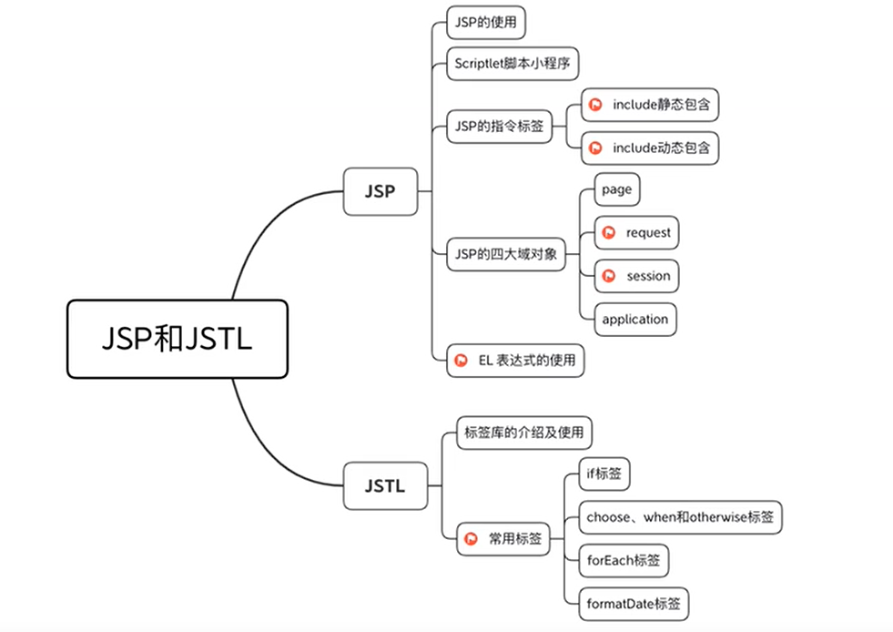

# JSP和JSTL

## 主要内容



## JSP

### JSP简介

* JSP: Java Server Page SUN公司提供的动态网页编程技术，是Java Web 服务器端的动态资源。
* 它相比 html而言，html只能为用户提供静态数据，而Jsp技术允许在页面中嵌套java代码
* 为用户提供动态数据。
* 相比 servlet而言，servlet很难对数据进行排版，而jsp除了可以用java代码产生动态数据的同时，也很容易对数据进行排版。
* 不管是JSP还是 Servlet，虽然都可以用于开发动态web资源。但由于这2门技术各自的特点，在长期的软件实践中，人们逐渐把 servlet作为web应用中的控制器组件来使用，而把JSP技术作为数据显示模板来使用。
* 其实Jsp就是一个Servlet，当我们第一次访问Jsp的时候，Jsp引擎都会将这个Jsp翻译成一个Servlet，这个文件存放在tomcat（源码目录)中的work目录中。

### jsp特点

* JSP 具有 Servlet 的所有优点，例如 JSP 文件跨平台，即一次编写，处处运行。
* JSP 比 CGI 性能更加优越，因为 JSP 可以直接在 HTML 中嵌入标签，而 CGI 需要单独引用 CGI 文件。
* JSP 比 Servlet 更易于维护，JSP 将业务逻辑与网页设计分离，使其更加灵活。
* 使用 JSP，Web 开发人员可以更注重于网页设计，Java 开发人员可以更注重于逻辑处理。

### JSP对比Servlet

| Servlet                                                 | JSP                                     |
| ------------------------------------------------------- | --------------------------------------- |
| Servlet在java中添加HTML代码                             | JSP在HTML内添加java代码                 |
| Servlet是一个java程序，支持HTML标签                     | JSP是一种HTML代码，支持Java语句         |
| Servlet一般用于开发程序的业务层（做一些复杂的逻辑处理） | JSP一般用于开发程序的表示层（显示数据） |
| Servlet由Java开发人员创建和维护                         | JSP常用于页面设计，由Web开发人员使用    |

### JSP生命周期

#### JSP编译

当浏览器请求 JSP 时，JSP 容器会首先检查是否需要编译页面。如果该页面从未被编译过，或者自上次编译以来对其进行了修改，则编译该页面

编译过程包括 3 个步骤：

* 解析/检查 JSP：JSP 容器解析 JSP 文件，查看是否有语法错误
* 翻译 JSP：JSP 容器把 JSP 文件翻译为 Servlet 类
* 编译 Servlet

#### JSP初始化

当容器加载 JSP 时，它将在处理任何请求之前调用 jspInit() 方法。如果您需要自定义 JSP 的初始化内容，可以重写 jspInit() 方法。

#### JSP执行

JSP 页面完成初始化后，JSP 将会调用 _jspService() 方法。

#### JSP销毁

* 调用jspDestory()方法
* jspDestroy() 方法等效于 Servlet 中的 destroy() 方法。如果您需要自定义 JSP 的销毁内容，可以重写 jspDestroy() 方法。

### 注释

```html
显示注释
<!--html风格的注释-->

隐式注释
//单行注释，/*多行注释*/
<%--jsp注释--%>
```

### Scriptlet

在JSP中最重要的部分就是Scriptlet(脚本小程序)，所有嵌入在HTML代码中的Java程序。在JSP中一共有三种Scriptlet 代码:都必须使用Scriptlet标记出来

```java
第一种:<%  %> java 脚本段，可以定义局部变量、编写语句
第二种:<%! %>:声明,可以定义全局(成员)变量、方法、类
第三种:<%= %>:表达式,数据一个变量或具体内容


<%-- 源码中是在servlet的类体中 --%>
<%! 
  String quanju = "全局变量"; 
%>
<%-- 源码中是在servlet的方法中 --%>
<% 
  String jubu = "局部变量"; 
  System.out.printf("这是脚本段读取了全局变量和全局变量");
  out.print(jubu);
  out.print(quanju);
%>
<%-- 源码中是在servlet的类体中，相当于out.print(jubu); --%>
<%=quanju %>
```

### 指令标签

JSP 指令（directive）用来告诉 Web 服务器如何处理 JSP 页面的请求和响应

| 指 令             | 说 明                                                  |
| ----------------- | ------------------------------------------------------ |
| <%@ page … %>    | 定义与页面相关的属性，例如脚本语言、错误页面和缓冲要求 |
| <%@ include … %> | 引入其它 JSP 文件                                      |
| <%@ taglib … %>  | 声明并导入标签库                                       |

#### Page指令

page指令通常放在jsp文件的顶部，也可以是任意的位置

| 属 性        | 取 值                                                          | 说 明                                                       | 举 例                                                                                        |
| ------------ | -------------------------------------------------------------- | ----------------------------------------------------------- | -------------------------------------------------------------------------------------------- |
| buffer       | none、缓冲区大小（默认值为 8kb）                               | 指定输出流是否有缓冲区                                      | <%@ page buffer=“16kb” %>                                                                  |
| autoFlush    | true（默认值）、false                                          | 指定缓冲区是否自动清除                                      | <%@ page autoFlush=“true” %>                                                               |
| contentType  | text/html; charset = ISO-8859-1、 text/xml；charset = UTF-8 等 | 指定 MIME 类型和字符编码                                    | <%@ page contentType=“text/html;charset=UTF-8” %>                                          |
| errorpage    | 页面路径                                                       | 指定当前 JSP 页面发生异常时，需要重定向的错误页面           | <%@ page errorPage=“myerrorpage.jsp” %> 注意：myerrorpage.jsp 的 isErrorpage 值必须为 true |
| isErrorPage  | true、false（默认值）                                          | 指定当前页面为错误页面                                      | <%@ page isErrorPage=“true” %>                                                             |
| extends      | 包名.类名                                                      | 指定当前页面继承的父类，一般很少使用                        | <%@ page extends=“mypackage.SampleClass”%>                                                 |
| import       | 类名、接口名、包名                                             | 导入类、接口、包，类似于 Java 的 import 关键字              | <％@ page import = " java.util.Date" ％> <%@ page import=“java.io.*, java.lang.* ”%>     |
| info         | 页面的描述信息                                                 | 定义 JSP 页面的描述信息，可以使用 getServletInfo() 方法获取 | <%@ page info=“这里是编程帮的页面信息”%>                                                   |
| isThreadSafe | true（默认值）、false                                          | 是否允许多线程使用                                          | <%@ page isThreadSafe=“false” %>                                                           |
| language     | 脚本语言                                                       | 指定页面中使用的脚本语言                                    | <%@ page language= “java” %>                                                               |
| session      | true（默认值）、false                                          | 指定页面是否使用 session                                    | <%@ page session=“false” %>                                                                |
| isELIgnored  | true（默认值）、false                                          | 指定页面是否忽略 JSP 中的 EL                                | <%@ page isELIgnored=“false” %>                                                            |

#### include指令

使用包含操作，可以将一些重复的代码包含进来继续使用，从正常的页面组成来看，有时可能分为几个区域。而其中的一些区域可能是一直不需要改变的，改变的就其中的一个具体内容区域。现在有两种方法可以实现上述功能。

1. 方法一:在每个JSP页面（HTML)都包含工具栏、头部信息、尾部信息、具体内容
2. 方法二:将工具栏、头部信息、尾部信息都分成各个独立的文件，使用的时候直接导入

   很明显，第二种方法比第一种更好，第一种会存在很多重复的代码，并且修改很不方便，在JSP中如果要想实现包含的操作，有两种做法:静态包含、动态包含，静态包含使用include 指令即可，动态包含则需要使用include动作标签。

##### include 静态包含

```html
<@include file="include.jsp"%>
或
<@include file="include.html">
```

1. 静态包含就是将内容进行了直接的替换，就好比程序中定义的变量一样是在servlet 引擎转译时，就把此文件内容包含了进去（两个文件的源代码整合到一起，全部放到_jspService方法中)
2. **只生成了一个servlet**
3. 两个页面**不能有同名的变量**。
4. 运行效率高一点点。但耦合性较高，不够灵活。

#### taglib指令

在 JSP 中，我们可以使用 taglib 指令声明并引入标签库。Java API 允许在页面中自定义标签，标签库就是自定义标签的集合

```html
<%@ page language="java" contentType="text/html; charset=UTF-8"
pageEncoding="UTF-8"%>
<%@ taglib uri="http://www.biancheng.net/tags" prefix="mytag"%>
<!DOCTYPE html>
<html>
<body>
    <mytag:currentDate />
</body>
</html>

```

### JSP动作

JSP 动作使用 XML 语法格式的标签来控制服务器的行为。利用 JSP 动作可以动态地插入文件、重用 JavaBean 组件、把用户重定向到另一个页面、为 Java 插件生成 HTML 代码等。

#### JSP动作与JSP指令的区别

JSP 动作与 JSP 指令的不同之处如下：

* JSP 指令在翻译阶段执行，从而设置整个 JSP 页面的属性。JSP 页面被执行时首先进入翻译阶段，程序会先查找页面中的 JSP 指令，并将它们转换成 Servlet。所以，JSP 指令是在页面转换时期被编译执行的，且编译一次。
* JSP 动作在请求处理阶段执行，它们只有执行时才实现自己的功能。通常用户每请求一次，动作标识就会执行一次。

```html
<jsp:action_name attribute="value"/>
或者
<jsp:action_name attribute="value"></jsp:action_name>

```

#### 常用的JSP动作

| 动作            | 说明                           |
| --------------- | ------------------------------ |
| jsp:include     | 页面被请求时引入一个文件       |
| jsp:userBean    | 实例化JavaBean                 |
| jsp:setProperty | 设置 JavaBean 的属性           |
| jsp:getProperty | 获取 JavaBean 的属性           |
| jsp:forward     | 将请求转发到另一个页面         |
| jsp:plugin      | 根据浏览器类型替换成 或者 标签 |
| jsp:element     | 定义动态 XML 元素              |
| jsp:attribute   | 设置动态 XML 元素的属性        |
| jsp:body        | 设置动态 XML 元素的内容        |

#### include 动态包含

动态包含在代码的编译阶段，包含和被包含部分是两个独立的部分，只有当运行时，才会动态包含进来，好比方法的调用。

注意:动态包含标签，中间不要加任何内容，包括空格，除非确认要使用参数，否则报错!

```html
<jsp:include page="include.html"></jsp:include>
<%
     string a = "hello.jsp";
%>
<jsp:include page="<%=a %>"></jsp:include>

<jsp:include page="buttom.jsp">
  <%-- name不支持表达式，value支持表达式 --%>
  <jsp:param name="name" value="zhangsan"/>
  <jsp:param name="pwd" value="<%=pwd%>"/>
</jsp:include>

<%-- 被跳转的页面 --%>
<% request.getParameter(name); %>
```

1. 动态包含相当于方法的调用
2. 动态包含会产生多个源码文件
3. 可以定义同名变量
4. 效率高，耦合低

#### forward动作

* 使用forwar可以将请求转发给另一个页面，请求的参数数据会被一起转发
* 转发后，浏览器地址栏显示的仍是当前页面的地址，具有很好的隐蔽性

```html
<jsp:forward page="URL" />
```

#### useBean动作

jsp:useBean 用于获取 Bean 对象。jsp:useBean 首先会在指定范围内查找 Bean 对象，如果 Bean 对象不存在，则创建 Bean 对象

```html
<jsp:useBean id = "name" class = "package.class" scope= "page | request | session | application" />
```

* id：表示Bean实例化对象的变量名，可以在指定范围内使用
* class：表示需要实例化Bean的类路径，指定的类必须包含public且无参的构造方法
* scope：指定Bean的作用域
  * Page：只能在当前页面使用该Bean对象
  * request：只能在一次请求范围内使用该Bean对象
  * session：只能在一次会话范围内使用
  * application：可以在整个应用范围内使用

#### setProperty和getProperty动作

jsp:getProperty 动作用于获取 Bean 的属性值，jsp:setProperty 动作用于设置 Bean 的属性值。

##### setProperty

**语法格式：**

```html
<jsp:setProperty name="BeanName" property="attributeName" vanlue="attributeValue" />

只有 jsp:useBean 实例化了 User 对象，jsp:setProperty 才会执行。
<jsp:useBean id = "User" ...>
    ...
    <jsp:setProperty name = "User" property = "attributeName" value = "attributeValue"/>
</jsp:useBean>

无论 jsp:useBean 是否实例化了 User 对象，jsp:setProperty 都会执行。
<jsp:useBean id="User" />
<jsp:setProperty name="User" property="attributeName" value="attributeValue" />
```

##### getProperty

```html
会在页面直接输出
<jsp:getProperty name="beanName" property="attributeName" />
```

jsp:setProperty 和 jsp:getProperty 动作都会按照 page、request、session 和 application 的顺序依次查找指定 Bean 的实例对象，直到第一个实例被找到。如果任何范围内都不存在这个 Bean 实例，则会拋出异常。注：要重写类的get和set方法

### JSP内置对象

#### **jsp有九个内置对象**

| 对 象                                                    | 类型                                   | 说 明                                                                                                                                            |
| -------------------------------------------------------- | -------------------------------------- | ------------------------------------------------------------------------------------------------------------------------------------------------ |
| [request](http://c.biancheng.net/jsp2/request.html)         | javax.servlet.http.HttpServletRequest  | 获取用户请求信息                                                                                                                                 |
| [response](http://c.biancheng.net/jsp2/response.html)       | javax.servlet.http.HttpServletResponse | 响应客户端请求，并将处理信息返回到客户端                                                                                                         |
| [out](http://c.biancheng.net/jsp2/out.html)                 | javax.servlet.jsp.JspWriter            | 输出内容到 HTML 中                                                                                                                               |
| [session](http://c.biancheng.net/jsp2/session.html)         | javax.servlet.http.HttpSession         | 用来保存用户信息                                                                                                                                 |
| [application](http://c.biancheng.net/jsp2/application.html) | javax.servlet.ServletContext           | 所有用户共享信息                                                                                                                                 |
| [config](http://c.biancheng.net/jsp2/config.html)           | javax.servlet.ServletConfig            | 这是一个 Servlet 配置对象，用于 Servlet 和页面的初始化参数                                                                                       |
| [pageContext](http://c.biancheng.net/jsp2/pagecontext.html) | javax.servlet.jsp.PageContext          | JSP 的页面容器，用于访问 page、request、application 和 session 的属性                                                                            |
| [page](http://c.biancheng.net/jsp2/page_object.html)        | javax.servlet.jsp.HttpJspPage          | 类似于 Java 类的 this 关键字，表示当前 JSP 页面                                                                                                  |
| [exception](http://c.biancheng.net/jsp2/page.html)          | java.lang.Throwable                    | 该对象用于处理 JSP 文件执行时发生的错误和异常；只有在 JSP 页面的 page 指令中指定 isErrorPage 的取值 true 时，才可以在本页面使用 exception 对象。 |

#### **四个域对象**

pageContext、request、session、application

| 作用域      | 描述                                                          | 作用范围                                                                                                          |
| ----------- | ------------------------------------------------------------- | ----------------------------------------------------------------------------------------------------------------- |
| page        | 如果把属性保存到 pageContext 中，则它的作用域是 page。        | 该作用域中的属性只在当前 JSP 页面有效，跳转页面后失效。                                                           |
| request     | 如果把属性保存到 request 中，则它的作用域是 request。         | 该作用域中的属性只在当前请求范围内有效。服务器跳转页面后有效，例如jsp:forward；客户端跳转页面后无效，例如超链接。 |
| session     | 如果把属性保存到 session 中，则它的作用域是 session。         | 该作用域中的属性只在当前会话范围内有效，网页关闭后失效。                                                          |
| application | 如果把属性保存到 application 中，则它的作用域是 application。 | 该作用域中的属性在整个应用范围内有效，服务器重启后失效。                                                          |

#### request域对象

主要用来获取客户端提交的数据。

| 方法                                        | 说明                                                                                     |
| ------------------------------------------- | ---------------------------------------------------------------------------------------- |
| String getParameter(String name)            | 获取请求参数 name 的值                                                                   |
| Enumeration getParameterNames()             | 获取所有参数名称                                                                         |
| String[] getParameterValues(String name)    | 获取请求参数 name 的所有值                                                               |
| Object getAttribute(String name)            | 获取 name 属性的值                                                                       |
| Enumeration getAttributeNames()             | 返回所有属性的名称集合                                                                   |
| void setAttribute(String key, Object value) | 给 key 对象赋 value 值                                                                   |
| void removeAttribute(String name)           | 删除指定的 name 属性                                                                     |
| cookie[] getCookies()                       | 获取所有的 cookie 对象                                                                   |
| HttpSession getSession()                    | 返回 request 对应的 session 对象，如果没有则创建一个 session 对象                        |
| HttpSession getSession(boolean create)      | 返回 request 对应的 session 对象，如果没有，且 create 值为 true，则创建一个 session 对象 |
| Enumeration getHeaderNames()                | 返回 HTTP 头信息的名称集合                                                               |
| String getHeader(String name)               | 获取 name 指定的 HTTP 头信息                                                             |
| String getMethod()                          | 获取 HTTP 请求方法/客户提交信息方式                                                      |

#### Response对象

response 对象和 request 对象相对应，主要用于响应客户端请求，将处理信息返回到客户端。

| 方 法                                     | 说 明                          |
| ----------------------------------------- | ------------------------------ |
| void addHeader(String name, String value) | 添加头信息（参数名称和对应值） |
| void addCookie(Cookie cookie)             | 添加 cookie 信息               |
| void sendRedirect(String location)        | 实现页面重定向                 |
| void setStatus(int sc)                    | 实现页面的响应状态代码         |
| void setContentType(String type)          | 设置页面的 MIME 类型和字符集   |
| void setCharacterEncoding(String charset) | 设定页面响应的编码类型         |

#### out对象

out 对象包含了很多 IO 流中的方法和特性，最常用的就是输出内容到 HTML 中。

| 方法                  | 说明                                              |
| --------------------- | ------------------------------------------------- |
| void print()          | 将内容直接打印在 HTML 标签中                      |
| void println()        | 类似于 print，唯一区别是 println 方法添加了换行符 |
| void newLine()        | 输出换行字符                                      |
| void clear()          | 清除页面缓冲区                                    |
| boolean isAutoFlush() | 检查页面是否自动清除缓冲区                        |

#### session对象

主要用来访问用户数据，记录客户的连接信息

| 方法                                         | 说明                                                                                          |
| -------------------------------------------- | --------------------------------------------------------------------------------------------- |
| void setAttribute(String name, Object value) | 将参数名和参数值存放在 session 对象中                                                         |
| Object getAttribute(String name)             | 通过 name 返回获取相应的 value 值，如果 name 没有相应的 value 值，则返回 null                 |
| void removeAttribute(String name)            | 删除指定的 name 参数                                                                          |
| Enumeration getAttributeNames()              | 获取 session 对象中存储的所有参数                                                             |
| long getCreationTime()                       | 返回 session 对象创建的时间                                                                   |
| String getId()                               | 获取 session 对象的 ID 值                                                                     |
| boolean isNew()                              | 用于检查 session 对象是不是新对象，如果客户端禁用了 cookie ，则 session.isNew() 始终返回 true |
| void invalidate()                            | 终止 session，即指定 session 对象失效                                                         |
| void setMaxInactiveInterval()                | 设置 session 对象的有效时间，单位：秒                                                         |
| int getMaxInactiveInterval()                 | 获取 session 对象的有效时间，单位：秒                                                         |
| long getLastAccessedTime()                   | 获取上次访问 session 对象的时间                                                               |

#### application对象

在服务器部署应用和项目时，Web 容器仅创建一次 ServletContext 实例，也就是说 application 设置的任何属性和值可以用于整个应用（所有 JSP 页面）。可以将 application 对象看作 Web 应用的全局变量。一般用于保存应用程序的公用数据。

| 方 法                                                  | 说 明                                            |
| ------------------------------------------------------ | ------------------------------------------------ |
| Object getAttribute(String attributeName)              | 获取 attributeName（属性名称）对应的 object      |
| void setAttribute(String attributeName, Object object) | 设置 attributeName 对应的属性值                  |
| Enumeration getAttributeNames()                        | 返回 application 对象中所有的 attributeName      |
| void removeAttribute(String objectName)                | 删除 application 对象中指定 attributeName 的属性 |
| String getServerInfo()                                 | 获取当前 Servlet 的版本信息                      |
| String getRealPath(String value)                       | 获取指定文件的实际路径                           |

#### config对象

一般用于获取页面和 Servlet 的初始化参数。

| 方法                                      | 说明                                                         |
| ----------------------------------------- | ------------------------------------------------------------ |
| String getInitParameter(String paramname) | 获取指定的初始化参数值                                       |
| Enumeration getInitParameterNames()       | 获取当前页面所有的初始化参数值                               |
| ServletContext getServletContext()        | 获取当前执行 Servlet 的 servletContext（Servlet 上下文）的值 |
| String getServletName()                   | 获取当前执行 Servlet 的名称                                  |

#### pageContext对象

pageContext 对象表示整个 JSP 页面，可以获取或删除request、page、session、application对象的任意属性

| 方 法                                                                     | 说 明                                                                                                            |
| ------------------------------------------------------------------------- | ---------------------------------------------------------------------------------------------------------------- |
| Object findAttribute (String AttributeName)                               | 按 page、request、session、application 的顺序查找指定的属性，并返回对应的属性值。如果没有相应的属性，则返回 NULL |
| Object getAttribute (String AttributeName, int Scope)                     | 在指定范围内获取属性值。与 findAttribute 不同的是，getAttribute 需要指定查找范围                                 |
| void removeAttribute(String AttributeName, int Scope)                     | 在指定范围内删除某属性                                                                                           |
| void setAttribute(String AttributeName, Object AttributeValue, int Scope) | 在指定范围内设置属性和属性值                                                                                     |
| Exception getException()                                                  | 返回当前页的 Exception 对象                                                                                      |
| ServletRequest getRequest()                                               | 返回当前页的 request 对象                                                                                        |
| ServletResponse getResponse()                                             | 返回当前页的 response 对象                                                                                       |
| ServletConfig getServletConfig()                                          | 返回当前页的 ServletConfig 对象                                                                                  |
| HttpSession getSession()                                                  | 返回当前页的 session 对象                                                                                        |
| Object getPage()                                                          | 返回当前页的 page 对象                                                                                           |
| ServletContext getServletContext()                                        | 返回当前页的 application 对象                                                                                    |

#### Page对象

page 对象是指当前的 JSP 页面本身，在实际开发中并不常用。

| 方 法                      | 说 明                        |
| -------------------------- | ---------------------------- |
| class getClass()           | 返回当前页面所在类           |
| int hashCode()             | 返回当前页面的 hash 代码     |
| String toString()          | 将当前页面所在类转换成字符串 |
| boolean equals(Object obj) | 比较对象和指定的对象是否相等 |
| void copy (Object obj)     | 把对象复制到指定的对象中     |
| Object clone()             | 复制对象                     |

### JSP Cookie

* Cookie 不是 JSP 内置对象，而是由 Netscape 公司发明，用来跟踪用户会话（session）的方式。
* Cookie 由服务器生成并发送给浏览器（客户端），浏览器会将其以文本文件的形式存储在某个目录下。

**识别用户通常有以下步骤：**

1. 服务器把 cookie 信息发送到浏览器，例如：用户 ID、用户名称等信息。
2. 浏览器在本地存储这些信息。
3. 浏览器再次向服务器发送请求时，它会同时将本地存储的 cookie 信息一同发送给服务器，然后服务器使用这些信息来识别用户或其它。

**cookie 的作用表现在以下方面：**

* 对特定对象的追踪，如用户的访问次数、最后访问时间等。
* 统计网页的浏览次数。
* 在 cookie 有效期内，记录用户的登录信息，简化下一次的登录过程。
* 实现各种个性化服务，如”最近浏览过的商品“。

**Cookie常用方法：**

| 方法                                   | 说明                                                                     |
| -------------------------------------- | ------------------------------------------------------------------------ |
| public void setDomain(String pattern)  | 设置 cookie 的域名，如 biancheng.net                                     |
| public String getDomain()              | 获取 cookie 的域名                                                       |
| public void setMaxAge(int expiry)      | 设置 cookie 有效期，单位：秒 默认仅在当前会话中存在                      |
| public int getMaxAge()                 | 获取 cookie 有效期，单位：秒 默认为 -1，表示 cookie 保存到浏览器关闭为止 |
| public String getName()                | 返回 cookie 的名称，名称创建后将不能被修改                               |
| public void setValue(String newValue)  | 设置 cookie 的值                                                         |
| public String getValue()               | 获取 cookie 的值                                                         |
| public void setPath(String uri)        | 设置 cookie 的路径 默认为当前页面目录以及子目录下的所有 URL              |
| public String getPath()                | 获取 cookie 的路径                                                       |
| public void setSecure(boolean flag)    | 设置 cookie 是否要加密传输                                               |
| public void setComment(String purpose) | 设置 cookie 注释                                                         |
| public String getComment()             | 返回 cookie 注释，如果 cookie 没有注释，则返回 null                      |

#### 创建cookie对象

```java
cookie cookieName = new cookie(String name,String value);
1
```

#### 写入cookie

```jsp
response.add(cookieName);
1
```

#### 设置cookie有效期

```jsp
cookie.setMaxAge(60*60*24);
1
```

#### 读取cookie

```jsp
request.getCookies();
1
```

注：对cookie进行设置操作后，需要重新写入response请求头中

### EL表达式

EL表达式可以简化JSP繁琐的语法，更方便阅读

```html
${EL表达式}
```

1. EL表达式一般操作的都是域对象中的数据，操作不了局部变量。
2. 域对象的概念在JSP中一共有四个: pageContext, request,session, application;范围依次是，本页面，一次请求，一次会话，整个应用程序。
3. 当需要指定从某个特定的域对象中查找数据时可以使用四个域对象对应的空间对象，分别是: pageScope,requestScope, sessionScope, applicationScope。
4. 而EL默认的查找方式为从小到大查找，找到即可。

#### EL内置对象

| 内置对象         | 说明                                                                          |
| ---------------- | ----------------------------------------------------------------------------- |
| pageScope        | 获取 page 范围的变量                                                          |
| requestScope     | 获取 request 范围的变量 相当于request.getAttribute                            |
| sessionScope     | 获取 session 范围的变量                                                       |
| applicationScope | 获取 application 范围的变量                                                   |
| param            | 相当于 request.getParameter(String name)，获取单个参数的值                    |
| paramValues      | 相当于 request.getParameterValues(String name)，获取参数集合中的变量值        |
| header           | 相当于 request.getHeader(String name)，获取 HTTP 请求头信息                   |
| headerValues     | 相当于 request.getHeaders(String name)，获取 HTTP 请求头数组信息              |
| initParam        | 相当于 application.getInitParameter(String name)，获取 web.xml 文件中的参数值 |
| cookie           | 相当于 request.getCookies()，获取 cookie 中的值                               |
| pageContext      | 表示当前 JSP 页面的 pageContext 对象                                          |

```html
页面一 父
<%
  pageContext.setAttribute("name", "page1");
  request.setAttribute("name", "page2"); 
  session.setAttribute("name", "page3"); 
  application.setAttribute("name", "page4"); 
%>
<form name="form1" method="post" action="paramtest.jsp">
   请输入用户姓名：<input type="text" name="username">
   <input type="submit" name="Submit" value="提交">
</form>

页面 （新窗口）
${pageScope.name} 空
${requestScope.name} 空
${sessionScope.name} 空
${applicationScope.name} page4
${param.name} 空


页面 （新页面）
${pageScope.name} 空
${requestScope.name} 空
${sessionScope.name} page3
${applicationScope.name} page4
${param.name} 空

页面 子（动态包含）
${pageScope.name} 空
${requestScope.name} page2
${sessionScope.name} page3
${applicationScope.name} page4
${param.name} 空

页面 子（静态包含）
${pageScope.name} page1
${requestScope.name} page2
${sessionScope.name} page3
${applicationScope.name} page4
${param.name} 空

页面跳转
${pageScope.name} 空
${requestScope.name} 空
${sessionScope.name} page3
${applicationScope.name} page4
//requestScope以request.getAttribute取值
${requestScope.username} 空
//requestScope以request.getParameter取值
${param.username} zhangsan


```

#### EL算术运算符

| EL算术运算符 | 说明 |
| ------------ | ---- |
| +            | 加   |
| -            | 减   |
| *            | 乘   |
| /或div       | 除   |
| %或mod       | 取模 |

注：如果+两边有字符串，EL表达式会将该字符串转换为数值进行运算，如果该字符串不能转换为数值类型，则会抛出异常

#### EL比较运算符

| EL比较运算符 | 说明     |
| ------------ | -------- |
| == 或 eq     | 等于     |
| != 或 ne     | 不等于   |
| < 或 lt      | 小于     |
| > 或 gt      | 大于     |
| <= 或 le     | 小于等于 |
| >= 或 ge     | 大于等于 |

#### EL逻辑运算符

| EL逻辑运算符 | 说明 |
| ------------ | ---- |
| && 或 and    | 与   |
| &或 and      | 或   |
| ! 或 not     | 非   |

#### 三目、empty、.和[ ]运算符

1. . 和 [ ]
   .和 [ ]是 EL 中最常用的运算符，用来访问 JavaBean 中的属性和隐式对象的数据。一般情况下，.用来访问 JavaBean 属性或 Map 类型的值，[ ]用来访问数组或者列表的元素。
   ```java
   <jsp:directive.page import="java.util.*" />
   <jsp:directive.page import="com.xxx.entry.*" />
   <%
     List<String> list = new ArrayList<>();
     list.add("aa1");
     list.add("aa2");
     list.add("aa3");
     request.setAttribute("list",list);

     Map map = new HashMap();
     map.put("col1","123");
     map.put("col2",123);
     map.put("col3",12.5);
     request.setAttribute("map",map);

     User user = new User();
     user.setName("aolig");
     user.setAge(12);
     request.setAttribute("user",user);
   %>
   ${list[0]}
   ${list.size()}

   ${map["col1"]}
   ${map.col1}

   ${user.getName()}
   ${user.age}
   ```
2. empty
   empty 用来判断 EL 表达式中的对象或者变量是否为空。若为空或者 null，返回 true，否则返回 false。
   ```java
   <body>
     <%
       request.setAttribute("msg","aoligei");
       request.setAttribute("msg1","");
       request.setAttribute("msg2",null);

       List<String> list1 = null;
       List<String> list2 = new ArrayList<>();
       List<String> list3 = new ArrayList<>();
       list3.add("aa1");
       request.setAttribute("list1",list1);
       request.setAttribute("list2",list2);
       request.setAttribute("list3",list3);

       Map map1 = null;
       Map map2 = new HashMap();
       Map map3 = new HashMap();
       map3.put("col1","123");
       request.setAttribute("map1",map1);
       request.setAttribute("map2",map2);
       request.setAttribute("map3",map3);

       User user1 = null;
       User user2 = new User();
       User user3 = new User();
       user3.setName("aolig");
       request.setAttribute("user1",user1);
       request.setAttribute("user2",user2);
       request.setAttribute("user3",user3);
     %>
     --无值即时空
     ${empty msg}
     ${empty msg1}
     ${empty msg2}
     ${empty msg3}
     <br>
     --无值即时空
     ${empty list1}
     ${empty list2}
     ${empty list3}
     <br>
     --无值即时空
     ${empty map1}
     ${empty map2}
     ${empty map3}
     <br>
     --只要有对象就不为空
     ${empty user1}
     ${empty user2}
     ${empty user3}
   </body>
   ```
3. 条件运算符
   EL 表达式中，条件运算符的语法和 Java 的完全一致：${条件表达式?表达式1:表达式2}

#### 运算符优先级（由高到低）

| 序号 | 优先级                       |
| ---- | ---------------------------- |
| 1    | [] .                         |
| 2    | ()                           |
| 3    | -（负）、not、! 、empty      |
| 4    | * 、 / 、 div 、% 、mod      |
| 5    | +、-（减）                   |
| 6    | <、>、<=、>=、lt、gt、le、ge |
| 7    | ==、!-、eq、ne               |
| 8    | &&、and                      |
| 9    | 或                           |
| 10   | ${A?B:C}                     |
