## **什么是 LDAP？**

**「轻量目录访问协议」** 。

划重点，LDAP  **「是一个协议」** ，约定了 Client 与 Server 之间的信息交互格式、使用的端口号、认证方式等内容。而  **「LDAP 协议的实现」** ，有着众多版本，例如微软的 **Active Directory** 是 LDAP 在 Windows 上的实现，AD 实现了 LDAP 所需的树形数据库、具体如何解析请求数据并到数据库查询然后返回结果等功能。再例如 OpenLDAP 是可以运行在 Linux 上的 LDAP 协议的开源实现。而我们平常说的 LDAP Server，一般指的是安装并配置了 Active Directory、OpenLDAP 这些程序的服务器。

## **LDAP 协议能解决什么问题？**

要说 LDAP 协议能解决什么问题，那不得不提 AD。AD 是 Windows 服务器上最强大的功能，AD 是基于 LDAP 协议的一套解决方案（LDAP 服务器 + 应用），解决了细粒度的权限控制。核心： **「谁 以什么权限 访问什么」** 。

### **用户服务**

管理用户的域账号、用户信息、企业通信录（与电子邮箱系统集成）、用户组管理、用户身份认证、用户授权管理、按需实施组管理策略等。在 Windows 下，有组策略管理器，如果启用域用户认证，那么这些组策略可以统一管理，方便地限制用户的权限。

### **计算机管理**

管理服务器及客户端计算机账户、所有服务器及客户端计算机加入域管理并按需实施组策略，甚至可以控制计算机禁止修改壁纸。（什么？给电脑重装系统就能解除限制？那么所有域上的资源都会无法访问了。）

### **资源管理**

管理打印机、文件共享服务、网络资源等实施组策略。

### **应用系统的支持**

对于电子邮件（Exchange）、在线及时通讯（Lync）、企业信息管理（SharePoint）、微软 CRM，ERP 等业务系统提供数据认证（身份认证、数据集成、组织规则等）。这里不单是微软产品的集成，其它的业务系统根据公用接口的方式一样可以嵌入进来。

## **为什么要用 LDAP 协议？**

历史原因，LDAP 协议诞生于 1988 年，比万维网的诞生还要早。1989 年英国科学家蒂姆·伯纳斯-李发明了万维网。因此沿用至今。

树形用户目录，树形存储结构，对组织管理建模符合直觉。

开放的标准化协议，受到广泛支持。

## **LDAP 拆而析之**

### **什么叫轻量？**

LDAP 协议之前有一个 X.500 DAP 协议规范，该协议十分复杂，是一个重量级的协议，后来对 X.500

进行了简化，诞生了 LDAP 协议，与 X.500 相比变得较为轻量。由 X.500 DAP -> LDAP，其实 LDAP 协议依然复杂。

### **什么叫目录？**

目录指的是用户目录，用户目录长这样：

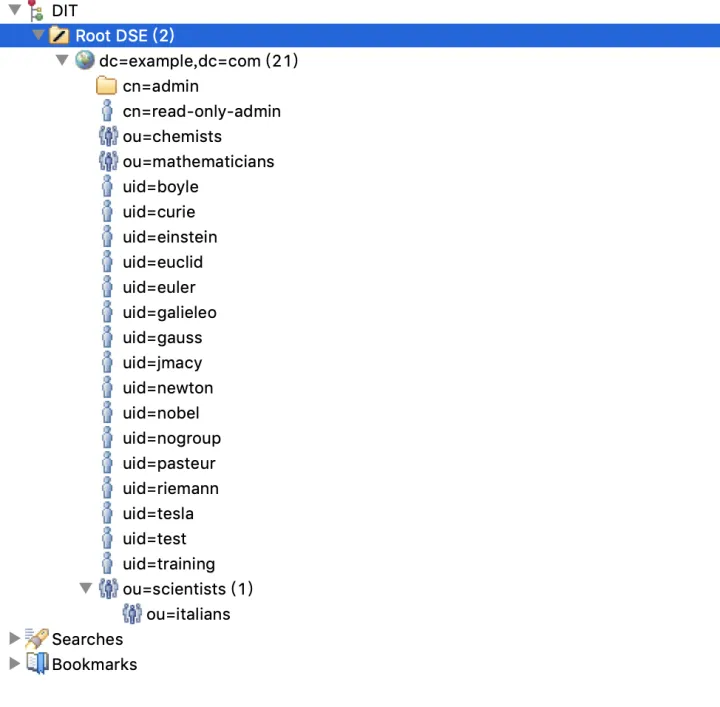

复杂一点的是这样：

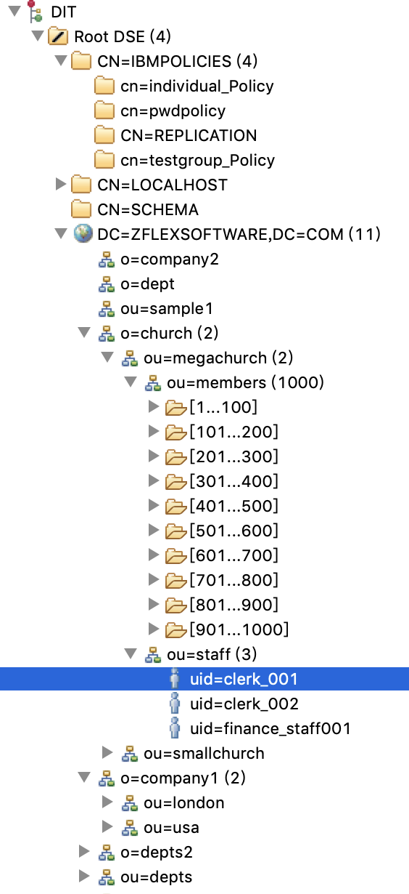

还有这样的：

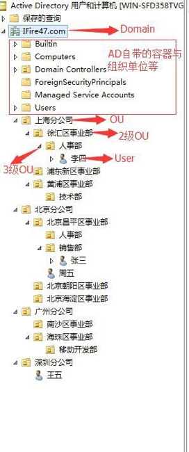

目录服务就是按照 **「树状」** 存储信息的模式。目录服务的数据类型主要是 **「字符型」** , 而不是关系数据库提供的整数、浮点数、日期、货币等类型。为了检索的需要添加了 BIN（二进制数据）、CIS（忽略大小写）、CES（大小写敏感）、TEL（电话型）等语法（Syntax）。同样也不提供象关系数据库中普遍包含的大量的函数。目录有很强的查询（读）功能，适合于进行大量数据的检索；但目录一般只执行简单的更新（写）操作，不支持批量更新所需要的事务处理功能；它主要面向数据的查询服务（查询和修改操作比一般是大于 10:1），不提供事务的回滚（rollback）机制；目录具有广泛复制信息的能力，适合于多个目录服务器同步/更新。

## **LDAP 数据库的信息组织形式**

目录服务的数据库以 **「树形方式」** 存储数据，也是一种 NoSQL。需要注意的是这是推荐的底层数据存储方式，因为目录服务查询比写入要多得多，所以使用树形数据库存储要有优势。但其实也可以使用 MySQL 或 MongoDB 这样的数据库 **「当做 LDAP 数据源」** 。LDAP 只是一个 **「协议」** ，约定的是 C/S 之间的通信方式。理论上服务器只要能够处理所有 LDAP 协议规定的操作，并返回正确的结果就可以。

## **专有名词解释**

在上面的用户目录中，有许多英文缩写。其实并不神秘，只是一些单词的缩写，接下来我们解释一些专有名词。在与 LDAP 打交道的过程中，这些名词一定会频繁遇到。

### **DIT（Directory Information Tree）目录信息树**

LDAP directory servers present data arranged in tree-like hierarchies in which each entry may have zero or more subordinate entries. This structure is called the Directory Information Tree, or DIT.

LDAP 目录服务器将信息以树形的方式组织，每一项都可以包含 0 个或多个子项。这样的结构叫做目录信息树。

目录信息树可以类比我们的 **「磁盘文件系统目录树」** ，上面的定义是官方定义，理解起来，DIT 就是指像文件系统一样的目录结构树。

### **Entry 项**

在用户目录中，你看到的每一行，都可以叫做一项，不论是叶子节点还是中间的节点。

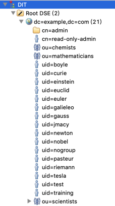

项包含一个 DN，一些属性，一些对象类。

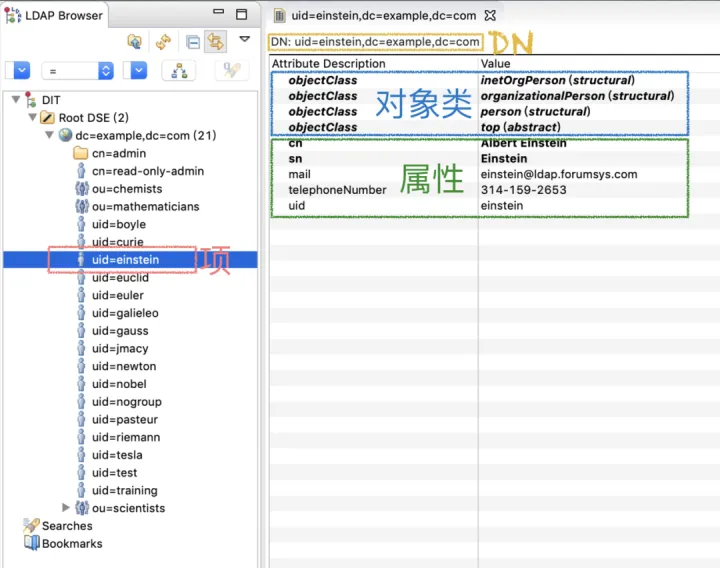

### **Root DSE（Root DSA-specific entry）根节点项**

每个 LDAP 服务器必须对外暴露一个特殊的 **「项」** ，叫做 root DSE，这个项的 DN 是空字符串。这个项是根节点，描述了 LDAP 服务器自身的信息和能力。例如你可以在下图看到 LDAP 服务器支持的功能，LDAP 协议版本等信息。

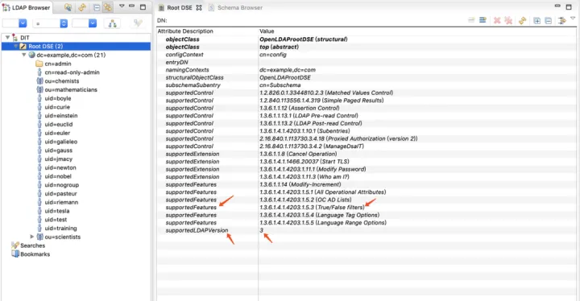

### **dn（Distinguished Name）分辨名**

dn 如下图白色方框中的内容， **「分辨名」** 用于唯一标识一个 **「项」** ，以及他在目录信息树中的位置。可以和文件系统中文件路径类比。类似于关系型数据库中的主键。dn 字符串从左向右，各组成部分依次向树根靠近。

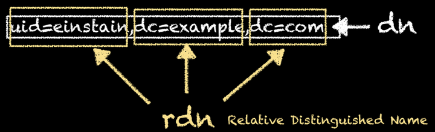

### **rdn（Relative Distinguished Name）相对分辨名**

Rdn 就是 **「键值对」** ，如下图黄色方框中的内容。dn 由若干个 rdn 组成，以逗号分隔。

### **dc（Distinguished Name）（域名组成）**

将 [http://**example.comexample.com**](https://link.zhihu.com/?target=http%3A//example.comexample.com) 这样的域名，拆成 dc=example,dc=com 这样的形式。

### **o（Organization）组织机构、公司**

在 dn 中可能会包含 o=公司 这样的组成部分，这里的 o 指代组织机构。

### **ou（Organization Unit）组织单元、部门**

在 dn 中可能会包含 ou=某某部门 这样的组成部分，这里的 ou 指代组织单元。

### **Object Classes**

每个 **「项」** 里面包含若干个 Object Classes，**「Object Class」** 指定了本项中必须、可能包含的 **「属性」** ，相当于 MySQL 中的建表语句。包含某个 Object Class 的项，必须满足 Object Class 中约定的规范。如下图，**「person objectClass」** 中规定了 cn 和 sn 属性必须存在，在这一 **「项」** 的属性中，你可以看到 cn 和 sn 被加粗显示了。

下图是 person Object class 的定义，规定了拥有此 Object class 的 **「项」** 需要拥有的属性：

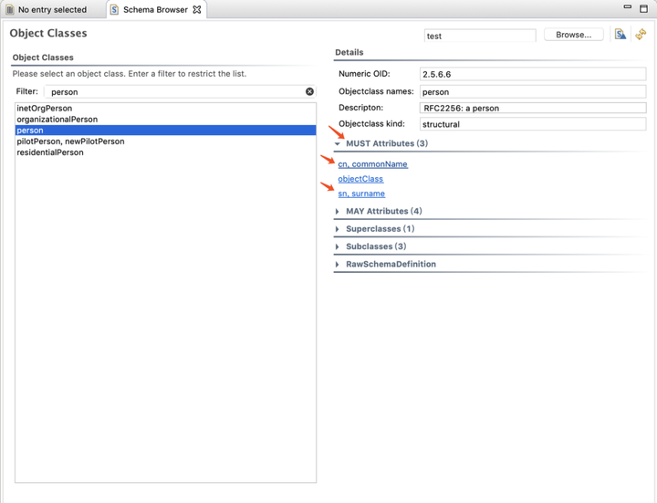

## **总结**

LDAP 协议是一个历史悠久的协议，诞生时间早于万维网。在当时商业数据库并不发达，而且当时商业数据库的驱动在多语言支持上也不友好——有可能这个数据库在你使用的编程语言上根本没有相关的开发包。LDAP 一直沿用至今，有很多的历史原因，因此许多应用都会支持通过 LDAP 登录。

LDAP 协议的用户目录是树形结构，天然与组织机构契合，而且在查询上速度非常快，比任何其他数据库都要快。

如果你想快速与 LDAP 服务器对接，不妨试一试试一试 Authing 的 LDAP 对接功能。

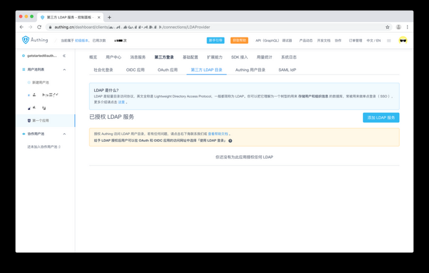

只要填好 LDAP 服务器的信息，然后点击保存。

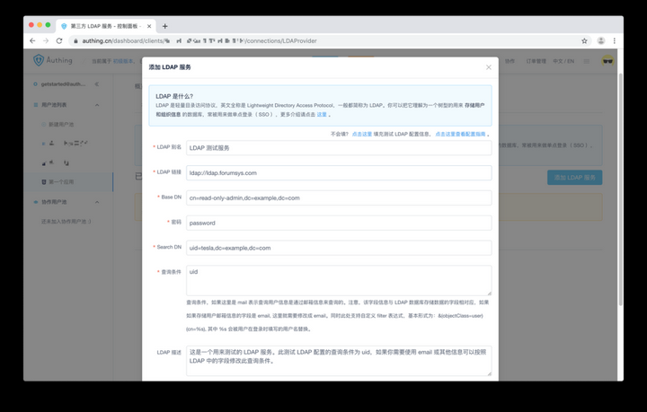

还能够方便地测试 LDAP 服务器的连通性和用户登录凭据的合法性。

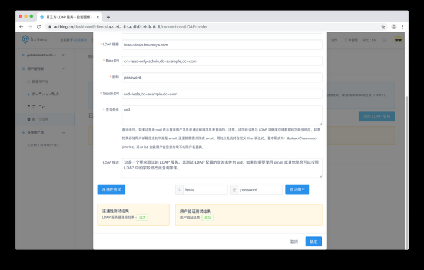

然后就可以使用 LDAP 进行登录了。

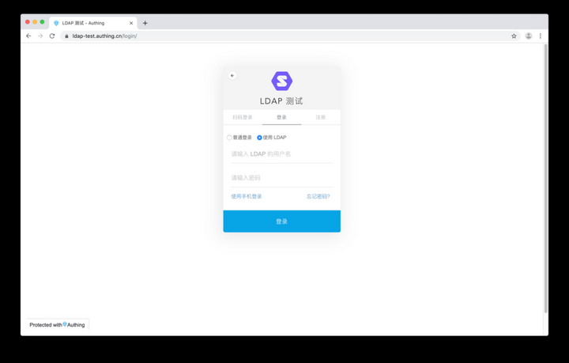
