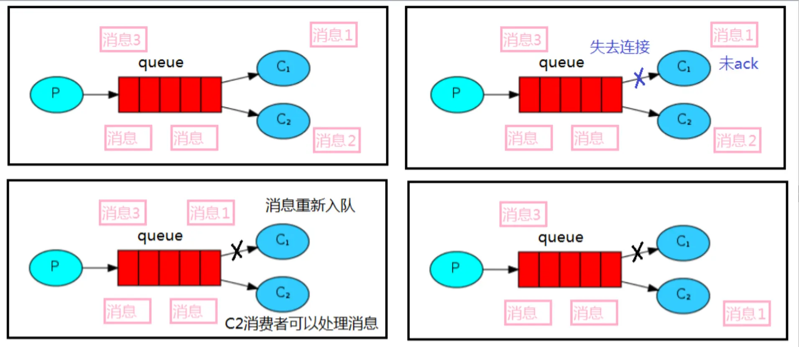
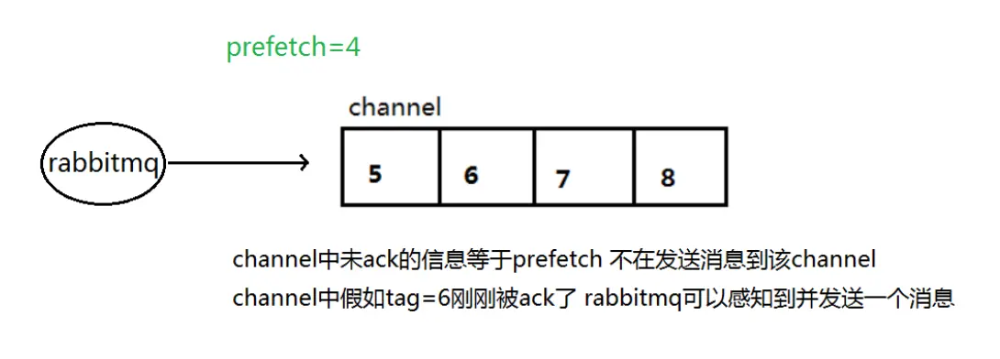

# RabbitMQ 消息应答与发布

## 消息应答

消费者完成一个任务可能需要一段时间，如果其中一个消费者处理一个长的任务并仅只完成了部分突然它挂掉了，会发生什么情况。RabbitMQ 一旦向消费者传递了一条消息，便立即将该消息标记为删除。在这种情况下，突然有个消费者挂掉了，我们将丢失正在处理的消息。以及后续发送给该消费者的消息，因为它无法接收到。

为了保证消息在发送过程中不丢失，引入消息应答机制，消息应答就是： =消费者在接收到消息并且处理该消息之后，告诉 rabbitmq 它已经处理了，rabbitmq 可以把该消息删除了。

### [#](https://frxcat.fun/middleware/RabbitMQ/RabbitMQ_Message_responseAndrelease/#%E8%87%AA%E5%8A%A8%E5%BA%94%E7%AD%94)自动应答

消息发送后立即被认为已经传送成功，这种模式需要在 **高吞吐量和数据传输安全性方面做权衡** ,因为这种模式如果消息在接收到之前，消费者那边出现连接或者 channel 关闭，那么消息就丢失了,当然另一方面这种模式消费者那边可以传递过载的消息， **没有对传递的消息数量进行限制** ，当然这样有可能使得消费者这边由于接收太多还来不及处理的消息，导致这些消息的积压，最终使得内存耗尽，最终这些消费者线程被操作系统杀死，**所以这种模式仅适用在消费者可以高效并以 某种速率能够处理这些消息的情况下使用。**

### [#](https://frxcat.fun/middleware/RabbitMQ/RabbitMQ_Message_responseAndrelease/#%E6%89%8B%E5%8A%A8%E6%B6%88%E6%81%AF%E5%BA%94%E7%AD%94%E7%9A%84%E6%96%B9%E6%B3%95)手动消息应答的方法

* `Channel.basicAck` (肯定确认应答)：

```java
basicAck(long deliveryTag, boolean multiple);
```

第一个参数是消息的标记，第二个参数表示是否应用于多消息，RabbitMQ 已知道该消息并且成功的处理消息，可以将其丢弃了

* `Channel.basicReject` (否定确认应答)

```java
basicReject(long deliveryTag, boolean requeue);
```

第一个参数表示拒绝 `deliveryTag` 对应的消息，第二个参数表示是否 `requeue`：true 则重新入队列，false 则丢弃或者进入死信队列。

该方法 reject 后，该消费者还是会消费到该条被 reject 的消息。

* `Channel.basicNack` (用于否定确认)：示己拒绝处理该消息，可以将其丢弃了

```java
basicNack(long deliveryTag, boolean multiple, boolean requeue);
```

第一个参数表示拒绝 `deliveryTag` 对应的消息，第二个参数是表示否应用于多消息，第三个参数表示是否 `requeue`，与 basicReject 区别就是同时支持多个消息，可以 拒绝签收 该消费者先前接收未 ack 的所有消息。拒绝签收后的消息也会被自己消费到。

* `Channel.basicRecover`

```java
basicRecover(boolean requeue);
```

是否恢复消息到队列，参数是是否 `requeue`，true 则重新入队列，并且尽可能的将之前 `recover` 的消息投递给其他消费者消费，而不是自己再次消费。false 则消息会重新被投递给自己。

**Multiple 的解释：**

手动应答的好处是可以批量应答并且减少网络拥堵

* true 代表批量应答 channel 上未应答的消息
  比如说 channel 上有传送 tag 的消息 5,6,7,8 当前 tag 是 8 那么此时 5-8 的这些还未应答的消息都会被确认收到消息应答
* false 同上面相比只会应答 tag=8 的消息 5,6,7 这三个消息依然不会被确认收到消息应答


### [#](https://frxcat.fun/middleware/RabbitMQ/RabbitMQ_Message_responseAndrelease/#%E6%B6%88%E6%81%AF%E8%87%AA%E5%8A%A8%E9%87%8D%E6%96%B0%E5%85%A5%E9%98%9F)消息自动重新入队

如果消费者由于某些原因失去连接(其通道已关闭，连接已关闭或 TCP 连接丢失)，导致消息未发送 ACK 确认，RabbitMQ 将了解到消息未完全处理，并将对其重新排队。如果此时其他消费者可以处理，它将很快将其重新分发给另一个消费者。这样，即使某个消费者偶尔死亡，也可以确保不会丢失任何消息。



### [#](https://frxcat.fun/middleware/RabbitMQ/RabbitMQ_Message_responseAndrelease/#%E6%89%8B%E5%8A%A8%E5%BA%94%E7%AD%94%E6%A1%88%E4%BE%8B)手动应答案例

默认消息采用的是自动应答，所以我们要想实现消息消费过程中不丢失，需要把自动应答改为手动应答

消费者启用两个线程，消费 1 一秒消费一个消息，消费者 2 十秒消费一个消息，然后在消费者 2 消费消息的时候，停止运行，这时正在消费的消息是否会重新进入队列，而后给消费者 1 消费呢？

* 工具类

```java
public class SleepUtils {
    public static void sleep(int second){
        try {
            Thread.sleep(1000*second);
        } catch (InterruptedException e) {
            Thread.currentThread().interrupt();
        }
    }
}
```

**消息生产者：**

```java
/**
 * @author frx
 * @version 1.0
 * @date 2022/7/24  12:15
 * desc:消息在手动应答是不丢失、放回队列中重新消费
 */
public class Task02 {

    //队列名称
    public static final String TASK_QUEUE_NAME = "ACK_QUEUE";

    public static void main(String[] args) throws IOException, TimeoutException {
        Channel channel = RabbitMQUtils.getChannel();

        //声明队列
        channel.queueDeclare(TASK_QUEUE_NAME,false,false,false,null);
        //在控制台中输入信息
        Scanner scanner = new Scanner(System.in);
        System.out.println("请输入信息：");
        while (scanner.hasNext()){
            String message = scanner.next();
            channel.basicPublish("",TASK_QUEUE_NAME,null,message.getBytes("UTF-8"));
            System.out.println("生产者发出消息:"+ message);
        }

    }

}
```

 **消费者 1：**

消费者在简单案例代码的基础上增加了以下内容

```java
channel.basicAck(delivery.getEnvelope().getDeliveryTag(), false);
// 采用手动应答
boolean autoAck = false;
channel.basicConsume(TASK_QUEUE_NAME, autoAck, deliverCallback, cancelCallback);
```

完整代码

```java
/**
 * @author frx
 * @version 1.0
 * @date 2022/7/24  12:29
 * desc:消息在手动应答是不丢失、放回队列中重新消费
 */
public class Work03 {

    //队列名称
    public static final String TASK_QUEUE_NAME = "ACK_QUEUE";

    //接受消息
    public static void main(String[] args) throws IOException, TimeoutException {
        Channel channel = RabbitMQUtils.getChannel();
        System.out.println("C1等待接受消息处理时间较短");

        DeliverCallback deliverCallback =(consumerTag,message) ->{

            //沉睡1S
            SleepUtils.sleep(1);
            System.out.println("接受到的消息:"+new String(message.getBody(),"UTF-8"));
            //手动应答
            /**
             * 1.消息的标记Tag
             * 2.是否批量应答 false表示不批量应答信道中的消息
             */
            channel.basicAck(message.getEnvelope().getDeliveryTag(),false);

        };

        CancelCallback cancelCallback = (consumerTag -> {
            System.out.println(consumerTag + "消费者取消消费接口回调逻辑");

        });
        //采用手动应答
        boolean autoAck = false;
        channel.basicConsume(TASK_QUEUE_NAME,autoAck,deliverCallback,cancelCallback);
    }
}
```

 **消费者 2：**

将 20 行代码的睡眠时间改为 10 秒：

```java
SleepUtils.sleep(10);
```

### [#](https://frxcat.fun/middleware/RabbitMQ/RabbitMQ_Message_responseAndrelease/#%E6%95%88%E6%9E%9C%E6%BC%94%E7%A4%BA)效果演示

正常情况下消息生产者发送两个消息， first 和 second 分别接收到消息并进行处理


当发送者发送消息 DD 到队列，此时是 second 来消费该消息，但是由于它处理时间较长，在还未处理完时间里停止运行，也就是说 second 还没有执行到 ack 代码的时候，second 被停掉了，此时会看到消息被 first 接收到了，说明消息 DD 被重新入队，然后分配给能处理消息的 first 处理了


## [#](https://frxcat.fun/middleware/RabbitMQ/RabbitMQ_Message_responseAndrelease/#rabbitmq%E6%8C%81%E4%B9%85%E5%8C%96)RabbitMQ持久化

当 RabbitMQ 服务停掉以后，消息生产者发送过来的消息不丢失要如何保障？默认情况下 RabbitMQ 退出或由于某种原因崩溃时，它忽视队列和消息，除非告知它不要这样做。确保消息不会丢失需要做两件事：**我们需要将队列和消息都标记为持久化。**

### [#](https://frxcat.fun/middleware/RabbitMQ/RabbitMQ_Message_responseAndrelease/#%E9%98%9F%E5%88%97%E6%8C%81%E4%B9%85%E5%8C%96)队列持久化

之前我们创建的队列都是非持久化的，RabbitMQ 如果重启的化，该队列就会被删除掉，如果要队列实现持久化需要在声明队列的时候把 durable 参数设置为true，代表开启持久化

在**消息生产者**开启持久化：

```java
public class Task02 {

    //队列名称
    public static final String TASK_QUEUE_NAME = "ACK_QUEUE";

    public static void main(String[] args) throws IOException, TimeoutException {
        Channel channel = RabbitMQUtils.getChannel();

        //开启持久化
        boolean durable = true;
        //声明队列
        channel.queueDeclare(TASK_QUEUE_NAME,durable,false,false,null);
        //在控制台中输入信息
        Scanner scanner = new Scanner(System.in);
        System.out.println("请输入信息：");
        while (scanner.hasNext()){
            String message = scanner.next();
            channel.basicPublish("",TASK_QUEUE_NAME,null,message.getBytes("UTF-8"));
            System.out.println("生产者发出消息:"+ message);
        }

    }
}
```

注意

如果之前声明的队列不是持久化的，需要把原先队列先删除，或者重新创建一个持久化的队列

不然就会出现如下错误：


### [#](https://frxcat.fun/middleware/RabbitMQ/RabbitMQ_Message_responseAndrelease/#%E6%B6%88%E6%81%AF%E6%8C%81%E4%B9%85%E5%8C%96)消息持久化

需要在**消息生产者**发布消息的时候，开启消息的持久化

在 basicPublish 方法的第二个参数添加这个属性： `MessageProperties.PERSISTENT_TEXT_PLAIN`,如 13 行代码

```java
public class Task02 {

    //队列名称
    public static final String TASK_QUEUE_NAME = "ACK_QUEUE";

    public static void main(String[] args) throws IOException, TimeoutException {
        Channel channel = RabbitMQUtils.getChannel();

        //队列持久化
        boolean durable = true;
        //声明队列
        channel.queueDeclare(TASK_QUEUE_NAME,durable,false,false,null);
        //在控制台中输入信息
        Scanner scanner = new Scanner(System.in);
        System.out.println("请输入信息：");
        while (scanner.hasNext()){
            String message = scanner.next();
        	//设置生产者发送消息为持久化消息(要求保存到磁盘上)
                        channel.basicPublish("",TASK_QUEUE_NAME,MessageProperties.PERSISTENT_TEXT_PLAIN,message.getBytes("UTF-8"));

            System.out.println("生产者发出消息:"+ message);
        }

    }
}
```

将消息标记为持久化并不能完全保证不会丢失消息。尽管它告诉 RabbitMQ 将消息保存到磁盘，但是这里依然存在当消息刚准备存储在磁盘的时候 但是还没有存储完，消息还在缓存的一个间隔点。此时并没 有真正写入磁盘。持久性保证并不强，但是对于我们的简单任务队列而言，这已经绰绰有余了。

## [#](https://frxcat.fun/middleware/RabbitMQ/RabbitMQ_Message_responseAndrelease/#%E4%B8%8D%E5%85%AC%E5%B9%B3%E5%88%86%E5%8F%91)不公平分发

### [#](https://frxcat.fun/middleware/RabbitMQ/RabbitMQ_Message_responseAndrelease/#%E4%BB%8B%E7%BB%8D)介绍

在最开始的时候我们学习到 RabbitMQ 分发消息采用的轮询分发，但是在某种场景下这种策略并不是很好，比方说有两个消费者在处理任务，其中有个**消费者 1** 处理任务的速度非常快，而另外一个**消费者 2** 处理速度却很慢，这个时候我们还是采用轮询分发的化就会到这处理速度快的这个消费者很大一部分时间处于空闲状态，而处理慢的那个消费者一直在干活，这种分配方式在这种情况下其实就不太好，但是 RabbitMQ 并不知道这种情况它依然很公平的进行分发。

为了避免这种情况， **在消费者们中消费消息之前** ，设置参数 `channel.basicQos(1);`

```java
public class Work03 {

    //队列名称
    public static final String TASK_QUEUE_NAME = "ACK_QUEUE";

    //接受消息
    public static void main(String[] args) throws IOException, TimeoutException {
        Channel channel = RabbitMQUtils.getChannel();
        System.out.println("C1等待接受消息处理时间较短");

        DeliverCallback deliverCallback =(consumerTag,message) ->{

            //沉睡1S
            SleepUtils.sleep(1);
            System.out.println("接受到的消息:"+new String(message.getBody(),"UTF-8"));
            //手动应答
            /**
             * 1.消息的标记Tag
             * 2.是否批量应答 false表示不批量应答信道中的消息
             */
            channel.basicAck(message.getEnvelope().getDeliveryTag(),false);

        };

        CancelCallback cancelCallback = (consumerTag -> {
            System.out.println(consumerTag + "消费者取消消费接口回调逻辑");

        });
        //设置不公平分发
        int prefetchCount = 1;
        channel.basicQos(prefetchCount);
        //采用手动应答
        boolean autoAck = false;
        channel.basicConsume(TASK_QUEUE_NAME,autoAck,deliverCallback,cancelCallback);
    }
}
```

开启成功，会看到如下结果：


不公平分发思想：如果一个工作队列还没有处理完或者没有应答签收一个消息，则不拒绝 RabbitMQ 分配新的消息到该工作队列。此时 RabbitMQ 会优先分配给其他已经处理完消息或者空闲的工作队列。如果所有的消费者都没有完成手上任务，队列还在不停的添加新任务，队列有可能就会遇到队列被撑满的情况，这个时候就只能添加新的 worker (工作队列)或者改变其他存储任务的策略。

### [#](https://frxcat.fun/middleware/RabbitMQ/RabbitMQ_Message_responseAndrelease/#%E6%95%88%E6%9E%9C%E6%BC%94%E7%A4%BA-2)效果演示

生产者生产多个消息，两个消费者的消费时间不同，则消费消息的次数也不同


## [#](https://frxcat.fun/middleware/RabbitMQ/RabbitMQ_Message_responseAndrelease/#%E9%A2%84%E5%8F%96%E5%80%BC%E5%88%86%E5%8F%91)预取值分发

### [#](https://frxcat.fun/middleware/RabbitMQ/RabbitMQ_Message_responseAndrelease/#%E4%BB%8B%E7%BB%8D-2)介绍

带权的消息分发

默认消息的发送是异步发送的，所以在任何时候，channel 上不止只有一个消息来自消费者的手动确认，所以本质上是异步的。因此这里就存在一个未确认的消息缓冲区，因此希望开发人员能 **限制此缓冲区的大小** ， **以避免缓冲区里面无限制的未确认消息问题** 。这个时候就可以通过使用 `basic.qos` 方法设置「预取计数」值来完成的。

该值定义通道上允许的未确认消息的最大数量。一旦数量达到配置的数量， RabbitMQ 将停止在通道上传递更多消息，除非至少有一个未处理的消息被确认，例如，假设在通道上有未确认的消息 5、6、7，8，并且通道的预取计数设置为 4，此时 RabbitMQ 将不会在该通道上再传递任何消息，除非至少有一个未应答的消息被 ack。比方说 tag=6 这个消息刚刚被确认 ACK，RabbitMQ 将会感知这个情况到并再发送一条消息。消息应答和 QoS 预取值对用户吞吐量有重大影响。

通常，增加预取将提高向消费者传递消息的速度。 **虽然自动应答传输消息速率是最佳的，但是，在这种情况下已传递但尚未处理的消息的数量也会增加，从而增加了消费者的 RAM 消耗** (随机存取存储器)应该小心使用具有无限预处理的自动确认模式或手动确认模式，消费者消费了大量的消息如果没有确认的话，会导致消费者连接节点的内存消耗变大，所以找到合适的预取值是一个反复试验的过程，不同的负载该值取值也不同 100 到 300 范围内的值通常可提供最佳的吞吐量，并且不会给消费者带来太大的风险。

预取值为 1 是最保守的。当然这将使吞吐量变得很低，特别是消费者连接延迟很严重的情况下，特别是在消费者连接等待时间较长的环境 中。对于大多数应用来说，稍微高一点的值将是最佳的。



```java
public class Work03 {

    //队列名称
    public static final String TASK_QUEUE_NAME = "ACK_QUEUE";

    //接受消息
    public static void main(String[] args) throws IOException, TimeoutException {
        Channel channel = RabbitMQUtils.getChannel();
        System.out.println("C1等待接受消息处理时间较短");

        DeliverCallback deliverCallback =(consumerTag,message) ->{

            //沉睡1S
            SleepUtils.sleep(1);
            System.out.println("接受到的消息:"+new String(message.getBody(),"UTF-8"));
            //手动应答
            /**
             * 1.消息的标记Tag
             * 2.是否批量应答 false表示不批量应答信道中的消息
             */
            channel.basicAck(message.getEnvelope().getDeliveryTag(),false);

        };

        CancelCallback cancelCallback = (consumerTag -> {
            System.out.println(consumerTag + "消费者取消消费接口回调逻辑");

        });
        //设置不公平分发
        //int prefetchCount = 1;
        //值不等于 1，则代表预取值,预取值为4
        int prefetchCount = 4;
        channel.basicQos(prefetchCount);
        //采用手动应答
        boolean autoAck = false;
        channel.basicConsume(TASK_QUEUE_NAME,autoAck,deliverCallback,cancelCallback);
    }
}
```

笔记

不公平分发和预取值分发都用到 `basic.qos` 方法，如果取值为 1，代表不公平分发，取值不为1，代表预取值分发

### [#](https://frxcat.fun/middleware/RabbitMQ/RabbitMQ_Message_responseAndrelease/#%E6%95%88%E6%9E%9C%E6%BC%94%E7%A4%BA-3)效果演示

设置了预取值为 4。生产者发送 5 条消息到 MQ 中


## [#](https://frxcat.fun/middleware/RabbitMQ/RabbitMQ_Message_responseAndrelease/#%E5%8F%91%E5%B8%83%E7%A1%AE%E8%AE%A4)发布确认

生产者发布消息到 RabbitMQ 后，需要 RabbitMQ 返回「ACK（已收到）」给生产者，这样生产者才知道自己生产的消息成功发布出去。

## [#](https://frxcat.fun/middleware/RabbitMQ/RabbitMQ_Message_responseAndrelease/#%E5%8F%91%E5%B8%83%E7%A1%AE%E8%AE%A4%E9%80%BB%E8%BE%91)发布确认逻辑

生产者将信道设置成 confirm 模式，一旦信道进入 confirm 模式，所有在该信道上面发布的消息都将会被指派一个唯一的 ID(从 1 开始)，一旦消息被投递到所有匹配的队列之后，broker 就会发送一个确认给生产者(包含消息的唯一 ID)，这就使得生产者知道消息已经正确到达目的队列了，如果消息和队列是可持久化的，那么确认消息会在将消息写入磁盘之后发出，broker 回传给生产者的确认消息中 delivery-tag 域包含了确认消息的序列号，此外 broker 也可以设置 basic.ack 的 multiple 域，表示到这个序列号之前的所有消息都已经得到了处理。

confirm 模式最大的好处在于是异步的，一旦发布一条消息，生产者应用程序就可以在等信道返回确认的同时继续发送下一条消息，当消息最终得到确认之后，生产者应用便可以通过回调方法来处理该确认消息，如果RabbitMQ 因为自身内部错误导致消息丢失，就会发送一条 nack 消息， 生产者应用程序同样可以在回调方法中处理该 nack 消息。

### [#](https://frxcat.fun/middleware/RabbitMQ/RabbitMQ_Message_responseAndrelease/#%E5%BC%80%E5%90%AF%E5%8F%91%E5%B8%83%E7%A1%AE%E8%AE%A4%E7%9A%84%E6%96%B9%E6%B3%95)开启发布确认的方法

发布确认默认是没有开启的，如果要开启需要调用方法 confirmSelect，每当你要想使用发布确认，都需要在 channel 上调用该方法

```java
//开启发布确认
channel.confirmSelect();
```

### [#](https://frxcat.fun/middleware/RabbitMQ/RabbitMQ_Message_responseAndrelease/#%E5%8D%95%E4%B8%AA%E7%A1%AE%E8%AE%A4%E5%8F%91%E5%B8%83)单个确认发布

这是一种简单的确认方式，它是一种**同步确认发布**的方式，也就是发布一个消息之后只有它被确认发布，后续的消息才能继续发布，`waitForConfirmsOrDie(long)` 这个方法只有在消息被确认的时候才返回，如果在指定时间范围内这个消息没有被确认那么它将抛出异常。

这种确认方式有一个最大的缺点就是： **发布速度特别的慢** ，因为如果没有确认发布的消息就会阻塞所有后续消息的发布，这种方式最多提供每秒不超过数百条发布消息的吞吐量。当然对于某些应用程序来说这可能已经足够了。

```java
public class ConfirmMessage {

    //单个发消息的个数
    public static final int MESSAGE_COUNT = 1000; //Ctrl+Shift+U 变大写

    public static void main(String[] args) throws InterruptedException, TimeoutException, IOException {
        publishMessageIndividually();//发布1000个单独确认消息，耗时:599ms
    }
    //单个确认
    public static void publishMessageIndividually() throws IOException, TimeoutException, InterruptedException {
        Channel channel = RabbitMQUtils.getChannel();
        //队列的声明
        String queueName = UUID.randomUUID().toString();
        channel.queueDeclare(queueName,false,true,false,null);

        //开启发布确认
        channel.confirmSelect();
        //开始时间
        long begin = System.currentTimeMillis();

        //批量发消息
        for (int i = 0; i < 1000; i++) {
            String message = i+"";
            channel.basicPublish("",queueName,null,message.getBytes());
            //单个消息就马上进行发布确认
            boolean flag = channel.waitForConfirms();
            if(flag){
                System.out.println("消息发送成功");
            }
        }
        //结束时间
        long end = System.currentTimeMillis();
        System.out.println("发布"+MESSAGE_COUNT+"个单独确认消息，耗时:"+(end-begin)+"ms");
    
    }
}
```

确认发布指的是成功发送到了队列，并不是消费者消费了消息。

### [#](https://frxcat.fun/middleware/RabbitMQ/RabbitMQ_Message_responseAndrelease/#%E6%89%B9%E9%87%8F%E7%A1%AE%E8%AE%A4%E5%8F%91%E5%B8%83)批量确认发布

单个确认发布方式非常慢，与单个等待确认消息相比，先发布一批消息然后一起确认可以极大地提高吞吐量，当然这种方式的缺点就是：当发生故障导致发布出现问题时，不知道是哪个消息出问题了，我们必须将整个批处理保存在内存中，以记录重要的信息而后重新发布消息。当然这种方案仍然是同步的，也一样阻塞消息的发布。

```java
public class ConfirmMessage2 {

    //批量发消息的个数
    public static final int MESSAGE_COUNT = 1000; //Ctrl+Shift+U 变大写

    public static void main(String[] args) throws InterruptedException, TimeoutException, IOException {
        publishMessageBatch(); //发布1000个批量确认消息，耗时:111ms
    }

    //批量发布确认
    public static void publishMessageBatch() throws IOException, TimeoutException, InterruptedException {
        Channel channel = RabbitMQUtils.getChannel();
        //队列的声明
        String queueName = UUID.randomUUID().toString();
        channel.queueDeclare(queueName, false, true, false, null);

        //开启发布确认
        channel.confirmSelect();
        //开始时间
        long begin = System.currentTimeMillis();

        //批量确认消息大小
        int batchSize =100;

        //批量发送消息，批量发布确认
        for (int i = 0; i < MESSAGE_COUNT; i++) {
            String message=i+"";
            channel.basicPublish("",queueName,null,message.getBytes());

            //判断达到100条消息的时候，批量确认一次
            if((i+1)%batchSize==0){
                //发布确认
                channel.waitForConfirms();
            }
        }
        //结束时间
        long end = System.currentTimeMillis();
        System.out.println("发布"+MESSAGE_COUNT+"个批量确认消息，耗时:"+(end-begin)+"ms");
    }
}
```

### [#](https://frxcat.fun/middleware/RabbitMQ/RabbitMQ_Message_responseAndrelease/#%E5%BC%82%E6%AD%A5%E7%A1%AE%E8%AE%A4%E5%8F%91%E5%B8%83)异步确认发布

异步确认虽然编程逻辑比上两个要复杂，但是性价比最高，无论是可靠性还是效率都很好，利用了回调函数来达到消息可靠性传递的，这个中间件也是通过函数回调来保证是否投递成功，下面详细讲解异步确认是怎么实现的。


添加回调函数，在回调函数里进行确认发布

```java
public class ConfirmMessage3 {

    public static final int MESSAGE_COUNT = 1000; //Ctrl+Shift+U 变大写
  
    public static void main(String[] args) throws Exception {
        publishMessageAsync(); //发布1000个异步发布确认消息，耗时:43ms
    }

    //异步发布确认
    public static void publishMessageAsync() throws Exception{

        Channel channel = RabbitMQUtils.getChannel();
        //队列的声明
        String queueName = UUID.randomUUID().toString();
        channel.queueDeclare(queueName, false, true, false, null);

        //开启发布确认
        channel.confirmSelect();
        //开始时间
        long begin = System.currentTimeMillis();

        //消息确认回调的函数
        ConfirmCallback ackCallback = (deliveryTag,multiple) ->{
            System.out.println("确认的消息:"+deliveryTag);
        };
        /**
         * 1.消息的标记
         * 2.是否为批量确认
         */
        //消息确认失败回调函数
        ConfirmCallback nackCallback= (deliveryTag,multiple) ->{
            System.out.println("未确认的消息:"+deliveryTag);
        };

        //准备消息的监听器 监听那些消息成功了，哪些消息失败了
        /**
         * 1.监听哪些消息成功了
         * 2.监听哪些消息失败了
         */
        channel.addConfirmListener(ackCallback,nackCallback);//异步通知

        //批量发送消息
        for (int i = 0; i < MESSAGE_COUNT; i++) {
            String message=i+"消息";
            channel.basicPublish("",queueName,null,message.getBytes());
        }

        //结束时间
        long end = System.currentTimeMillis();
        System.out.println("发布"+MESSAGE_COUNT+"个异步发布确认消息，耗时:"+(end-begin)+"ms");
    }
}
```

实际案例里，将发布的消息存入 Map 里，方便获取。`headMap` 方法用于将已确认的消息存入新的 Map 缓存区里，然后清除该新缓存区的内容。因为 `headMap` 方法是浅拷贝，所以清除了缓存区，相当于清除了内容的地址，也就清除了队列的确认的消息。

**如何处理异步未确认消息?**

最好的解决的解决方案就是把未确认的消息放到一个基于内存的能被发布线程访问的队列，比如说用 ConcurrentLinkedQueue 这个队列在 confirm callbacks 与发布线程之间进行消息的传递。

```java
public class ConfirmMessage3 {

    public static final int MESSAGE_COUNT = 1000; //Ctrl+Shift+U 变大写
  
    public static void main(String[] args) throws Exception {
        publishMessageAsync(); //发布1000个异步发布确认消息，耗时:43ms
    }

    //异步发布确认
    public static void publishMessageAsync() throws Exception{

        Channel channel = RabbitMQUtils.getChannel();
        //队列的声明
        String queueName = UUID.randomUUID().toString();
        channel.queueDeclare(queueName, false, true, false, null);

        //开启发布确认
        channel.confirmSelect();

        /**
         * 线程安全有序的一个哈希表，适用于高并发的情况下
         * 1.轻松的将序号与消息进行关联
         * 2.轻松批量删除条目 只要给到序号
         * 3.支持高并发(多线程)
         */
        ConcurrentSkipListMap<Long,String> outstandingConfirms=
                new ConcurrentSkipListMap<>();

        //消息确认回调的函数
        ConfirmCallback ackCallback = (deliveryTag,multiple) ->{
            if(multiple) {
                //2.删除掉已经确认的消息 剩下的就是未确认的消息
                ConcurrentNavigableMap<Long, String> confirmed =
                        outstandingConfirms.headMap(deliveryTag);
                confirmed.clear();
            }else {
                outstandingConfirms.remove(deliveryTag);
            }
            System.out.println("确认的消息:" + deliveryTag);
        };
        /**
         * 1.消息的标记
         * 2.是否为批量确认
         */
        //消息确认失败回调函数
        ConfirmCallback nackCallback= (deliveryTag,multiple) ->{
            //3.打印一下未确认的消息都有哪些
            String message = outstandingConfirms.remove(deliveryTag);
            System.out.println("未确认的消息是:"+message+":::未确认的消息tag:"+deliveryTag);
        };

        //准备消息的监听器 监听那些消息成功了，哪些消息失败了
        /**
         * 1.监听哪些消息成功了
         * 2.监听哪些消息失败了
         */
        channel.addConfirmListener(ackCallback,nackCallback);//异步通知

        //开始时间
        long begin = System.currentTimeMillis();

        //批量发送消息
        for (int i = 0; i < MESSAGE_COUNT; i++) {
            String message=i+"消息";
            channel.basicPublish("",queueName,null,message.getBytes());
            //1.此处记录下所有要发送的消息 消息的总和
            outstandingConfirms.put(channel.getNextPublishSeqNo(),message);
        }

        //结束时间
        long end = System.currentTimeMillis();
        System.out.println("发布"+MESSAGE_COUNT+"个异步发布确认消息，耗时:"+(end-begin)+"ms");
    }
}
```

**以上 3 种发布确认速度对比:**

* 单独发布消息
  同步等待确认，简单，但吞吐量非常有限。
* 批量发布消息
  批量同步等待确认，简单，合理的吞吐量，一旦出现问题但很难推断出是那条消息出现了问题。
* 异步处理
  最佳性能和资源使用，在出现错误的情况下可以很好地控制，但是实现起来稍微难些

## [#](https://frxcat.fun/middleware/RabbitMQ/RabbitMQ_Message_responseAndrelease/#%E5%BA%94%E7%AD%94%E5%92%8C%E5%8F%91%E5%B8%83%E5%8C%BA%E5%88%AB)应答和发布区别

应答功能属于消费者，消费完消息告诉 RabbitMQ 已经消费成功。

发布功能属于生产者，生产消息到 RabbitMQ，RabbitMQ 需要告诉生产者已经收到消息。
