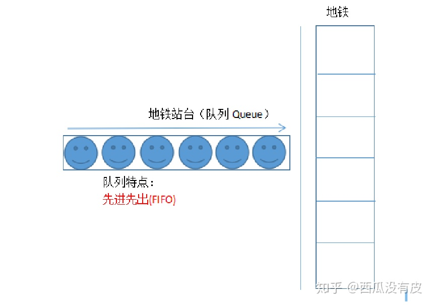
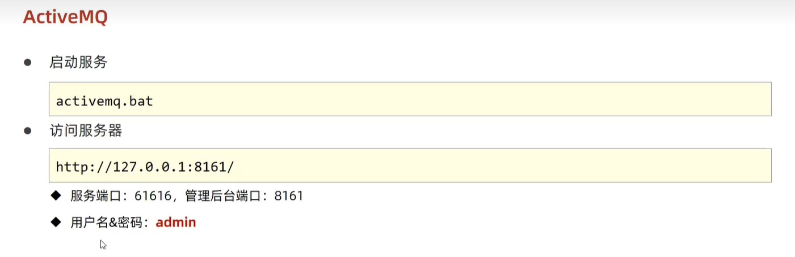

# ActiveMQ

## ActiveMQ简介

### 1 什么是 ActiveMQ

ActiveMQ 是 Apache 出品，最流行的，能力强劲的开源消息总线。ActiveMQ 是一个 完全支持 JMS1.1 和 J2EE 1.4 规范的 JMS Provider 实现，尽管 JMS 规范出台已经是很久 的事情了，但是 JMS 在当今的 J2EE 应用中间仍然扮演着特殊的地位。

### 2 什么是消息

“消息”是在两台计算机间传送的数据单位。消息可以非常简单，例如只包含文本字符串； 也可以更复杂，可能包含嵌入对象。

### 3 什么是队列

### 4 什么是消息队列

“消息队列”是在消息的传输过程中保存消息的容器。

### 5 常用消息服务应用

#### 5.1 ActiveMQ

ActiveMQ 是 Apache 出品，最流行的，能力强劲的开源消息总线。ActiveMQ 是一个完 全支持 JMS1.1 和 J2EE 1.4 规范的 JMS Provider 实现。

#### 5.2 RabbitMQ

RabbitMQ 是一个在 AMQP 基础上完成的，可复用的企业消息系统。他遵循 Mozilla Public License 开源协议。开发语言为 Erlang。

#### 5.3 RocketMQ

由阿里巴巴定义开发的一套消息队列应用服务。

## 运行服务

## ActiveMQ 术语

### 1 Destination

目的地，JMS Provider（消息中间件）负责维护，用于对 Message 进行管理的对象。 MessageProducer 需要指定 Destination 才能发送消息，MessageReceiver 需要指定 Destination 才能接收消息。

### 2 Producer

消息生成者，负责发送 Message 到目的地。

### 3 Consumer | Receiver

消息消费者，负责从目的地中消费【处理|监听|订阅】Message。

### 4 Message

消息，消息封装一次通信的内容。
