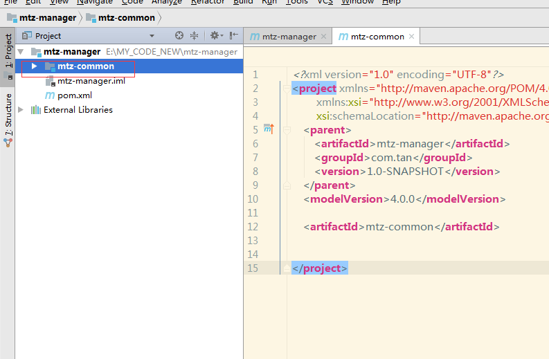

# Maven高级

## 学习前置

看问题之前先了解maven中的两个标签 < dependencyManagement >和 < dependencies >，明白的直接跳过。

### dependencyManagement

这里其实是起到管理依赖jar版本号的作用，一般只会在项目的最顶层的pom.xml中使用到，所有子module如果想要使用到这里面声明的jar，只需要在子module中添加相应的groupId和[artifactId](https://so.csdn.net/so/search?q=artifactId&spm=1001.2101.3001.7020)即可，并不需要声明版本号，需要注意的是这里面只是声明一个依赖，并不是真实的下载jar，只有在子module中使用到，才会去下载依赖。

### dependencies

我们是这里引入了一个jar包之后，这里如果没有加上version版本号的话，那么maven就会去 < dependencyManagement >里找对应groupId和artifactId的jar,如果有就继承他，如果没有就会报错，这时候其实在我们配置的本地仓库中会真实的下载对应的jar包，这时候所有的子module都会默认继承这里面所有声明的jar。

总的来说，就是在中声明依赖和版本号，该标签中的依赖不会被子模块继承，仅仅是声明，子pom中直接引入依赖，具体的版本号会在父子中去找。

父pom的packaging都是pom，子项目pom的packaging都是jar/war。关于在父子配置pom的引用有两种方案，这里以 springboot项目为例说明问题。

## 父子工程

### 第一种pom配置

我们希望在父pom中引入相关依赖，都记录在 `<dependencies>`下，子模块直接继承父pom的依赖，在子模块中开发中就不必再去引入依赖，但在项目中有模块可能就是单一的工具包，它并不需要 springboot的依赖，这时候启动就会冲突。可以这样解决，在父pom中定义[springboot版本](https://so.csdn.net/so/search?q=springboot%E7%89%88%E6%9C%AC&spm=1001.2101.3001.7020)号，子模块作为项目启动的模块配置springboot插件依赖，普通的dao，serivce，common不必引入。如下配置文件，文件中只列举个别依赖包，重在说明问题：

父pom.xml配置：

```xml
<?xml version="1.0" encoding="UTF-8"?>
<project xmlns="http://maven.apache.org/POM/4.0.0"
         xmlns:xsi="http://www.w3.org/2001/XMLSchema-instance"
         xsi:schemaLocation="http://maven.apache.org/POM/4.0.0 http://maven.apache.org/xsd/maven-4.0.0.xsd">
    <modelVersion>4.0.0</modelVersion>
    <groupId>com.demo</groupId>
    <artifactId>demo-api</artifactId>
    <version>1.0-SNAPSHOT</version>
    <packaging>pom</packaging>
    <modules>
        <module>demo-web</module>
        <module>demo-common</module>
        <module>demo-service</module>
    </modules>
    <properties>
        <spring-boot.version>2.1.8.RELEASE</spring-boot.version>
        <java.version>1.8</java.version>
        <project.reporting.outputEncoding>UTF-8</project.reporting.outputEncoding>
        <project.build.sourceEncoding>UTF-8</project.build.sourceEncoding>
        <fastjson.version>1.2.47</fastjson.version>
        <pagehelper.version>5.1.6</pagehelper.version>
    </properties>
    <dependencyManagement>
        <dependencies>
            <dependency>
                <groupId>org.springframework.boot</groupId>
                <artifactId>spring-boot-dependencies</artifactId>
                <version>${spring-boot.version}</version>
                <type>pom</type>
                <scope>import</scope>
            </dependency>
        </dependencies>
    </dependencyManagement>
    <dependencies>
		<!--这两个依赖都将被子模块继承-->
        <dependency>
            <groupId>com.alibaba</groupId>
            <artifactId>fastjson</artifactId>
            <version>${fastjson.version}</version>
        </dependency>
		<dependency>
            <groupId>com.github.pagehelper</groupId>
            <artifactId>pagehelper</artifactId>
            <version>${pagehelper.version}</version>
        </dependency>
    </dependencies>
    <build>
        <plugins>
            <plugin>
                <groupId>org.apache.maven.plugins</groupId>
                <artifactId>maven-compiler-plugin</artifactId>
                <configuration>
                    <source>8</source>
                    <target>8</target>
                </configuration>
            </plugin>
        </plugins>
    </build>
    <profiles>
        <profile>
            <id>dev</id>
            <properties>
                <package.environment>dev</package.environment>
            </properties>
            <!-- 是否默认 true表示默认-->
            <activation>
                <activeByDefault>true</activeByDefault>
            </activation>
        </profile>
        <profile>
            <!-- 测试环境 -->
            <id>test</id>
            <properties>
                <package.environment>test</package.environment>
            </properties>
        </profile>
        <profile>
            <!-- 生产环境 -->
            <id>prod</id>
            <properties>
                <package.environment>prod</package.environment>
            </properties>
        </profile>
    </profiles>
</project>

```

普通子模块pom.xml配置：

```xml
<?xml version="1.0" encoding="UTF-8"?>
<project xmlns="http://maven.apache.org/POM/4.0.0"
         xmlns:xsi="http://www.w3.org/2001/XMLSchema-instance"
         xsi:schemaLocation="http://maven.apache.org/POM/4.0.0 http://maven.apache.org/xsd/maven-4.0.0.xsd">
    <parent>
        <artifactId>demo-api</artifactId>
        <groupId>com.demo</groupId>
        <version>1.0-SNAPSHOT</version>
    </parent>
    <modelVersion>4.0.0</modelVersion>
    <groupId>com.demo.common</groupId>
    <artifactId>demo-common</artifactId>
    <version>0.0.1-SNAPSHOT</version>
    <name>demo-common</name>
    <description>demo-common project</description>
    <packaging>jar</packaging>
</project>

```

启动类子模块pom.xml配置：

```xml
<?xml version="1.0" encoding="UTF-8"?>
<project xmlns="http://maven.apache.org/POM/4.0.0" xmlns:xsi="http://www.w3.org/2001/XMLSchema-instance"
         xsi:schemaLocation="http://maven.apache.org/POM/4.0.0 https://maven.apache.org/xsd/maven-4.0.0.xsd">
    <modelVersion>4.0.0</modelVersion>
    <parent>
        <groupId>com.demo</groupId>
        <artifactId>demo-api</artifactId>
        <version>1.0-SNAPSHOT</version>
    </parent>
    <groupId>com.demo.web</groupId>
    <artifactId>demo-web</artifactId>
    <version>0.0.1-SNAPSHOT</version>
    <name>demo-web</name>
    <description>demo-web project</description>
    <properties>
        <java.version>1.8</java.version>
    </properties>
    <dependencies>
		<!--引入子模块相关jar -->
        <dependency>
            <groupId>com.demo.common</groupId>
            <artifactId>demo-common</artifactId>
            <version>0.0.1-SNAPSHOT</version>
        </dependency>
        <dependency>
            <groupId>com.myway.service</groupId>
            <artifactId>share-read-service</artifactId>
            <version>0.0.1-SNAPSHOT</version>
        </dependency>
        <dependency>
            <groupId>org.springframework.boot</groupId>
            <artifactId>spring-boot-starter-test</artifactId>
            <scope>test</scope>
            <exclusions>
                <exclusion>
                    <groupId>org.junit.vintage</groupId>
                    <artifactId>junit-vintage-engine</artifactId>
                </exclusion>
            </exclusions>
        </dependency>
    </dependencies>
    <build>
        <!--重要 如果不设置resource 会导致application.yaml中的@@找不到pom文件中的配置-->
        <resources>
            <resource>
                <directory>src/main/resources</directory>
                <filtering>true</filtering>
            </resource>
        </resources>
        <plugins>
			<!--仅在启动项目中引入springboot插件 -->
            <plugin>
                <groupId>org.springframework.boot</groupId>
                <artifactId>spring-boot-maven-plugin</artifactId>
            </plugin>
            <plugin>
                <groupId>org.springframework.boot</groupId>
                <artifactId>spring-boot-maven-plugin</artifactId>
                <executions>
                    <execution>
                        <goals>
                            <goal>repackage</goal>
                        </goals>
                    </execution>
                </executions>
            </plugin>
        </plugins>
    </build>
</project>

```

### 第二种pom配置

将所有的依赖在父pom的中声明，子模块把需要的都引入一遍：

父pom.xml配置：

```xml
<?xml version="1.0" encoding="UTF-8"?>
<project xmlns="http://maven.apache.org/POM/4.0.0"
         xmlns:xsi="http://www.w3.org/2001/XMLSchema-instance"
         xsi:schemaLocation="http://maven.apache.org/POM/4.0.0 http://maven.apache.org/xsd/maven-4.0.0.xsd">
	<modelVersion>4.0.0</modelVersion>
    <groupId>com.demo</groupId>
    <artifactId>demo</artifactId>
    <version>3.0.0</version>

    <modules>
        <module>demo-web</module>
        <module>demo-common</module>
    </modules>
    <packaging>pom</packaging>

    <properties>
        <project.build.sourceEncoding>UTF-8</project.build.sourceEncoding>
        <project.reporting.outputEncoding>UTF-8</project.reporting.outputEncoding>
        <java.version>1.8</java.version>
        <druid.version>1.1.14</druid.version>
        <pagehelper.boot.version>1.2.5</pagehelper.boot.version>
        <fastjson.version>1.2.70</fastjson.version>
    </properties>
    <!-- 依赖声明 -->
    <dependencyManagement>
        <dependencies>
            <!-- SpringBoot的依赖配置-->
            <dependency>
                <groupId>org.springframework.boot</groupId>
                <artifactId>spring-boot-dependencies</artifactId>
                <version>2.1.8.RELEASE</version>
                <type>pom</type>
                <scope>import</scope>
            </dependency>
            <!--阿里数据库连接池 -->
            <dependency>
                <groupId>com.alibaba</groupId>
                <artifactId>druid-spring-boot-starter</artifactId>
                <version>${druid.version}</version>
            </dependency>
            <!-- pagehelper 分页插件 -->
            <dependency>
                <groupId>com.github.pagehelper</groupId>
                <artifactId>pagehelper-spring-boot-starter</artifactId>
                <version>${pagehelper.boot.version}</version>
            </dependency>
        </dependencies>
    </dependencyManagement>
  
    <dependencies>
    </dependencies>
    <build>
        <plugins>
            <plugin>
                <groupId>org.apache.maven.plugins</groupId>
                <artifactId>maven-compiler-plugin</artifactId>
                <version>3.1</version>
                <configuration>
                    <source>${java.version}</source>
                    <target>${java.version}</target>
                    <encoding>${project.build.sourceEncoding}</encoding>
                </configuration>
            </plugin>
        </plugins>
    </build>
    <repositories>
        <repository>
            <id>public</id>
            <name>aliyun nexus</name>
            <url>http://maven.aliyun.com/nexus/content/groups/public/</url>
            <releases>
                <enabled>true</enabled>
            </releases>
        </repository>
    </repositories>
    <pluginRepositories>
        <pluginRepository>
            <id>public</id>
            <name>aliyun nexus</name>
            <url>http://maven.aliyun.com/nexus/content/groups/public/</url>
            <releases>
                <enabled>true</enabled>
            </releases>
            <snapshots>
                <enabled>false</enabled>
            </snapshots>
        </pluginRepository>
    </pluginRepositories>
	<profiles>
        <profile>
            <id>dev</id>
            <properties>
                <package.environment>dev</package.environment>
            </properties>
            <!-- 是否默认 true表示默认-->
            <activation>
                <activeByDefault>true</activeByDefault>
            </activation>
        </profile>
        <profile>
            <!-- 测试环境 -->
            <id>test</id>
            <properties>
                <package.environment>test</package.environment>
            </properties>
        </profile>
        <profile>
            <!-- 生产环境 -->
            <id>prod</id>
            <properties>
                <package.environment>prod</package.environment>
            </properties>
        </profile>
    </profiles>
</project>
```

* 普通子模块pom.xml配置：

```xml
<?xml version="1.0" encoding="UTF-8"?>
<project xmlns="http://maven.apache.org/POM/4.0.0"
         xmlns:xsi="http://www.w3.org/2001/XMLSchema-instance"
         xsi:schemaLocation="http://maven.apache.org/POM/4.0.0 http://maven.apache.org/xsd/maven-4.0.0.xsd">
    <parent>
        <artifactId>demo</artifactId>
        <groupId>com.demo</groupId>
        <version>1.0.0</version>
    </parent>
    <modelVersion>4.0.0</modelVersion>
    <artifactId>demo-system</artifactId>
    <dependencies>
        <dependency>
            <groupId>com.demo</groupId>
            <artifactId>demo-common</artifactId>
        </dependency>
		<dependency>
			<groupId>com.alibaba</groupId>
			<artifactId>druid-spring-boot-starter</artifactId>
		</dependency>
		<dependency>
			<groupId>com.github.pagehelper</groupId>
			<artifactId>pagehelper-spring-boot-starter</artifactId>
		</dependency>
    </dependencies>
</project>
```

* 启动类子模块pom.xml配置：

```xml
<?xml version="1.0" encoding="UTF-8"?>
<project xmlns="http://maven.apache.org/POM/4.0.0"
         xmlns:xsi="http://www.w3.org/2001/XMLSchema-instance"
         xsi:schemaLocation="http://maven.apache.org/POM/4.0.0 http://maven.apache.org/xsd/maven-4.0.0.xsd">
    <parent>
        <artifactId>demo</artifactId>
        <groupId>com.demo</groupId>
        <version>3.0.0</version>
    </parent>
    <modelVersion>4.0.0</modelVersion>
    <packaging>jar</packaging>
    <artifactId>demo-admin</artifactId>
    <description>
        web服务
    </description>
    <dependencies>
		<dependency>
			<artifactId>demo</artifactId>
			<groupId>com.demo</groupId>
			<version>1.0.0</version>
		</dependency>
    </dependencies>
    <build>
        <plugins>
            <plugin>
                <groupId>org.springframework.boot</groupId>
                <artifactId>spring-boot-maven-plugin</artifactId>
                <version>2.1.8.RELEASE</version>
                <configuration>
                    <fork>true</fork> <!-- 如果没有该配置，devtools不会生效 -->
                </configuration>
                <executions>
                    <execution>
                        <goals>
                            <goal>repackage</goal>
                        </goals>
                    </execution>
                </executions>
            </plugin>
            <plugin>
                <groupId>org.apache.maven.plugins</groupId>
                <artifactId>maven-war-plugin</artifactId>
                <version>3.0.0</version>
                <configuration>
                    <failOnMissingWebXml>false</failOnMissingWebXml>
                    <warName>${project.artifactId}</warName>
                </configuration>
           </plugin>
        </plugins>
    </build>
</project>
```

### parent标签注意点

值得注意的是 `<relativePath>`标签，如果pom的层次关系父子嵌套只隔一层，则可以省略这个。maven同样可以找到子pom。


子pom中引入 `<parent>`标签后，就会从父pom继承 `<version>`等属性了


## 分模块开发与设计*

以下只是一种思想，并不代表实际


### entity拆分


### dao拆分


### service拆分


### controller拆分

注意改成war包


### 总结


### 父子工程创建流程

#### 创建父工程

1.以IDEA为示例 (Eclipse大同小异) 选择New--Project


2.在弹出界面选择Maven, 选择JDK，-->next


3.输入GroupId 和ArtifactId , -->next


4.输入完整项目名，和项目保存在本地的路径 ->finish


5.完成之后我们得到一个新建的maven工程作为我们的父工程，然后删掉目录下的整个src,得到如下目录


#### 创建子工程

1.创建子工程，我们先选中父工程目录，然后New-->Model ，在弹出界面直接-->Next


3.下一步到这个页面我们填写子工程名称，然后-->Next


4.根据情况修改以下属性值，然后点击--->finish


5.完成之后我们子工程就创建成功了，可以看到如下的目录结构



并且父工程的pom会自动生成Modules标签及内容，这样就创建了一个有聚合关系的工程了。


完了之后，我们打开Maven视图，点击一下父工程test看看是否存在错误,如看到以下打印，则表示子工程创建成功。


#### Spring Boot父工程

Spring boot在创建单应用项目的时候，有默认的 `<parent>`依赖；我们在自定义父工程项目时，如果直接以Spring boot的parent作为项目的 `<parent>`父依赖管理的话，子项目会由于存在两个parent而报错，无法导入依赖。

解决方案如下：

```xml
<dependency>
    <groupId>org.springframework.boot</groupId>
    <artifactId>spring-boot-dependencies</artifactId>
    <version>${spring.boot.version}</version>
    <type>pom</type>
    <scope>import</scope>
</dependency>
```

使用spring-boot-dependencies依赖对springboot的依赖包进行统一管理。

对于Spring Boot项目，maven父工程项pom.xml我们需要做的处理

```xml
<modelVersion>4.0.0</modelVersion>
    <!--基本信息-->
    <groupId>com.tan</groupId>
    <artifactId>mtz-manager</artifactId>
    <packaging>pom</packaging>
    <version>1.0-SNAPSHOT</version>

    <name>mtz-manager</name>
    <description>mtz-manager管理系统</description>

    <!--定义属性值-->
    <properties>
        <project.build.sourceEncoding>UTF-8</project.build.sourceEncoding>
        <project.reporting.outputEncoding>UTF-8</project.reporting.outputEncoding>
        <java.version>1.8</java.version>
        <spring.boot.version>2.1.1.RELEASE</spring.boot.version>
    </properties>

    <!-- 依赖声明 -->
    <dependencyManagement>
        <dependencies>

            <!-- SpringBoot的依赖配置-->
            <dependency>
                <groupId>org.springframework.boot</groupId>
                <artifactId>spring-boot-dependencies</artifactId>
                <version>${spring.boot.version}</version>
                <type>pom</type>
                <scope>import</scope>
            </dependency>

        </dependencies>
    </dependencyManagement>

    <!--编译管理 jdk版本和字符集编码-->
    <build>
        <plugins>
            <plugin>
                <groupId>org.apache.maven.plugins</groupId>
                <artifactId>maven-compiler-plugin</artifactId>
                <configuration>
                    <source>${java.version}</source>
                    <target>${java.version}</target>
                    <encoding>${project.build.sourceEncoding}</encoding>
                </configuration>
            </plugin>
        </plugins>
    </build>

    <!--Maven远程仓库设置 非必要，可以删除-->
    <repositories>
        <repository>
            <id>public</id>
            <name>aliyun nexus</name>
            <url>http://maven.aliyun.com/nexus/content/groups/public/</url>
            <releases>
                <enabled>true</enabled>
            </releases>
        </repository>
    </repositories>

    <!--Maven远程插件库设置 非必要，可以删除-->
    <pluginRepositories>
        <pluginRepository>
            <id>public</id>
            <name>aliyun nexus</name>
            <url>http://maven.aliyun.com/nexus/content/groups/public/</url>
            <releases>
                <enabled>true</enabled>
            </releases>
            <snapshots>
                <enabled>false</enabled>
            </snapshots>
        </pluginRepository>
    </pluginRepositories>
```

到这里父工程创建完成。

#### 创建Spring Boot子工程

第一步：按照之前创建完毕子工程。

第二部：我们以之前创建的子工程后按照以下进行修改。

新建一个mtz-admin模块，以mtz-admin为例,此模块为web模块

1.mtz-admin创建之后，修改mtz-admin的pom.xml添加以下内容

```xml
<dependencies>
        <!-- SpringBoot Web容器 -->
        <dependency>
            <groupId>org.springframework.boot</groupId>
            <artifactId>spring-boot-starter-web</artifactId>
        </dependency>
    </dependencies>
```

2.分别添加application.yml 和 Application.java


3.完了之后我们得到一个Spring Boot应用，启动Application，得到如下结果，则表示创建成功完成。


#### 模块之间的引用

被引入的模块需要install到本地仓库

```xml
<dependency>
    <groupId>com.example</groupId>
    <artifactId>demo-entity</artifactId>
    <version>0.0.1-SNAPSHOT</version>
</dependency>
```

## 聚合*

### 多模块构建维护


默认打jar包

## 继承*

### 问题引出


### 问题解决

在子工程中只需要定义依赖，而不需要指定版本，即表示引入依赖

而且还可以引入其他模块包的依赖，因为父工程只是声明，不会全局引入，所以在各个子模块中按需引入即可


### 总结


### 继承和聚合

两者不是相对的，只是一起使用更好


## 属性*

### 问题引出


### 属性类别

#### 自定义属性


#### 内置属性


统一项目版本


#### Setting属性


#### java系统属性


#### 环境变量属性


## 版本管理


### 总结


## 资源配置

当前只能管理依赖，不能管理配置文件


### 总结


## 多环境开发配置


### 定义对应环境变量

可设置默认环境


### 配置使用对应环境


### 总结


## 跳过测试

### 应用场景


### 方式一


### 方式二


### 方式三


## 私服*

### 私服安装


### 私服资源获取

### 介绍


### 访问私服


### 发布配置

配置完后执行 deploy


### 指定私服

```xml
<!--从私服下载jar包-->
<repositories>
    <repository>
        <id>company-releases</id>
        <url>http://43.143.175.64:8081//repository/maven-public/</url>
        <releases>
            <enabled>true</enabled>
        </releases>
        <snapshots>
            <enabled>true</enabled>
            <updatePolicy>always</updatePolicy>
            <checksumPolicy>fail</checksumPolicy>
        </snapshots>
    </repository>
</repositories>
```
