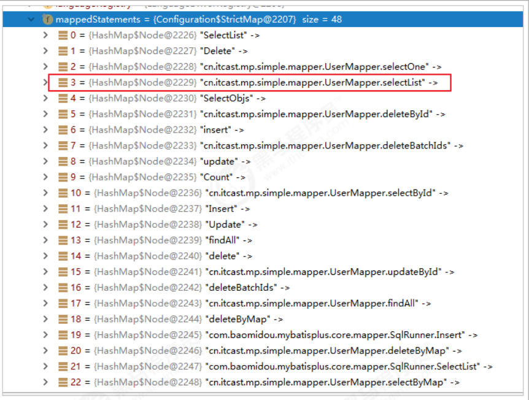

# Mybatis-Plus环境整合

## 依赖

```xml
<dependency>
    <groupId>com.baomidou</groupId>
    <artifactId>mybatis-plus</artifactId>
    <version>3.5.3.1</version>
</dependency>
```

## 用法方式


## 回顾Mybatis

### 导入依赖

```xml
<project xmlns="http://maven.apache.org/POM/4.0.0" xmlns:xsi="http://www.w3.org/2001/XMLSchema-instance"
  xsi:schemaLocation="http://maven.apache.org/POM/4.0.0 http://maven.apache.org/xsd/maven-4.0.0.xsd">
  <modelVersion>4.0.0</modelVersion>

  <groupId>com.example</groupId>
  <artifactId>mybatis-plus-test</artifactId>
  <version>1.0-SNAPSHOT</version>
  <packaging>pom</packaging>

  <name>mybatis-plus-test</name>
  <url>http://maven.apache.org</url>
  <modules>
    <module>mybatis-plus-test-simple</module>
  </modules>

  <properties>
    <project.build.sourceEncoding>UTF-8</project.build.sourceEncoding>
    <maven.compiler.source>11</maven.compiler.source>
    <maven.compiler.target>11</maven.compiler.target>
  </properties>

  <dependencies>
    <dependency>
      <groupId>junit</groupId>
      <artifactId>junit</artifactId>
      <version>4.12</version>
    </dependency>
    <dependency>
      <groupId>com.baomidou</groupId>
      <artifactId>mybatis-plus</artifactId>
      <version>3.5.3.1</version>
    </dependency>
    <dependency>
      <groupId>mysql</groupId>
      <artifactId>mysql-connector-java</artifactId>
      <version>8.0.28</version>
    </dependency>
    <dependency>
      <groupId>com.alibaba</groupId>
      <artifactId>druid</artifactId>
      <version>1.2.3</version>
    </dependency>
    <dependency>
      <groupId>org.projectlombok</groupId>
      <artifactId>lombok</artifactId>
      <version>1.18.26</version>
    </dependency>
    <dependency>
      <groupId>org.slf4j</groupId>
      <artifactId>slf4j-log4j12</artifactId>
      <version>1.6.4</version>
    </dependency>

  </dependencies>
</project>

```

### log4j.properties

```properties
log4j.rootLogger=DEBUG,A1
log4j.appender.A1=org.apache.log4j.ConsoleAppender
log4j.appender.A1.layout=org.apache.log4j.PatternLayout
log4j.appender.A1.layout.ConversionPattern=[%t] [%c]-[%p] %m%n
```

### mybatis-config.xml

```xml
<?xml version="1.0" encoding="UTF-8" ?>
<!DOCTYPE configuration
        PUBLIC "-//mybatis.org//DTD Config 3.0//EN"
        "http://mybatis.org/dtd/mybatis-3-config.dtd">
<configuration>

  <properties resource="db.properties"/>

  <settings>
    <!--将下划线映射为驼峰-->
    <setting name="mapUnderscoreToCamelCase" value="true"/>
  </settings>

  <!--
  environments：配置数据库连接环境信息。可以配置多个environment，通过default属性切换不同的environment
  -->
  <environments default="development">
    <environment id="development">
      <transactionManager type="JDBC"/>
      <dataSource type="POOLED">
        <!--数据库连接信息-->
        <property name="driver" value="${driverClassName}"/>
        <property name="url" value="${url}"/>
        <property name="username" value="${username}"/>
        <property name="password" value="${password}"/>
      </dataSource>
    </environment>
  </environments>
  <mappers>
    <!--加载sql映射文件-->
    <!-- <mapper resource="com/bobo/mapper/ClassMapper.xml"/> -->
    <package name="com.example.mapper"/>
  </mappers>
</configuration>
```

### Student

```java
package com.example.entity;

import lombok.AllArgsConstructor;
import lombok.Data;
import lombok.NoArgsConstructor;
import lombok.ToString;

@Data
@AllArgsConstructor
@NoArgsConstructor
@ToString
public class Student {
  private String studentNo;
  private String name;
  private String mobile;
  private int gender;
  private int age;
  private String classNo;
}
```

### StudentMapper接口

```java
package com.example.mapper;

import com.example.entity.Student;
import java.util.List;

public interface StudentMapper {

  List<Student> findAll();

}
```

### StudentMapper.xml

```xml
<?xml version="1.0" encoding="UTF-8" ?>
<!DOCTYPE mapper
        PUBLIC "-//mybatis.org//DTD Mapper 3.0//EN"
        "http://mybatis.org/dtd/mybatis-3-mapper.dtd">
<mapper namespace="com.example.mapper.StudentMapper">
  <select id="findAll" resultType="com.example.entity.Student">
    select * from student
  </select>
</mapper>
```

### 测试用例

```java
@Test
  public void testUserList() throws Exception {
    String resource = "mybatis-config.xml";
    InputStream inputStream = Resources.getResourceAsStream(resource);
    SqlSessionFactory sqlSessionFactory = new SqlSessionFactoryBuilder().build(inputStream);
    SqlSession sqlSession = sqlSessionFactory.openSession();
    StudentMapper userMapper = sqlSession.getMapper(StudentMapper.class);
    List<Student> list = userMapper.selectList();
    for (Student student : list) {
      System.out.println(student);
    }
  }
```

## 初步使用MP

### 继承BaseMapper

```java
package com.example.mapper;

import com.baomidou.mybatisplus.core.mapper.BaseMapper;
import com.example.entity.Student;

import java.util.List;

public interface StudentMapper extends BaseMapper<Student> {

  List<Student> findAll();

}
```

### 实体类增加@TableName，指定数据库表名

默认开启驼峰

```java
@Data
@AllArgsConstructor
@NoArgsConstructor
@ToString
@TableName("student")
public class Student {
  private String studentNo;
  private String name;
  private String mobile;
  private int gender;
  private int age;
  private String classNo;
}
```

### 使用MP中的MybatisSqlSessionFactoryBuilder进程构建

```java
@Test
  public void testMPStudentList() throws Exception {
    String resource = "mybatis-config.xml";
    InputStream inputStream = Resources.getResourceAsStream(resource);
//这里使用的是MP中的MybatisSqlSessionFactoryBuilder
    SqlSessionFactory sqlSessionFactory = new MybatisSqlSessionFactoryBuilder().build(inputStream);
    SqlSession sqlSession = sqlSessionFactory.openSession();
    StudentMapper userMapper = sqlSession.getMapper(StudentMapper.class);
// 可以调用BaseMapper中定义的方法
    List<Student> list = userMapper.selectList(null);
    for (Student student : list) {
      System.out.println(student);
    }
  }
```

由于使用了MybatisSqlSessionFactoryBuilder进行了构建，继承的BaseMapper中的方法就载入到了SqlSession中，所以就可以直接使用相关的方法；



## Spring+M+MP

### 导入依赖

```xml
<dependency>
      <groupId>org.springframework</groupId>
      <artifactId>spring-context</artifactId>
      <version>${spring.version}</version>
    </dependency>
    <dependency>
      <groupId>org.springframework</groupId>
      <artifactId>spring-jdbc</artifactId>
      <version>${spring.version}</version>
    </dependency>
    <dependency>
      <groupId>org.springframework</groupId>
      <artifactId>spring-test</artifactId>
      <version>${spring.version}</version>
    </dependency>
    <!-- 连接池 -->
    <dependency>
      <groupId>com.alibaba</groupId>
      <artifactId>druid</artifactId>
      <version>1.2.8</version>
    </dependency>
    <!-- junit测试 -->
    <dependency>
      <groupId>junit</groupId>
      <artifactId>junit</artifactId>
      <version>4.12</version>
      <scope>test</scope>
    </dependency>
    <!-- MySQL驱动 -->
    <dependency>
      <groupId>mysql</groupId>
      <artifactId>mysql-connector-java</artifactId>
      <version>8.0.27</version>
    </dependency>
    <!-- 日志 -->
    <dependency>
      <groupId>org.slf4j</groupId>
      <artifactId>slf4j-api</artifactId>
      <version>1.7.30</version>
    </dependency>
    <dependency>
      <groupId>ch.qos.logback</groupId>
      <artifactId>logback-classic</artifactId>
      <version>1.2.3</version>
    </dependency>
    <!-- lombok用来简化实体类 -->
    <dependency>
      <groupId>org.projectlombok</groupId>
      <artifactId>lombok</artifactId>
      <version>1.16.16</version>
    </dependency>
    <!--MyBatis-Plus的核心依赖-->
    <dependency>
      <groupId>com.baomidou</groupId>
      <artifactId>mybatis-plus</artifactId>
      <version>3.4.3.4</version>
    </dependency>


```

### jdbc.properties

```properties
jdbc.driverClassName=com.mysql.cj.jdbc.Driver
jdbc.url=jdbc:mysql://localhost:3300/table_test?useUnicode=true;characterEncoding=utf8;serverTimezone=Asia/Shanghai;useTimezone=true
jdbc.username=root
jdbc.password=123456
```

### applicationContext.xml

```xml
<?xml version="1.0" encoding="UTF-8"?>
<beans xmlns="http://www.springframework.org/schema/beans"
       xmlns:xsi="http://www.w3.org/2001/XMLSchema-instance"
       xmlns:context="http://www.springframework.org/schema/context"
       xsi:schemaLocation="http://www.springframework.org/schema/beans
http://www.springframework.org/schema/beans/spring-beans.xsd
http://www.springframework.org/schema/context
http://www.springframework.org/schema/context/spring-context.xsd">
  <context:property-placeholder location="classpath:*.properties"/>
  <!-- 定义数据源 -->
  <bean id="dataSource" class="com.alibaba.druid.pool.DruidDataSource" destroy-method="close">
    <property name="url" value="${jdbc.url}"/>
    <property name="username" value="${jdbc.username}"/>
    <property name="password" value="${jdbc.password}"/>
    <property name="driverClassName" value="${jdbc.driverClassName}"/>
  </bean>
  <!--这里使用MP提供的sqlSessionFactory，完成了Spring与MP的整合-->

  <bean id="sqlSessionFactory"
        class="com.baomidou.mybatisplus.extension.spring.MybatisSqlSessionFactoryBean">
    <property name="dataSource" ref="dataSource"/>
  </bean>
  <!--扫描mapper接口，使用的依然是Mybatis原生的扫描器-->
  <bean class="org.mybatis.spring.mapper.MapperScannerConfigurer">
    <property name="basePackage" value="com.example.mapper"/>
  </bean>
</beans>
```

注意上面的文件在test目录中也需要resources目录，否则读取不到

### 测试用例

```java
@RunWith(SpringJUnit4ClassRunner.class)
@ContextConfiguration(locations = "classpath:applicationContext.xml")
public class AppTest {

  @Autowired
  private StudentMapper studentMapper;

  @Test
  public void testSelectList() {
    List<Student> students = studentMapper.selectList(null);
    for (Student student : students) {
      System.out.println(student);
    }
  }

}
```

## spirngboot+M+MP

使用SpringBoot将进一步的简化MP的整合，需要注意的是，由于使用SpringBoot需要继承parent，所以需要重新创建工程，并不是创建子Module。

### 导入依赖

```xml
<dependency>
      <groupId>org.springframework.boot</groupId>
      <artifactId>spring-boot-starter-web</artifactId>
    </dependency>

    <dependency>
      <groupId>org.springframework.boot</groupId>
      <artifactId>spring-boot-devtools</artifactId>
      <scope>runtime</scope>
      <optional>true</optional>
    </dependency>

    <dependency>
      <groupId>org.springframework.boot</groupId>
      <artifactId>spring-boot-starter-test</artifactId>
      <scope>test</scope>
    </dependency>

    <dependency>
      <groupId>org.projectlombok</groupId>
      <artifactId>lombok</artifactId>
      <optional>true</optional>
    </dependency>

    <dependency>
      <groupId>com.baomidou</groupId>
      <artifactId>mybatis-plus-boot-starter</artifactId>
      <version>3.5.0</version>
    </dependency>

    <dependency>
      <groupId>mysql</groupId>
      <artifactId>mysql-connector-java</artifactId>
      <version>8.0.28</version>
    </dependency>
```

### application.properties

```properties
spring.application.name = itcast-mp-springboot
spring.datasource.driver-class-name=com.mysql.cj.jdbc.Driver
spring.datasource.url=jdbc:mysql://localhost:3300/table_test?useUnicode=true;characterEncoding=utf8;serverTimezone=Asia/Shanghai;useTimezone=true
spring.datasource.username=root
spring.datasource.password=123456

# 配置MyBatis日志
mybatis-plus.configuration.log-impl: org.apache.ibatis.logging.stdout.StdOutImpl

```

### 启动类配置

```java
@MapperScan("com.example.mapper")
@SpringBootApplication
public class MybatisPlusTestSpringbootApplication {

  public static void main(String[] args) {
    SpringApplication.run(MybatisPlusTestSpringbootApplication.class, args);
  }

}
```

### 测试用例

```java
@SpringBootTest
class MybatisPlusTestSpringbootApplicationTests {

  @Autowired
  private StudentMapper studentMapper;
  @Test
  public void testSelect() {
    List<Student> list = studentMapper.selectList(null);
    for (Student student : list) {
      System.out.println(student);
    }
  }

}
```
