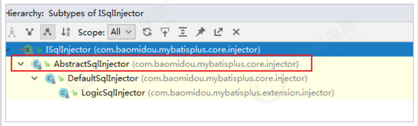
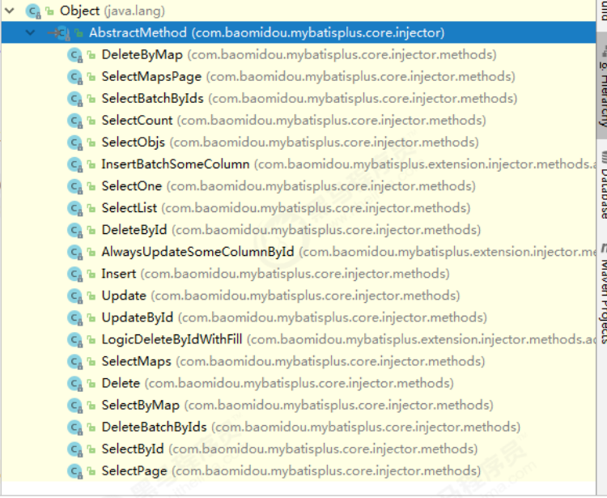
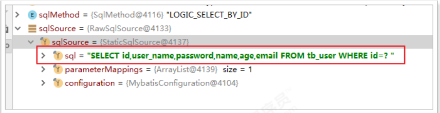

# SQL注入原理

前面我们已经知道，MP在启动后会将BaseMapper中的一系列的方法注册到meppedStatements中，那么究竟是如何注入的呢？流程又是怎么样的？下面我们将一起来分析下。

在MP中，ISqlInjector负责SQL的注入工作，它是一个接口，AbstractSqlInjector是它的实现类，实现关系如下：



在AbstractSqlInjector中，主要是由inspectInject()方法进行注入的，如下：

```java
@Override
    public void inspectInject(MapperBuilderAssistant builderAssistant, Class<?> mapperClass) {
        Class<?> modelClass = ReflectionKit.getSuperClassGenericType(mapperClass, Mapper.class, 0);
        if (modelClass != null) {
            String className = mapperClass.toString();
            Set<String> mapperRegistryCache = GlobalConfigUtils.getMapperRegistryCache(builderAssistant.getConfiguration());
            if (!mapperRegistryCache.contains(className)) {
                TableInfo tableInfo = TableInfoHelper.initTableInfo(builderAssistant, modelClass);
                List<AbstractMethod> methodList = this.getMethodList(mapperClass, tableInfo);
                if (CollectionUtils.isNotEmpty(methodList)) {
                    // 循环注入自定义方法
                    methodList.forEach(m -> m.inject(builderAssistant, mapperClass, modelClass, tableInfo));
                } else {
                    logger.debug(mapperClass.toString() + ", No effective injection method was found.");
                }
                mapperRegistryCache.add(className);
            }
        }
    }
```

在实现方法中， methodList.forEach(m -> m.inject(builderAssistant, mapperClass, modelClass,tableInfo)); 是关键，循环遍历方法，进行注入。

最终调用抽象方法injectMappedStatement进行真正的注入：

```java
/**
* 注入自定义 MappedStatement
*
* @param mapperClass mapper 接口
* @param modelClass mapper 泛型
* @param tableInfo 数据库表反射信息
* @return MappedStatement
*/
public abstract MappedStatement injectMappedStatement(Class<?> mapperClass, Class<?> modelClass, TableInfo tableInfo);
```

查看该方法的实现：



以SelectById为例查看：

```java
@Override
    public MappedStatement injectMappedStatement(Class<?> mapperClass, Class<?> modelClass, TableInfo tableInfo) {
        SqlMethod sqlMethod = SqlMethod.SELECT_BY_ID;
        SqlSource sqlSource = new RawSqlSource(configuration, String.format(sqlMethod.getSql(),
                sqlSelectColumns(tableInfo, false),
                tableInfo.getTableName(), tableInfo.getKeyColumn(), tableInfo.getKeyProperty(),
                tableInfo.getLogicDeleteSql(true, true)), Object.class);
        return this.addSelectMappedStatementForTable(mapperClass, getMethod(sqlMethod), sqlSource, tableInfo);
    }
```



# 配置文件

## configLocation

MyBatis 配置文件位置，如果您有单独的 MyBatis 配置，请将其路径配置到 configLocation 中。 MyBatis Configuration 的具体内容请参考MyBatis 官方文档

Spring Boot：

```properties
mybatis-plus.config-location = classpath:mybatis-config.xml
```

Spring MVC：

```xml
<bean id="sqlSessionFactory" class="com.baomidou.mybatisplus.extension.spring.MybatisSqlSessionFactoryBean">
    <property name="configLocation" value="classpath:mybatis-config.xml"/>
</bean>
```

## mapperLocations

MyBatis Mapper 所对应的 XML 指定文件位置，如果您在 Mapper 中有自定义方法（XML 中有自定义实现），需要进行该配置，告诉 Mapper 所对应的 XML 文件位置。


如果不配置则与Mybatis一样，需要创建同样的目录

Spring Boot：

```properties
mybatis-plus.mapper-locations = classpath*:mybatis/*.xml
```

Spring MVC：

```xml
<bean id="sqlSessionFactory" class="com.baomidou.mybatisplus.extension.spring.MybatisSqlSessionFactoryBean">
    <property name="mapperLocations" value="classpath*:mybatis/*.xml"/>
</bean>
```

Maven 多模块项目的扫描路径需以 classpath*: 开头 （即加载多个 jar 包下的 XML 文件）

## typeAliasesPackage

MyBaits 别名包扫描路径，通过该属性可以给包中的类注册别名，注册后在 Mapper 对应的 XML 文件中可以直接使用类名，而不用使用全限定的类名（即 XML 中调用的时候不用包含包名）。

Spring Boot：

```properties
mybatis-plus.type-aliases-package = cn.itcast.mp.pojo
```

Spring MVC：

```xml
<bean id="sqlSessionFactory" class="com.baomidou.mybatisplus.extension.spring.MybatisSqlSessionFactoryBean">
    <property name="typeAliasesPackage" value="com.baomidou.mybatisplus.samples.quickstart.entity"/>
</bean>
```

# 进阶配置

本部分（Configuration）的配置大都为 MyBatis 原生支持的配置，这意味着您可以通过 MyBatis XML 配置文件的形式进行配置。

## mapUnderscoreToCamelCase

是否开启自动驼峰命名规则（camel case）映射，即从经典数据库列名 A_COLUMN（下划线命名） 到经典 Java 属性名 aColumn（驼峰命名） 的类似映射。默认开启

注意：此属性在 MyBatis 中原默认值为 false，在 MyBatis-Plus 中，此属性也将用于生成最终的 SQL 的 select body如果您的数据库命名符合规则无需使用 @TableField 注解指定数据库字段名

```properties
#关闭自动驼峰映射，该参数不能和mybatis-plus.config-location同时存在
mybatis-plus.configuration.map-underscore-to-camel-case=false
```

## cacheEnabled

二级缓存

全局地开启或关闭配置文件中的所有映射器已经配置的任何缓存，默认为 true。

```properties
mybatis-plus.configuration.cache-enabled=false
```

# DB 策略配置

## idType

全局默认主键类型，设置后，即可省略实体对象中的@TableId(type = IdType.AUTO)配置。

SpringBoot：

```properties
mybatis-plus.global-config.db-config.id-type=auto
```

SpringMVC：

```xml
<!--这里使用MP提供的sqlSessionFactory，完成了Spring与MP的整合-->
<bean id="sqlSessionFactory" class="com.baomidou.mybatisplus.extension.spring.MybatisSqlSessionFactoryBean">
<property name="dataSource" ref="dataSource"/>
<property name="globalConfig">
  <bean class="com.baomidou.mybatisplus.core.config.GlobalConfig">
    <property name="dbConfig">
      <bean class="com.baomidou.mybatisplus.core.config.GlobalConfig$DbConfig">
        <property name="idType" value="AUTO"/>
      </bean>
    </property>
  </bean>
</property>
</bean>
```

## tablePrefix

默认会按照实体类名作为表名查询

表名前缀，全局配置后可省略@TableName()配置。

SpringBoot：

```properties
mybatis-plus.global-config.db-config.table-prefix=tb_
```

SpringMVC：

```xml
<bean id="sqlSessionFactory" class="com.baomidou.mybatisplus.extension.spring.MybatisSqlSessionFactoryBean">
<property name="dataSource" ref="dataSource"/>
<property name="globalConfig">
  <bean class="com.baomidou.mybatisplus.core.config.GlobalConfig">
    <property name="dbConfig">
      <bean class="com.baomidou.mybatisplus.core.config.GlobalConfig$DbConfig">
        <property name="idType" value="AUTO"/>
        <property name="tablePrefix" value="tb_"/>
      </bean>
    </property>
  </bean>
</property>
</bean>
```
