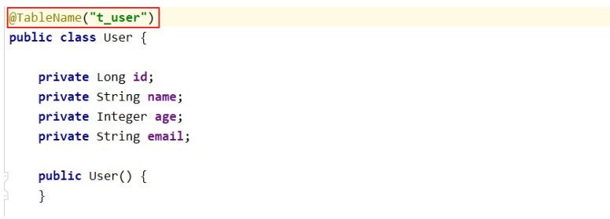
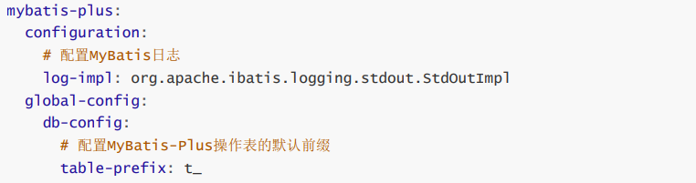
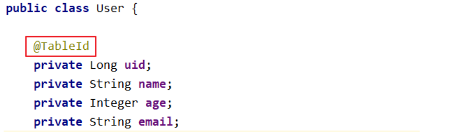
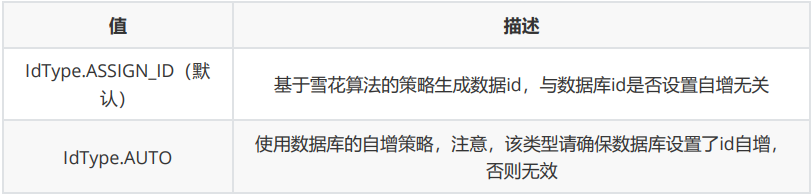
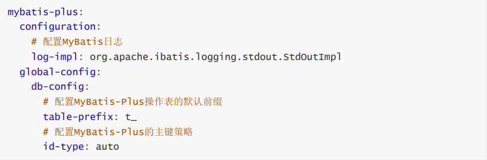
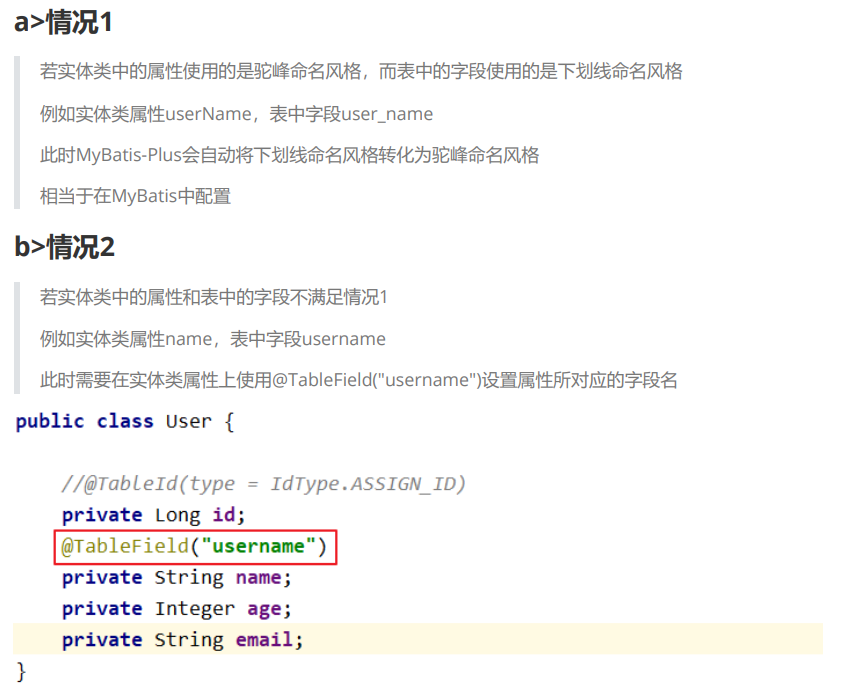
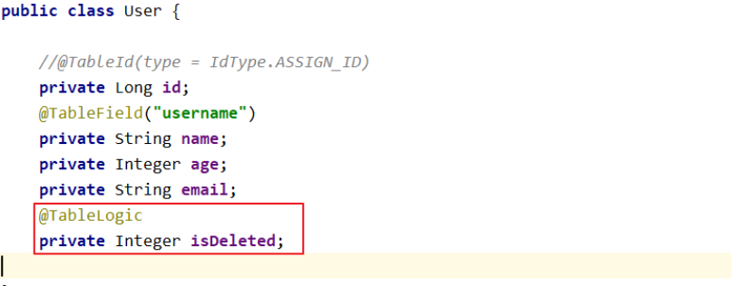

# 常用注解

## @TableName

经过以上的测试，在使用MyBatis-Plus实现基本的CRUD时，我们并没有指定要操作的表，只是在Mapper接口继承BaseMapper时，设置了泛型User，而操作的表为user表

由此得出结论，MyBatis-Plus在确定操作的表时，由BaseMapper的泛型决定，即实体类型决定，且默认操作的表名和实体类型的类名一致

### 通过@TableName解决实体类名与表名不一致问题



### 通过全局配置解决问题

在开发的过程中，我们经常遇到以上的问题，即实体类所对应的表都有固定的前缀，例如t_或tbl_

此时，可以使用MyBatis-Plus提供的全局配置，为实体类所对应的表名设置默认的前缀，那么就不需要在每个实体类上通过@TableName标识实体类对应的表



## @TableId

经过以上的测试，MyBatis-Plus在实现CRUD时，会默认将id作为主键列，并在插入数据时，默认基于雪花算法的策略生成id

在实体类中uid属性上通过@TableId将其标识为主键，即可成功执行SQL语句

### 通过@TableId解决识别主键问题



### @TableId的value属性

* 若实体类中主键对应的属性为id，而表中表示主键的字段为uid，此时若只在属性id上添加注解@TableId，则抛出异常Unknown column 'id' in 'field list'，即MyBatis-Plus仍然会将id作为表的主键操作，而表中表示主键的是字段uid
* 此时需要通过@TableId注解的value属性，指定表中的主键字段，@TableId("uid")或@TableId(value="uid")

### @TableId的type属性

type属性用来定义主键策略



### 配置全局主键策略：



## @TableField

经过以上的测试，我们可以发现，MyBatis-Plus在执行SQL语句时，要保证实体类中的属性名和表中的字段名一致

如果实体类中的属性名和字段名不一致的情况，会出现什么问题呢？



## @TableLogic

### 逻辑删除

* 物理删除：真实删除，将对应数据从数据库中删除，之后查询不到此条被删除的数据
* 逻辑删除：假删除，将对应数据中代表是否被删除字段的状态修改为“被删除状态”，之后在数据库中仍旧能看到此条数据记录
* 使用场景：可以进行数据恢复

### 实现逻辑删除

step1：数据库中创建逻辑删除状态列，设置默认值为0

step2：实体类中添加逻辑删除属性



step3：设置配置文件

```properties
#默认为0/1
mybatis-plus.global-config.db-config.logic-not-delete-value=1
mybatis-plus.global-config.db-config.logic-delete-value=0
```
