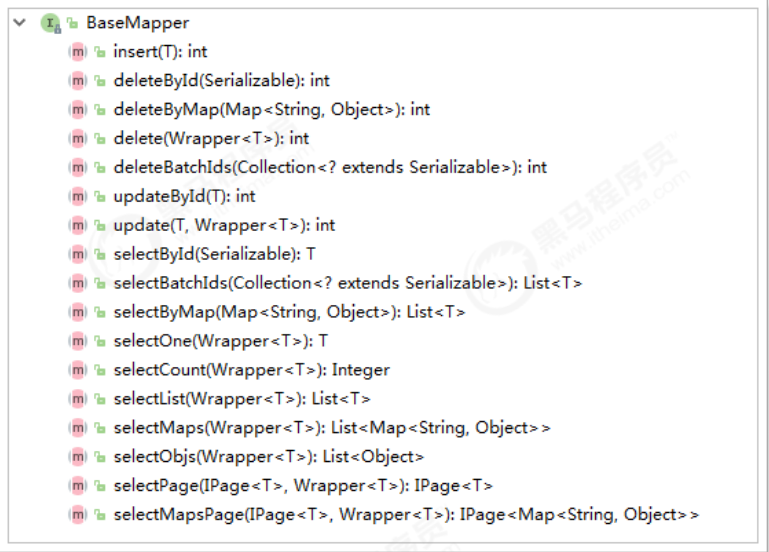
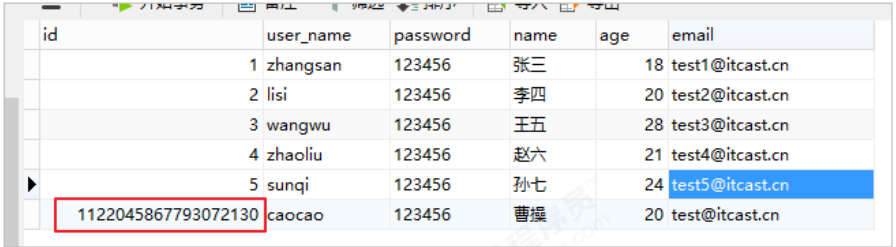
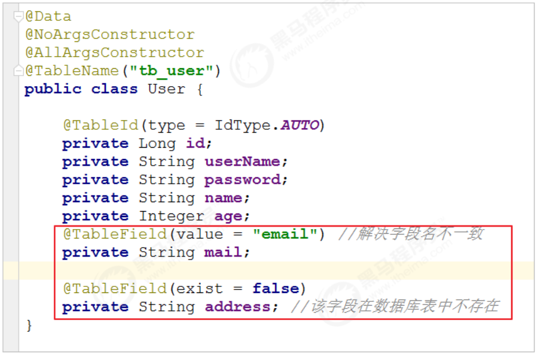
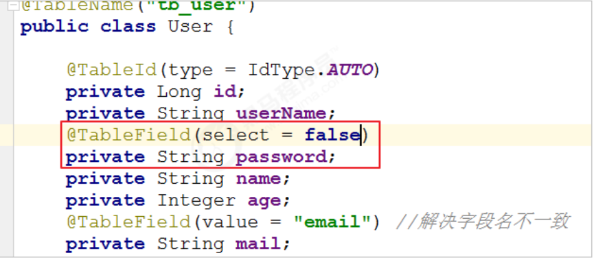
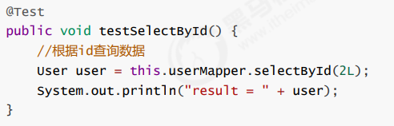
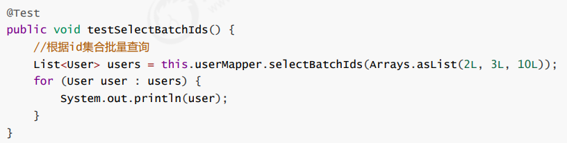
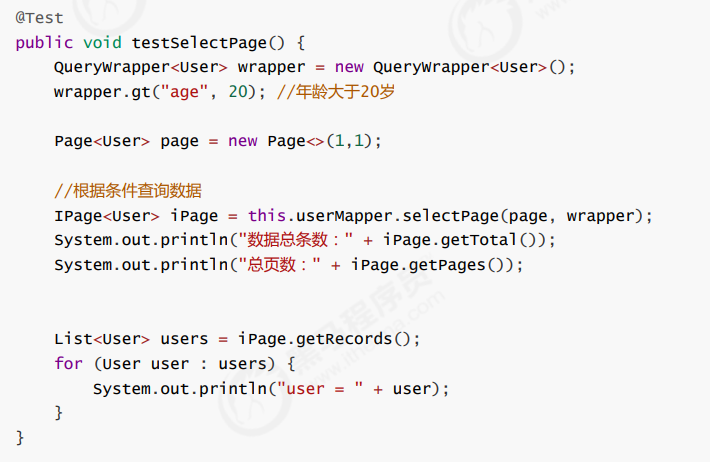

# 通用CRUD

通过前面的学习，我们了解到通过继承BaseMapper就可以获取到各种各样的单表操作，接下来我们将详细讲解这些操作。



## 插入操作

### 定义

```java
/**
* 插入一条记录
*
* @param entity 实体对象
*/
int insert(T entity);
```

### 测试用例

```java
@SpringBootTest
  public class UserMapperTest {
    @Autowired
    private UserMapper userMapper;

    @Test
    public void testInsert() {
      User user = new User();
      user.setAge(20);
      user.setEmail("test@itcast.cn");
      user.setName("曹操");
      user.setUserName("caocao");
      user.setPassword("123456");
      int result = this.userMapper.insert(user); //返回的result是受影响的行数，并不是自增后的id
      System.out.println("result = " + result);
      System.out.println(user.getId()); //自增后的id会回填到对象中
    }
  }
```

### 主键生成策略



可以看到，数据已经写入到了数据库，但是，id的值不正确，我们期望的是数据库自增长，实际是MP生成了id的值写入到了数据库。

如何设置id的生成策略呢？使用可见@TableId内容

MP支持的id策略：

```java
@Getter
public enum IdType {
    /**
     * 数据库ID自增
     * <p>该类型请确保数据库设置了 ID自增 否则无效</p>
     */
    AUTO(0),
    /**
     * 该类型为未设置主键类型(注解里等于跟随全局,全局里约等于 INPUT)
     */
    NONE(1),
    /**
     * 用户输入ID
     * <p>该类型可以通过自己注册自动填充插件进行填充</p>
     */
    INPUT(2),

    /* 以下3种类型、只有当插入对象ID 为空，才自动填充。 */
    /**
     * 分配ID (主键类型为number或string）,
     * 默认实现类 {@link com.baomidou.mybatisplus.core.incrementer.DefaultIdentifierGenerator}(雪花算法)
     *
     * @since 3.3.0
     */
    ASSIGN_ID(3),
    /**
     * 分配UUID (主键类型为 string)
     * 默认实现类 {@link com.baomidou.mybatisplus.core.incrementer.DefaultIdentifierGenerator}(UUID.replace("-",""))
     */
    ASSIGN_UUID(4);

    private final int key;

    IdType(int key) {
        this.key = key;
    }
}
```

### @TableId

指定id类型为自增长

```java
  @Data
  @NoArgsConstructor
  @AllArgsConstructor
  @TableName("tb_user")
  public class User {
    @TableId(type = IdType.AUTO) //指定id类型为自增长
    private Long id;
    private String userName;
    private String password;
    private String name;
    private Integer age;
    private String email;
  }
```

### @TableField

在MP中通过@TableField注解可以指定字段的一些属性，常常解决的问题有2个：

1. 对象中的属性名和字段名不一致的问题（非驼峰）
2. 对象中的属性字段在表中不存在的问题

使用：



其他用法，如大字段不加入查询字段：



## 更新操作

在MP中，更新操作有2种，一种是根据id更新，另一种是根据条件更新。

### 定义

```java
/**
* 根据 ID 修改
*
* @param entity 实体对象
*/
int updateById(@Param(Constants.ENTITY) T entity);

/**
* 根据 whereEntity 条件，更新记录
*
* @param entity 实体对象 (set 条件值,可以为 null)
* @param updateWrapper 实体对象封装操作类（可以为 null,里面的 entity 用于生成 where 语句）
*/
int update(@Param(Constants.ENTITY) T entity, @Param(Constants.WRAPPER) Wrapper<T> updateWrapper);
```

### 测试用例

#### 依据主键更新

```java
@Test
  public void testUpdateById() {
    User user = new User();
    user.setId(6L); //主键
    user.setAge(21); //更新的字段
//根据id更新，更新不为null的字段
    this.userMapper.updateById(user);
  }
```

#### 依据条件更新

```java
@Test
  public void testUpdate() {

    User user = new User();
    user.setAge(22); //更新的字段
    //更新的条件
    QueryWrapper<User> wrapper = new QueryWrapper<>();
    wrapper.eq("id", 6);
    //执行更新操作
    int result = this.userMapper.update(user, wrapper);
    System.out.println("result = " + result);
  }
```

或者，通过UpdateWrapper进行更新：

```java
  @Test
  public void testUpdate() {
//更新的条件以及字段
    UpdateWrapper<User> wrapper = new UpdateWrapper<>();
    wrapper.eq("id", 6).set("age", 23);
//执行更新操作
    int result = this.userMapper.update(null, wrapper);
    System.out.println("result = " + result);
  }

```

均可达到更新的效果。关于wrapper更多的用法后面会详细讲解。

## 删除操作

### 定义

```java
/**
* 根据 ID 删除
*
* @param id 主键ID
*/
int deleteById(Serializable id);


/**
* 根据 columnMap 条件，删除记录
*
* @param columnMap 表字段 map 对象
*/
int deleteByMap(@Param(Constants.COLUMN_MAP) Map<String, Object> columnMap);

/**
* 根据 entity 条件，删除记录
*
* @param wrapper 实体对象封装操作类（可以为 null）
*/
int delete(@Param(Constants.WRAPPER) Wrapper<T> wrapper);

/**
* 删除（根据ID 批量删除）
*
* @param idList 主键ID列表(不能为 null 以及 empty)
*/
int deleteBatchIds(@Param(Constants.COLLECTION) Collection<? extends Serializable> idList);
```

### 测试用例

#### deleteById

```java
  @Test
  public void testDeleteById() {
//执行删除操作
    int result = this.userMapper.deleteById(6L);
    System.out.println("result = " + result);
  }
```

#### deleteByMap

```java
  @Test
  public void testDeleteByMap() {
    Map<String, Object> columnMap = new HashMap<>();
    columnMap.put("age", 20);
    columnMap.put("name", "张三");
//将columnMap中的元素设置为删除的条件，多个之间为and关系
    int result = this.userMapper.deleteByMap(columnMap);
    System.out.println("result = " + result);
  }
```

#### delete

```java
  @Test
  public void testDeleteByMap() {
    User user = new User();
    user.setAge(20);
    user.setName("张三");
    //将实体对象进行包装，包装为操作条件（比较推荐）
    //如果不想使用可以玩QueryWrapper
    QueryWrapper<User> wrapper = new QueryWrapper<>(user);
    int result = this.userMapper.delete(wrapper);
    System.out.println("result = " + result);
  }

```

#### deleteBatchIds

```java
  @Test
  public void testDeleteByMap() {
//根据id集合批量删除
    int result = this.userMapper.deleteBatchIds(Arrays.asList(1L,10L,20L));
    System.out.println("result = " + result);
  }
```

## 查询操作

MP提供了多种查询操作，包括根据id查询、批量查询、查询单条数据、查询列表、分页查询等操作。

### selectById

```java
/**
* 根据 ID 查询
*
* @param id 主键ID
*/
T selectById(Serializable id);
```



### selectBatchIds

```java
/**
* 查询（根据ID 批量查询）
*
* @param idList 主键ID列表(不能为 null 以及 empty)
*/
List<T> selectBatchIds(@Param(Constants.COLLECTION) Collection<? extends Serializable> idList);
```



### selectOne

```java
/**
* 根据 entity 条件，查询一条记录
*
* @param queryWrapper 实体对象封装操作类（可以为 null）
*/
T selectOne(@Param(Constants.WRAPPER) Wrapper<T> queryWrapper);
```

```java
  @Test
  public void testSelectOne() {
    QueryWrapper<User> wrapper = new QueryWrapper<User>();
    wrapper.eq("name", "李四");
//根据条件查询一条数据，如果结果超过一条会报错
    User user = this.userMapper.selectOne(wrapper);
    System.out.println(user);
  }
```

### selectCount

```java
/**
* 根据 Wrapper 条件，查询总记录数
*
* @param queryWrapper 实体对象封装操作类（可以为 null）
*/
Integer selectCount(@Param(Constants.WRAPPER) Wrapper<T> queryWrapper);
```

```java
@Test
  public void testSelectCount() {
    QueryWrapper<User> wrapper = new QueryWrapper<User>();
    wrapper.gt("age", 23); //年龄大于23岁
//根据条件查询数据条数
    Integer count = this.userMapper.selectCount(wrapper);
    System.out.println("count = " + count);
  }
```

### selectList

```java
/**
* 根据 entity 条件，查询全部记录
*
* @param queryWrapper 实体对象封装操作类（可以为 null）
*/
List<T> selectList(@Param(Constants.WRAPPER) Wrapper<T> queryWrapper);

```

```java
 @Test
  public void testSelectList() {
    QueryWrapper<User> wrapper = new QueryWrapper<User>();
    wrapper.gt("age", 23); //年龄大于23岁
//根据条件查询数据
    List<User> users = this.userMapper.selectList(wrapper);
    for (User user : users) {
      System.out.println("user = " + user);
    }
  }
```

### selectPage

```java
/**
* 根据 entity 条件，查询全部记录（并翻页）
*
* @param page 分页查询条件（可以为 RowBounds.DEFAULT）
* @param queryWrapper 实体对象封装操作类（可以为 null）
*/
IPage<T> selectPage(IPage<T> page, @Param(Constants.WRAPPER) Wrapper<T> queryWrapper);
```

配置分页插件

```java
//旧版已经过期
@Configuration
@MapperScan("com.example.mapper")
public class MyBtaisPlusConfig {

  @Bean
  public PaginationInnerInterceptor paginationInnerInterceptor(){
    return new PaginationInnerInterceptor();
  }

}

//或者

@Configuration
@MapperScan("scan.your.mapper.package")
public class MybatisPlusConfig {

    /**
     * 新的分页插件,一缓和二缓遵循mybatis的规则,需要设置 MybatisConfiguration#useDeprecatedExecutor = false 避免缓存出现问题(该属性会在旧插件移除后一同移除)
     */
    @Bean
    public MybatisPlusInterceptor mybatisPlusInterceptor() {
        MybatisPlusInterceptor interceptor = new MybatisPlusInterceptor();
        interceptor.addInnerInterceptor(new PaginationInnerInterceptor(DbType.H2));
        return interceptor;
    }

    //有点小问题
    @Bean
    public ConfigurationCustomizer configurationCustomizer() {
        return configuration -> configuration.setUseDeprecatedExecutor(false);
    }
}
```


