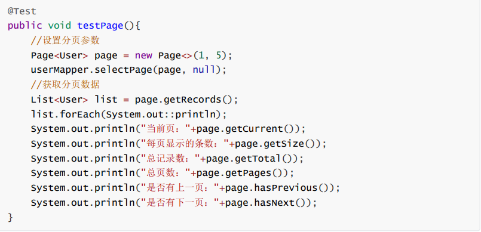
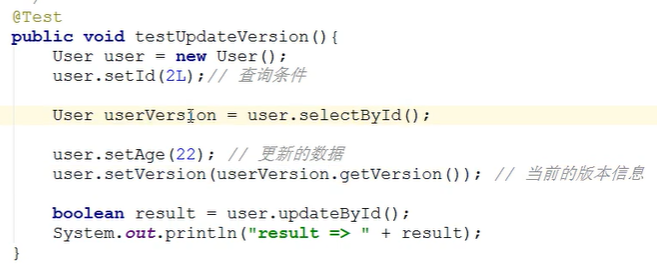

# 插件

## mybatis的插件机制

MyBatis 允许你在已映射语句执行过程中的某一点进行拦截调用。默认情况下，MyBatis 允许使用插件来拦截的方法

调用包括：

1. Executor (update, query, flushStatements, commit, rollback, getTransaction, close, isClosed)
2. ParameterHandler (getParameterObject, setParameters)
3. ResultSetHandler (handleResultSets, handleOutputParameters)
4. StatementHandler (prepare, parameterize, batch, update, query)

我们看到了可以拦截Executor接口的部分方法，比如update，query，commit，rollback等方法，还有其他接口的一些方法等。

总体概括为：

1. 拦截执行器的方法
2. 拦截参数的处理
3. 拦截结果集的处理
4. 拦截Sql语法构建的处理

拦截器示例：

```java
@Intercepts({@Signature(
        type= Executor.class,//拦截类型
        method = "update",//拦截的操作
        args = {MappedStatement.class,Object.class})})
public class MyInterceptor implements Interceptor {
  @Override
  public Object intercept(Invocation invocation) throws Throwable {
    //拦截方法，具体业务逻辑编写的位置
    return invocation.proceed();
  }

  @Override
  public Object plugin(Object target) {
    //创建target对象的代理对象,目的是将当前拦截器加入到该对象中
    return Plugin.wrap(target, this);
  }

  @Override
  public void setProperties(Properties properties) {
    //属性设置
  }
}
```

注入到Spring容器：

```java
@Bean
  public MyInterceptor myInterceptor(){
    return new MyInterceptor();
  }
```

或者通过xml配置，mybatis-config.xml：

```xml
<?xml version="1.0" encoding="UTF-8" ?>
<!DOCTYPE configuration
	PUBLIC "-//mybatis.org//DTD Config 3.0//EN"
	"http://mybatis.org/dtd/mybatis-3-config.dtd">
<configuration>
	<plugins> 
		<plugin interceptor="cn.itcast.mp.plugins.MyInterceptor">			</plugin>
	</plugins>
</configuration>

```

## 分页插件

MyBatis Plus自带分页插件，只要简单的配置即可实现分页功能

```java
@Bean
  public MybatisPlusInterceptor mybatisPlusInterceptor() {
    MybatisPlusInterceptor interceptor = new MybatisPlusInterceptor();
    //分页
    interceptor.addInnerInterceptor(new PaginationInnerInterceptor(DbType.MYSQL));
    return interceptor;
  }
```



## 执行分析插件

在MP中提供了对SQL执行的分析的插件，可用作阻断全表更新、删除的操作，注意：该插件仅适用于开发环境，不适用于生产环境。

SpringBoot配置：

```java
@Bean
  public MybatisPlusInterceptor mybatisPlusInterceptor() {
    MybatisPlusInterceptor interceptor = new MybatisPlusInterceptor();
    //分页
    interceptor.addInnerInterceptor(new PaginationInnerInterceptor(DbType.MYSQL));
    //分析器
    interceptor.addInnerInterceptor(new BlockAttackInnerInterceptor());
    return interceptor;
  }
```

## 性能分析插件

3.2.0后被移除了，官方推荐使用第三方的

### 旧版

性能分析拦截器，用于输出每条 SQL 语句及其执行时间，可以设置最大执行时间，超过时间会抛出异常。该插件只用于开发环境，不建议生产环境使用。

```xml
<!-- SQL 执行性能分析，开发环境使用，线上不推荐。 maxTime 指的是 sql 最大执行时长 -->
<plugin interceptor="com.baomidou.mybatisplus.extension.plugins.PerformanceInterceptor">
	<property name="maxTime" value="100" />
	<!--SQL是否格式化 默认false--> 
	<property name="format" value="true" />
</plugin>
```

### 新版

```xml
<dependency>
  <groupId>p6spy</groupId>
  <artifactId>p6spy</artifactId>
  <version>最新版本</version>
</dependency>
```

```yml
spring:
  datasource:
    driver-class-name: com.p6spy.engine.spy.P6SpyDriver
    url: jdbc:p6spy:h2:mem:test
```

spy.properties 配置：

```properties
#3.2.1以上使用
modulelist=com.baomidou.mybatisplus.extension.p6spy.MybatisPlusLogFactory,com.p6spy.engine.outage.P6OutageFactory
#3.2.1以下使用或者不配置
#modulelist=com.p6spy.engine.logging.P6LogFactory,com.p6spy.engine.outage.P6OutageFactory
# 自定义日志打印
logMessageFormat=com.baomidou.mybatisplus.extension.p6spy.P6SpyLogger
#日志输出到控制台
appender=com.baomidou.mybatisplus.extension.p6spy.StdoutLogger
# 使用日志系统记录 sql
#appender=com.p6spy.engine.spy.appender.Slf4JLogger
# 设置 p6spy driver 代理
deregisterdrivers=true
# 取消JDBC URL前缀
useprefix=true
# 配置记录 Log 例外,可去掉的结果集有error,info,batch,debug,statement,commit,rollback,result,resultset.
excludecategories=info,debug,result,commit,resultset
# 日期格式
dateformat=yyyy-MM-dd HH:mm:ss
# 实际驱动可多个
#driverlist=org.h2.Driver
# 是否开启慢SQL记录
outagedetection=true
# 慢SQL记录标准 2 秒
outagedetectioninterval=2
```

注意！

* driver-class-name 为 p6spy 提供的驱动类
* url 前缀为 jdbc:p6spy 跟着冒号为对应数据库连接地址
* 打印出 sql 为 null,在 excludecategories 增加 commit
* 批量操作不打印 sql,去除 excludecategories 中的 batch
* 批量操作打印重复的问题请使用 MybatisPlusLogFactory (3.2.1 新增）
* 该插件有性能损耗，不建议生产环境使用。

## 乐观锁插件

当要更新一条记录的时候，希望这条记录没有被别人更新

乐观锁实现方式：

* 取出记录时，获取当前 version
* 更新时，带上这个 version
* 执行更新时， set version = newVersion where version = oldVersion
* 如果 version 不对，就更新失败

### 配置插件

spring boot 注解方式:

```java
@Bean
public MybatisPlusInterceptor mybatisPlusInterceptor() {
    MybatisPlusInterceptor interceptor = new MybatisPlusInterceptor();
    interceptor.addInnerInterceptor(new OptimisticLockerInnerInterceptor());
    return interceptor;
}
```

spring xml 方式:

```xml
<bean class="com.baomidou.mybatisplus.extension.plugins.inner.OptimisticLockerInnerInterceptor" id="optimisticLockerInnerInterceptor"/>

<bean id="mybatisPlusInterceptor" class="com.baomidou.mybatisplus.extension.plugins.MybatisPlusInterceptor">
    <property name="interceptors">
        <list>
            <ref bean="optimisticLockerInnerInterceptor"/>
        </list>
    </property>
</bean>
```

### 在实体类的字段上加上 `@Version`注解

```java
@Version
private Integer version;
```

说明:

* **支持的数据类型只有:int,Integer,long,Long,Date,Timestamp,LocalDateTime**
* 整数类型下 `newVersion = oldVersion + 1`
* `newVersion` 会回写到 `entity` 中
* 仅支持 `updateById(id)` 与 `update(entity, wrapper)` 方法
* **在 `update(entity, wrapper)` 方法下, `wrapper` 不能复用!!!**


