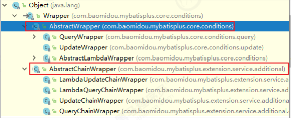

# 条件构造器

在MP中，Wrapper接口的实现类关系如下：



可以看到，AbstractWrapper和AbstractChainWrapper是重点实现，接下来我们重点学习AbstractWrapper以及其子类。

警告：不支持以及不赞成在 RPC 调用中把 Wrapper 进行传输

AbstractWrapper

说明：QueryWrapper(LambdaQueryWrapper) 和UpdateWrapper (LambdaUpdateWrapper)  的父类 用于生成 sql的 where 条件, entity 属性也用于生成 sql 的 where 条件

注意: entity 生成的 where 条件与 使用各个 api 生成的 where 条件没有任何关联行为

### alleq

个别参数说明: params : key 为数据库字段名, value 为字段值 null2IsNull : 为 true 则在 map 的 value 为null 时调用 isNull 方法,为 false 时则忽略 value 为 null 的

个别参数说明: filter : 过滤函数,是否允许字段传入比对条件中 params 与 null2IsNull : 同上

```java
@Test
  public void testWrapper() {
    QueryWrapper<User> wrapper = new QueryWrapper<>();
//设置条件
    Map<String, Object> params = new HashMap<>();
    params.put("name", "曹操");
    params.put("age", "20");
    params.put("password", null);
// wrapper.allEq(params);//SELECT * FROM tb_user WHERE password IS NULL AND name = ?AND age = ?
// wrapper.allEq(params,false); //SELECT * FROM tb_user WHERE name = ? AND age = ?
// wrapper.allEq((k, v) -> (k.equals("name") || k.equals("age")) ,params);//SELECT * FROM tb_user WHERE name = ? AND age = ?
    List<User> users = this.userMapper.selectList(wrapper);
    for (User user : users) {
      System.out.println(user);
    }
  }
```

### 基本比较操作

略

### 模糊查询

略

### 排序

略

### 逻辑查询

#### or

主动调用 or 表示紧接着下一个方法不是用 and 连接!(不调用 or 则默认为使用 and 连接)

```java
wrapper.eq("name","李四").or().eq("age", 24);
```
