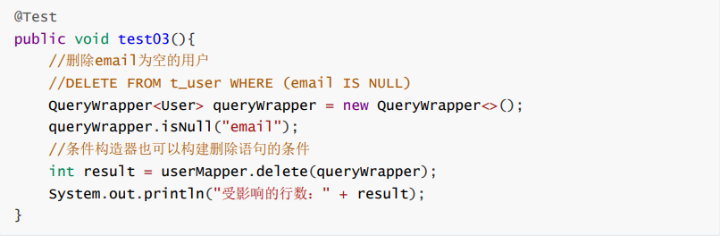

# 条件构造器

在MP中，Wrapper接口的实现类关系如下：

* Wrapper ： 条件构造抽象类，最顶端父类
* AbstractWrapper ： 用于查询条件封装，生成 sql 的 where 条件
* QueryWrapper ： 查询条件封装
* UpdateWrapper ： Update 条件封装
* AbstractLambdaWrapper ： 使用Lambda 语法
* LambdaQueryWrapper ：用于Lambda语法使用的查询Wrapper
* LambdaUpdateWrapper ： Lambda 更新封装Wrapper

## QueryWrapper

### 组装查询条件

### 组装排序条件

### 组装删除条件

### 条件的优先级

### 组装select子句

### 实现子查询

## UpdateWrapper

## condition

在真正开发的过程中，组装条件是常见的功能，而这些条件数据来源于用户输入，是可选的，因此我们在组装这些条件时，必须先判断用户是否选择了这些条件，若选择则需要组装该条件，若没有选择则一定不能组装，以免影响SQL执行的结果

### 思路一

### 思路二

上面的实现方案没有问题，但是代码比较复杂，我们可以使用带condition参数的重载方法构建查询条件，简化代码的编写

## LambdaQueryWrapper

## LambdaUpdateWrapper

