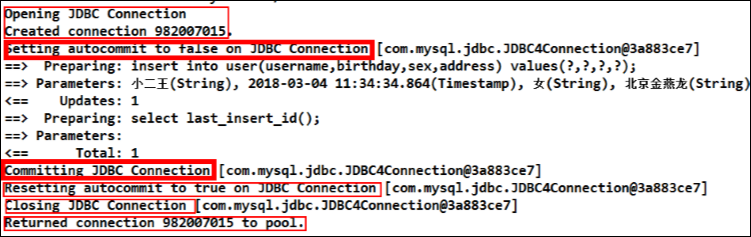
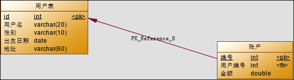
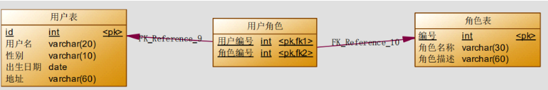

# Mybatis

## 三层架构

表现层：用于展示数据的

业务层：处理业务需求

持久层：和数据库交互的

## mybatis入门

* mybatis的环境搭建
  * 第一步：创建maven工程并导入坐标

    ```xml
        <!-- https://mvnrepository.com/artifact/org.mybatis/mybatis -->
        <dependency>
          <groupId>org.mybatis</groupId>
          <artifactId>mybatis</artifactId>
          <version>3.5.11</version>
        </dependency>
        <dependency>
          <groupId>log4j</groupId>
          <artifactId>log4j</artifactId>
          <version>1.2.12</version>
        </dependency>
        <dependency>
          <groupId>mysql</groupId>
          <artifactId>mysql-connector-java</artifactId>
          <version>8.0.17</version>
        </dependency>
        <dependency>
          <groupId>org.projectlombok</groupId>
          <artifactId>lombok</artifactId>
          <version>1.18.12</version>
        </dependency>
    ```
  * 第二步：创建实体类和mapper接口

    ```java
    package com.bobo.entity;

    import lombok.AllArgsConstructor;
    import lombok.Data;
    import lombok.NoArgsConstructor;
    import lombok.ToString;

    @Data
    @AllArgsConstructor
    @NoArgsConstructor
    @ToString
    public class Class_ {
      private String classNo;
      private String className;
      private String leaderTeacher;
    }
    ```

    ```java
    package com.bobo.mapper;

    import java.util.List;

    import com.bobo.entity.Class_;

    public interface ClassMapper {
      List<Class_> findAll();
    }

    ```
  * 第三步：创建mybatis的主配置文件mybatis-config.xml

    ```xml
    <?xml version="1.0" encoding="UTF-8" ?>
    <!DOCTYPE configuration
            PUBLIC "-//mybatis.org//DTD Config 3.0//EN"
            "http://mybatis.org/dtd/mybatis-3-config.dtd">
    <configuration>

        <!-- <typeAliases>
            <package name="com.bobo.entity"/>
        </typeAliases> -->

        <properties resource="db.properties"/>

        <!--
        environments：配置数据库连接环境信息。可以配置多个environment，通过default属性切换不同的environment
        -->
        <environments default="development">
            <environment id="development">
                <transactionManager type="JDBC"/>
                <dataSource type="POOLED">
                    <!--数据库连接信息-->
                    <property name="driver" value="${driverClassName}"/>
                    <property name="url" value="${url}"/>
                    <property name="username" value="${username}"/>
                    <property name="password" value="${password}"/>
                </dataSource>
            </environment>

            <!-- <environment id="test">
                <transactionManager type="JDBC"/>
                <dataSource type="POOLED"> -->
                    <!--数据库连接信息-->
                    <!-- <property name="driver" value="com.mysql.jdbc.Driver"/>
                    <property name="url" value="jdbc:mysql:///mybatis?useSSL=false"/>
                    <property name="username" value="root"/>
                    <property name="password" value="123456"/>
                </dataSource>
            </environment> -->
        </environments>
        <mappers>
           <!--加载sql映射文件-->
           <!-- <mapper resource="com/bobo/mapper/ClassMapper.xml"/> -->
           <package  name="com.bobo.mapper"/>
        </mappers>
    </configuration>
    ```
  * 第四步：创建映射配置文件ClassMapper.xml

    ```xml
    <?xml version="1.0" encoding="UTF-8" ?>
    <!DOCTYPE mapper PUBLIC "-//mybatis.org//DTD Mapper 3.0//EN" "http://mybatis.org/dtd/mybatis-3-mapper.dtd">

    <mapper namespace="com.bobo.mapper.ClassMapper">
        <select id="findAll" resultType="com.bobo.entity.Class_">
            select * from class;
        </select>
    </mapper>
    ```
* 搭建环境的注意事项
  * 一：创建IUserDao.xml和IUserDao.java是名称是为了和之前的只是保持一致。在mybatis中它把持久层的操作接口名称和映射文件也叫做：Mapper
  * 二：在idea中创建目录的时候，它和包是不一样的。包在创建时：com.itheima.mapper是三级结构；目录在创建时：com.itheima.mapper是一级目录
  * 三：mybatis的映射配置xml文件位置必须和mapper接口的包结构相同
  * 四：映射配置文件的mapper标签namespace属性的取值必须是mapper接口的全限定类名
  * 五：映射配置文件的操作配置（select），id属性的取值必须是mapper接口的方法名

当我们遵从了三四五点之后，我们在开发中就无须在写mapper接口的实现类。

* mybatis的入门案例
  * 第一步：读取配置文件
  * 第二步：创建SQLSessionFactory工厂
  * 第三步：创建SQLSession
  * 第四步：创建代理Mapper接口的代理对象
  * 第五步：执行Mapper中的方法
  * 第六步：释放资源

```java
// 1.声明一个工厂对象
  private static SqlSessionFactory factory;
  // 2.在静态代码块中创建会话工厂
  static {
    SqlSessionFactoryBuilder builder = new SqlSessionFactoryBuilder();
    // 得到输入流
    try (InputStream inputStream = Resources.getResourceAsStream("mybatis-config.xml");) {
      factory = builder.build(inputStream);
    } catch (IOException e) {
      e.printStackTrace();
    }
  }

  // 3.静态方法得到会话工厂
  public static SqlSessionFactory getSessionFactory() {
    return factory;
  }

  // 4.得到会话对象
  public static SqlSession getSession() {
    return factory.openSession();
  }
```

```java
    // 1.通过工具类得到会话对象
    SqlSession session = MybatisUtils.getSession();
    // 2.会话对象的得到UserMapper接口代理对象
    ClassMapper classMapper = session.getMapper(ClassMapper.class);
    // 3.生成了代理对象
    System.out.println(classMapper);
    // 4.执行查询操作
    List<Class_> class_ = classMapper.findAll();
    // 5.遍历
    class_.stream().forEach(System.out::println);
    // 6.关闭会话
    session.close();
```

* mybatis基于注解的入门案例

把Mapper.xml移除，在Mapper接口的方法上使用@select注解，并且指定SQL语句。同时需要在config.xml中的mapper配置时，使用class属性指定Mapper接口的全限定类名。

## 基于代理dao实现CRUD操作

使用要求：

1. 持久层接口和持久层接口的映射配置必须在相同的包下
2. 持久层映射配置中mapper标签的namespace属性取值必须是持久层接口的全限定类名
3. SQL语句的配置标签 `<select>`,`<insert>`,`<delete>`,`<update>`的id属性必须和持久层接口的方法名相同

### 查询操作

```java
/**
* 根据 id 查询
* @param userId
* @return
*/
User findById(Integer userId)
```

```xml
<!-- 根据 id 查询 --> 
<select id="findById" resultType="com.itheima.domain.User" parameterType="int">
select * from user where id = #{uid}
</select>
```

1. resultType 属性：用于指定结果集的类型。
2. parameterType 属性：用于指定传入参数的类型。
3. sql 语句中使用#{}：它代表占位符，相当于原来 jdbc 部分所学的?，都是用于执行语句时替换实际的数据。具体的数据是由#{}里面的内容决定的。
4. #{}中内容的写法：由于数据类型是基本类型，所以此处可以随意写。

### 插入操作

```java
/**
* 保存用户
* @param user
* @return 影响数据库记录的行数
*/
int saveUser(User user);
```

```xml
<!-- 保存用户 -->
<!-- 保存用户-->
<insert id="saveUser" parameterType="com.itheima.domain.User">
insert into user(username,birthday,sex,address)  values(#{username},#{birthday},#{sex},#{address})
</insert>
```

1. patameterType属性：代表参数的类型，因为我们要传入的是一个类的对象，所以类型就写类的全名称。
2. SQL语句中使用#{}字符：它代表占位符，相当于原来jdbc部分所学的？，都是用于执行语句是替换实际的数据。具体的数据是由#{}里面的内容决定的。
3. #{}中内容的写法：由于我们保存方法的参数是一个User对象，此处要写User对象中的属性名称，他用的是OGNL表达式。
4. OGNL表达式：语法格式就是使用 #{对象.对象}的方式。#{user.username}它会先去找 user 对象，然后在 user 对象中找到 username 属性，并调用getUsername()方法把值取出来。但是我们在 parameterType 属性上指定了实体类名称，所以可以省略 user，而直接写 username。

### 更新操作

```java
/**
* 更新用户
* @param user
* @return 影响数据库记录的行数
*/
int updateUser(User user);
```

```xml
<!-- 更新用户 -->
<update id="updateUser" parameterType="com.itheima.domain.User">
	update user set username=#{username},birthday=#{birthday},sex=#{sex},address=#{address} where id=#{id}
<update>
```

### 删除操作

```java
/**
* 根据id删除用户
* @param userId
* @return 
*/
int deleteUser(Integer userId);
```

```xml
<!-- 删除用户 -->
<delete id="deleteUser" parameterType="java.lang.Integer">
	delete from user where id = #{uid}
<delete>
```

### 模糊查询

```java
/**
* 根据名称模糊查询
* @param username
* @return 
*/
List<User> findByName(String username);
```

```xml
<!-- 根据名称模糊查询 -->
<select id="findByName" resultType="com.itheima.domain.User" parameterType="String">
	select * from user where username like #{username}
</select>
模糊查询的另一种配置方式
<!-- 根据名称模糊查询 -->
<select id="findByName" resultType="com.itheima.domain.User" parameterType="String">
	select * from user where username like '%${value}%'
</select>
```

#### #{}和 ${}的区别

**#{}表示一个占位符号**

通过#{}可以实现preparedStatement向占位符中设置值，自动进行java类型和jdbc类型转换，#{}可以有效防止SQL注入。#{}可以接受简单类型值或pojo属性值。如果parameterType传输单个简单类型值，#{}扩号中可以是value或其他名称。

**${}表示拼接 sql 串**

通过 `${}`可以将 parameterType 传入的内容拼接在 sql中且不进行 jdbc 类型转换， `${}`可以接收简单类型值或 pojo 属性值，如果 parameterType 传输单个简单类型值，`${}`括号中只能是 value。

#### resultType

对于resultType的情况是比较简单的，一般来说**增删改**中mapper.xml文件中对应的resultType是不需要写的，因为增删改方法的返回值都是影响行数的int，mybatis自行处理，是不需要写的。

## Mybatis的参数深入

### parameterType 配置参数

**使用说明**

上一章节中已经介绍了 SQL 语句传参，使用标签的 parameterType 属性来设定。该属性的取值可以是基本类型，引用类型（例如:String 类型），还可以是实体类类型（POJO 类）。同时也可以使用实体类的包装类，本章节将介绍如何使用实体类的包装类作为参数传递。

**注意事项**

1. 在使用parameterType时，参数类型，只能传一个参数，如果有多个参数时要封装，如封装成一个类，要包名加上类名，基本数据类型可以省略。
2. 基本类型和 String 我们可以直接写类型名称 ，也可以使用 包名.类名 的方式，例如 ： `java.lang.String` 。实体类类型目前我们只能使用全限定类名，究其原因是因为 mybaits 在加载时已经把常用的数据类型注册了别名，从而我们在使用时可以不写包名，而我们的是实体类并没有注册别名，所以必须写全限定类名。接下来将讲解如何注册实体类的别名。

### 传递poji包装对象

开发中通过 pojo 传递查询条件 ，查询条件是综合的查询条件，不仅包括用户查询条件还包括其它的查询条件（比如将用户购买商品信息也作为查询条件），这时可以使用包装对象传递输入参数。Pojo 类中包含 pojo。

需求：根据用户名查询用户信息，查询条件放到 QueryVo 的 user 属性中。

编写QueryVo

```java
public class QueryVo implements Serializable {
	private User user;
	public User getUser() {
		return user;
 	}
	public void setUser(User user) {
		this.user = user;
	}
}
```

编写持久层接口

```java
public interface IUserDao {
	/**
	* 根据 QueryVo 中的条件查询用户
	* @param vo
	* @return
	*/
	List<User> findByVo(QueryVo vo);
}
```

持久层接口的映射文件

```java
<!-- 根据用户名称模糊查询，参数变成一个 QueryVo 对象了 --> 
<select id="findByVo" resultType="com.itheima.domain.User"
 parameterType="com.itheima.domain.QueryVo">
	select * from user where username like #{user.username};
</select>
```

## Mybatis的输出结果封装

### resultType配置结果类型

resultType 属性可以指定结果集的类型，它支持基本类型和实体类类型。

需要注意的是，它和 parameterType 一样，如果注册过类型别名的，可以直接使用别名。没有注册过的必须使用全限定类名。

例如：我们的实体类此时必须是全限定类名。一对一、一对多时，若有表的字段相同必须写别名，不然查询结果无法正常映射，出现某属性为空或者返回的结果与预想的不一致，而这往往是没有报错的。

### resultMap结果类型

resultMap 标签可以建立查询的列名和实体类的属性名称不一致时建立对应关系，从而实现封装。

在 select 标签中使用 resultMap 属性指定引用即可。同时 resultMap 可以实现将查询结果映射为复杂类型的 pojo

比如在查询结果映射对象中包括 pojo 和 list 实现一对一查询和一对多查询。

```xml
<!-- 建立 User 实体和数据库表的对应关系
	type 属性：指定实体类的全限定类名
	id 属性：给定一个唯一标识，是给查询 select 标签引用用的。
--> 
<resultMap type="com.itheima.domain.User" id="userMap">
	<id column="id" property="userId"/>
	<result column="username" property="userName"/>
	<result column="sex" property="userSex"/>
	<result column="address" property="userAddress"/>
	<result column="birthday" property="userBirthday"/>
</resultMap>
id 标签：用于指定主键字段
result 标签：用于指定非主键字段
column 属性：用于指定数据库列名
property 属性：用于指定实体类属性名称
```

```xml
<!-- 配置查询所有操作 --> 
<select id="findAll" resultMap="userMap">
	select * from user
</select>
```

强烈建议开启自动驼峰转换

在配置文件中加入

```xml
<settings>
    <!--将下划线映射为驼峰-->
    <setting name="mapUnderscoreToCamelCase" value="true"/>
</settings>
```

## mybatis-config.xml配置文件

### 配置的内容和顺序

```xml
-properties（属性）
	--property
-settings（全局配置参数）
	--setting
-typeAliases（类型别名）
	--typeAliase
	--package
-typeHandlers（类型处理器）
-objectFactory（对象工厂）
-plugins（插件）
-environments（环境集合属性对象）
	--environment（环境子属性对象）
		---transactionManager（事务管理）
		---dataSource（数据源）
-mappers（映射器）
	--mapper
	--package
```

### properties（属性）

在使用 properties 标签配置时，我们可以采用两种方式指定属性配置

**第一种**

```xml
<properties> 
	<property name="jdbc.driver" value="com.mysql.jdbc.Driver"/>
	<property name="jdbc.url" value="jdbc:mysql://localhost:3306/eesy"/>
	<property name="jdbc.username" value="root"/>
	<property name="jdbc.password" value="root"/>
</properties>
```

**第二种**

定义db.properties

```properties
jdbc.driver=com.mysql.jdbc.Driver
jdbc.url=jdbc:mysql://localhost:3306/eesy
jdbc.username=root
jdbc.password=root
```

```xml
<!--多种形式，自行搜索-->
<properties resource="db.properties"/>
<!--此时我们的 dataSource 标签就变成了引用上面的配置-->
<dataSource type="POOLED"> 
	<property name="driver" value="${jdbc.driver}"/>
	<property name="url" value="${jdbc.url}"/>
	<property name="username" value="${jdbc.username}"/>
	<property name="password" value="${jdbc.password}"/>
</dataSource>
```

### typeAliases（类型别名）

在前面我们讲的 Mybatis 支持的默认别名，我们也可以采用自定义别名方式来开发。
自定义别名：

```xml
<!--在 SqlMapConfig.xml 中配置：-->
<typeAliases>
	<!-- 单个别名定义 --> 
	<typeAlias alias="user" type="com.itheima.domain.User"/>
	<!-- 批量别名定义，扫描整个包下的类，别名为类名（首字母大写或小写都可以） --> 
	<package name="com.itheima.domain"/>
	<package name="其它包"/>
</typeAliases>
```

### mappers（映射器）

1. 使用相对于类路径的资源
   如：< mapper resource=“com/itheima/dao/IUserDao.xml” />
2. 使用 mapper 接口类路径
   如：< mapper class=“com.itheima.dao.UserDao”/>
   注意：此种方法要求 mapper 接口名称和 mapper 映射文件名称相同，且放在同一个目录中。
3. 注册指定包下的所有 mapper 接口
   如：< package name=“cn.itcast.mybatis.mapper”/>
   注意：此种方法要求 mapper 接口名称和 mapper 映射文件名称相同，且放在同一个目录中。

## Mybatis执行过程

待定

## Mybatis连接池与事务深入

### Mybatis的连接池技术

Mybatis 中的连接池技术，它采用的是自己的连接池技术。在 Mybatis 的 mybatis-config.xml 配置文件中，通过< dataSource type=”pooled”>来实现 Mybatis 中连接池的配置。

#### Mybatis连接池的分类

Mybatis 将它自己的数据源分为三类：

| UNPOOLED | 不使用连接池的数据源   |
| -------- | ---------------------- |
| POOLED   | 使用连接池的数据源     |
| JNDI     | 使用 JNDI 实现的数据源 |

在这三种数据源中，我们一般采用的是 POOLED 数据源（很多时候我们所说的数据源就是为了更好的管理数据库连接，也就是我们所说的连接池技术）。

#### Mybatis中数据源的配置

```xml
<!-- 配置数据源（连接池）信息 --> 
<dataSource type="POOLED"> 
	<property name="driver" value="${jdbc.driver}"/>
	<property name="url" value="${jdbc.url}"/>
	<property name="username" value="${jdbc.username}"/>
	<property name="password" value="${jdbc.password}"/>
</dataSource>
```

#### Mybatis中DataSource的存取

待定

#### Mybatis中连接的获取过程分析

待定

### Mybatis的事务控制

#### JDBC中事务的回顾

在 JDBC 中我们可以通过手动方式将事务的提交改为手动方式，通过 setAutoCommit()方法就可以调整。
Mybatis 框架因为是对 JDBC 的封装，所以 Mybatis 框架的事务控制方式，本身也是用 JDBC 的setAutoCommit()方法来设置事务提交方式的。

#### Mybatis中事务提交方式

Mybatis 中事务的提交方式，本质上就是调用 JDBC 的 setAutoCommit()来实现事务控制。

运行下面测试代码：

```java
@Test 
public void testSaveUser() throws Exception {
	User user = new User();
        user.setUsername("mybatis user09"); 
        //6.执行操作   
	int res = userDao.saveUser(user);   
	System.out.println(res);   
	System.out.println(user.getId());  
}   
@Before//在测试方法执行之前执行  
public void init()throws Exception { 
	//1.读取配置文件   
	in = Resources.getResourceAsStream("SqlMapConfig.xml");   
	//2.创建构建者对象   
	SqlSessionFactoryBuilder builder = new SqlSessionFactoryBuilder();   
	//3.创建 SqlSession 工厂对象   
	factory = builder.build(in); 
    //4.创建 SqlSession 对象   
	session = factory.openSession(); 
    //5.创建 Dao 的代理对象   
	userDao = session.getMapper(IUserDao.class);  
} 
@After//在测试方法执行完成之后执行  
public void destroy() throws Exception{   
	//7.提交事务 
	session.commit(); 
	//8.释放资源   
	session.close();   
	in.close();  
}
```



这是我们的 Connection 的整个变化过程，通过分析我们能够发现之前的 CUD 操作过程中，我们都要手动进行事务的提交，原因是 setAutoCommit()方法，在执行时它的值被设置为 false 了，所以我们在 CUD 操作中，必须通过 sqlSession.commit()方法来执行提交操作。

#### Mybatis自动提交事务的设置

通过上面的研究和分析，为什么 CUD 过程中必须使用 sqlSession.commit()提交事务？主要原因就是在连接池中取出的连接，都会将调用 connection.setAutoCommit(false)方法，这样我们就必须使用 sqlSession.commit()方法，相当于使用了 JDBC 中的 connection.commit()方法实现事务提交。

明白这一点后，我们现在一起尝试不进行手动提交，一样实现 CUD 操作。

```java
//4.创建 SqlSession 对象
  session = factory.openSession(true);
```

此时事务就设置为自动提交了，同样可以实现CUD操作时记录的保存。虽然这也是一种方式，但就编程而言，设置为自动提交方式为 false 再根据情况决定是否进行提交，这种方式更常用。因为我们可以根据业务情况来决定提交是否进行提交。

## Mybatis的动态SQL语句

Mybatis 的映射文件中，前面我们的 SQL 都是比较简单的，有些时候业务逻辑复杂时，我们的 SQL 是动态变化的，此时在前面的学习中我们的 SQL 就不能满足要求了。

### 动态 SQL 之 < if >标签

我们根据实体类的不同取值，使用不同的 SQL 语句来进行查询。比如在 id 如果不为空时可以根据 id 查询，如果 username 也不为空时还要加入用户名作为条件。这种情况在我们的多条件组合查询中经常会碰到。

```xml
<select id="findByUser" resultType="user" parameterType="user">
	select * from user where 1=1
	<if test="username!=null and username != '' ">
		and username like #{username}
	</if> 
	<if test="address != null">
		and address like #{address}
	</if>
</select>
```

注意：标签的 test 属性中写的是对象的属性名，如果是包装类的对象要使用 OGNL 表达式的写法。
另外要注意 where 1=1 的作用~！防止where无条件出错

### 动态 SQL 之 < where >标签

为了简化上面 where 1=1 的条件拼装，我们可以采用标签来简化开发。

```java
<!-- 根据用户信息查询 --> 
<select id="findByUser" resultType="user" parameterType="user"> 
	<include refid="defaultSql"></include> 
	<where> 
		<if test="username!=null and username != '' ">
			and username like #{username}
		</if> 
		<if test="address != null">
			and address like #{address}
		</if>
	</where>
</select>
```

< where >会判断是否有条件来是否加入sql语句

### 动态标签之 < foreach >标签

传入多个 id 查询用户信息，用下边两个 sql 实现：

```sql
`SELECT * FROM USERS WHERE username LIKE '%张%' AND (id =10 OR id =89 OR id=16)`

`SELECT * FROM USERS WHERE username LIKE '%张%' AND id IN (10,89,16)`
```

这样我们在进行范围查询时，就要将一个集合中的值，作为参数动态添加进来。 这样我们将如何进行参数的传递？

```java
<select id="findIn" resultType="com.bobo.entity.Class_">
        select * from class
        <where> 
            <if test="list != null and list.size() > 0"> 
                <foreach collection="list" open="leader_teacher in ( " close=")" item="uid" separator=",">
                    #{uid}
                </foreach>
            </if>
        </where>
    </select>
```

标签用于遍历集合，它的属性：

* collection:代表要遍历的集合元素，注意编写时不要写#{}
* open:代表语句的开始部分
* close:代表结束部分
* item:代表遍历集合的每个元素，生成的变量名
* sperator:代表分隔符

### Mybatis 中简化编写的 SQL 片段

Sql 中可将重复的 sql 提取出来，使用时用 include 引用即可，最终达到 sql 重用的目的。

```xml
<!-- 抽取重复的语句代码片段 --> 
<sql id="defaultSql">
	select * from user
</sql>

<!-- 配置查询所有操作 --> 
<select id="findAll" resultType="user"> 
	<include refid="defaultSql"></include>
</select>

<!-- 根据 id 查询 --> 
<select id="findById" resultType="UsEr" parameterType="int">
	<include refid="defaultSql"></include>
	where id = #{uid}
</select>
```

## Mybatis 多表查询之一对多

本次案例主要以最为简单的用户和账户的模型来分析Mybatis多表关系。用户为User 表，账户为Account 表。一个用户（User）可以有多个账户（Account）。具体关系如下：



### 一对一查询

需求：查询所有账户信息，关联查询下单用户信息。

注意：因为一个账户信息只能供某个用户使用，所以从查询账户信息出发关联查询用户信息为一对一查询。如果从用户信息出发查询用户下的账户信息则为一对多查询，因为一个用户可以有多个账户。

#### 方式一

定义账户信息的实体类

```java
public class Account implements Serializable {
	private Integer id;
	private Integer uid;
	private Double money;
	...//省略getter/setter/tostring
}
```

定义 AccountUser 类

```java
public class AccountUser extends Account implements Serializable {
	private String username;
	private String address;

	...getter/setter/tostring
}
```

定义 AccountDao.xml 文件中的查询配置信息

```xml
<!-- 配置查询所有操作--> 
<mapper namespace="com.itheima.dao.IAccountDao">
	<select id="findAll" resultType="accountuser">
		select a.*,u.username,u.address from account a,user u where a.uid =u.id;
	</select> 
</mapper>
```

注意：因为上面查询的结果中包含了账户信息同时还包含了用户信息，所以我们的返回值类型 returnType的值设置为 AccountUser 类型，这样就可以接收账户信息和用户信息了。

小结：定义专门的 pojo 类作为输出类型，其中定义了 sql 查询结果集所有的字段。此方法较为简单，企业中使用普遍。

#### 方式二

使用 resultMap，定义专门的 resultMap 用于映射一对一查询结果。通过面向对象的(has a)关系可以得知，我们可以在 Account 类中加入一个 User 类的对象来代表这个账户是哪个用户的。

定义 AccountUser 类

```java
public class Account implements Serializable {
	private Integer id;
	private Integer uid;
	private Double money;
	private User user;
	...getter/setter/tostring
}
```

注意：第二种方式，将返回值改 为了 Account 类型。
因为 Account 类中包含了一个 User 类的对象，它可以封装账户所对应的用户信息。
由于user是一个对象，因此不能直接作为参数传递，需要使用association标签单独处理。

重新定义 AccountDao.xml 文件

```xml
<mapper namespace="com.itheima.dao.IAccountDao">
	<!-- 建立对应关系 --> 
	<resultMap type="account" id="accountMap"> 
		<id column="aid" property="id"/>
		<result column="uid" property="uid"/>
		<result column="money" property="money"/>
		<!-- 它是用于指定从表方的引用实体属性的 --> 
		<association property="user" javaType="user"> 
			<id column="id" property="id"/>
			<result column="username" property="username"/>
			<result column="sex" property="sex"/>
			<result column="birthday" property="birthday"/>
			<result column="address" property="address"/>
		</association>
	</resultMap> 
	<select id="findAll" resultMap="accountMap">
		select u.*,a.id as aid,a.uid,a.money from account a,user u where a.uid =u.id;
	</select>
</mapper>
```

### 一对多查询

需求：查询所有用户信息及用户关联的账户信息。

分析：用户信息和他的账户信息为一对多关系，并且查询过程中如果用户没有账户信息，此时也要将用户信息查询出来，我们想到了左外连接查询比较合适。

User 类加入 List< Account >

```java
public class User implements Serializable {
	private Integer id;
	private String username;
	private Date birthday;
	private String sex;
	private String address;
	private List<Account> accounts;
	//...getter/setter/tostring
}
```

用户持久层 Dao 映射文件配置

```xml
<mapper namespace="com.itheima.dao.IUserDao"> 
	<resultMap type="user" id="userMap"> 
		<id column="id" property="id"/>
		<result column="username" property="username"/>
		<result column="address" property="address"/>
		<result column="sex" property="sex"/>
		<result column="birthday" property="birthday"/>
		<!-- collection 是用于建立一对多中集合属性的对应关系
		ofType 用于指定集合元素的数据类型--> 
		<collection property="accounts" ofType="account"> 
			<id column="aid" property="id"/>
			<result column="uid" property="uid"/>
			<result column="money" property="money"/>
		</collection>
	</resultMap>
	<!-- 配置查询所有操作 --> 
	<select id="findAll" resultMap="userMap">
		select u.*,a.id as aid ,a.uid,a.money from user u left outer join account a on u.id =a.uid
	</select>
</mapper> 
```

collection：部分定义了用户关联的账户信息。表示关联查询结果集

property="accounts"：关联查询的结果集存储在 User 对象的上哪个属性。

ofType="account"：指定关联查询的结果集中的对象类型即List中的对象类型。此处可以使用别名，也可以使用全限定名。

## Mybatis 多表查询之多对多

用户与角色的关系模型



需求：实现查询所有对象并且加载它所分配的用户信息。

分析：查询角色我们需要用到Role表，但角色分配的用户的信息我们并不能直接找到用户信息，而是要通过中间表(USER_ROLE 表)才能关联到用户信息。

*多对多表关系查询与一对多查询类似* ,不过多赘述。

编写Role实体类

```java
public class Role implements Serializable {
	 private Integer roleId;
	 private String roleName;
	 private String roleDesc;
	 //多对多的关系映射：一个角色可以赋予多个用户
	 private List<User> users;
 	//...getter/setter/tostring
 }
```

编写映射文件

```xml
<mapper namespace="com.itheima.dao.IRoleDao">
	 <!--定义 role 表的 ResultMap-->
	 <resultMap id="roleMap" type="role">
		 <id property="roleId" column="rid"></id>
		 <result property="roleName" column="role_name"></result>
		 <result property="roleDesc" column="role_desc"></result>
		 <collection property="users" ofType="user">
			 <id column="id" property="id"></id>
			 <result column="username" property="username"></result>
			 <result column="address" property="address"></result>
			 <result column="sex" property="sex"></result>
			 <result column="birthday" property="birthday"></result>
		 </collection>
	 </resultMap>
	 <!--查询所有-->
	 <select id="findAll" resultMap="roleMap">
		 select u.*,r.id as rid,r.role_name,r.role_desc from role r
		 left outer join user_role ur on r.id = ur.rid
		 left outer join user u on u.id = ur.uid
	 </select>
</mapper>
```

## Mybatis中的延迟加载

### 何为延迟加载?

延迟加载：就是在需要用到数据时才进行加载，不需要用到数据时就不加载数据。延迟加载也称懒加载。

好处：先从单表查询，需要时再从关联表去关联查询，大大提高数据库性能，因为查询单表要比关联查询多张表速度要快。

坏处：因为只有当需要用到数据时，才会进行数据库查询，这样在大批量数据查询时，因为查询工作也要消耗时间，所以可能造成用户等待时间变长，造成用户体验下降。

### 实现需求

查询账户(Account)信息并且关联查询用户(User)信息。如果先查询账户(Account)信息即可满足要求，当我们需要查询用户(User)信息时再查询用户(User)信息。把对用户(User)信息的按需去查询就是延迟加载。

mybatis实现多表操作时，我们使用了resultMap来实现一对一，一对多，多对多关系的操作。主要是通过 association、collection 实现一对一及一对多映射。association、collection 具备延迟加载功能。
