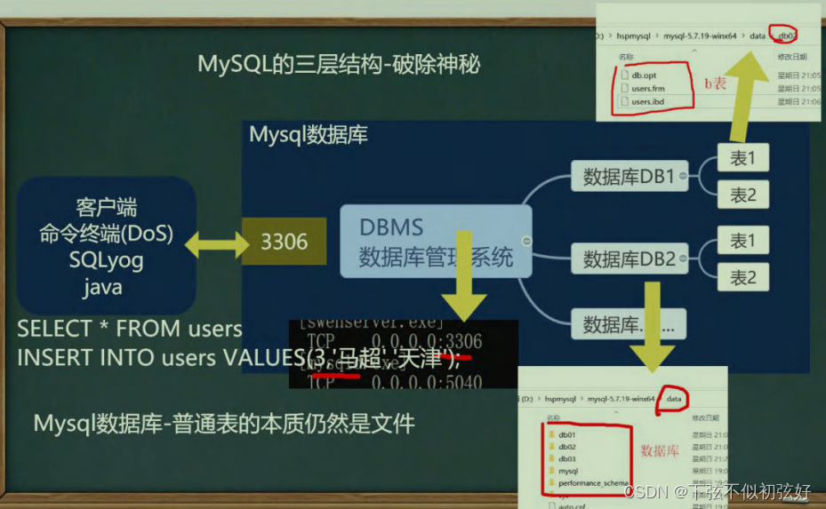
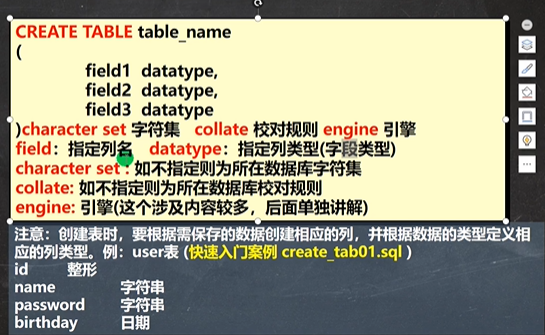
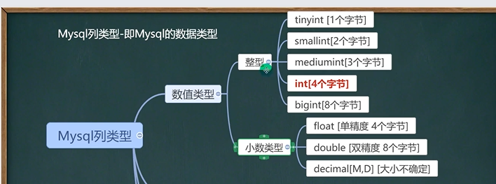

# Mysql

## Mysql三层结构

1. 所谓安装Mysql数据库，就是在主机安装一个数据库管理系统(DBMS)，这个管理程序可以管理多个数据库。DBMS(database manage system)
2. 一个数据库中可以创建多个表,以保存数据(信息)。
3. 数据库管理系统(DBMS)、数据库和表的关系如图所示:示意图
   

## 数据在数据库中的存储方式


## sql语句分类

1. DDL：数据定义语句，create表、数据库
2. DML：数据操作语句，insert delete update
3. DQL：数据查询语句，select
4. DCL：数据控制语句，管理数据库：比如用户权限 grant

## 数据库操作

### 创建数据库

```sql
CREATE DATABASE [IF NOT EXISTS] db_name
    [DEFAULT] CHARACTER SET = charset_name
    [DEFAULT] COLLATE collation_name;

#字符集默认utf8
#字符集校对规则 常用utf8_bin（区分大小写）、utf8_general_ci（默认，不区分大小写）

举例
CREATE DATABASE IF NOT EXISTS db_name
    DEFAULT CHARACTER SET = "utf8"
    COLLATE "utf8_general_ci";
```

### 查看、删除数据库

显示数据库语句

```sql
show databases
```

显示数据库创建语句

```sql
show create database db_name
```

数据库删除语句[慎用]

```sql
drop database [IF EXISTS] db_name
```

### 备份和恢复数据库

```sql
--备份数据库(dos执行)
MYSQLDUMP -U 用户名 -P -B 数据库1 数据库2 数据库N > 文件名.sql
--备份表
MYSQLDUMP -U 用户名 -P密码 数据库 表1 表N > 文件名.SQL
--恢复数据库（进入mysql命令行执行）
Source 文件名.sql
```

## 表操作

### 创建表



```sql
--创建表
CREATE TABLE test_db.`table_name01`(
  `id` INT,
  `name` VARCHAR(255),
  `pwd` VARCHAR(255),
  `birthday` DATE,
  `login_time` TIMESTAMP
)character set "utf8" collate "utf8_general_ci" engine innodb
```

### 删除表

```sql
--删除表
drop table test_db.TABLE_NAME01
```

### 修改表

```sql
--修改表
--添加列
alter table 表名
  ADD (COLUMN type [NOT NULL DEFAULT '' AFTER RESUME])--在RESUME列之后

--修改列（同添加类似）
alter TABLE TEST_DB.TABLE_NAME01
  MODIFY (COLUMN TYPE [NOT NULL DEFAULT '' AFTER RESUME])

--删除列
alter TABLE 表名
  DROP (COLUMN)

--查看表的结构
desc 表名

--修改表名
Rename table 表名 to 新表名

--修改表字符集
alter table 表名 character set 字符集

--修改列名
alter table 表名 change OLDCOLUMN NEWCOLUMN TYPE [NOT NULL DEFAULT '' AFTER RESUME]

```

## 列类型

### 类型1



### 类型2


### 整形

在满足需求的情况下，尽量选择占用空间小的类型，如果没有指定unsinged，则整形就是有符号的

1. tinyint，
2. smallint
3. mediumint
4. int
5. bigint

### bit

1. bit字段显示时，按照位的方式显示.
2. 查询的时候仍然可以用使用添加的数值
3. 如果一个值只有0,1可以考虑使用bit(1),可以节约空间位类型。
4. M指定位数,默认值1,范围1-64
5. 使用不多.

### 小数类型

1. FLOAT/DOUBLE [UNSIGNED]
   Float单精度精度，Double 双精度.
2. DECIMAL[M,D] [UNSIGNED]
   可以支持更加精确的小数位。M是小数位数(精度)的总数，D是小数点(标度)后面的位数。
   如果D是0，则值没有小数点或分数部分。M最大65。D最大是30。如果D被省略,默认是0。如果M被省略,默认是10。
   建议:如果希望小数的精度高,推荐使用decimal

### 字符串的基本使用

1. CHAR(size)
   固定长度字符串最大255字符
2. VARCHAR(size) 0~65535
   可变长度字符串最大65532字节【utf8编码最大21844字符1-3个字节用于记录大小】（ 65535-3）/3=21844

细节

1. char(4)  这个4表示字符数(最大255)，不是字节数，不管是中文还是字母都是放四个,按字符计算
   varchar(4)  这个4表示字符数，不管是字母还是中文都以定义好的表的编码来存放数据。依据编码不同字节长度不同。
   不管是中文还是英文字母，都是最多存放4个,是按照字符来存放的.
2. char(4)  是定长(固定的大小)，就是说，即使你插入'aa'，也会占用分配的4个字符的空间。
   varchar(4)  是变长，就是说，如果你插入了'aa',实际占用空间大小并不是4个字符，而是按照实际占用空间来分配(说明:varchar本身还需要占用1-3个字节来记录存放内容长度)。L+(1~3)
3. 什么时候使用char,什么时候使用varchar
   如果数据是定长，推荐使用char，比如md5的密码、邮编、手机号、身份证号码等。char(32)
   如果一个字段的长度是不确定，我们使用varchar，比如留言、文章
   查询速度:char > varchar
4. 在存放文本时，也可以使用Text数据类型。可以将Text列视为VARCHAR列，注意Text不能有默认值，大小0-2^16字节
   如果希望存放更多字符，可以选择mediumtext 0-2^24或者longtext 0-2^32

### 日期类型

1. DATE：日期类型
2. DATETIME：日期时间类型
3. TIMESTAMP：时间戳
   如果想自动更新，比如登陆时间 ：

   ```sql
   create table tmp_table(
       login_time TIMESTAMP 
   	NOT NULL DEFAULT CURRENT_TIMESTAMP 
   	ON UPDATE CURRENT_TIMESTAMP
   )
   ```
