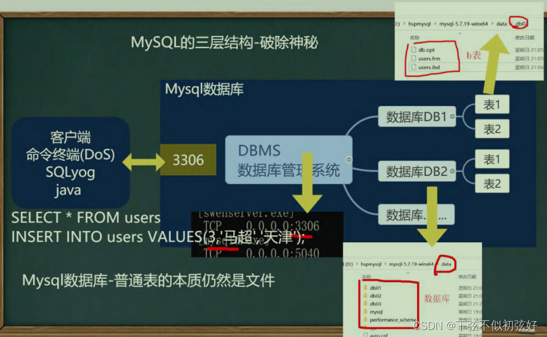
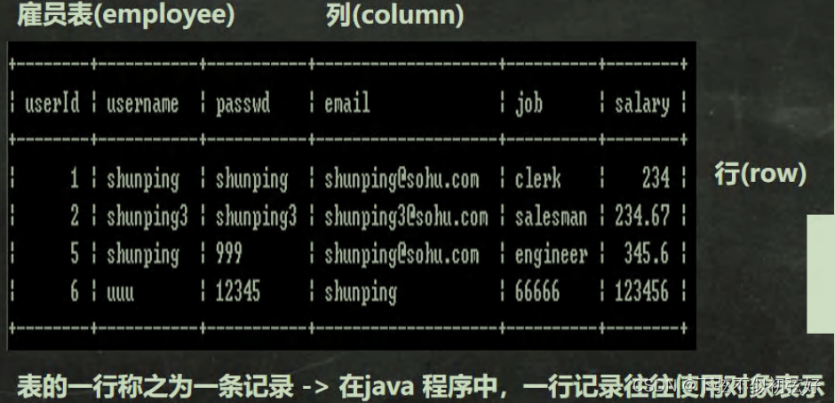
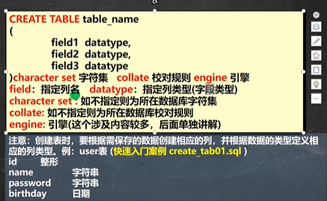
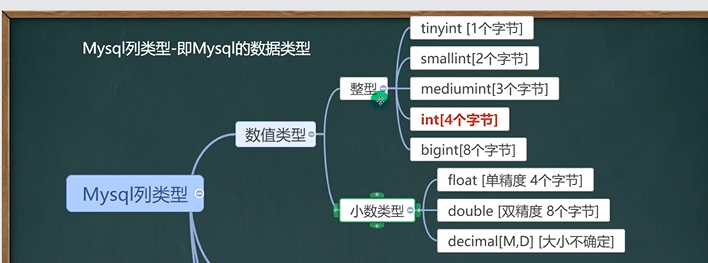
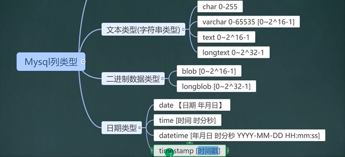
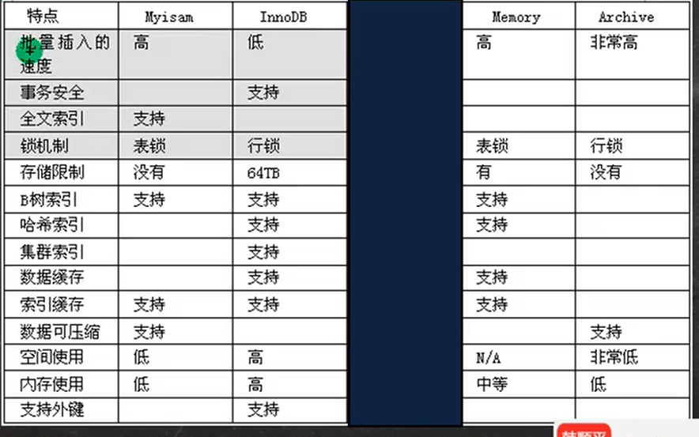
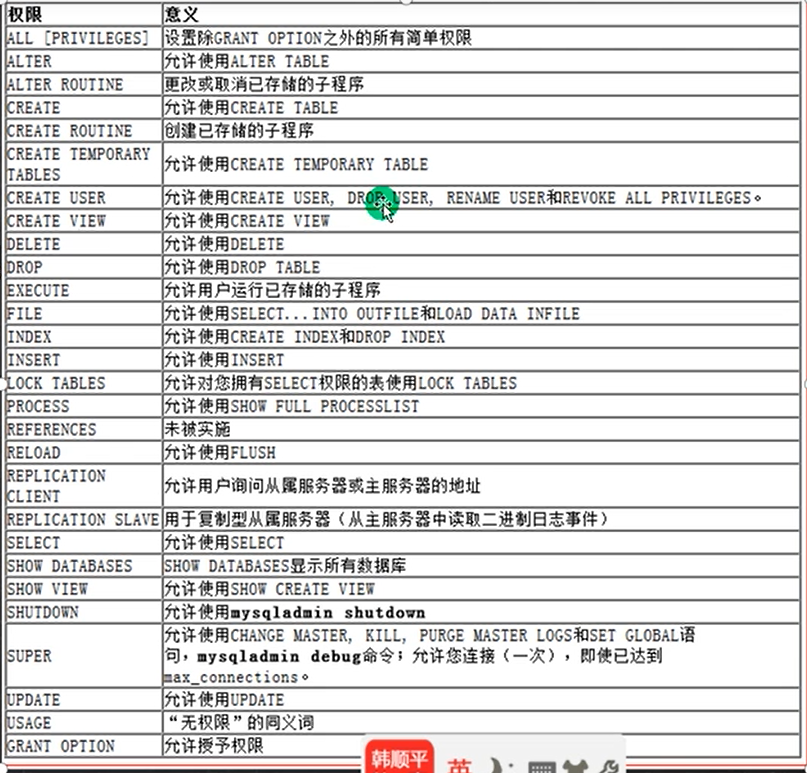

# Mysql基础

## Mysql三层结构

1. 所谓安装Mysql数据库，就是在主机安装一个数据库管理系统(DBMS)，这个管理程序可以管理多个数据库。DBMS(database manage system)
2. 一个数据库中可以创建多个表,以保存数据(信息)。
3. 数据库管理系统(DBMS)、数据库和表的关系如图所示:示意图
   

## 数据在数据库中的存储方式



## sql语句分类

1. DDL：数据定义语句，create表、数据库
2. DML：数据操作语句，insert delete update
3. DQL：数据查询语句，select
4. DCL：数据控制语句，管理数据库：比如用户权限 grant

## 数据库操作

### 创建数据库

```sql
CREATE DATABASE [IF NOT EXISTS] db_name
    [DEFAULT] CHARACTER SET = charset_name
    [DEFAULT] COLLATE collation_name;

#字符集默认utf8
#字符集校对规则 常用utf8_bin（区分大小写）、utf8_general_ci（默认，不区分大小写）

举例
CREATE DATABASE IF NOT EXISTS db_name
    DEFAULT CHARACTER SET = "utf8"
    COLLATE "utf8_general_ci";
```

### 查看、删除数据库

显示数据库语句

```sql
show databases
```

显示数据库创建语句

```sql
show create database db_name
```

数据库删除语句[慎用]

```sql
drop database [IF EXISTS] db_name
```

### 备份和恢复数据库

```sql
--备份数据库(dos执行)
MYSQLDUMP -U 用户名 -P -B 数据库1 数据库2 数据库N > 文件名.sql
--备份表
MYSQLDUMP -U 用户名 -P密码 数据库 表1 表N > 文件名.SQL
--恢复数据库（进入mysql命令行执行）
Source 文件名.sql
```

## 表操作 DDL

### 创建表



```sql
--创建表
CREATE TABLE test_db.`table_name01`(
  `id` INT,
  `name` VARCHAR(255),
  `pwd` VARCHAR(255),
  `birthday` DATE,
  `login_time` TIMESTAMP
)character set "utf8" collate "utf8_general_ci" engine innodb
```

### 删除表

```sql
--删除表
drop table test_db.TABLE_NAME01
```

### 修改表

```sql
--修改表
--添加列
alter table 表名
  ADD (COLUMN type [NOT NULL DEFAULT '' AFTER RESUME])--在RESUME列之后

--修改列（同添加类似）
alter TABLE TEST_DB.TABLE_NAME01
  MODIFY (COLUMN TYPE [NOT NULL DEFAULT '' AFTER RESUME])

--删除列
alter TABLE 表名
  DROP (COLUMN)

--查看表的结构
desc 表名

--修改表名
Rename table 表名 to 新表名

--修改表字符集
alter table 表名 character set 字符集

--修改列名
alter table 表名 change OLDCOLUMN NEWCOLUMN TYPE [NOT NULL DEFAULT '' AFTER RESUME]

```

## 列类型

### 类型1



### 类型2



### 整形

在满足需求的情况下，尽量选择占用空间小的类型，如果没有指定unsinged，则整形就是有符号的

1. tinyint，
2. smallint
3. mediumint
4. int
5. bigint

### bit

1. bit字段显示时，按照位的方式显示.
2. 查询的时候仍然可以用使用添加的数值
3. 如果一个值只有0,1可以考虑使用bit(1),可以节约空间位类型。
4. M指定位数,默认值1,范围1-64
5. 使用不多.

### 小数类型

1. FLOAT/DOUBLE [UNSIGNED]
   Float单精度精度，Double 双精度.
2. DECIMAL[M,D] [UNSIGNED]
   可以支持更加精确的小数位。M是小数位数(精度)的总数，D是小数点(标度)后面的位数。
   如果D是0，则值没有小数点或分数部分。M最大65。D最大是30。如果D被省略,默认是0。如果M被省略,默认是10。
   建议:如果希望小数的精度高,推荐使用decimal

### 字符串的基本使用

1. CHAR(size)
   固定长度字符串最大255字符
2. VARCHAR(size) 0~65535
   可变长度字符串最大65532字节【utf8编码最大21844字符1-3个字节用于记录大小】（ 65535-3）/3=21844

细节

1. char(4)  这个4表示字符数(最大255)，不是字节数，不管是中文还是字母都是放四个,按字符计算
   varchar(4)  这个4表示字符数，不管是字母还是中文都以定义好的表的编码来存放数据。依据编码不同字节长度不同。
   不管是中文还是英文字母，都是最多存放4个,是按照字符来存放的.
2. char(4)  是定长(固定的大小)，就是说，即使你插入'aa'，也会占用分配的4个字符的空间。
   varchar(4)  是变长，就是说，如果你插入了'aa',实际占用空间大小并不是4个字符，而是按照实际占用空间来分配(说明:varchar本身还需要占用1-3个字节来记录存放内容长度)。L+(1~3)
3. 什么时候使用char,什么时候使用varchar
   如果数据是定长，推荐使用char，比如md5的密码、邮编、手机号、身份证号码等。char(32)
   如果一个字段的长度是不确定，我们使用varchar，比如留言、文章
   查询速度:char > varchar
4. 在存放文本时，也可以使用Text数据类型。可以将Text列视为VARCHAR列，注意Text不能有默认值，大小0-2^16字节
   如果希望存放更多字符，可以选择mediumtext 0-2^24或者longtext 0-2^32

### 日期类型

1. DATE：日期类型
2. DATETIME：日期时间类型
3. TIMESTAMP：时间戳
   如果想自动更新，比如登陆时间 ：

   ```sql
   create table tmp_table(
       login_time TIMESTAMP 
   	NOT NULL DEFAULT CURRENT_TIMESTAMP 
   	ON UPDATE CURRENT_TIMESTAMP
   )
   ```

## CRUD DML

### 亚元表

当没有表用的时候可以from dual做测试

### insert（添加数据）

```sql
insert into 
  表名 (字段1,字段2)
    values(数据1, 数据2);

insert into TABLE_NAME (id,name) values(1001,'aoligei'),(1002,'aoligei')
```

细节

1. 插入的数据应与字段的数据类型相同。
2. 数据的长度应在列的规定范围内，例如:不能将一个长度为86的字符加入到长度为40的列中。
3. 在values中列出的数据位置必须与被加入的列的排列位置相对应。
4. 字符和日期型数据应包含在单引号中。
5. 列可以插入空值[前提是该字段允许为空]，insert into table value(null)
6. insert into tab_name (列名..) values (数据..),(数据..),(数据..)  形式添加多条记录
7. 如果是给表中的所有字段添加数据，可以不写前面的字段名称
8. 默认值的使用，当不给某个字段值时，如果有默认值就会添加，否则报错

### update（修改数据）

```sql
update table_name 
    set  
      字段1 = 值1,
      字段2 = 值2,
    where 
      字段3 = 值3;

update table_name set `name` = 'name',`City` = 'City',`pwd` = 'pwd' where id = 'id';
```

细节

1. UPDATE语法可以用新值更新原有表行中的各列。
2. SET将句指示要修改哪些列和要给予哪些值。
3. WHERE学句指定应更新哪些行。如没有WHERE子句,则更新所有的行。
4. 如果需要修改多个字段，可以通过set字段1=值1,字段2=值2.….

### delete（删除语句）

```sql
delete from 
    table_name 
  where 
    id = $id;
```

细节

1. 如果不使用where子句，将删除表中所有数据。
2. Dlete语句不能删除某一列的值(可使用update设为null或者'')
3. 使用delete语句仅删除记录，不删除表本身。如要删除表，使用drop table语句。drop table表名;

### select（查询语句）

```sql
--查询数据
--DISTINCT去重
SELECT [DISTINCT] id,name,`City`,pwd FROM table_name where id= '1002';
```

可以使用表达式，函数，运算符

where自居中常用运算符

比较运算符：

1. 大于、等于、小于等；
2. between ... and ... 介于...之间；闭区间
3. in(set集合)；是否在集合内
4. like '张' 模糊查询。not like '张' 取模糊查询的非，'张%'右模糊
5. is null 不为空

逻辑运算符：

1. and 与
2. or 或
3. not 非

### order by （排序）

1. Order by 指定排序的列，排序的列既可以是表中的列名，也可以是select语句后指定的列名。
2. Asc升序[默认]、Desc降序
3. ORDER BY子句应位于SELECT语句的结尾，先查询再排序。

### 统计函数

#### count （统计总数）

返回行的总数，先查询再统计

count(列)会统计某列有多少个非空行，即排除null

#### sum （求和）

返回满足where条件的行的和，一般用在数值列

#### avg （平均值）

平均值

#### max/min （最大/最小）

最大最小值

### 分组统计

#### group by （分组）

对查询结果进行分组统计，可以**多列分组 group col1,col2**

#### having （分组后筛选）

统计后进一步筛选

### 字符串函数

#### charset(str) （返回字符集）

返回字符串字符集

#### concat(str[,...]) （连接字符串）

连接字符串

#### instr(str, subStr) （第一次出现位置）

返回subStr在str出现的位置，如果没有则返回0

#### ucase(str) （大写）

转大写

#### lcase(str) （小写）

转换成小写

#### left(str, length) （从左侧截取）

截取str左边起length长度的字符

#### length(str) （字符长度）

返回str的长度

#### replace(str, search_str, replace_str) （替换）

在str中用replace_str替换search_str

#### strcmp(str1,str2) （比较字符串大小）

比较两个字符串大小

#### substring(str, position, [,length]) （截取字符串）

从str的position开始【从1开始计算】，取length个字符

#### ltrim(str)  /  rtrim(str)  /  trim(str) （去除空格）

去除左侧空格或右侧空格或去掉左右两侧

### 数学函数

#### abs(num) （绝对值）

取num的绝对值

#### bin(decimal_num) （十转二进制）

十进制转二进制

#### hex(decimalNum) （转十六进制）

转16进制

#### conv(num, from_base, to_base) （进制转换）

进制转换 将num从from_base进制转换为to_base进制

#### ceiling(num)  /  floor(num) （上下取整）

向上取整/向下取整

#### format(num, decimal_places) （保留小数位数）

保留小数位数 四舍五入 但返回string类型，不适合二次运算

#### round(x,d)（保留小数位数）

四舍五入。round(x) ,其实就是round(x,0),也就是默认d为0

#### TRUNCATE(x,d) (截取保留的小数位)

直接截取需要保留的小数位

#### CONVERT(x, DECIMAL(10,d)); （四舍五入）

转型，会四舍五入,保留d位小数

#### least(num1, num2 [,...]) （取最小值）

求最小值

#### mod(numerator, denominator) （求余）

求余

#### rand([seed]) （返回随机数）

返回随机数 范围0~1，若存在seed 则随机数固定，类似时间戳

### 时间函数

#### current_date() 当前日期

```sql
select current_date() as '当前日期' from dual;

返回：2020-05-26
```

#### current_time() 当前时间

```sql
select current_time() as '当前时间' from dual;

返回：20:27:57
```

#### current_timestamp() 当前时间戳

```sql
select current_timestamp() as '当前时间' from dual;

返回：2020-05-26 20:29:21
```

#### date(datetime) 返回datetime的日期部分

```sql
select date(datetime) from t01;

返回：2020-05-26
```

#### date_add(date/datetime/timestamp, interval d_value d_type) 在date中加上日期或时间

```sql
select 
    "2019-01-01" as col1
    ,date_add("2019-01-01",interval 7 year) as col2
    ,date_add("2019-01-01",interval 7 month) as col3
    ,date_add("2019-01-01",interval 7 day) as col4
```

#### date_sub(date/datetime/timestamp, interval d_value d_type) 在date上减去一个时间

```sql
select 
    "2019-01-01" as col1
    ,date_sub("2019-01-01",interval 7 year) as col2
    ,date_sub("2019-01-01",interval 7 month) as col3
    ,date_sub("2019-01-01",interval 7 day) as col4
```

#### datediff(date1, date2) 两个日期差（天）

```sql
select datediff("2019-01-07","2019-01-01")
结果为6
```

#### timediff(date1, date2) 两个时间差（小时，分钟，秒）

```sql
SELECT
  timeDIFF("11:12:12",
  "10:11:11") from dual

结果：01:01:01
```

#### now() 当前时间

```sql
select now() as '当前日期和时间' from dual;

返回：2020-05-26 20:27:21
```

#### year|month|date|time|hour|minute|second(datetime) 年|月|日|时间|时|分|秒

```sql
datetime=2020-05-26 11:11:11
select year(datetime) from t01;
返回：2020

select month(datetime) from t01;
返回：5

select day(datetime) from t01;
返回：26

select time(datetime) from t01;
返回：11:11:11

select hour(datetime) from t01;
返回：11

select minute(datetime) from t01;
返回：11

select second(datetime) from t01;
返回：11
```

#### unix_timestamp() 返回从1970-01-01到现在的秒数

```sql
select UNIX_TIMESTAMP() from dual
1679813335
```

#### from_unixtime() 把unix_timestamp()的秒数转为日期格式

```sql
SELECT FROM_UNIXTIME(UNIX_TIMESTAMP()) FROM DUAL
2023-03-26 14:52:03

SELECT FROM_UNIXTIME(UNIX_TIMESTAMP(),'%Y-%m-%d') FROM DUAL
2023-03-26
```

#### 日期格式转换

| 主题   | 格式 | 描述                                 |
| ------ | ---- | ------------------------------------ |
| 年     | %Y   | 4位数的年                            |
| 月     | %b   | 月份对应的英文缩写                   |
| 月     | %M   | 月份对应的英文全称                   |
| 月     | %m   | 01-12的月                            |
| 月     | %c   | 1-12的月份数值                       |
| 日     | %d   | 01-31的某月里面的第几天              |
| 日     | %e   | 1-31的某月里面的第几天               |
| 日     | %D   | 用th后缀表示某月中的第几天           |
| 日     | %j   | 001-366的一年中的第几天              |
| 周     | %a   | 星期几对应的英文缩写                 |
| 周     | %W   | 星期几对应的英文全称                 |
| 时     | %H   | 00-23的小时                          |
| 时     | %h   | 01-12的小时                          |
| 分     | %i   | 00-59的分钟                          |
| 秒     | %S   | 秒(00-59)                            |
| 秒     | %f   | 微秒                                 |
| 时分秒 | %T   | 返回当前的时分秒, 24-小时 (hh:mm:ss) |

### 加密和系统函数

#### user() 查询当前使用数据库的用户

```sql
select USER() from dual
查询结果:root@localhost
```

#### database() 查看当前使用数据库名称

```sql
select DATABASE()
查询结果:test_db
```

#### MD5(str) 对str进行md5（32位字符串）加密 一般在insert使用

```sql
insert into user_table value (1001,'bobo',MD5('MIMA'))

select * from user_table where name = 'bobo' and pwd = MD5('MIMA') --存在sql注入问题
```

#### PASSWORD(str) 加密函数

mysql数据库的用户密码默认就是PASSWORD函数加密，但在mysql8被移除了

```sql
select PASSWORD("sad") from dual
*E9256F1B862041C25A6396A2BB13A5C59F616E24
```

### 流程控制函数

#### IF(expr1, expr2, expr3) 类似三目运算符

注意如果使用if判断是否为空要用is [not] null判断，不可以用=null

```sql
select lie1,lie2,if (lie2>=10000,'高薪','普薪') as 'level' from table ;
```

#### IFNULL(expr1, expr2) 如果不为空返回expr1，如果为空返回expr2

```sql
select lie1,lie2,ifnull(lie2,0) as "num" from table ;
```

#### case when...then... when...then... else... end函数 类似多分支

如果when后的条件为true，则返回then后面的内容。如果都不满足则返回else的内容，最后以end结束

```sql
select lie1,lie2 ,case when lie2 >=15000 then '大佬' else '潜力股' end as "level" from table ;
```

### 查询增强

#### 日期的比较

```sql
select * from emp where hiredate > '1992-01-01'
```

#### 模糊查询

```sql
select * from emp where name like '张%'
--返回第二个字符为纪的名字
select * from emp where name like '_纪%'
```

#### 列判空

```sql
select * from emp where mgr is null
```

#### 排序

```sql
select * from emp order by deptno asc, sal desc
```

#### 分页查询

select ... limit start, rows  表示从start+1行开始取，取出rows行，start是从0开始计算的

```sql
select * from emp where sex = '男' order by id limit 0, 10
select * from emp where sex = '男' order by id limit 10, 10
```

#### 分组增强

注意点：count不会统计null的数据，count内部也可以使用流程控制函数 。count(distinct col)，

#### 多子句查询书写顺序

group by，having，order by，limit的是sql的书写顺序

#### **CAST函数** 查询数据类型转换

用于将值从一种数据类型转换为表达式中指定的另一种数据类型

```sql
CAST(value AS datatype)
```

### 多表查询

#### 多表笛卡尔集

多表查询的条件不能少于表的个数-1，否则会出现笛卡尔集

即表1的每一行与表2的所有行进行组合

出现笛卡尔集查询的行数为 表1行数*表2行数

**多表查询可以理解成在笛卡尔集的基础上进行条件筛选**

#### 多表查询

多表查询的**条件筛选**不一定是单纯用等于去判断，还可以使用between and 等去筛选

注：尽量给查询出的列起一个别名

#### 自连接

自身表的两个列进行关联，

注：需要给同张表起个别名，后续的左右连接会解决关联的列为null的情况

#### 子查询

##### 单行子查询

单行子查询结果为一行数据的某一列，然后可以视作一个变量，搭配各种条件判断符使用

```sql
SELECT * 
	FROM emp
	WHERE deptno = (
		SELECT deptno 
		FROM emp 
		WHERE ename = 'SMITH'
	)

```

##### 多行子查询

多行子查询结果为多行数据的某一列，可以视作一个set集合（注意需要提前使用distinct去重），使用in或exsit进行条件判断

```sql
SELECT ename, job, sal, deptno
	FROM emp
	WHERE job IN (
		SELECT disTINCT job 
		FROM emp 
		WHERE deptno = 10
	) AND deptno <> 10 
```

#### 子查询临时表

子查询结果为多行数据的某些列，然后将子查询当作一个临时表使用

```sql
select goods_id, ecs_goods.cat_id, goods_name, shop_price 
	from (
		SELECT cat_id , MAX(shop_price) as max_price
		FROM ecs_goods
		GROUP BY cat_id
	) temp , ecs_goods
	where  temp.cat_id = ecs_goods.cat_id 
	and temp.max_price = ecs_goods.shop_price 
```

#### all any

all和any必须和比较操作符一起使用

```sql
--查询结果中s1 要大于all后面子查询的最大值
select s1 from t1 where s1 > all (select s1 from t2);

--查询结果中s1 要大于all后面子查询的最小值
select s1 from t1 where s1 > any (select s1 from t2);
```

#### 多列子查询

要与子查询临时表区分，where (字段1，字段2) = (select 字段1，字段2 from...)

```sql
SELECT * 
	FROM emp
	WHERE (deptno , job) = (
		SELECT deptno , job
		FROM emp 
		WHERE ename = 'ALLEN'
	) AND ename != 'ALLEN'
```

### 表复制和去重

#### 表复制（自我复制数据/蠕虫复制）

有时，为了对某个sql语句进行效率测试，我们需要海数据时，可以使用此法为表创建海量数据。

```sql
--把旧表数据插入到新表
insert into 新表 (新表字段1, 新表字段2, 新表字段3) select 旧表字段1, 旧表字段2, 旧表字段3 from 旧表

--把新表数据插入给自己
insert into 新表 select * from 新表
```

#### 表去重

```sql
--删除一张表的重复记录
--去重思路
--1.先创建一张临时表my_tmp ，该表的结构和my_tab02一样
create table my_tmp  like my_tab02
--2.把my_tmp 的记录通过distinct关键字处理后把记录复制到my_tmp
insert into my_tmp select distinct * from my_tab02
--3.清除my_tab02记录
delete from my_tab02
--4.把my_tmp表的记录复制到my_tab02
insert into my_tab02 select * from my_tmp
--5.drop掉临时表my_tmp
drop table my_tmp
```

### 外连接

前面我们学习的查询，是利用where子句对两张表或者多张表，形成的笛卡尔积进行筛选，根据关联条件，显示所有匹配的记录，匹配不上的不显示，属于内连接，即取并集

#### 左外连接

以左表为主表显示，如果从表没有与之对应的则显示为null，即取左集

```sql
SELECT SP.shop_id, SP.shop_name, P.sale_price
 	FROM Products P LEFT JOIN ShopProduct as SP
    	ON SP.product_id = P.product_id;
```

#### 右外连接(与左外连接一致)

以右表为主显示，如果从表没有与之对应的则显示为null，即取右集

#### 全连接

左表和右表全部都要显示，如果没有与其对应的，则显示为null，即取全集

可以通过left join 与 right join 的结果进行 union 合并，就可以实现了，union 本身就是带有去重，所以交集的部分不会重复了

### 数据集合操作

#### union 和 union all （并集操作）

```sql
--不保留重复数据
SELECT * FROM t1 UNION SELECT * FROM t2;

--保留重复数据
SELECT * FROM t1 UNION ALL SELECT * FROM t2;
```

#### INTERSECT（交集操作）

```sql
-- intersect：得到的是两个 select 语句的公共部分（即交集部分）
SELECT * FROM a INTERSECT SELECT * FROM b;
```

#### EXCEPT （差集操作）

oracle中式minus关键字

```sql
-- minus：得到的是前一个 select查询出来有但后一个 select 没有的
SELECT * FROM a MINUS SELECT * FROM b;
```

## 约束

约束用于确保数据库的数据满足特定的商业规则。

在mysql中，约束包括: not null、unique、primary key、foreign key、check五种.

### primary key

用于唯一的标示表行的数据。当定义主键约束后，该列不能重复，且不可为空

主键约束的创建分为列级和表级两种，其基本语法格式为：

```sql
CREATE TABLE tb_user (
	id int [PRIMARY KEY],
	name varchar( 10 ),
	[PRIMARY KEY(id,name)]
);
#列级约束
字段名 数据类型 PRIMARY KEY
#表级约束
PRIMARY KEY(字段名1,字段名2,...)

--查看表结构
desc table_name 
```

* 表级约束的字段若只有一个，则为单字段主键于列级约束添加的效果相同；若有多个，则为复合主键(不推荐使用)。
* 复合主键需要用多个字段来确定一条记录的唯一性，类似于复合唯一键。
* 主键约束对应着表中的一列或者多列（复合主键）
* 如果是多列组合的复合主键约束，那么这些列都不允许为空值，并且组合的值不允许重复。
* MySQL的主键名总是PRIMARY，就算自己命名了主键约束名也没用。

### not null 非空

```sql
字段名 数据类型 not null
```

### unique 唯一

如果没有指定not null，则unique是可以有多个null的

一张表可以指定多个字段为unique

```sql
字段名 数据类型 unique
```

### foreign key 外键

在MySQL中，为了保证不同表中相同含义数据的一致性和完整性，可为数据表添加外检约束。

外键指的是在一个表中引用另外一个表中的一列或多列，被引用的列应该具有主键约束或唯一性约束，从而保证数据的一致性和完整性。

其中，被引用的表称为主表，引用外键的表称为从表。
主表（父表）：被引用的表，被参考的表
从表（子表）：引用别人的表，参考别人的表

```sql
[CONSTRAINT <外键约束名称>] FOREIGN KEY [index_name] (从表的字段) REFERENCES 主表名(被参考字段)
[ON DELETE{RESTRICT|CASCADE|SET NULL|NO ACTION|SET DEFAULT}]
[ON UPDATE{RESTRICT|CASCADE|SET NULL|NO ACTION|SET DEFAULT}]

--CONSTRAINT <外键约束名称>表示用于定义外键约束的名称，若省略，系统会自动生成一个名字。
--index_name 是可选参数，表示外键索引名称，若省略，系统也会在建立外键时自动创建一个外键索引，加快查询速度
--从表的字段,…表示从表中外键名称列表，而被参考字段,…表示主键约束或唯一约束字段
--ON DELETE用于设置主表中的数据被删除时，从表对应的数据进行相应的处理办法
--ON UPDATE用于设置主表中的数据被更新时，从表对应的数据进行相应的处理办法
```

| 参数名称    | 功能描述                                                                         |
| ----------- | -------------------------------------------------------------------------------- |
| RESTRICT    | 默认值，拒绝主表删除或修改外键关联字段                                           |
| CASCADE     | 主表中删除或更新记录时，同时自动删除或更新从表中对应的记录                       |
| SET NULL    | 主表中删除或更新记录时，使用NULL值替换从表中对应的记录（不适用于NOT NULL的字段） |
| NO ACTION   | 与默认值RESTRICT相同，拒绝主表删除或修改外键关联字段                             |
| SET DEFAULT | 设默认值，但InnoDB目前不支持                                                     |

注意：

1. 目前只有InnoDB存储引擎支持外键约束，其他的存储引擎不支持。
2. 建立外键关系的两个数据表的相关字段数据必须相似，也就是要求两个字段之间可以相互转换。int类型和tinyint类型的字段之间可以建立联系，而int类型与char类型之间不可以建立联系。
3. 从表的（某个字段)的字段名可以与主表名(被参考字段)的字段名一样，也可以不一样。
4. 外键约束的添加有2种方式，分别为在创建表时添加外键约束和在修改表时添加外键约束。
5. 外键字段的值，必须在主键字段中出现过，或者为null [前提是外键字段允许为null]
6. 添加了外键约束后，主表和从表的修改和删除数据等操作均受到约束

```sql
#添加方式1：创建从表时添加
[CONSTRAINT <外键约束名称>] FOREIGN KEY (从表的字段) REFERENCES 主表名(被参考字段)  

#添加方式2：修改从表时添加
ALTER TABLE 从表名 ADD[CONSTRAINT <外键约束名称>] FOREIGN KEY (从表的字段) REFERENCES 主表名(被引用字段) 
	[ON DELETE{RESTRICT|CASCADE|SET NULL|NO ACTION|SET DEFAULT}]
	[ON UPDATE{RESTRICT|CASCADE|SET NULL|NO ACTION|SET DEFAULT}];
```

### check

在MySQL中，为了检查某个字段的值是否符合xx要求，一般指的是值的范围，可以通过设置检索约束来实现。

检索约束的基本语法:

```sql
字段名 数据类型 CHECK (条件)

sex varchar(6) check (sex in ('man','woman'))
```

在 MySQL 5.7 中，CHECK 约束是被忽略的，因此它对数据验证没有任何作用，可以使用触发器来实现。这意味着，在 MySQL 5.7 中，可以插入不符合 CHECK 约束的数据，而不会有任何错误或警告。

但是，在 MySQL 8.0 中，CHECK 约束是被支持的，并且会对数据进行验证。如果插入的数据不符合 CHECK 约束，则会产生错误。

### DEFAULT 默认值

默认约束用于为数据表中的字段指定默认值，即当在表中插入一条新记录时，如果没有给这个字段赋值，那么系统会自动为该字段插入默认值。默认值是通过DEFAULT关键字定义的，基本语法格式为：

```sql
字段名 数据类型 DEFAULT 默认值;
--需要注意的是，BLOB,TEXT数据类型不支持默认约束。
```

### AUTO_INCREMENT 自增约束

在为数据表设置主键约束后，每次插入的数据，都需要检查主键的值，防止因出现插入的数据重复，从而导致数据添加失败。

```sql
#方式1：创建表时添加
字段名 字段类型 AUTO_INCREMENT

#方式2：修改表时添加
alter table 表名称 modify 字段名 字段类型 AUTO_INCREMENT;

```

1. 一个表中只能有一个自动增长的字段，该字段的数据类型为整型类型，且必须为键，如UNIQUE ，PRIMARY KEY。
2. 自动增长值是从1开始自增，每次加1。若插入的值大于自动增长值，则下次插入的自动增长值会自动使用最大值加1，若插入的值小于自动增长值，则不会对自动增长值产生影响。
3. 如果为自动增长字段插入NULL，0，DEFAULT或在插入的时候省略该字段，则该字段就会使用自动增长值；如果插入的是一个具体值，则不会使用自动增长值。
4. 使用delete删除记录时，自动增长值不会减少或填补空缺。

## mysql索引

说起提高数据库性能,索引是最物美价廉的东西了。不用加内存，不用改程序,不用调sql，查询速度就可能提高百倍干倍，以空间换时间。

```sql
--创建emp表上empno列的名为empno_index的索引
create index empno_index on emp (empno)
```

创建索引后，只对创建了索引的列有效

### 索引机制原理

没有索引的情况下会进行全表扫描，创建索引后，会转成B+树或其他的数据结构

### 索引的代价

1. 磁盘占用
2. 对修改、删除、插入语句的效率影响

### 索引种类

1. 主键索引（Primary key）
   主键索引是一种特殊的唯一索引，不允许有空值。在创建主键的时候会自动创建主键索引
2. 唯一索引（unique）
   索引列的值必须唯一，允许有空值，但是只能存在一个null。也会自动创建唯一索引
3. 普通索引（index）
   基本索引类型，没有限制，允许在定义索引的列中插入重复值和空值，纯粹为了查询数据更快一 点。
4. 全文索引（fulltext）
   --适用于MyISAM引擎，一般开发不适用mysql自带的全文索引，而是考虑使用：全文搜索Solr和ElasticSearch(ES)
5. 组合索引
   在表中的多个字段组合上创建的索引，只有在查询条件中使用了这些字段的左边字段时，索引才会被使用，使用组合索引时遵循最左前缀集合。

### 索引使用

创建唯一索引/普通索引

```sql
CREATE [UNIQUE] INDEX table_INDEX ON table_name (
  `COL_NAME` [(length)] [ASC|DESC],....
)

ALTER TABLE table_name ADD index [index_name] (`col_name`)

-- 添加唯一索引 UNIQUE 当前列要求唯一,但允许为空
alter table users add unique u_name (uname);
```

添加主键（索引）

```sql
-- 直接修改时添加主键和自增
alter table users modify uid int primary key AUTO_INCREMENT;

ALTER TABLE table_name  ADD primary key (id)
```

删除索引

```sql
ALTER TABLE table_name DROP INDEX `PRIMARY_INDEX`

DROP INDEX PRIMARY_INDEX ON table_name
```

删除主键索引，*删除主键索引 注意需要先取消 自增*

```sql
-- 先取消自增,修改字段
alter table users modify uid int;

-- 删除主键
ALTER TABLE table_name DROP PRIMARY KEY
```

修改索引，先删除再添加

查询索引

```sql
show index from 表

show indexes from 表

show keys from 表

desc 表
```

### 创建索引规则

1. 较频繁的作为查询条件字段应该创建索引
2. 唯─性太差的字段不适合单独创建索引，即使频繁作为查询条件
3. 更新非常频繁的字段不适合创建索引
4. 不会出现在WHERE子句中字段不该创建索引

## mysql事务

事务用于保证数据的一致性，它由一组相关的dml语句组成，该组的dml语句要么全部成功，要么全部失败。如：转账就要用事务来处理，用以保证数据的一致性。

### 事务和锁

当执行事务操作时(dml语句)，mysql会在表上加锁，防止其它用户改表的数据。这对用户来讲是非常重要的

### 事务的重要操作（显式事务）

start transaction 开启一个事务

savepoint 设置保存点

rollback to 回滚事务

rollback 回滚全部事务

commit 提交事务

```sql
--开启事务后自动在该阶段设置保存点
start transaction;

--设置保存点a
savepoint a

--执行DML操作，这里实现一下"李二给王五转账"的事务过程
update t_account set balance = balance - 50 where vname = "李二";

--设置保存点b
savepoint b
update t_account set balance = balance + 130 where vname = "王五";

-- 回滚事务到b
rollback to b;
-- 回滚事务到a
rollback to a;

--提交事务
commit; 
--回滚整个事务
--rollback; 
```

### 回退事务

在介绍回退事务前，先介绍一下保存点(savepoint)。保存点是事务中的点。用于取消部分事务，当结束事务时，会自动的删除该事务所定义的所有保存点。
当执行回退事务时，通过指定保存点可以回退到指定的点，这里我们作图说明

### 提交事务

使用commit语句可以提交事务。当执行了commit语句子后，会确认事务的变化、结束事务、删除保存点、释放锁，数据生效。当使用commit语句结束事务子后，其它会话将可以查看到事务变化后的新数据

### 事务细节

1. 如果不开始事务，默认情况下，dml操作是自动提交的，不能回滚，即【**隐式事务】**
2. 如果开始一个事务，你没有创建保存点。你可以执行rollback，默认就是回退到你事务开始的状态
3. 你也可以在这个事务中(还没有提交时)，创建多个保存点。比如: savepoint aaa;
   执行dml , savepoint bbb;
4. 你可以在事务没有提交前，选择回退到哪个保存点。
5. mysql的事务机制需要innodb的存储引擎还可以使用，myisam不好使.
6. 开始一个事务start transaction，set autocommit=off;

### 事务的隔离级别

多个连接开启各自事务操作数据库中数据时，数据库系统要负责隔离操作，以保证各个连接在获取数据时的准确性。

如果不考虑隔离性，可能会引发如下问题:

1. 脏读：当一个事务**读取另一个事务尚未提交的修改**时，产生脏读。
2. 不可重复读：在同一事务中多次进行查询，但由于其他**提交**的事务所做的**修改或删除（数据的变化）**，每次返回不同的结果集，此时发生不可重复读。
3. 幻读：在同一事务中多次进行查询，但由于其他**提交**的事务所做的**插入**操作（条数的变化），每次返回不同的结果集，此时发生幻读。

#### 事务隔离级别

定义了事务与事务的隔离程度

|  隔离级别  | 脏读 | 不可重复读 | 幻读 | 加锁读 |
| :--------: | :--: | :--------: | :--: | :----: |
| 读未提交的 |  √  |     √     |  √  | 不加锁 |
| 读已提交的 |  ×  |     √     |  √  | 不加锁 |
|  可重复读  |  ×  |     ×     |  ×  | 不加锁 |
|  可串行化  |  ×  |     ×     |  ×  |  加锁  |

#### 查看隔离级别

```sql
--查看当前会话隔离级别
MySQL8.0  : SELECT @@transaction_isolation;
MySQL5.7  : SELECT @@tx_isolation;

--查看系统当前隔离级别
SELECT @@global.tx_isolation;
```

#### 设置隔离级别

```sql
--设置当前/系统的隔离级别
SET [SESSION|GLOBAL] TRANSACTION ISOLATION LEVEL [READ UNCOMMITTED|READ COMMITTED|REPEATABLE READ|SERIALIZABLE]
SET SESSION TRANSACTION ISOLATION LEVEL READ UNCOMMITTED;
SET SESSION TRANSACTION ISOLATION LEVEL READ COMMITTED;
SET SESSION TRANSACTION ISOLATION LEVEL REPEATABLE READ;
SET SESSION TRANSACTION ISOLATION LEVEL SERIALIZABLE;
```

默认隔离级别

为可重复读，一般情况下，没有特殊要求，没必要修改，如果需要增强，修改my.ini

```ini
transaction-isolation = REPEATABLE-READ
```

### 事务ACID特性

1. 原子性(Atomicity)
   原子性是指事务是一个不可分割的工作单位，事务中的操作要么都发生，要么都不发生。
2. 一致性(Consistency)
   事务必须使数据库从一个二致性状态变换到另外一个一致性状态
3. 隔离性(lsolation)
   事务的隔离性是多个用户并发访问数据库时，数据库为每一个用户开启的事务，不能被其他事务的操作数据所干扰，多个并发事务之间要相互隔离。
4. 持久性(Durability)
   持久性是指一个事务一旦被提交，它对数据库中数据的改变就是永久性的，接下来即使数据库发生故障也不应该对其有任何影响

## 表类型和存储引擎

1. MySQL的表类型由存储引擎(Storage Engines)决定，主要包括MylSAM、innoDB（事务、外键、行级锁）、Memory（内存级别，查询快）等。
2. MySQL 数据表主要支持六种类型，分别是：CSV、Memory、ARCHIVE、MRG_MYISAM（集合性质的MYISAM）、MYISAM（不支持事务，批处理快）、InnoBDB。
3. 这六种又分为两类，一类是”事务安全型”(transaction-safe)，比如:InnoDB；其余都属于第二类,称为”非事务安全型”(non-transaction-safe)  [mysiam和memory]。



### 主要介绍MylSAM、innoDB、Memory

1. MylSAM不支持事务、也不支持外键，但其访问速度快，对事务完整性没有要求
2. InnoDB存储引擎提供了具有提交、回滚和崩溃恢复能力的事务安全。但是比起
   MyISAM存储引擎，InnoDB写的处理效率差一些并且会占用更多的磁盘空间以保留数据和索引。
3. MEMORY存储引擎使用存在内存中的内容来创建表。每个MEMORY表只实际对应一个磁盘文件。MEMORY类型的表访问非常得快，因为它的数据是基于哈希放在内存中的，对临时表有用，默认使用hash索引。一旦mysql服务器关闭，表中的数据就会丢失掉，表的结构还在。

### 如何选择存储引擎

1. 如果你的应用不需要事务，处理的只是基本的CRUD操作，那么MylSAM是不二选择,速度快
2. 如果需要支持事务，选择lnnoDB。
3. Memory存储引擎就是将数据存储在内存中，由于没有磁盘I/O的等待，速度极快。但由于是内存存储引擎，所做的任何修改在服务器重启后都将消失。(经典用法用户的在线状态)

### 修改存储引擎

```sql
alter table `表名` engine = 存储引擎
```

## 视图

emp表的列信息很多，有些信息是个人重要信息(比如sal, comm,mgr, hiredate)，如果我们希望某个用户只能查询emp表的(empno，ename，job和deptno)信息，有什么办法?

1. 视图是一个虚拟表，其内容由查询定义。同真实的表一样，视图包含列，其数据来自对应的（多个）真实表(基表)
2. 视图和基表关系的示意图
3. 通过试图可以修改基表数据，反之也会修改视图的数据（引用）

### 视图的基本使用

1. create view 视图名 as select语句

   ```sql
   CREATE VIEW view_name
   	AS SELECT `name`,`City` FROM table_name
   ```
2. alter view 视图名 as select语句
   修改视图
3. show create view 视图名
   查看创建视图的指令
4. drop view视图名1,视图名2
   删除视图

### 视图细节

1. 创建视图后，到数据库去看，对应视图只有一个视图结构文件(形式:视图名.frm)
2. 视图的数据变化会影响到基高，基表的数据变化也会影响到视图
3. 视图中可以再使用视图

### 视图使用场景

1. 安全。一些数据表有着重要的信息。有些字段是保密的，不能让用户直接看到。这时就可以创建一个视图，在这张视图中只保留一部分字段。这样，用户就可以查询自己需要的字段,不能查看保密的字段。
2. 性能。关系数据库的数据常常会分表存储，使用外键建立这些表的之间关系。这时，数据库查询通常会用到连接(JOIN)。这样做不但麻烦，效率相对也比较低。如果建立一个视图，将相关的表和字段组合在一起，就可以避免使用JOIN查询数据。
3. 灵活。如果系统中有一张旧的表，这张表由于设计的问题，即将被废弃。然而，很多应用都是基于这张表，不易修改。这时就可以建立一张视图，视图中的数据直接映射到新建的表。这样，就可以少做很多改动，也达到了升级数据表的目的。

### 多基表练习

针对emp , dept，和salgrade 张三表.创建一个视图emp_view03，可以显示雇员编号，雇员名，雇员部门名称和薪水级别[即使用三张表，构建一个视图

```sql
CREATE VIEW EMP_VIEW AS(
  SELECT
    EMPNO,
    ENAME,
    DNAME,
    GRADE
  FROM
    EMP,
    DEPT,
    SALGRADE
  WHERE
    EMP.DEPTNO = DEPT.DEPTNO
    AND (SAL BETWEEN LOSAL
    AND HISAL)
)
```

## Mysql管理

### Mysql用户

mysql中的用户，都存储在系统数据库mysql中 user表中

其中user表的重要字段说明:

1. host:允许登录的“位置”，localhost表示该用户只允许本机登录，也可以指定ip地址，比如:192.168.1.100
2. user:用户名;
3. authentication_string:密码，是通过mysql的password()函数加密之后的密码。

### 用户管理

根据需要创建不同的用户，赋予相应权限，供相应人员使用

```sql
--创建新用户，localhost为登录ip
create user '用户名'@'localhost' identified by 'password';

--查询用户表
select * from mysql.user

--重命名用户
rename user 'jzz'@'localhost' to 'zjj'@'localhost';

--删除用户
drop user '用户名'@'localhost'

--登录
--登陆后，不同用户，可操作的库、表/视图等对象不相同

--修改自己的密码
set password = password('kya123');

--root修改其他用户密码
set password for '用户名'@'localhost' = password('kya123');

```

### 权限管理



#### 给用户授权

```sql
grant 权限列表 on 数据库.对象名 to '用户名'@'登录位置' 【identified by '密码'】

--权限列表，多个权限用逗号分开
grant select on ...
grant select,delete, create on ...
grant all 【privileges】 on ...  --表示赋予该用户在该对象上的所有权限

--权限列表为
-- *.* 代表本系统中的所有数据库的所有对象(表，视图，存储过程)
-- 库.*:表示某个数据库中的所有数据对象(表，视图,存储过程等)

--identified by可以省略，也可以写出
--如果用户存在，就是修改该用户的密码。
--如果该用户不存在，就是创建该用户!


```

#### 回收权限

```sql
基本语法:
revoke 权限列表 on 库.对象名 from '用户名"@"登录位置';
```

#### 权限生效指令

```sql
如果权限没有生效，可以执行下面命令.基本语法:
FLUSH PRIVILEGES;
```

#### 管理细节

1. 在创建用户的时候，如果不指定Host,则为%，%表示表示所有IP都有连接权限create user xxx;
2. 你也可以这样指定
   create user 'xxx'@'192.168.1.%’表示xxx用户在192.168.1.*的ip可以登录mysql
3. 在删除用户的时候,如果host 不是%,需要明确指定‘用户@'host值'
