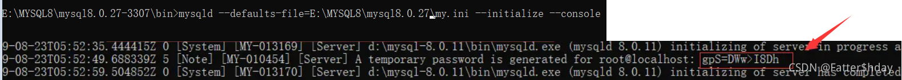

# mysql5.7的安装

1. 下载安装包
   https://cdn.mysql.com//archives/mysql-5.7/mysql-5.7.19-winx64.zip
2. 解压
3. 修改环境变量
   在Path加入E:\mysql-5.7.19-winx64\bin
4. E:\mysql-5.7.19-winx64目录下添加my.ini
   ```ini
   [mysqld]
   #设置3306端口号
   port=3306
   #设置MySQL的安装目录
   basedir=E:\mysql-5.7.19-winx64\
   #设置MySQL数据库的数据存放目录
   datadir=E:\mysql-5.7.19-winx64\data\
   #运行最大连接数
   #max_connections=200
   #运行连接失败的次数。这也是为了防止有人从该主机试图攻击数据库系统
   #max_connect_errors=10
   #服务端使用的字符集默认为utf-8
   character-set-server=utf8
   #跳过安全检查
   skip-grant-tables


   #[mysql]
   #客户端使用的字符集默认为utf8
   #default-character-set=utf8


   [client]
   #客户端默认端口号为3306
   port=3306
   default-character-set=utf8
   ```
5. 管理员中cmd到E:\mysql-5.7.19-winx64目录，执行  mysqld -install
6. 以及  mysqld --initialize-insecure --user=mysql
7. 启动服务  net start mysql
8. 登录mysql  mysql -u root -p        -u后为用户名  -p后为密码
9. 修改用户密码  use mysql;
   update user set authentication_string=password('qq2194296863') where user='root' and Host = 'localhost';
   执行flush privileges; 刷新权限
   quit退出
10. 注销my.ini的跳过安全检查 #skip-grant-tables
11. 重启mysql  net stop mysql       net start mysql
12. 重新登录 步骤8

# 命令行数据库的连接

mysql -h 主机ip -P 端口 -u 用户名 -p密码

（-p密码无间隔）（默认本机主机和3306）

```sql
mysql -h 127.0.0.1 -P 3306 -u root -pqq2194296863
```

# 同时安装mysql8.0

安装包  https://dev.mysql.com/downloads/mysql/

1.新建一个my.ini文件，并且最初是没有data文件夹的不需要自己去创建！！！

```ini
[mysql]
# 设置mysql客户端默认字符集
default-character-set=utf8mb4
[mysqld]
#设置3306端口，我的mysql5.7占用了3306这里改成3307即可
port = 3307
# 设置mysql的安装目录
basedir=E:\\MYSQL8\\mysql8.0.27-3307
# 设置mysql数据库的数据的存放目录
datadir=E:\\MYSQL8\\mysql8.0.27-3307\\data
# 允许最大连接数
max_connections=200
# 服务端使用的字符集默认为8比特编码的latin1字符集
character-set-server=utf8mb4
# 创建新表时将使用的默认存储引擎
default-storage-engine=INNODB 
```

2.去电脑服务关闭mysql5.7的服务

3.用管理员方式启动cmd,并且切换到mysql8.0.11bin,执行如下命令，并记住密码（一定要记住这个密码 不然等会很麻烦 我第一次就这里没记到重弄了好久）

3.1

```sql
mysqld --defaults-file=E:\MYSQL8\mysql8.0.27\my.ini --initialize --console
```



3.2再执行如下命令

```ini
mysqld install MySQL8.0.27  --defaults-file="E:\MYSQL8\mysql8.0.27\my.ini"
```

3.3去配置环境变量

在PATH路径下新添加你安装的MySQL8的bin目录

4、先不急启动服务，找开注册表，目录为

“计算机\HKEY_LOCAL_MACHINE\SYSTEM\CurrentControlSet\Services\MySQL8.0.27”找到ImagePath双击打开它并修改为"E:\MYSQL8\mysql8.0.27-3307\bin\mysqld" --defaults-file=E:\MYSQL8\mysql8.0.27-3307\my.ini MySQL8.0.27

5.去服务里面启动你的MySQL服务（两个都可以启动起来）

6.接下来去修改密码

**1.打开cmd：mysql -u root -p -P3307（你自己的第二个MySQL的端口号）**

**2.进入mysql依次执行下面语句**

```sql
ALTER USER'root'@'localhost' IDENTIFIED BY 'root' PASSWORD EXPIRE NEVER; #修改加密规则 
ALTER USER'root'@'localhost' IDENTIFIED WITH mysql_native_password BY 'root'; #更新一下用户的密码 
FLUSH PRIVILEGES; #刷新权限
重置密码：alter user'root'@'localhost' identified by '你要改的密码';
```
