# MySQL 索引

## 索引介绍

索引（index）是帮助MySQL**高效获取数据**的 **数据结构** ( **有序** )。在数据之外，数据库系统还维护着满足 特定查找算法的数据结构，这些数据结构以某种方式引用（指向）数据， 这样就可以在这些数据结构 上实现高级查找算法，这种数据结构就是索引。


优缺点：

优点：

* 提高数据检索效率，降低数据库的IO成本
* 通过索引列对数据进行排序，降低数据排序的成本，降低CPU的消耗

缺点：

* 索引列也是要占用空间的
* 索引大大提高了查询效率，但降低了更新的速度，比如 INSERT、UPDATE、DELETE

## [#](https://frxcat.fun/database/MySQL/MySQL_Advanced_index/#%E7%B4%A2%E5%BC%95%E7%BB%93%E6%9E%84)索引结构

| 索引结构            | 描述                                                                             |
| ------------------- | -------------------------------------------------------------------------------- |
| B+Tree              | 最常见的索引类型，大部分引擎都支持B+树索引                                       |
| Hash                | 底层数据结构是用哈希表实现，只有精确匹配索引列的查询才有效，不支持范围查询       |
| R-Tree(空间索引)    | 空间索引是 MyISAM 引擎的一个特殊索引类型，主要用于地理空间数据类型，通常使用较少 |
| Full-Text(全文索引) | 是一种通过建立倒排索引，快速匹配文档的方式，类似于 Lucene, Solr, ES              |

* 上述是MySQL中所支持的所有的索引结构，接下来，我们再来看看不同的存储引擎对于索引结构的支持 情况。

| 索引       | InnoDB          | MyISAM | Memory |
| ---------- | --------------- | ------ | ------ |
| B+Tree索引 | 支持            | 支持   | 支持   |
| Hash索引   | 不支持          | 不支持 | 支持   |
| R-Tree索引 | 不支持          | 支持   | 不支持 |
| Full-text  | 5.6版本之后支持 | 支持   | 不支持 |

> 注意： 我们平常所说的索引，如果没有特别指明，都是指B+树结构组织的索引。

### [#](https://frxcat.fun/database/MySQL/MySQL_Advanced_index/#%E4%BA%8C%E5%8F%89%E6%A0%91)二叉树

假如说MySQL的索引结构采用二叉树的数据结构，比较理想的结构如下：

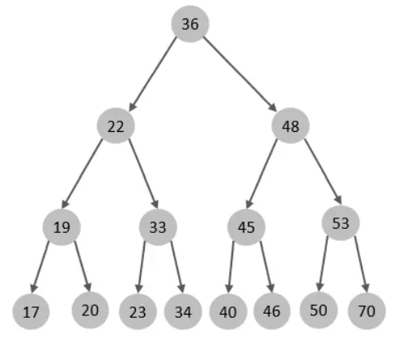

如果主键是顺序插入的，则会形成一个单向链表，结构如下：

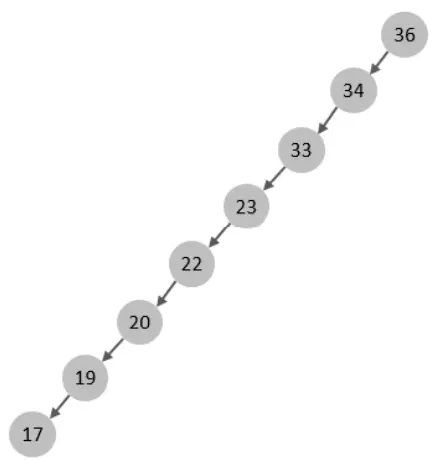

所以，如果选择二叉树作为索引结构，会存在以下缺点：

* 顺序插入时，会形成一个链表，查询性能大大降低。
* 大数据量情况下，层级较深，检索速度慢。

此时大家可能会想到，我们可以选择红黑树，红黑树是一颗自平衡二叉树，那这样即使是顺序插入数据，最终形成的数据结构也是一颗平衡的二叉树,结构如下:


但是，即使如此，由于红黑树也是一颗二叉树，所以也会存在一个缺点：

* 大数据量情况下，层级较深，检索速度慢。

所以，在MySQL的索引结构中，并没有选择二叉树或者红黑树，而选择的是B+Tree，那么什么是B+Tree呢？在详解B+Tree之前，先来介绍一个B-Tree。

### [#](https://frxcat.fun/database/MySQL/MySQL_Advanced_index/#b-tree)B-Tree

B-Tree，B树是一种**多路**衡查找树，相对于二叉树，B树每个节点可以有多个分支，即多叉。以一颗最大度数（max-degree）为5(5阶)的b-tree为例，那这个B树每个节点最多存储4个key，5个指针：

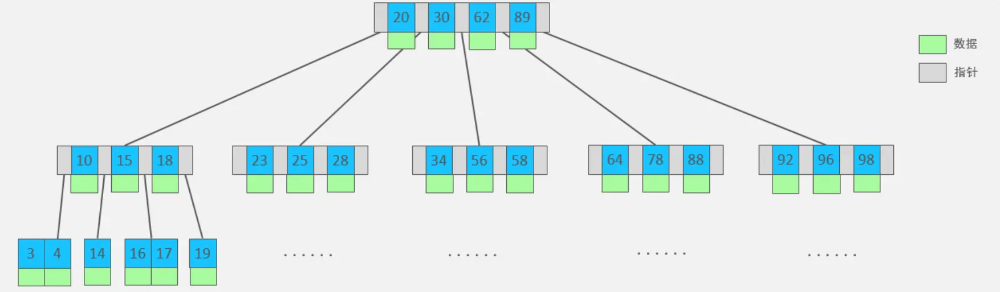

> 树的度数指的是一个节点的子节点个数。

我们可以通过一个数据结构可视化的网站来简单演示一下。[B-Tree Visualization (usfca.edu)(opens new window)](https://www.cs.usfca.edu/~galles/visualization/BTree.html)


插入一组数据： 100 65 169 368 900 556 780 35 215 1200 234 888 158 90 1000 88 120 268 250 。然后观察一些数据插入过程中，节点的变化情况。

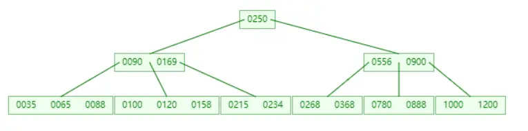

特点：

* 5阶的B树，每一个节点最多存储4个key，对应5个指针。
* 一旦节点存储的key数量到达5，就会裂变，中间元素向上分裂。
* 在**B树**中， **非叶子节点和叶子节点都会存放数据** 。

### [#](https://frxcat.fun/database/MySQL/MySQL_Advanced_index/#b-tree-2)B+Tree

B+Tree是B-Tree的变种，我们以一颗最大度数（max-degree）为4（4阶）的b+tree为例，来看一下其结构示意图：

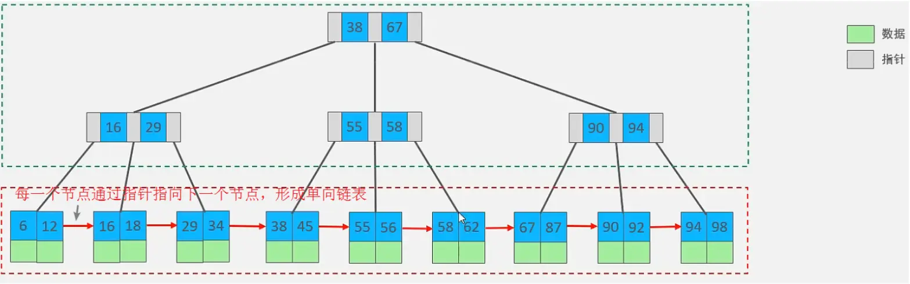

我们可以看到，两部分：

* 绿色框框起来的部分，是索引部分，仅仅起到索引数据的作用，不存储数据。
* 红色框框起来的部分，是数据存储部分，在其叶子节点中要存储具体的数据。

我们可以通过一个数据结构可视化的网站来简单演示一下。[B+ Tree Visualization (usfca.edu)(opens new window)](https://www.cs.usfca.edu/~galles/visualization/BPlusTree.html)


插入一组数据： 100 65 169 368 900 556 780 35 215 1200 234 888 158 90 1000 88 120 268 250 。然后观察一些数据插入过程中，节点的变化情况。

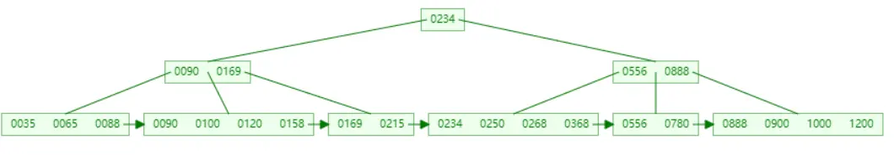

最终我们看到，B+Tree 与 B-Tree相比，主要有以下三点区别：

* **所有的数据**都会出现在 **叶子节点** 。
* **叶子节点形成**一个 **单向链表** 。
* **非叶子节点**仅仅起到 **索引数据作用** ，**具体的数据**都是在**叶子节点存放**的。

上述我们所看到的结构是标准的B+Tree的数据结构，接下来，我们再来看看MySQL中优化之后的B+Tree。

MySQL索引数据结构对经典的B+Tree进行了优化。在原B+Tree的基础上，增加一个指向相邻叶子节点的链表指针，就形成了带有顺序指针的B+Tree，提高区间访问的性能，利于排序。

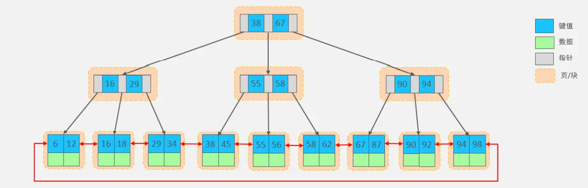

### [#](https://frxcat.fun/database/MySQL/MySQL_Advanced_index/#hash)Hash

MySQL中除了支持B+Tree索引，还支持一种索引类型---Hash索引。

1. 结构

哈希索引就是采用一定的hash算法，将键值换算成新的hash值，映射到对应的槽位上，然后存储在hash表中。

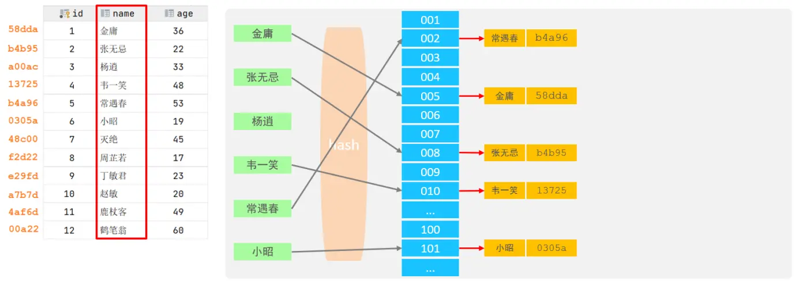

如果两个(或多个)键值，映射到一个相同的槽位上，他们就产生了hash冲突（也称为hash碰撞），可以通过链表来解决。

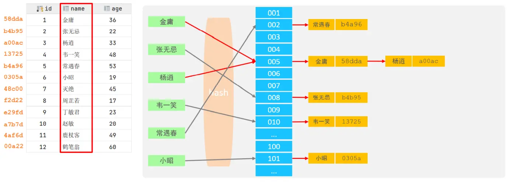

2. 特点

* Hash索引只能用于对等比较(=，in)，不支持范围查询（between，>，< ，...）
* 无法利用索引完成排序操作
* 查询效率高，通常(不存在hash冲突的情况)只需要一次检索就可以了，效率通常要高于B+tree索引

3. 存储引擎支持

在MySQL中，支持hash索引的是Memory存储引擎。 而InnoDB中具有自适应hash功能，hash索引是 InnoDB存储引擎根据B+Tree索引在指定条件下自动构建的。

> 思考题：  **为什么InnoDB存储引擎选择使用B+tree索引结构** ?
>
> 1. 相对于二叉树，层级更少，搜索效率高；
> 2. 对于B-tree，无论是叶子节点还是非叶子节点，都会保存数据，这样**导致**一页中存储的 **键值减少** ， **指针跟着减少** ，要同样 **保存大量数据** ， **只能增加树的高度** ，导致 **性能降低** ；
> 3. 相对Hash索引，B+tree支持范围匹配及排序操作；

## [#](https://frxcat.fun/database/MySQL/MySQL_Advanced_index/#%E7%B4%A2%E5%BC%95%E7%9A%84%E5%88%86%E7%B1%BB)索引的分类

在MySQL数据库，将索引的具体类型主要分为以下几类：主键索引、唯一索引、常规索引、全文索引。

| 分类     | 含义                                                 | 特点                     | 关键字   |
| -------- | ---------------------------------------------------- | ------------------------ | -------- |
| 主键索引 | 针对于表中主键创建的索引                             | 默认自动创建，只能有一个 | PRIMARY  |
| 唯一索引 | 避免同一个表中某数据列中的值重复                     | 可以有多个               | UNIQUE   |
| 常规索引 | 快速定位特定数据                                     | 可以有多个               |          |
| 全文索引 | 全文索引查找的是文本中的关键词，而不是比较索引中的值 | 可以有多个               | FULLTEXT |

在 InnoDB 存储引擎中，根据索引的存储形式，又可以分为以下两种：

| 分类                      | 含义                                                       | 特点                           |
| ------------------------- | ---------------------------------------------------------- | ------------------------------ |
| 聚集索引(Clustered Index) | 将数据存储与索引放一块，索引结构的叶子节点保存了行数据     | **必须有，而且只有一个** |
| 二级索引(Secondary Index) | 将数据与索引分开存储，索引结构的叶子节点关联的是对应的主键 | 可以存在多个                   |

聚集索引选取规则:

* 如果 =存在主键= ，主键索引就是=聚集索引=
* 如果 =不存在主键= ，将使用 =第一个唯一（UNIQUE）索引作为聚集索引= 。
* 如果表 =没有主键，或没有合适的唯一索引= ，则InnoDB会=自动生成一个rowid作为隐藏=的聚集索 引。

聚集索引和二级索引的具体结构如下：

演示图：

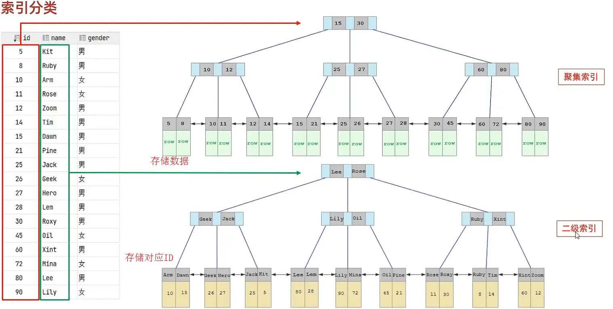

* 聚集索引的叶子节点下挂的是这一行的数据 。
* 二级索引的叶子节点下挂的是该字段值对应的主键值。

接下来，我们来分析一下，当我们执行如下的SQL语句时，具体的查找过程是什么样子的。

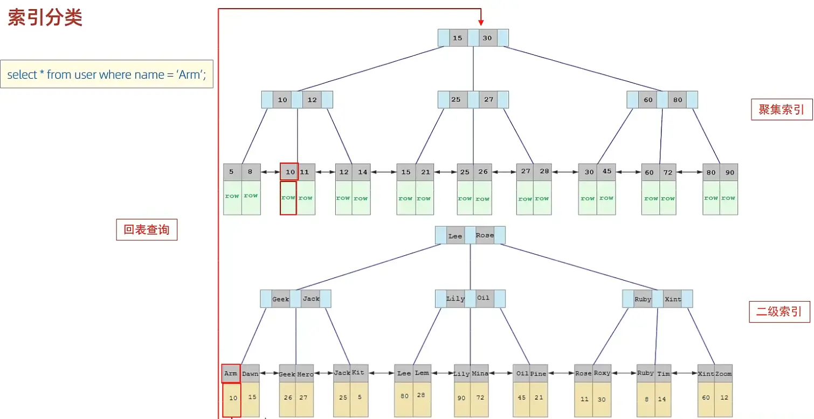

具体过程如下:

1. 由于是根据name字段进行查询，所以先根据name='Arm'到name字段的二级索引中进行匹配查 找。但是在二级索引中只能查找到 Arm 对应的主键值 10。
2. 由于查询返回的数据是*，所以此时，还需要根据主键值10，到聚集索引中查找10对应的记录，最 终找到10对应的行row。
3. 最终拿到这一行的数据，直接返回即可。

> **回表查询** ： 这种先到二级索引中查找数据，找到主键值，然后再到聚集索引中根据主键值，获取 数据的方式，就称之为回表查询。

> 思考题：
>
> * 以下两条SQL语句，那个执行效率高? 为什么?
>   A. select * from user where id = 10 ;
>   B. select * from user where name = 'Arm' ;
>   备注: id为主键，name字段创建的有索引；
>
> 解答：
>
> * A 语句的执行性能要高于B 语句。
> * 因为A语句直接走聚集索引，直接返回数据。 而B语句需要先查询name字段的二级索引，然后再查询聚集索引，也就是需要进行回表查询。

> 思考题：
>
> * InnoDB主键索引的B+tree高度为多高呢?
>
> 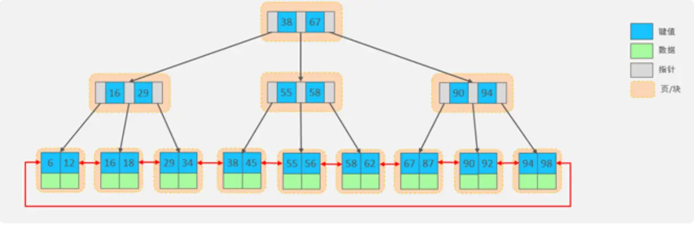
>
> 答：假设一行数据大小为1k，一页中可以存储16行这样的数据。InnoDB 的指针占用6个字节的空间，主键假设为bigint，占用字节数为8. 可得公式：`n * 8 + (n + 1) * 6 = 16 * 1024`，其中 8 表示 bigint 占用的字节数，n 表示当前节点存储的key的数量，(n + 1) 表示指针数量（比key多一个）。算出n约为1170。
>
> 如果树的高度为2，那么他能存储的数据量大概为：`1171 * 16 = 18736`； 如果树的高度为3，那么他能存储的数据量大概为：`1171 * 1171 * 16 = 21939856`。
>
> 另外，如果有成千上万的数据，那么就要考虑分表，涉及运维篇知识

## [#](https://frxcat.fun/database/MySQL/MySQL_Advanced_index/#%E7%B4%A2%E5%BC%95%E8%AF%AD%E6%B3%95)索引语法

1. 创建索引

```sql
CREATE [ UNIQUE | FULLTEXT ] INDEX index_name ON table_name (index_col_name,... ) ;
```

2. 查看索引

```sql
SHOW INDEX FROM table_name ;
```

3. 删除索引

```sql
DROP INDEX index_name ON table_name ;
```

案例演示:

先来创建一张表 tb_user，并且查询测试数据。

```sql
create table tb_user(
	id int primary key auto_increment comment '主键',
	name varchar(50) not null comment '用户名',
	phone varchar(11) not null comment '手机号',
	email varchar(100) comment '邮箱',
	profession varchar(11) comment '专业',
	age tinyint unsigned comment '年龄',
	gender char(1) comment '性别 , 1: 男, 2: 女',
	status char(1) comment '状态',
	createtime datetime comment '创建时间'
) comment '系统用户表';
INSERT INTO tb_user (name, phone, email, profession, age, gender, status,createtime) VALUES ('吕布', '17799990000', 'lvbu666@163.com', '软件工程', 23, '1','6', '2001-02-02 00:00:00');
INSERT INTO tb_user (name, phone, email, profession, age, gender, status,createtime) VALUES ('曹操', '17799990001', 'caocao666@qq.com', '通讯工程', 33,'1', '0', '2001-03-05 00:00:00');
INSERT INTO tb_user (name, phone, email, profession, age, gender, status,createtime) VALUES ('赵云', '17799990002', '17799990@139.com', '英语', 34, '1','2', '2002-03-02 00:00:00');
INSERT INTO tb_user (name, phone, email, profession, age, gender, status,createtime) VALUES ('孙悟空', '17799990003', '17799990@sina.com', '工程造价', 54,'1', '0', '2001-07-02 00:00:00');
INSERT INTO tb_user (name, phone, email, profession, age, gender, status,createtime) VALUES ('花木兰', '17799990004', '19980729@sina.com', '软件工程', 23,'2', '1', '2001-04-22 00:00:00');
INSERT INTO tb_user (name, phone, email, profession, age, gender, status,createtime) VALUES ('大乔', '17799990005', 'daqiao666@sina.com', '舞蹈', 22, '2','0', '2001-02-07 00:00:00');
INSERT INTO tb_user (name, phone, email, profession, age, gender, status, createtime) VALUES ('露娜', '17799990006', 'luna_love@sina.com', '应用数学', 24,'2', '0', '2001-02-08 00:00:00');
INSERT INTO tb_user (name, phone, email, profession, age, gender, status,createtime) VALUES ('程咬金', '17799990007', 'chengyaojin@163.com', '化工', 38,'1', '5', '2001-05-23 00:00:00');
INSERT INTO tb_user (name, phone, email, profession, age, gender, status,createtime) VALUES ('项羽', '17799990008', 'xiaoyu666@qq.com', '金属材料', 43,'1', '0', '2001-09-18 00:00:00');
INSERT INTO tb_user (name, phone, email, profession, age, gender, status,createtime) VALUES ('白起', '17799990009', 'baiqi666@sina.com', '机械工程及其自动化', 27, '1', '2', '2001-08-16 00:00:00');
INSERT INTO tb_user (name, phone, email, profession, age, gender, status,createtime) VALUES ('韩信', '17799990010', 'hanxin520@163.com', '无机非金属材料工程', 27, '1', '0', '2001-06-12 00:00:00');
INSERT INTO tb_user (name, phone, email, profession, age, gender, status,createtime) VALUES ('荆轲', '17799990011', 'jingke123@163.com', '会计', 29, '1','0', '2001-05-11 00:00:00');
INSERT INTO tb_user (name, phone, email, profession, age, gender, status,createtime) VALUES ('兰陵王', '17799990012', 'lanlinwang666@126.com', '工程造价',44, '1', '1', '2001-04-09 00:00:00');
INSERT INTO tb_user (name, phone, email, profession, age, gender, status,createtime) VALUES ('狂铁', '17799990013', 'kuangtie@sina.com', '应用数学', 43,'1', '2', '2001-04-10 00:00:00');
INSERT INTO tb_user (name, phone, email, profession, age, gender, status,createtime) VALUES ('貂蝉', '17799990014', '84958948374@qq.com', '软件工程', 40,'2', '3', '2001-02-12 00:00:00');
INSERT INTO tb_user (name, phone, email, profession, age, gender, status,createtime) VALUES ('妲己', '17799990015', '2783238293@qq.com', '软件工程', 31,'2', '0', '2001-01-30 00:00:00');
INSERT INTO tb_user (name, phone, email, profession, age, gender, status,createtime) VALUES ('芈月', '17799990016', 'xiaomin2001@sina.com', '工业经济', 35,'2', '0', '2000-05-03 00:00:00');
INSERT INTO tb_user (name, phone, email, profession, age, gender, status,createtime) VALUES ('嬴政', '17799990017', '8839434342@qq.com', '化工', 38, '1','1', '2001-08-08 00:00:00');
INSERT INTO tb_user (name, phone, email, profession, age, gender, status,createtime) VALUES ('狄仁杰', '17799990018', 'jujiamlm8166@163.com', '国际贸易',30, '1', '0', '2007-03-12 00:00:00');
INSERT INTO tb_user (name, phone, email, profession, age, gender, status,createtime) VALUES ('安琪拉', '17799990019', 'jdodm1h@126.com', '城市规划', 51,'2', '0', '2001-08-15 00:00:00');
INSERT INTO tb_user (name, phone, email, profession, age, gender, status,createtime) VALUES ('典韦', '17799990020', 'ycaunanjian@163.com', '城市规划', 52,'1', '2', '2000-04-12 00:00:00');
INSERT INTO tb_user (name, phone, email, profession, age, gender, status,createtime) VALUES ('廉颇', '17799990021', 'lianpo321@126.com', '土木工程', 19,'1', '3', '2002-07-18 00:00:00');
INSERT INTO tb_user (name, phone, email, profession, age, gender, status,createtime) VALUES ('后羿', '17799990022', 'altycj2000@139.com', '城市园林', 20,'1', '0', '2002-03-10 00:00:00');
INSERT INTO tb_user (name, phone, email, profession, age, gender, status,createtime) VALUES ('姜子牙', '17799990023', '37483844@qq.com', '工程造价', 29,'1', '4', '2003-05-26 00:00:00');
```

表结构中插入的数据如下：

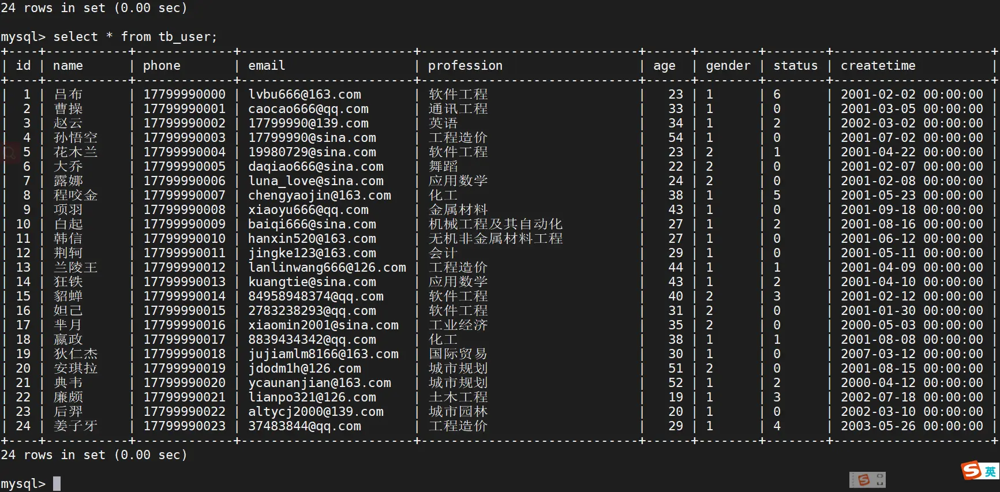

数据准备好了之后，接下来，我们就来完成如下需求：

1. name字段为姓名字段，该字段的值可能会重复，为该字段创建索引。

```sql
CREATE INDEX idx_user_name ON tb_user(name);
```

2. phone手机号字段的值，是非空，且唯一的，为该字段创建唯一索引。

```sql
CREATE UNIQUE INDEX idx_user_phone ON tb_user(phone);
```

3. 为profession、age、status创建联合索引。

```sql
CREATE INDEX idx_user_pro_age_sta ON tb_user(profession,age,status);
```

4. 为email建立合适的索引来提升查询效率

```sql
CREATE INDEX idx_email ON tb_user(email);
```

完成上述的需求之后，我们再查看tb_user表的所有的索引数据。

```sql
show index from tb_user;
```

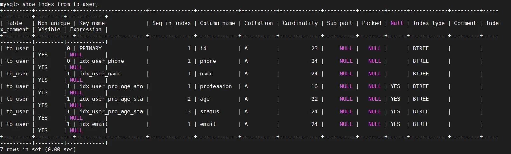

## [#](https://frxcat.fun/database/MySQL/MySQL_Advanced_index/#sql-%E6%80%A7%E8%83%BD%E5%88%86%E6%9E%90)SQL 性能分析

### [#](https://frxcat.fun/database/MySQL/MySQL_Advanced_index/#sql-%E6%89%A7%E8%A1%8C%E9%A2%91%E7%8E%87)SQL 执行频率

MySQL 客户端连接成功后，通过 show [session|global] status 命令可以提供服务器状态信息。通过如下指令，可以查看当前数据库的INSERT、UPDATE、DELETE、SELECT的访问频次：

```sql
-- session 是查看当前会话 ;
-- global 是查询全局数据 ;
SHOW GLOBAL STATUS LIKE 'Com_______';
```

 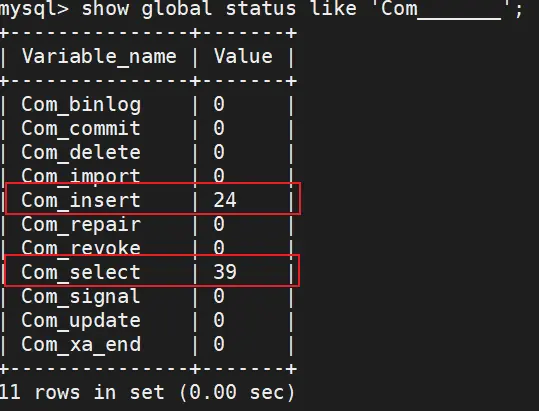

Com_delete: 删除次数

Com_insert: 插入次数

Com_select: 查询次数

Com_update: 更新次数

我们可以在当前数据库再执行几次查询操作，然后再次查看执行频次，看看 Com_select 参数会不会变化。

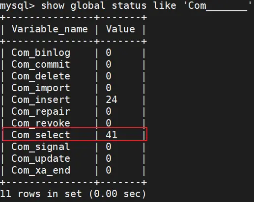

> 通过上述指令，我们可以查看到当前数据库到底是以查询为主，还是以增删改为主，从而为数据库优化提供参考依据。 如果是以增删改为主，我们可以考虑不对其进行索引的优化。 如果是以查询为主，那么就要考虑对数据库的索引进行优化了。

那么通过查询SQL的执行频次，我们就能够知道当前数据库到底是增删改为主，还是查询为主。 那假如说是以查询为主，我们又该如何定位针对于那些查询语句进行优化呢？ 次数我们可以借助于慢查询日志。

接下来，我们就来介绍一下MySQL中的慢查询日志。

### [#](https://frxcat.fun/database/MySQL/MySQL_Advanced_index/#%E6%85%A2%E6%9F%A5%E8%AF%A2%E6%97%A5%E5%BF%97)慢查询日志

慢查询日志记录了所有执行时间超过指定参数（long_query_time，单位：秒，默认10秒）的所有 SQL语句的日志。

MySQL的慢查询日志默认没有开启，我们可以查看一下系统变量 slow_query_log。

```sql
show variables like 'slow_query_log';
```

```sql
mysql> show variables like 'slow_query_log';
+----------------+-------+
| Variable_name  | Value |
+----------------+-------+
| slow_query_log | OFF   |
+----------------+-------+
1 row in set (0.01 sec)
```

如果要开启慢查询日志，需要在MySQL的配置文件（/etc/my.cnf）中配置如下信息：

```sh
# 开启MySQL慢日志查询开关

slow_query_log=1

# 设置慢日志的时间为2秒，SQL语句执行时间超过2秒，就会视为慢查询，记录慢查询日志

long_query_time=2
```

 配置完毕之后，通过以下指令重新启动MySQL服务器进行测试，查看慢日志文件中记录的信息 `/var/lib/mysql/localhost-slow.log`。

```sh
systemctl restart mysqld
```

然后，再次查看开关情况，慢查询日志就已经打开了。

```sql
mysql> show variables like 'slow_query_log';
+----------------+-------+
| Variable_name  | Value |
+----------------+-------+
| slow_query_log | ON    |
+----------------+-------+
1 row in set (0.00 sec)
```

测试：

1. 执行如下SQL语句 ：

```sql
select * from tb_user; -- 这条SQL执行效率比较高, 执行耗时 0.00sec
select count(*) from tb_sku; -- 由于tb_sku表中, 预先存入了1000w的记录, count一次,耗时13.35sec
```

2. 检查慢查询日志 ：

最终我们发现，在慢查询日志中，只会记录执行时间超多我们预设时间（2s）的SQL，执行较快的SQL是不会记录的。

那这样，通过慢查询日志，就可以定位出执行效率比较低的SQL，从而有针对性的进行优化。

### [#](https://frxcat.fun/database/MySQL/MySQL_Advanced_index/#profile%E8%AF%A6%E6%83%85)profile详情

show profiles 能够在做SQL优化时帮助我们了解时间都耗费到哪里去了。通过have_profiling参数，能够看到当前MySQL是否支持profile操作：

```sql
SELECT @@have_profiling;
```

```sql
mysql> SELECT @@have_profiling;
+------------------+
| @@have_profiling |
+------------------+
| YES              |
+------------------+
1 row in set, 1 warning (0.00 sec)

mysql> select @@profiling;
+-------------+
| @@profiling |
+-------------+
|           0 |
+-------------+
1 row in set, 1 warning (0.00 sec)
```

可以看到，当前MySQL是支持 profile操作的，但是开关是关闭的。可以通过set语句在session/global级别开启profiling：

```sh
SET profiling = 1;
```

开关已经打开了，接下来，我们所执行的SQL语句，都会被MySQL记录，并记录执行时间消耗到哪儿去了。 我们直接执行如下的SQL语句：

```sql
select * from tb_user;

select * from tb_user where id = 1;

select * from tb_user where name = '白起';

select count(*) from tb_sku;
```

执行一系列的业务SQL的操作，然后通过如下指令查看指令的执行耗时：

```sql
-- 查看每一条SQL的耗时基本情况
show profiles;

-- 查看指定query_id的SQL语句各个阶段的耗时情况
show profile for query query_id;

-- 查看指定query_id的SQL语句CPU的使用情况
show profile cpu for query query_id;
```

 查看每一条SQL的耗时情况:

```sql
mysql> show profiles;
+----------+------------+---------------------------------------------+
| Query_ID | Duration   | Query                                       |
+----------+------------+---------------------------------------------+
|        1 | 0.00035925 | select @@profiling                          |
|        2 | 0.00047950 | select * from tb_user                       |
|        3 | 0.00028925 | select * from tb_user where id = 1          |
|        4 | 0.00047600 | select * from tb_user where name = '白起'   |
|        5 | 0.00074075 | select count(*) from tb_sku                 |
+----------+------------+---------------------------------------------+
5 rows in set, 1 warning (0.00 sec)
```

查看指定SQL各个阶段的耗时情况 :

```sql
mysql> show profile for query 4;
+--------------------------------+----------+
| Status                         | Duration |
+--------------------------------+----------+
| starting                       | 0.000089 |
| Executing hook on transaction  | 0.000006 |
| starting                       | 0.000007 |
| checking permissions           | 0.000005 |
| Opening tables                 | 0.000032 |
| init                           | 0.000004 |
| System lock                    | 0.000007 |
| optimizing                     | 0.000061 |
| statistics                     | 0.000182 |
| preparing                      | 0.000015 |
| executing                      | 0.000030 |
| end                            | 0.000003 |
| query end                      | 0.000003 |
| waiting for handler commit     | 0.000006 |
| closing tables                 | 0.000005 |
| freeing items                  | 0.000010 |
| cleaning up                    | 0.000011 |
+--------------------------------+----------+
17 rows in set, 1 warning (0.00 sec)
```

查看指定query_id的SQL语句CPU的使用情况:

```sql
mysql> show profile cpu for query 4;
+--------------------------------+----------+----------+------------+
| Status                         | Duration | CPU_user | CPU_system |
+--------------------------------+----------+----------+------------+
| starting                       | 0.000089 | 0.000026 |   0.000061 |
| Executing hook on transaction  | 0.000006 | 0.000001 |   0.000002 |
| starting                       | 0.000007 | 0.000002 |   0.000005 |
| checking permissions           | 0.000005 | 0.000001 |   0.000004 |
| Opening tables                 | 0.000032 | 0.000010 |   0.000022 |
| init                           | 0.000004 | 0.000001 |   0.000003 |
| System lock                    | 0.000007 | 0.000002 |   0.000005 |
| optimizing                     | 0.000061 | 0.000000 |   0.000062 |
| statistics                     | 0.000182 | 0.000000 |   0.000202 |
| preparing                      | 0.000015 | 0.000000 |   0.000014 |
| executing                      | 0.000030 | 0.000000 |   0.000030 |
| end                            | 0.000003 | 0.000000 |   0.000003 |
| query end                      | 0.000003 | 0.000000 |   0.000003 |
| waiting for handler commit     | 0.000006 | 0.000000 |   0.000006 |
| closing tables                 | 0.000005 | 0.000000 |   0.000005 |
| freeing items                  | 0.000010 | 0.000000 |   0.000011 |
| cleaning up                    | 0.000011 | 0.000000 |   0.000010 |
+--------------------------------+----------+----------+------------+
17 rows in set, 1 warning (0.00 sec)
```

### [#](https://frxcat.fun/database/MySQL/MySQL_Advanced_index/#explain)explain

EXPLAIN 或者 DESC命令获取 MySQL 如何执行 SELECT 语句的信息，包括在 SELECT 语句执行过程中表如何连接和连接的顺序。

语法：

```sql
-- 直接在select语句之前加上关键字 explain / desc
EXPLAIN SELECT 字段列表 FROM 表名 WHERE 条件 ;
```

```sql
mysql> EXPLAIN select * from tb_user where id = 1;
+----+-------------+---------+------------+-------+---------------+---------+---------+-------+------+----------+-------+
| id | select_type | table   | partitions | type  | possible_keys | key     | key_len | ref   | rows | filtered | Extra |
+----+-------------+---------+------------+-------+---------------+---------+---------+-------+------+----------+-------+
|  1 | SIMPLE      | tb_user | NULL       | const | PRIMARY       | PRIMARY | 4       | const |    1 |   100.00 | NULL  |
+----+-------------+---------+------------+-------+---------------+---------+---------+-------+------+----------+-------+
1 row in set, 1 warning (0.00 sec)
```

Explain 执行计划中各个字段的含义:

| 字段          | 含义                                                                                                                                                                                                                                                                                                                                                                                                                                                                                                                                                                                                                                                                                                                                                                                                                                                                                                                                                                                                                             |
| ------------- | -------------------------------------------------------------------------------------------------------------------------------------------------------------------------------------------------------------------------------------------------------------------------------------------------------------------------------------------------------------------------------------------------------------------------------------------------------------------------------------------------------------------------------------------------------------------------------------------------------------------------------------------------------------------------------------------------------------------------------------------------------------------------------------------------------------------------------------------------------------------------------------------------------------------------------------------------------------------------------------------------------------------------------- |
| id            | 查询的序号，包含一组数字，表示查询中执行select子句或操作表的顺序**两种情况** id相同，执行顺序从上往下 id不同，id值越大，优先级越高，越先执行                                                                                                                                                                                                                                                                                                                                                                                                                                                                                                                                                                                                                                                                                                                                                                                                                                                                               |
| select_type   | 查询类型，主要用于区别普通查询，联合查询，子查询等的复杂查询``1、simple ——简单的select查询，查询中不包含子查询或者UNION``2、primary ——查询中若包含任何复杂的子部分，最外层查询被标记``3、subquery——在select或where列表中包含了子查询``4、derived——在from列表中包含的子查询被标记为derived（衍生），MySQL会递归执行这些子查询，把结果放到临时表中``5、union——如果第二个select出现在UNION之后，则被标记为UNION，如果union包含在from子句的子查询中，外层select被标记为derived``6、union result:UNION 的结果                                                                                                                                                                                                                                                                                                                                                                                                                                                                     |
| table         | 输出的行所引用的表                                                                                                                                                                                                                                                                                                                                                                                                                                                                                                                                                                                                                                                                                                                                                                                                                                                                                                                                                                                                               |
| type          | 显示联结类型，显示查询使用了何种类型，按照从最佳到最坏类型排序``1、system：表中仅有一行（=系统表）这是const联结类型的一个特例。``2、const：表示通过索引一次就找到，const用于比较primary key或者unique索引。因为只匹配一行数据，所以如果将主键置于where列表中，mysql能将该查询转换为一个常量。``3、eq_ref:唯一性索引扫描，对于每个索引键，表中只有一条记录与之匹配。常见于唯一索引或者主键扫描。``4、ref:非唯一性索引扫描，返回匹配某个单独值的所有行，本质上也是一种索引访问，它返回所有匹配某个单独值的行，可能会找多个符合条件的行，属于查找和扫描的混合体。``5、range:只检索给定范围的行，使用一个索引来选择行。key列显示使用了哪个索引，一般就是where语句中出现了between,in等范围的查询。这种范围扫描索引扫描比全表扫描要好，因为它开始于索引的某一个点，而结束另一个点，不用全表扫描。``6、index:index 与all区别为index类型只遍历索引树。通常比all快，因为索引文件比数据文件小很多。``7、all：遍历全表以找到匹配的行。 注意:一般保证查询至少达到range级别，最好能达到ref。 |
| possible_keys | 指出MySQL能使用哪个索引在该表中找到行                                                                                                                                                                                                                                                                                                                                                                                                                                                                                                                                                                                                                                                                                                                                                                                                                                                                                                                                                                                            |
| key           | 显示MySQL实际决定使用的键(索引)。如果没有选择索引,键是NULL。查询中如果使用覆盖索引，则该索引和查询的select字段重叠。                                                                                                                                                                                                                                                                                                                                                                                                                                                                                                                                                                                                                                                                                                                                                                                                                                                                                                             |
| key_len       | 表示索引中使用的字节数，该列计算查询中使用的索引的长度在不损失精度的情况下，长度越短越好。如果键是NULL,则长度为NULL。该字段显示为索引字段的最大可能长度，并非实际使用长度。                                                                                                                                                                                                                                                                                                                                                                                                                                                                                                                                                                                                                                                                                                                                                                                                                                                      |
| ref           | 显示索引的哪一列被使用了，如果有可能是一个常数，哪些列或常量被用于查询索引列上的值                                                                                                                                                                                                                                                                                                                                                                                                                                                                                                                                                                                                                                                                                                                                                                                                                                                                                                                                               |
| rows          | 根据表统计信息以及索引选用情况，大致估算出找到所需的记录所需要读取的行数                                                                                                                                                                                                                                                                                                                                                                                                                                                                                                                                                                                                                                                                                                                                                                                                                                                                                                                                                         |
| Extra         | 包含不适合在其他列中显示，但是十分重要的额外信息``1、Using filesort：说明mysql会对数据适用一个外部的索引排序。而不是按照表内的索引顺序进行读取。MySQL中无法利用索引完成排序操作称为“文件排序”``2、Using temporary:使用了临时表保存中间结果，mysql在查询结果排序时使用临时表。常见于排序order by和分组查询group by。``3、Using index:表示相应的select操作用使用覆盖索引，避免访问了表的数据行。如果同时出现using where，表名索引被用来执行索引键值的查找；如果没有同时出现using where，表名索引用来读取数据而非执行查询动作。``4、Using where :表明使用where过滤``5、using join buffer:使用了连接缓存``6、impossible where:where子句的值总是false，不能用来获取任何元组``7、select tables optimized away：在没有group by子句的情况下，基于索引优化Min、max操作或者对于MyISAM存储引擎优化count（*），不必等到执行阶段再进行计算，查询执行计划生成的阶段即完成优化。``8、distinct：优化distinct操作，在找到第一匹配的元组后即停止找同样值的动作。                         |

## [#](https://frxcat.fun/database/MySQL/MySQL_Advanced_index/#%E7%B4%A2%E5%BC%95%E4%BD%BF%E7%94%A8)索引使用

### [#](https://frxcat.fun/database/MySQL/MySQL_Advanced_index/#%E9%AA%8C%E8%AF%81%E7%B4%A2%E5%BC%95%E6%95%88%E7%8E%87)验证索引效率

在讲解索引的使用原则之前，先通过一个简单的案例，来验证一下索引，看看是否能够通过索引来提升数据查询性能。在演示的时候，我们还是使用之前准备的一张表 tb_sku , 在这张表中准备了1000w的记录。


这张表中id为主键，有主键索引，而其他字段是没有建立索引的。 我们先来查询其中的一条记录，看 看里面的字段情况，执行如下SQL：

```sql
select * from tb_sku here id = 1\G;
```


可以看到即使有1000w的数据,根据id进行数据查询,性能依然很快，因为主键id是有索引的。 那么接下来，我们再来根据 sn 字段进行查询，执行如下SQL：

```sql
SELECT * FROM tb_sku WHERE sn = '100000003145001';
```


我们可以看到根据sn字段进行查询，查询返回了一条数据，结果耗时 20.78sec，就是因为sn没有索引，而造成查询效率很低。

那么我们可以针对于sn字段，建立一个索引，建立了索引之后，我们再次根据sn进行查询，再来看一下查询耗时情况。

创建索引：

```sql
create index idx_sku_sn on tb_sku(sn) ;
```


然后再次执行相同的SQL语句，再次查看SQL的耗时。

```sql
SELECT * FROM tb_sku WHERE sn = '100000003145001';
```

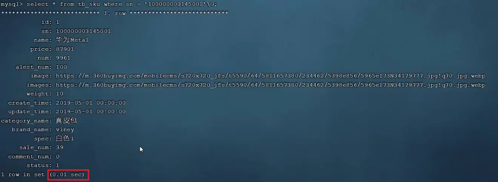

我们明显会看到，sn字段建立了索引之后，查询性能大大提升。建立索引前后，查询耗时都不是一个数量级的。

### [#](https://frxcat.fun/database/MySQL/MySQL_Advanced_index/#%E6%9C%80%E5%B7%A6%E5%89%8D%E7%BC%80%E6%B3%95%E5%88%99)最左前缀法则

如果索引关联了多列（联合索引），要遵守最左前缀法则，最左前缀法则指的是查询从索引的最左列开始，并且不跳过索引中的列。如果跳跃某一列， =索引将部分失效（后面的字段索引失效）= 。

以 tb_user 表为例，我们先来查看一下之前 tb_user 表所创建的索引。

```sql
mysql> show index from tb_user;
+---------+------------+----------------------+--------------+-------------+-----------+-------------+----------+--------+------+------------+---------+---------------+---------+------------+
| Table   | Non_unique | Key_name             | Seq_in_index | Column_name | Collation | Cardinality | Sub_part | Packed | Null | Index_type | Comment | Index_comment | Visible | Expression |
+---------+------------+----------------------+--------------+-------------+-----------+-------------+----------+--------+------+------------+---------+---------------+---------+------------+
| tb_user |          0 | PRIMARY              |            1 | id          | A         |          23 |     NULL |   NULL |      | BTREE      |         |               | YES     | NULL       |
| tb_user |          0 | idx_user_phone       |            1 | phone       | A         |          24 |     NULL |   NULL |      | BTREE      |         |               | YES     | NULL       |
| tb_user |          1 | idx_user_name        |            1 | name        | A         |          24 |     NULL |   NULL |      | BTREE      |         |               | YES     | NULL       |
| tb_user |          1 | idx_user_pro_age_sta |            1 | profession  | A         |          16 |     NULL |   NULL | YES  | BTREE      |         |               | YES     | NULL       |
| tb_user |          1 | idx_user_pro_age_sta |            2 | age         | A         |          22 |     NULL |   NULL | YES  | BTREE      |         |               | YES     | NULL       |
| tb_user |          1 | idx_user_pro_age_sta |            3 | status      | A         |          24 |     NULL |   NULL | YES  | BTREE      |         |               | YES     | NULL       |
| tb_user |          1 | idx_email            |            1 | email       | A         |          24 |     NULL |   NULL | YES  | BTREE      |         |               | YES     | NULL       |
+---------+------------+----------------------+--------------+-------------+-----------+-------------+----------+--------+------+------------+---------+---------------+---------+------------+
7 rows in set (0.00 sec)

```

在 tb_user 表中，有一个联合索引，这个联合索引涉及到三个字段，顺序分别为：profession，age，status。

对于最左前缀法则指的是，查询时，最左变的列，也就是profession必须存在，否则索引全部失效。而且中间不能跳过某一列，否则该列后面的字段索引将失效。 接下来，我们来演示几组案例，看一下具体的执行计划：

```sh
explain select * from tb_user where profession = '软件工程' and age = 31 and status = '0';
```

```sql
mysql> explain select * from tb_user where profession = '软件工程' and age = 31 and status = '0';
+----+-------------+---------+------------+------+----------------------+----------------------+---------+-------------------+------+----------+-----------------------+
| id | select_type | table   | partitions | type | possible_keys        | key                  | key_len | ref               | rows | filtered | Extra                 |
+----+-------------+---------+------------+------+----------------------+----------------------+---------+-------------------+------+----------+-----------------------+
|  1 | SIMPLE      | tb_user | NULL       | ref  | idx_user_pro_age_sta | idx_user_pro_age_sta | 54      | const,const,const |    1 |   100.00 | Using index condition |
+----+-------------+---------+------------+------+----------------------+----------------------+---------+-------------------+------+----------+-----------------------+
1 row in set, 1 warning (0.00 sec)
```

```sql
explain select * from tb_user where profession = '软件工程' and age = 31;
```

```sql
mysql> explain select * from tb_user where profession = '软件工程' and age = 31;
+----+-------------+---------+------------+------+----------------------+----------------------+---------+-------------+------+----------+-------+
| id | select_type | table   | partitions | type | possible_keys        | key                  | key_len | ref         | rows | filtered | Extra |
+----+-------------+---------+------------+------+----------------------+----------------------+---------+-------------+------+----------+-------+
|  1 | SIMPLE      | tb_user | NULL       | ref  | idx_user_pro_age_sta | idx_user_pro_age_sta | 49      | const,const |    1 |   100.00 | NULL  |
+----+-------------+---------+------------+------+----------------------+----------------------+---------+-------------+------+----------+-------+
1 row in set, 1 warning (0.00 sec)
```

```sql
explain select * from tb_user where profession = '软件工程';
```

```sql
mysql> explain select * from tb_user where profession = '软件工程';
+----+-------------+---------+------------+------+----------------------+----------------------+---------+-------+------+----------+-------+
| id | select_type | table   | partitions | type | possible_keys        | key                  | key_len | ref   | rows | filtered | Extra |
+----+-------------+---------+------------+------+----------------------+----------------------+---------+-------+------+----------+-------+
|  1 | SIMPLE      | tb_user | NULL       | ref  | idx_user_pro_age_sta | idx_user_pro_age_sta | 47      | const |    4 |   100.00 | NULL  |
+----+-------------+---------+------------+------+----------------------+----------------------+---------+-------+------+----------+-------+
1 row in set, 1 warning (0.00 sec)
```

以上的这三组测试中，我们发现只要联合索引最左边的字段 profession存在，索引就会生效，只不过索引的长度不同。 而且由以上三组测试，我们也可以推测出profession字段索引长度为47、age字段索引长度为2、status字段索引长度为5。

```sql
explain select * from tb_user where age = 31 and status = '0';
```

```sql
mysql> explain select * from tb_user where age = 31 and status = '0';
+----+-------------+---------+------------+------+---------------+------+---------+------+------+----------+-------------+
| id | select_type | table   | partitions | type | possible_keys | key  | key_len | ref  | rows | filtered | Extra       |
+----+-------------+---------+------------+------+---------------+------+---------+------+------+----------+-------------+
|  1 | SIMPLE      | tb_user | NULL       | ALL  | NULL          | NULL | NULL    | NULL |   24 |     4.17 | Using where |
+----+-------------+---------+------------+------+---------------+------+---------+------+------+----------+-------------+
1 row in set, 1 warning (0.00 sec)
```

```sql
explain select * from tb_user where status = '0';
```

```sql
mysql> explain select * from tb_user where status = '0';
+----+-------------+---------+------------+------+---------------+------+---------+------+------+----------+-------------+
| id | select_type | table   | partitions | type | possible_keys | key  | key_len | ref  | rows | filtered | Extra       |
+----+-------------+---------+------------+------+---------------+------+---------+------+------+--------+-------------+
|  1 | SIMPLE      | tb_user | NULL       | ALL  | NULL          | NULL | NULL    | NULL |   24 |    10.00 | Using where |
+----+-------------+---------+------------+------+---------------+------+---------+------+------+----------+-------------+
1 row in set, 1 warning (0.00 sec)
```

而通过上面的这两组测试，我们也可以看到索引并未生效，原因是因为不满足最左前缀法则，联合索引最左边的列profession不存在。

```sql
explain select * from tb_user where profession = '软件工程' and status = '0';
```

```sql
mysql> explain select * from tb_user where profession = '软件工程' and status = '0';
+----+-------------+---------+------------+------+----------------------+----------------------+---------+-------+------+----------+-----------------------+
| id | select_type | table   | partitions | type | possible_keys        | key                  | key_len | ref   | rows | filtered | Extra                 |
+----+-------------+---------+------------+------+----------------------+----------------------+---------+-------+------+----------+-----------------------+
|  1 | SIMPLE      | tb_user | NULL       | ref  | idx_user_pro_age_sta | idx_user_pro_age_sta | 47      | const |    4 |    10.00 | Using index condition |
+----+-------------+---------+------------+------+----------------------+----------------------+---------+-------+------+----------+-----------------------+
1 row in set, 1 warning (0.00 sec)
```

上述的SQL查询时，存在profession字段，最左边的列是存在的，索引满足最左前缀法则的基本条件。但是查询时，跳过了age这个列，所以后面的列索引是不会使用的，也就是索引部分生效，所以索引的长度就是47。

> 思考题:
>
> 当执行SQL语句: explain select * from tb_user where age = 31 and status = '0' and profession = '软件工程'； 时，是否满足最左前缀法则，走不走上述的联合索引，索引长度？
>
> ```sql
> mysql> explain select * from tb_user where age = 31 and status = '0' and profession = '软件工程';
> +----+-------------+---------+------------+------+----------------------+----------------------+---------+-------------------+------+----------+-----------------------+
> | id | select_type | table   | partitions | type | possible_keys        | key                  | key_len | ref               | rows | filtered | Extra                 |
> +----+-------------+---------+------------+------+----------------------+----------------------+---------+-------------------+------+----------+-----------------------+
> |  1 | SIMPLE      | tb_user | NULL       | ref  | idx_user_pro_age_sta | idx_user_pro_age_sta | 54      | const,const,const |    1 |   100.00 | Using index condition |
> +----+-------------+---------+------------+------+----------------------+----------------------+---------+-------------------+------+----------+-----------------------+
> 1 row in set, 1 warning (0.00 sec)
> ```
>
> 可以看到，是完全满足最左前缀法则的，索引长度54，联合索引是生效的。
>
> 注意 ： 最左前缀法则中指的最左边的列，是指在查询时，联合索引的最左边的字段(即是第一个字段)必须存在，与我们编写SQL时，条件编写的**先后顺序无关**。

### [#](https://frxcat.fun/database/MySQL/MySQL_Advanced_index/#%E8%8C%83%E5%9B%B4%E6%9F%A5%E8%AF%A2)范围查询

联合索引中，出现范围查询(>,<)，范围查询右侧的列索引失效。

```sql
explain select * from tb_user where profession = '软件工程' and age > 30 and status = '0';
```

```sql
mysql> explain select * from tb_user where profession = '软件工程' and age > 30 and status = '0';
+----+-------------+---------+------------+-------+----------------------+----------------------+---------+------+------+----------+-----------------------+
| id | select_type | table   | partitions | type  | possible_keys        | key                  | key_len | ref  | rows | filtered | Extra                 |
+----+-------------+---------+------------+-------+----------------------+----------------------+---------+------+------+----------+-----------------------+
|  1 | SIMPLE      | tb_user | NULL       | range | idx_user_pro_age_sta | idx_user_pro_age_sta | 49      | NULL |    2 |    10.00 | Using index condition |
+----+-------------+---------+------------+-------+----------------------+----------------------+---------+------+------+----------+-----------------------+
1 row in set, 1 warning (0.00 sec)
```

当范围查询使用> 或 < 时，走联合索引了，但是索引的长度为49，就说明=范围查询右边的status字段是没有走索引=的。

```sql
explain select * from tb_user where profession = '软件工程' and age >= 30 and status = '0';
```

```sql
mysql> explain select * from tb_user where profession = '软件工程' and age >= 30 and status = '0';
+----+-------------+---------+------------+-------+----------------------+----------------------+---------+------+------+----------+-----------------------+
| id | select_type | table   | partitions | type  | possible_keys        | key                  | key_len | ref  | rows | filtered | Extra                 |
+----+-------------+---------+------------+-------+----------------------+----------------------+---------+------+------+----------+-----------------------+
|  1 | SIMPLE      | tb_user | NULL       | range | idx_user_pro_age_sta | idx_user_pro_age_sta | 54      | NULL |    2 |    10.00 | Using index condition |
+----+-------------+---------+------------+-------+----------------------+----------------------+---------+------+------+----------+-----------------------+
1 row in set, 1 warning (0.00 sec)
```

当范围查询使用>= 或 <= 时，走联合索引了，但是索引的长度为54，就说明所有的字段都是走索引的。

所以，在业务允许的情况下，尽可能的使用类似于 >= 或 <= 这类的范围查询，而避免使用 > 或 <

大于号导致[索引失效](https://so.csdn.net/so/search?q=%E7%B4%A2%E5%BC%95%E5%A4%B1%E6%95%88&spm=1001.2101.3001.7020)的原因?

mysql先用=号去查数据，找到最后的叶子节点，然后往后推，找大于的所有数据

加上等号可以具体定位到叶子链表中的具体节点，然后顺着往后遍历就可以了，不加等号，如果后面列索引不失效会出现很多重复的情况，遍历耗时更多

### [#](https://frxcat.fun/database/MySQL/MySQL_Advanced_index/#%E7%B4%A2%E5%BC%95%E5%A4%B1%E6%95%88%E6%83%85%E5%86%B5)索引失效情况

#### [#](https://frxcat.fun/database/MySQL/MySQL_Advanced_index/#%E7%B4%A2%E5%BC%95%E5%88%97%E8%BF%90%E7%AE%97)索引列运算

 =不要在索引列上进行运算操作， 索引将失效= 。

在tb_user表中，除了前面介绍的联合索引之外，还有一个索引，是phone字段的单列索引。

```sql
mysql> show index from tb_user;
+---------+------------+----------------------+--------------+-------------+-----------+-------------+----------+--------+------+------------+---------+---------------+---------+------------+
| Table   | Non_unique | Key_name             | Seq_in_index | Column_name | Collation | Cardinality | Sub_part | Packed | Null | Index_type | Comment | Index_comment | Visible | Expression |
+---------+------------+----------------------+--------------+-------------+-----------+-------------+----------+--------+------+------------+---------+---------------+---------+------------+
| tb_user |          0 | PRIMARY              |            1 | id          | A         |          23 |     NULL |   NULL |      | BTREE      |         |               | YES     | NULL       |
| tb_user |          0 | idx_user_phone       |            1 | phone       | A         |          24 |     NULL |   NULL |      | BTREE      |         |               | YES     | NULL       |
| tb_user |          1 | idx_user_name        |            1 | name        | A         |          24 |     NULL |   NULL |      | BTREE      |         |               | YES     | NULL       |
| tb_user |          1 | idx_user_pro_age_sta |            1 | profession  | A         |          16 |     NULL |   NULL | YES  | BTREE      |         |               | YES     | NULL       |
| tb_user |          1 | idx_user_pro_age_sta |            2 | age         | A         |          22 |     NULL |   NULL | YES  | BTREE      |         |               | YES     | NULL       |
| tb_user |          1 | idx_user_pro_age_sta |            3 | status      | A         |          24 |     NULL |   NULL | YES  | BTREE      |         |               | YES     | NULL       |
| tb_user |          1 | idx_email            |            1 | email       | A         |          24 |     NULL |   NULL | YES  | BTREE      |         |               | YES     | NULL       |
+---------+------------+----------------------+--------------+-------------+-----------+-------------+----------+--------+------+------------+---------+---------------+---------+------------+
7 rows in set (0.00 sec)
```

1. 当根据phone字段进行等值匹配查询时, 索引生效。

```sql
explain select * from tb_user where phone = '17799990015';
```

```sql
mysql> explain select * from tb_user where phone = '17799990015';
+----+-------------+---------+------------+-------+----------------+----------------+---------+-------+------+----------+-------+
| id | select_type | table   | partitions | type  | possible_keys  | key            | key_len | ref   | rows | filtered | Extra |
+----+-------------+---------+------------+-------+----------------+----------------+---------+-------+------+----------+-------+
|  1 | SIMPLE      | tb_user | NULL       | const | idx_user_phone | idx_user_phone | 46      | const |    1 |   100.00 | NULL  |
+----+-------------+---------+------------+-------+----------------+----------------+---------+-------+------+----------+-------+
1 row in set, 1 warning (0.00 sec)
```

2. 当根据phone字段进行函数运算操作之后，索引失效。

```sql
explain select * from tb_user where substring(phone,10,2) = '15';
```

```sql
mysql> explain select * from tb_user where substring(phone,10,2) = '15';
+----+-------------+---------+------------+------+---------------+------+---------+------+------+----------+-------------+
| id | select_type | table   | partitions | type | possible_keys | key  | key_len | ref  | rows | filtered | Extra       |
+----+-------------+---------+------------+------+---------------+------+---------+------+------+----------+-------------+
|  1 | SIMPLE      | tb_user | NULL       | ALL  | NULL          | NULL | NULL    | NULL |   24 |   100.00 | Using where |
+----+-------------+---------+------------+------+---------------+------+---------+------+------+----------+-------------+
1 row in set, 1 warning (0.00 sec)
```

#### [#](https://frxcat.fun/database/MySQL/MySQL_Advanced_index/#%E5%AD%97%E7%AC%A6%E4%B8%B2%E4%B8%8D%E5%8A%A0%E5%BC%95%E5%8F%B7)字符串不加引号（隐式类型转换）

 =字符串类型字段使用时，不加引号，索引将失效= 。

接下来，我们通过两组示例，来看看对于字符串类型的字段，加单引号与不加单引号的区别：

```sql
explain select * from tb_user where profession = '软件工程' and age = 31 and status = '0';
explain select * from tb_user where profession = '软件工程' and age = 31 and status = 0;
```

```sql
mysql> explain select * from tb_user where profession = '软件工程' and age = 31 and status = '0';
+----+-------------+---------+------------+------+----------------------+----------------------+---------+-------------------+------+----------+-----------------------+
| id | select_type | table   | partitions | type | possible_keys        | key                  | key_len | ref               | rows | filtered | Extra                 |
+----+-------------+---------+------------+------+----------------------+----------------------+---------+-------------------+------+----------+-----------------------+
|  1 | SIMPLE      | tb_user | NULL       | ref  | idx_user_pro_age_sta | idx_user_pro_age_sta | 54      | const,const,const |    1 |   100.00 | Using index condition |
+----+-------------+---------+------------+------+----------------------+----------------------+---------+-------------------+------+----------+-----------------------+
1 row in set, 1 warning (0.00 sec)

mysql> explain select * from tb_user where profession = '软件工程' and age = 31 and status = 0;
+----+-------------+---------+------------+------+----------------------+----------------------+---------+-------------+------+----------+-----------------------+
| id | select_type | table   | partitions | type | possible_keys        | key                  | key_len | ref         | rows | filtered | Extra                 |
+----+-------------+---------+------------+------+----------------------+----------------------+---------+-------------+------+----------+-----------------------+
|  1 | SIMPLE      | tb_user | NULL       | ref  | idx_user_pro_age_sta | idx_user_pro_age_sta | 49      | const,const |    1 |    10.00 | Using index condition |
+----+-------------+---------+------------+------+----------------------+----------------------+---------+-------------+------+----------+-----------------------+
1 row in set, 2 warnings (0.00 sec)
```

```sql
explain select * from tb_user where phone = '17799990015';
explain select * from tb_user where phone = 17799990015;
```

```sql
mysql> explain select * from tb_user where phone = '17799990015';
+----+-------------+---------+------------+-------+----------------+----------------+---------+-------+------+----------+-------+
| id | select_type | table   | partitions | type  | possible_keys  | key            | key_len | ref   | rows | filtered | Extra |
+----+-------------+---------+------------+-------+----------------+----------------+---------+-------+------+----------+-------+
|  1 | SIMPLE      | tb_user | NULL       | const | idx_user_phone | idx_user_phone | 46      | const |    1 |   100.00 | NULL  |
+----+-------------+---------+------------+-------+----------------+----------------+---------+-------+------+----------+-------+
1 row in set, 1 warning (0.00 sec)

mysql> explain select * from tb_user where phone = 17799990015;
+----+-------------+---------+------------+------+----------------+------+---------+------+------+----------+-------------+
| id | select_type | table   | partitions | type | possible_keys  | key  | key_len | ref  | rows | filtered | Extra       |
+----+-------------+---------+------------+------+----------------+------+---------+------+------+----------+-------------+
|  1 | SIMPLE      | tb_user | NULL       | ALL  | idx_user_phone | NULL | NULL    | NULL |   24 |    10.00 | Using where |
+----+-------------+---------+------------+------+----------------+------+---------+------+------+----------+-------------+
1 row in set, 3 warnings (0.00 sec)
```

经过上面两组示例，我们会明显的发现，如果字符串不加单引号，对于查询结果，没什么影响，但是数据库存在隐式类型转换，索引将失效。

#### [#](https://frxcat.fun/database/MySQL/MySQL_Advanced_index/#%E6%A8%A1%E7%B3%8A%E6%9F%A5%E8%AF%A2)模糊查询

 =如果仅仅是尾部模糊匹配，索引不会失效。如果是头部模糊匹配，索引失效= 。

接下来，我们来看一下这三条SQL语句的执行效果，查看一下其执行计划：

由于下面查询语句中，都是根据profession字段查询，符合最左前缀法则，联合索引是可以生效的，

我们主要看一下，模糊查询时，%加在关键字之前，和加在关键字之后的影响。

```sql
explain select * from tb_user where profession like '软件%';
explain select * from tb_user where profession like '%工程';
explain select * from tb_user where profession like '%工%';
```

```sql
mysql> explain select * from tb_user where profession like '软件%';
+----+-------------+---------+------------+-------+----------------------+----------------------+---------+------+------+----------+-----------------------+
| id | select_type | table   | partitions | type  | possible_keys        | key                  | key_len | ref  | rows | filtered | Extra                 |
+----+-------------+---------+------------+-------+----------------------+----------------------+---------+------+------+----------+-----------------------+
|  1 | SIMPLE      | tb_user | NULL       | range | idx_user_pro_age_sta | idx_user_pro_age_sta | 47      | NULL |    4 |   100.00 | Using index condition |
+----+-------------+---------+------------+-------+----------------------+----------------------+---------+------+------+----------+-----------------------+
1 row in set, 1 warning (0.00 sec)

mysql> explain select * from tb_user where profession like '%工程';
+----+-------------+---------+------------+------+---------------+------+---------+------+------+----------+-------------+
| id | select_type | table   | partitions | type | possible_keys | key  | key_len | ref  | rows | filtered | Extra       |
+----+-------------+---------+------------+------+---------------+------+---------+------+------+----------+-------------+
|  1 | SIMPLE      | tb_user | NULL       | ALL  | NULL          | NULL | NULL    | NULL |   24 |    11.11 | Using where |
+----+-------------+---------+------------+------+---------------+------+---------+------+------+----------+-------------+
1 row in set, 1 warning (0.00 sec)

mysql> explain select * from tb_user where profession like '%工%';
+----+-------------+---------+------------+------+---------------+------+---------+------+------+----------+-------------+
| id | select_type | table   | partitions | type | possible_keys | key  | key_len | ref  | rows | filtered | Extra       |
+----+-------------+---------+------------+------+---------------+------+---------+------+------+----------+-------------+
|  1 | SIMPLE      | tb_user | NULL       | ALL  | NULL          | NULL | NULL    | NULL |   24 |    11.11 | Using where |
+----+-------------+---------+------------+------+---------------+------+---------+------+------+----------+-------------+
1 row in set, 1 warning (0.00 sec)
```

经过上述的测试，我们发现，在like模糊查询中，在关键字后面加%，索引可以生效。而如果在关键字前面加了%，索引将会失效。

#### [#](https://frxcat.fun/database/MySQL/MySQL_Advanced_index/#or%E8%BF%9E%E6%8E%A5%E6%9D%A1%E4%BB%B6)or连接条件

 =用or分割开的条件， 如果or前的条件中的列有索引，而后面的列中没有索引，那么涉及的索引都不会被用到= 。

```sql
explain select * from tb_user where id = 10 or age = 23;
explain select * from tb_user where phone = '17799990017' or age = 23;
```

```sql
mysql> explain select * from tb_user where id = 10 or age = 23;
+----+-------------+---------+------------+------+---------------+------+---------+------+------+----------+-------------+
| id | select_type | table   | partitions | type | possible_keys | key  | key_len | ref  | rows | filtered | Extra       |
+----+-------------+---------+------------+------+---------------+------+---------+------+------+----------+-------------+
|  1 | SIMPLE      | tb_user | NULL       | ALL  | PRIMARY       | NULL | NULL    | NULL |   24 |    13.91 | Using where |
+----+-------------+---------+------------+------+---------------+------+---------+------+------+----------+-------------+
1 row in set, 1 warning (0.01 sec)

mysql> explain select * from tb_user where phone = '17799990017' or age = 23;
+----+-------------+---------+------------+------+----------------+------+---------+------+------+----------+-------------+
| id | select_type | table   | partitions | type | possible_keys  | key  | key_len | ref  | rows | filtered | Extra       |
+----+-------------+---------+------------+------+----------------+------+---------+------+------+----------+-------------+
|  1 | SIMPLE      | tb_user | NULL       | ALL  | idx_user_phone | NULL | NULL    | NULL |   24 |    13.75 | Using where |
+----+-------------+---------+------------+------+----------------+------+---------+------+------+----------+-------------+
1 row in set, 1 warning (0.00 sec)
```

由于age没有索引，所以即使id、phone有索引，索引也会失效。所以需要针对于age也要建立索引。

然后，我们可以对age字段建立索引。

```sql
create index idx_user_age on tb_user(age);
```

建立了索引之后，我们再次执行上述的SQL语句，看看前后执行计划的变化。

```sql
mysql> explain select * from tb_user where id = 10 or age = 23;
+----+-------------+---------+------------+-------------+----------------------+----------------------+---------+------+------+----------+------------------------------------------------+
| id | select_type | table   | partitions | type        | possible_keys        | key                  | key_len | ref  | rows | filtered | Extra                                          |
+----+-------------+---------+------------+-------------+----------------------+----------------------+---------+------+------+----------+------------------------------------------------+
|  1 | SIMPLE      | tb_user | NULL       | index_merge | PRIMARY,idx_user_age | PRIMARY,idx_user_age | 4,2     | NULL |    3 |   100.00 | Using union(PRIMARY,idx_user_age); Using where |
+----+-------------+---------+------------+-------------+----------------------+----------------------+---------+------+------+----------+------------------------------------------------+
1 row in set, 1 warning (0.00 sec)

mysql> explain select * from tb_user where phone = '17799990017' or age = 23;
+----+-------------+---------+------------+-------------+-----------------------------+-----------------------------+---------+------+------+----------+-------------------------------------------------------+
| id | select_type | table   | partitions | type        | possible_keys               | key                         | key_len | ref  | rows | filtered | Extra                                                 |
+----+-------------+---------+------------+-------------+-----------------------------+-----------------------------+---------+------+------+----------+-------------------------------------------------------+
|  1 | SIMPLE      | tb_user | NULL       | index_merge | idx_user_phone,idx_user_age | idx_user_phone,idx_user_age | 46,2    | NULL |    3 |   100.00 | Using union(idx_user_phone,idx_user_age); Using where |
+----+-------------+---------+------------+-------------+-----------------------------+-----------------------------+---------+------+------+----------+-------------------------------------------------------+
1 row in set, 1 warning (0.00 sec)

```

最终，我们发现，当or连接的条件，左右两侧字段都有索引时，索引才会生效。

#### order | group by

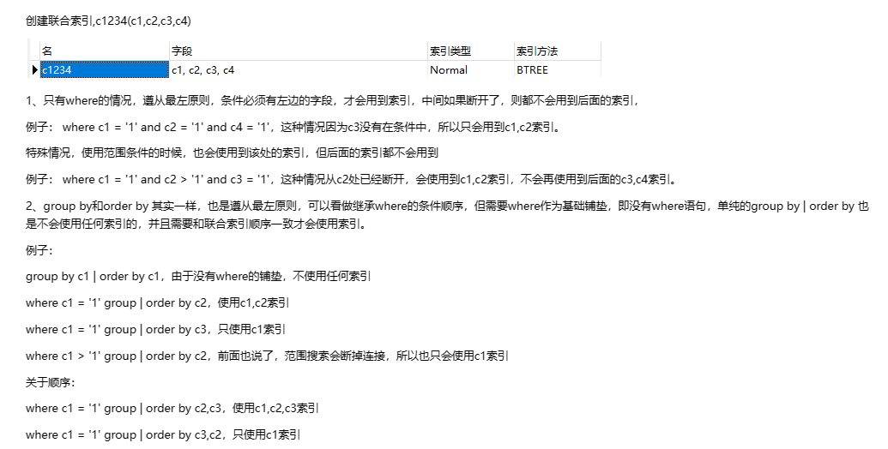

#### [#](https://frxcat.fun/database/MySQL/MySQL_Advanced_index/#%E6%95%B0%E6%8D%AE%E5%88%86%E5%B8%83%E5%BD%B1%E5%93%8D)数据分布影响

 =如果MySQL评估使用索引比全表更慢，则不使用索引= 。

```sql
select * from tb_user where phone >= '17799990005';
select * from tb_user where phone >= '17799990015';
```

```sql
mysql> explain select * from tb_user where phone >= '17799990005';
+----+-------------+---------+------------+------+----------------+------+---------+------+------+----------+-------------+
| id | select_type | table   | partitions | type | possible_keys  | key  | key_len | ref  | rows | filtered | Extra       |
+----+-------------+---------+------------+------+----------------+------+---------+------+------+----------+-------------+
|  1 | SIMPLE      | tb_user | NULL       | ALL  | idx_user_phone | NULL | NULL    | NULL |   24 |    79.17 | Using where |
+----+-------------+---------+------------+------+----------------+------+---------+------+------+----------+-------------+
1 row in set, 1 warning (0.00 sec)

mysql> explain select * from tb_user where phone >= '17799990015';
+----+-------------+---------+------------+-------+----------------+----------------+---------+------+------+----------+-----------------------+
| id | select_type | table   | partitions | type  | possible_keys  | key            | key_len | ref  | rows | filtered | Extra                 |
+----+-------------+---------+------------+-------+----------------+----------------+---------+------+------+----------+-----------------------+
|  1 | SIMPLE      | tb_user | NULL       | range | idx_user_phone | idx_user_phone | 46      | NULL |    9 |   100.00 | Using index condition |
+----+-------------+---------+------------+-------+----------------+----------------+---------+------+------+----------+-----------------------+
1 row in set, 1 warning (0.00 sec)
```

经过测试我们发现，相同的SQL语句，只是传入的字段值不同，最终的执行计划也完全不一样，这是为什么呢？

> 就是因为MySQL在查询时，会评估使用索引的效率与走全表扫描的效率，如果走全表扫描更快，则放弃索引，走全表扫描。 因为索引是用来索引少量数据的，如果通过索引查询返回大批量的数据，则还不如走全表扫描来的快，此时索引就会失效。

接下来，我们再来看看 is null 与 is not null 操作是否走索引。 执行如下两条语句 ：

```sql
explain select * from tb_user where profession is null;
explain select * from tb_user where profession is not null;
```

```sql
mysql> explain select * from tb_user where profession is null;
+----+-------------+---------+------------+------+----------------------+----------------------+---------+-------+------+----------+-----------------------+
| id | select_type | table   | partitions | type | possible_keys        | key                  | key_len | ref   | rows | filtered | Extra                 |
+----+-------------+---------+------------+------+----------------------+----------------------+---------+-------+------+----------+-----------------------+
|  1 | SIMPLE      | tb_user | NULL       | ref  | idx_user_pro_age_sta | idx_user_pro_age_sta | 47      | const |    1 |   100.00 | Using index condition |
+----+-------------+---------+------------+------+----------------------+----------------------+---------+-------+------+----------+-----------------------+
1 row in set, 1 warning (0.00 sec)

mysql> explain select * from tb_user where profession is not null;
+----+-------------+---------+------------+------+----------------------+------+---------+------+------+----------+-------------+
| id | select_type | table   | partitions | type | possible_keys        | key  | key_len | ref  | rows | filtered | Extra       |
+----+-------------+---------+------------+------+----------------------+------+---------+------+------+----------+-------------+
|  1 | SIMPLE      | tb_user | NULL       | ALL  | idx_user_pro_age_sta | NULL | NULL    | NULL |   24 |   100.00 | Using where |
+----+-------------+---------+------------+------+----------------------+------+---------+------+------+----------+-------------+
1 row in set, 1 warning (0.00 sec)
```

接下来，我们做一个操作将profession字段值全部更新为null。

```sql
update tb_user set profession = null;
```

然后，再次执行上述的两条SQL，查看SQL语句的执行计划。

```sql
mysql> explain select * from tb_user where profession is null;
+----+-------------+---------+------------+------+----------------------+------+---------+------+------+----------+-------------+
| id | select_type | table   | partitions | type | possible_keys        | key  | key_len | ref  | rows | filtered | Extra       |
+----+-------------+---------+------------+------+----------------------+------+---------+------+------+----------+-------------+
|  1 | SIMPLE      | tb_user | NULL       | ALL  | idx_user_pro_age_sta | NULL | NULL    | NULL |   24 |   100.00 | Using where |
+----+-------------+---------+------------+------+----------------------+------+---------+------+------+----------+-------------+
1 row in set, 1 warning (0.00 sec)

mysql> explain select * from tb_user where profession is not null;
+----+-------------+---------+------------+-------+----------------------+----------------------+---------+------+------+----------+-----------------------+
| id | select_type | table   | partitions | type  | possible_keys        | key                  | key_len | ref  | rows | filtered | Extra                 |
+----+-------------+---------+------------+-------+----------------------+----------------------+---------+------+------+----------+-----------------------+
|  1 | SIMPLE      | tb_user | NULL       | range | idx_user_pro_age_sta | idx_user_pro_age_sta | 47      | NULL |    1 |   100.00 | Using index condition |
+----+-------------+---------+------------+-------+----------------------+----------------------+---------+------+------+----------+-----------------------+
1 row in set, 1 warning (0.00 sec)
```

### [#](https://frxcat.fun/database/MySQL/MySQL_Advanced_index/#sql%E6%8F%90%E7%A4%BA)SQL提示

目前tb_user表的数据情况如下:

```sql
mysql> select * from tb_user;
+----+-----------+-------------+-----------------------+-----------------------------+------+--------+--------+---------------------+
| id | name      | phone       | email                 | profession                  | age  | gender | status | createtime          |
+----+-----------+-------------+-----------------------+-----------------------------+------+--------+--------+---------------------+
|  1 | 吕布      | 17799990000 | lvbu666@163.com       | 软件工程                    |   23 | 1      | 6      | 2001-02-02 00:00:00 |
|  2 | 曹操      | 17799990001 | caocao666@qq.com      | 通讯工程                    |   33 | 1      | 0      | 2001-03-05 00:00:00 |
|  3 | 赵云      | 17799990002 | 17799990@139.com      | 英语                        |   34 | 1      | 2      | 2002-03-02 00:00:00 |
|  4 | 孙悟空    | 17799990003 | 17799990@sina.com     | 工程造价                    |   54 | 1      | 0      | 2001-07-02 00:00:00 |
|  5 | 花木兰    | 17799990004 | 19980729@sina.com     | 软件工程                    |   23 | 2      | 1      | 2001-04-22 00:00:00 |
|  6 | 大乔      | 17799990005 | daqiao666@sina.com    | 舞蹈                        |   22 | 2      | 0      | 2001-02-07 00:00:00 |
|  7 | 露娜      | 17799990006 | luna_love@sina.com    | 应用数学                    |   24 | 2      | 0      | 2001-02-08 00:00:00 |
|  8 | 程咬金    | 17799990007 | chengyaojin@163.com   | 化工                        |   38 | 1      | 5      | 2001-05-23 00:00:00 |
|  9 | 项羽      | 17799990008 | xiaoyu666@qq.com      | 金属材料                    |   43 | 1      | 0      | 2001-09-18 00:00:00 |
| 10 | 白起      | 17799990009 | baiqi666@sina.com     | 机械工程及其自动化          |   27 | 1      | 2      | 2001-08-16 00:00:00 |
| 11 | 韩信      | 17799990010 | hanxin520@163.com     | 无机非金属材料工程          |   27 | 1      | 0      | 2001-06-12 00:00:00 |
| 12 | 荆轲      | 17799990011 | jingke123@163.com     | 会计                        |   29 | 1      | 0      | 2001-05-11 00:00:00 |
| 13 | 兰陵王    | 17799990012 | lanlinwang666@126.com | 工程造价                    |   44 | 1      | 1      | 2001-04-09 00:00:00 |
| 14 | 狂铁      | 17799990013 | kuangtie@sina.com     | 应用数学                    |   43 | 1      | 2      | 2001-04-10 00:00:00 |
| 15 | 貂蝉      | 17799990014 | 84958948374@qq.com    | 软件工程                    |   40 | 2      | 3      | 2001-02-12 00:00:00 |
| 16 | 妲己      | 17799990015 | 2783238293@qq.com     | 软件工程                    |   31 | 2      | 0      | 2001-01-30 00:00:00 |
| 17 | 芈月      | 17799990016 | xiaomin2001@sina.com  | 工业经济                    |   35 | 2      | 0      | 2000-05-03 00:00:00 |
| 18 | 嬴政      | 17799990017 | 8839434342@qq.com     | 化工                        |   38 | 1      | 1      | 2001-08-08 00:00:00 |
| 19 | 狄仁杰    | 17799990018 | jujiamlm8166@163.com  | 国际贸易                    |   30 | 1      | 0      | 2007-03-12 00:00:00 |
| 20 | 安琪拉    | 17799990019 | jdodm1h@126.com       | 城市规划                    |   51 | 2      | 0      | 2001-08-15 00:00:00 |
| 21 | 典韦      | 17799990020 | ycaunanjian@163.com   | 城市规划                    |   52 | 1      | 2      | 2000-04-12 00:00:00 |
| 22 | 廉颇      | 17799990021 | lianpo321@126.com     | 土木工程                    |   19 | 1      | 3      | 2002-07-18 00:00:00 |
| 23 | 后羿      | 17799990022 | altycj2000@139.com    | 城市园林                    |   20 | 1      | 0      | 2002-03-10 00:00:00 |
| 24 | 姜子牙    | 17799990023 | 37483844@qq.com       | 工程造价                    |   29 | 1      | 4      | 2003-05-26 00:00:00 |
+----+-----------+-------------+-----------------------+-----------------------------+------+--------+--------+---------------------+
24 rows in set (0.00 sec)
```

索引情况如下:

```sql
mysql> show index from tb_user;
+---------+------------+----------------------+--------------+-------------+-----------+-------------+----------+--------+------+------------+---------+---------------+---------+------------+
| Table   | Non_unique | Key_name             | Seq_in_index | Column_name | Collation | Cardinality | Sub_part | Packed | Null | Index_type | Comment | Index_comment | Visible | Expression |
+---------+------------+----------------------+--------------+-------------+-----------+-------------+----------+--------+------+------------+---------+---------------+---------+------------+
| tb_user |          0 | PRIMARY              |            1 | id          | A         |          23 |     NULL |   NULL |      | BTREE      |         |               | YES     | NULL       |
| tb_user |          0 | idx_user_phone       |            1 | phone       | A         |          24 |     NULL |   NULL |      | BTREE      |         |               | YES     | NULL       |
| tb_user |          1 | idx_user_name        |            1 | name        | A         |          24 |     NULL |   NULL |      | BTREE      |         |               | YES     | NULL       |
| tb_user |          1 | idx_user_pro_age_sta |            1 | profession  | A         |          16 |     NULL |   NULL | YES  | BTREE      |         |               | YES     | NULL       |
| tb_user |          1 | idx_user_pro_age_sta |            2 | age         | A         |          22 |     NULL |   NULL | YES  | BTREE      |         |               | YES     | NULL       |
| tb_user |          1 | idx_user_pro_age_sta |            3 | status      | A         |          24 |     NULL |   NULL | YES  | BTREE      |         |               | YES     | NULL       |
| tb_user |          1 | idx_email            |            1 | email       | A         |          24 |     NULL |   NULL | YES  | BTREE      |         |               | YES     | NULL       |
| tb_user |          1 | idx_user_age         |            1 | age         | A         |          19 |     NULL |   NULL | YES  | BTREE      |         |               | YES     | NULL       |
+---------+------------+----------------------+--------------+-------------+-----------+-------------+----------+--------+------+------------+---------+---------------+---------+------------+
8 rows in set (0.00 sec)
```

1. 执行SQL : explain select * from tb_user where profession = '软件工程';

```sql
mysql> explain select * from tb_user where profession = '软件工程';
+----+-------------+---------+------------+------+----------------------+----------------------+---------+-------+------+----------+-------+
| id | select_type | table   | partitions | type | possible_keys        | key                  | key_len | ref   | rows | filtered | Extra |
+----+-------------+---------+------------+------+----------------------+----------------------+---------+-------+------+----------+-------+
|  1 | SIMPLE      | tb_user | NULL       | ref  | idx_user_pro_age_sta | idx_user_pro_age_sta | 47      | const |    4 |   100.00 | NULL  |
+----+-------------+---------+------------+------+----------------------+----------------------+---------+-------+------+----------+-------+
1 row in set, 1 warning (0.00 sec)
```

2. 执行SQL，创建profession的单列索引：create index idx_user_pro on tb_user(profession);

```sql
create index idx_user_pro on tb_user(profession);
```

3. 创建单列索引后，再次执行1中的SQL语句，查看执行计划，看看到底走哪个索引。

```sql
mysql> explain select * from tb_user where profession = '软件工程';
+----+-------------+---------+------------+------+-----------------------------------+----------------------+---------+-------+------+----------+-------+
| id | select_type | table   | partitions | type | possible_keys                     | key                  | key_len | ref   | rows | filtered | Extra |
+----+-------------+---------+------------+------+-----------------------------------+----------------------+---------+-------+------+----------+-------+
|  1 | SIMPLE      | tb_user | NULL       | ref  | idx_user_pro_age_sta,idx_user_pro | idx_user_pro_age_sta | 47      | const |    4 |   100.00 | NULL  |
+----+-------------+---------+------------+------+-----------------------------------+----------------------+---------+-------+------+----------+-------+
1 row in set, 1 warning (0.00 sec)
```

测试结果，我们可以看到，possible_keys中 idx_user_pro_age_sta,idx_user_pro 这两个索引都可能用到，最终MySQL选择了idx_user_pro_age_sta索引。这是MySQL自动选择的结果。

那么，我们能不能在查询的时候，自己来指定使用哪个索引呢？ 答案是肯定的，此时就可以借助于MySQL的SQL提示来完成。 接下来，介绍一下SQL提示。

SQL提示，是优化数据库的一个重要手段，简单来说，就是在SQL语句中加入一些人为的提示来达到优化操作的目的。

1. `use index`： 建议MySQL使用哪一个索引完成此次查询（仅仅是建议，mysql内部还会再次进行评估）。

```sql
explain select * from tb_user use index(idx_user_pro) where profession = '软件工程';
```

2. `ignore index` ： 忽略指定的索引。

```sql
explain select * from tb_user ignore index(idx_user_pro) where profession = '软件工程';
```

3. `force index` ： 强制使用索引。

```sql
explain select * from tb_user force index(idx_user_pro) where profession = '软件工程';
```

示例演示：

A. use index

```sql
mysql> explain select * from tb_user use index(idx_user_pro) where profession = '软件工程';
+----+-------------+---------+------------+------+---------------+--------------+---------+-------+------+----------+-------+
| id | select_type | table   | partitions | type | possible_keys | key          | key_len | ref   | rows | filtered | Extra |
+----+-------------+---------+------------+------+---------------+--------------+---------+-------+------+----------+-------+
|  1 | SIMPLE      | tb_user | NULL       | ref  | idx_user_pro  | idx_user_pro | 47      | const |    4 |   100.00 | NULL  |
+----+-------------+---------+------------+------+---------------+--------------+---------+-------+------+----------+-------+
1 row in set, 1 warning (0.00 sec)
```

B. ignore index

```sql
mysql> explain select * from tb_user ignore index(idx_user_pro) where profession = '软件工程';
+----+-------------+---------+------------+------+----------------------+----------------------+---------+-------+------+----------+-------+
| id | select_type | table   | partitions | type | possible_keys        | key                  | key_len | ref   | rows | filtered | Extra |
+----+-------------+---------+------------+------+----------------------+----------------------+---------+-------+------+----------+-------+
|  1 | SIMPLE      | tb_user | NULL       | ref  | idx_user_pro_age_sta | idx_user_pro_age_sta | 47      | const |    4 |   100.00 | NULL  |
+----+-------------+---------+------------+------+----------------------+----------------------+---------+-------+------+----------+-------+
1 row in set, 1 warning (0.00 sec)
```

C. force index

```sql
mysql> explain select * from tb_user force index(idx_user_pro) where profession = '软件工程';
+----+-------------+---------+------------+------+---------------+--------------+---------+-------+------+----------+-------+
| id | select_type | table   | partitions | type | possible_keys | key          | key_len | ref   | rows | filtered | Extra |
+----+-------------+---------+------------+------+---------------+--------------+---------+-------+------+----------+-------+
|  1 | SIMPLE      | tb_user | NULL       | ref  | idx_user_pro  | idx_user_pro | 47      | const |    4 |   100.00 | NULL  |
+----+-------------+---------+------------+------+---------------+--------------+---------+-------+------+----------+-------+
1 row in set, 1 warning (0.00 sec)
```

### [#](https://frxcat.fun/database/MySQL/MySQL_Advanced_index/#%E8%A6%86%E7%9B%96%E7%B4%A2%E5%BC%95)覆盖索引

尽量使用覆盖索引，减少select *。 那么什么是覆盖索引呢？ 覆盖索引是指=查询使用了索引，并且需要返回的列，在该索引中已经全部能够找到= 。

接下来，我们来看一组SQL的执行计划，看看执行计划的差别，然后再来具体做一个解析。

```sql
explain select id, profession from tb_user where profession = '软件工程' and age = 31 and status = '0' ;
explain select id,profession,age, status from tb_user where profession = '软件工程' and age = 31 and status = '0' ;
explain select id,profession,age, status, name from tb_user where profession = '软件工程' and age = 31 and status = '0' ;
explain select * from tb_user where profession = '软件工程' and age = 31 and status = '0';
```

把上述的 idx_user_age, idx_email 这两个之前测试使用过的索引直接删除。 

```sql
drop index idx_user_age on tb_user;
drop index idx_email on tb_user;
```

* 查看上述SQL执行计划

```sql
mysql> explain select id, profession from tb_user where profession = '软件工程' and age = 31 and status = '0' ;
+----+-------------+---------+------------+------+-----------------------------------+----------------------+---------+-------------------+------+----------+--------------------------+
| id | select_type | table   | partitions | type | possible_keys                     | key                  | key_len | ref               | rows | filtered | Extra                    |
+----+-------------+---------+------------+------+-----------------------------------+----------------------+---------+-------------------+------+----------+--------------------------+
|  1 | SIMPLE      | tb_user | NULL       | ref  | idx_user_pro_age_sta,idx_user_pro | idx_user_pro_age_sta | 54      | const,const,const |    1 |   100.00 | Using where; Using index |
+----+-------------+---------+------------+------+-----------------------------------+----------------------+---------+-------------------+------+----------+--------------------------+
1 row in set, 1 warning (0.00 sec)

mysql> explain select id,profession,age, status from tb_user where profession = '软件工程' and age = 31 and status = '0' ;
+----+-------------+---------+------------+------+-----------------------------------+----------------------+---------+-------------------+------+----------+--------------------------+
| id | select_type | table   | partitions | type | possible_keys                     | key                  | key_len | ref               | rows | filtered | Extra                    |
+----+-------------+---------+------------+------+-----------------------------------+----------------------+---------+-------------------+------+----------+--------------------------+
|  1 | SIMPLE      | tb_user | NULL       | ref  | idx_user_pro_age_sta,idx_user_pro | idx_user_pro_age_sta | 54      | const,const,const |    1 |   100.00 | Using where; Using index |
+----+-------------+---------+------------+------+-----------------------------------+----------------------+---------+-------------------+------+----------+--------------------------+
1 row in set, 1 warning (0.00 sec)

mysql> explain select id,profession,age, status, name from tb_user where profession = '软件工程' and age = 31 and status = '0' ;
+----+-------------+---------+------------+------+-----------------------------------+----------------------+---------+-------------------+------+----------+-----------------------+
| id | select_type | table   | partitions | type | possible_keys                     | key                  | key_len | ref               | rows | filtered | Extra                 |
+----+-------------+---------+------------+------+-----------------------------------+----------------------+---------+-------------------+------+----------+-----------------------+
|  1 | SIMPLE      | tb_user | NULL       | ref  | idx_user_pro_age_sta,idx_user_pro | idx_user_pro_age_sta | 54      | const,const,const |    1 |   100.00 | Using index condition |
+----+-------------+---------+------------+------+-----------------------------------+----------------------+---------+-------------------+------+----------+-----------------------+
1 row in set, 1 warning (0.00 sec)

mysql> explain select * from tb_user where profession = '软件工程' and age = 31 and status = '0';
+----+-------------+---------+------------+------+-----------------------------------+----------------------+---------+-------------------+------+----------+-----------------------+
| id | select_type | table   | partitions | type | possible_keys                     | key                  | key_len | ref               | rows | filtered | Extra                 |
+----+-------------+---------+------------+------+-----------------------------------+----------------------+---------+-------------------+------+----------+-----------------------+
|  1 | SIMPLE      | tb_user | NULL       | ref  | idx_user_pro_age_sta,idx_user_pro | idx_user_pro_age_sta | 54      | const,const,const |    1 |   100.00 | Using index condition |
+----+-------------+---------+------------+------+-----------------------------------+----------------------+---------+-------------------+------+----------+-----------------------+
1 row in set, 1 warning (0.00 sec)
```

从上述的执行计划我们可以看到，这四条SQL语句的执行计划前面所有的指标都是一样的，看不出来差异。但是此时，我们主要关注的是后面的Extra(额外的，补充的)，前面两条SQL的结果为 Using where; UsingIndex ; 而后面两条SQL的结果为: Using index condition 。

| Extra                    | 含义                                                                     |
| ------------------------ | ------------------------------------------------------------------------ |
| Using where; Using Index | 查找使用了索引，但是需要的数据都在索引列中能找到，所以不需要回表查询数据 |
| Using index condition    | 查找使用了索引，但是需要回表查询数据                                     |

因为，在tb_user表中有一个联合索引 idx_user_pro_age_sta，该索引关联了三个字段profession、age、status，而这个索引也是一个二级索引，所以叶子节点下面挂的是这一行的主键id。 所以当我们查询返回的数据在 id、profession、age、status 之中，则直接走二级索引直接返回数据了。 如果超出这个范围，就需要拿到主键id，再去扫描聚集索引，再获取额外的数据了，这个过程就是回表。 而我们如果一直使用select * 查询返回所有字段值，很容易就会造成回表查询（除非是根据主键查询，此时只会扫描聚集索引）。

为了大家更清楚的理解，什么是覆盖索引，什么是回表查询，我们一起再来看下面的这组SQL的执行过程。

A. 表结构及索引示意图:

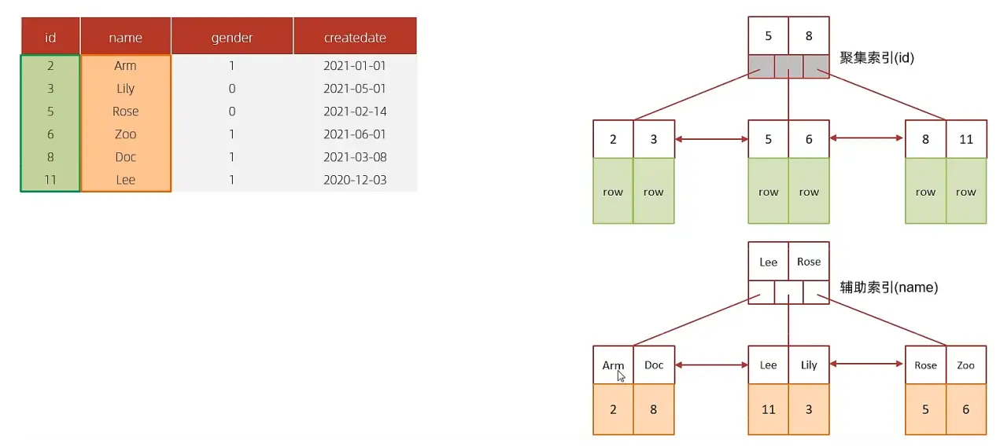

id是主键，是一个聚集索引。 name字段建立了普通索引，是一个二级索引（辅助索引）。

B. 执行SQL : select * from tb_user where id = 2;

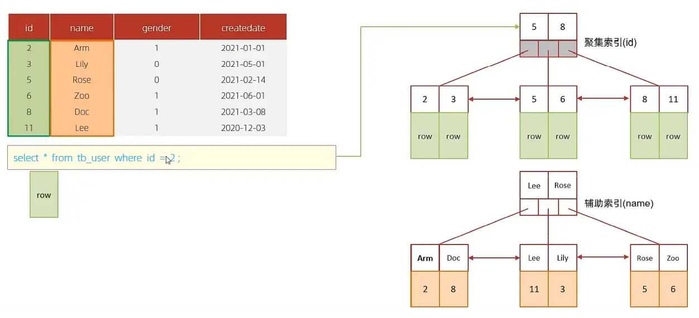

根据id查询，直接走聚集索引查询，一次索引扫描，直接返回数据，性能高。

C. 执行SQL：selet id,name from tb_user where name = 'Arm';

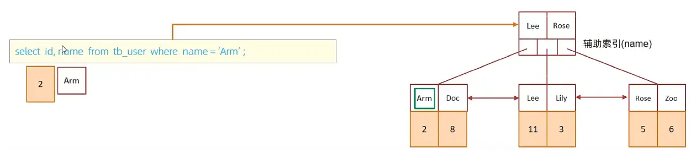

虽然是根据name字段查询，查询二级索引，但是由于查询返回在字段为 id，name，在name的二级索引中，这两个值都是可以直接获取到的，因为覆盖索引，所以不需要回表查询，性能高。

D. 执行SQL：selet id,name,gender from tb_user where name = 'Arm';

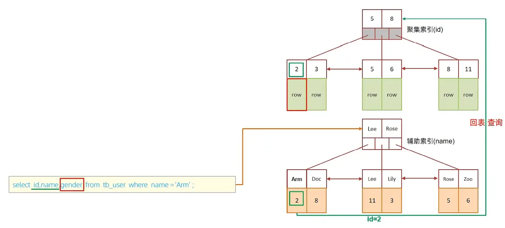

由于在name的二级索引中，不包含gender，所以，需要两次索引扫描，也就是需要回表查询，性能相对较差一点。

> 思考题：
>
> 一张表, 有四个字段(id, username, password, status), 由于数据量大, 需要对以下SQL语句进行优化, 该如何进行才是最优方案:
>
> `select id,username,password from tb_user where username = 'itcast';`
>
> 答案: 针对于 username, password建立联合索引, sql为: `create index idx_user_name_pass on tb_user(username,password);`
>
> 这样可以避免上述的SQL语句，在查询的过程中，出现回表查询。

### [#](https://frxcat.fun/database/MySQL/MySQL_Advanced_index/#%E5%89%8D%E7%BC%80%E7%B4%A2%E5%BC%95)前缀索引

当字段类型为字符串（varchar，text，longtext等）时，有时候需要索引很长的字符串，这会让索引变得很大，查询时，浪费大量的磁盘IO， 影响查询效率。此时可以只将字符串的一部分前缀，建立索引，这样可以大大节约索引空间，从而提高索引效率。

1. 语法

```sql
create index idx_xxxx on table_name(column(n));
```

示例:

为tb_user表的email字段，建立长度为5的前缀索引。

```sql
create index idx_email_5 on tb_user(email(5));
```

```sql
mysql> show index from tb_user;
+---------+------------+----------------------+--------------+-------------+-----------+-------------+----------+--------+------+------------+---------+---------------+---------+------------+
| Table   | Non_unique | Key_name             | Seq_in_index | Column_name | Collation | Cardinality | Sub_part | Packed | Null | Index_type | Comment | Index_comment | Visible | Expression |
+---------+------------+----------------------+--------------+-------------+-----------+-------------+----------+--------+------+------------+---------+---------------+---------+------------+
| tb_user |          0 | PRIMARY              |            1 | id          | A         |          23 |     NULL |   NULL |      | BTREE      |         |               | YES     | NULL       |
| tb_user |          0 | idx_user_phone       |            1 | phone       | A         |          24 |     NULL |   NULL |      | BTREE      |         |               | YES     | NULL       |
| tb_user |          1 | idx_user_name        |            1 | name        | A         |          24 |     NULL |   NULL |      | BTREE      |         |               | YES     | NULL       |
| tb_user |          1 | idx_user_pro_age_sta |            1 | profession  | A         |          16 |     NULL |   NULL | YES  | BTREE      |         |               | YES     | NULL       |
| tb_user |          1 | idx_user_pro_age_sta |            2 | age         | A         |          22 |     NULL |   NULL | YES  | BTREE      |         |               | YES     | NULL       |
| tb_user |          1 | idx_user_pro_age_sta |            3 | status      | A         |          24 |     NULL |   NULL | YES  | BTREE      |         |               | YES     | NULL       |
| tb_user |          1 | idx_user_pro         |            1 | profession  | A         |          16 |     NULL |   NULL | YES  | BTREE      |         |               | YES     | NULL       |
| tb_user |          1 | idx_email_5          |            1 | email       | A         |          23 |        5 |   NULL | YES  | BTREE      |         |               | YES     | NULL       |
+---------+------------+----------------------+--------------+-------------+-----------+-------------+----------+--------+------+------------+---------+---------------+---------+------------+
8 rows in set (0.03 sec)
```

2. 前缀长度

可以根据索引的选择性来决定，而选择性是指不重复的索引值（基数）和数据表的记录总数的比值，索引选择性越高则查询效率越高， 唯一索引的选择性是1，这是最好的索引选择性，性能也是最好的。

```sql
select count(distinct email) / count(*) from tb_user;
select count(distinct substring(email,1,5)) / count(*) from tb_user;
```

3. 前缀索引的查询流程

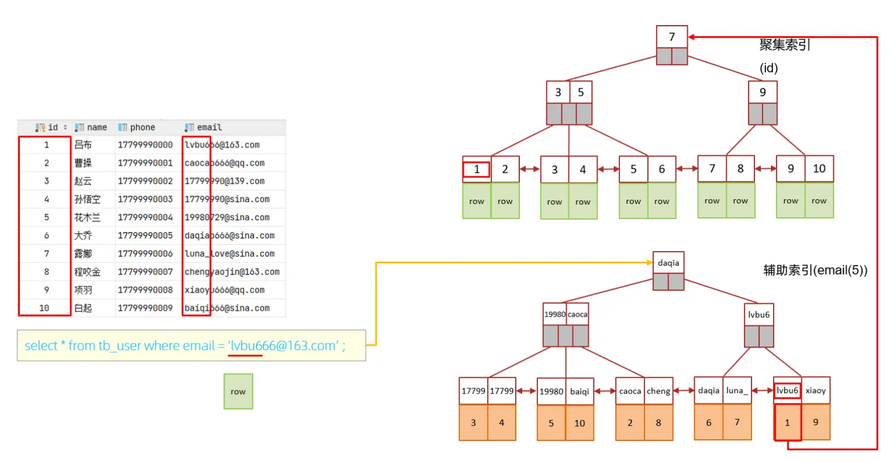

### [#](https://frxcat.fun/database/MySQL/MySQL_Advanced_index/#%E5%8D%95%E5%88%97%E7%B4%A2%E5%BC%95%E4%B8%8E%E8%81%94%E5%90%88%E7%B4%A2%E5%BC%95)单列索引与联合索引

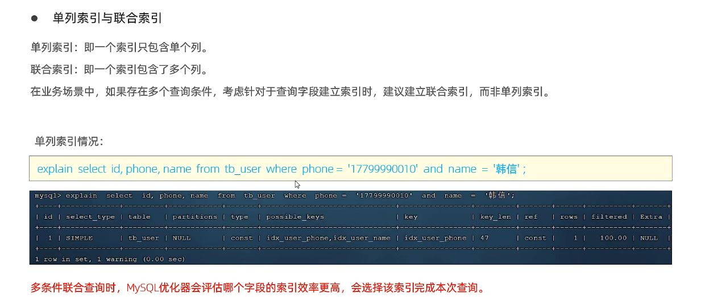

单列索引：即一个索引只包含单个列。

联合索引：即一个索引包含了多个列。

我们先来看看 tb_user 表中目前的索引情况:

```sql
mysql> show index from tb_user;
+---------+------------+----------------------+--------------+-------------+-----------+-------------+----------+--------+------+------------+---------+---------------+---------+------------+
| Table   | Non_unique | Key_name             | Seq_in_index | Column_name | Collation | Cardinality | Sub_part | Packed | Null | Index_type | Comment | Index_comment | Visible | Expression |
+---------+------------+----------------------+--------------+-------------+-----------+-------------+----------+--------+------+------------+---------+---------------+---------+------------+
| tb_user |          0 | PRIMARY              |            1 | id          | A         |          23 |     NULL |   NULL |      | BTREE      |         |               | YES     | NULL       |
| tb_user |          0 | idx_user_phone       |            1 | phone       | A         |          24 |     NULL |   NULL |      | BTREE      |         |               | YES     | NULL       |
| tb_user |          1 | idx_user_name        |            1 | name        | A         |          24 |     NULL |   NULL |      | BTREE      |         |               | YES     | NULL       |
| tb_user |          1 | idx_user_pro_age_sta |            1 | profession  | A         |          16 |     NULL |   NULL | YES  | BTREE      |         |               | YES     | NULL       |
| tb_user |          1 | idx_user_pro_age_sta |            2 | age         | A         |          22 |     NULL |   NULL | YES  | BTREE      |         |               | YES     | NULL       |
| tb_user |          1 | idx_user_pro_age_sta |            3 | status      | A         |          24 |     NULL |   NULL | YES  | BTREE      |         |               | YES     | NULL       |
| tb_user |          1 | idx_user_pro         |            1 | profession  | A         |          16 |     NULL |   NULL | YES  | BTREE      |         |               | YES     | NULL       |
| tb_user |          1 | idx_email_5          |            1 | email       | A         |          23 |        5 |   NULL | YES  | BTREE      |         |               | YES     | NULL       |
+---------+------------+----------------------+--------------+-------------+-----------+-------------+----------+--------+------+------------+---------+---------------+---------+------------+
8 rows in set (0.00 sec)
```

在查询出来的索引中，既有单列索引，又有联合索引。

接下来，我们来执行一条SQL语句，看看其执行计划：

```sql
mysql> select * from tb_user where phone = '17799990010' and name = '韩信';
+----+--------+-------------+-------------------+-----------------------------+------+--------+--------+---------------------+
| id | name   | phone       | email             | profession                  | age  | gender | status | createtime          |
+----+--------+-------------+-------------------+-----------------------------+------+--------+--------+---------------------+
| 11 | 韩信   | 17799990010 | hanxin520@163.com | 无机非金属材料工程          |   27 | 1      | 0      | 2001-06-12 00:00:00 |
+----+--------+-------------+-------------------+-----------------------------+------+--------+--------+---------------------+
1 row in set (0.02 sec)

mysql> explain select * from tb_user where phone = '17799990010' and name = '韩信';
+----+-------------+---------+------------+-------+------------------------------+----------------+---------+-------+------+----------+-------+
| id | select_type | table   | partitions | type  | possible_keys                | key            | key_len | ref   | rows | filtered | Extra |
+----+-------------+---------+------------+-------+------------------------------+----------------+---------+-------+------+----------+-------+
|  1 | SIMPLE      | tb_user | NULL       | const | idx_user_phone,idx_user_name | idx_user_phone | 46      | const |    1 |   100.00 | NULL  |
+----+-------------+---------+------------+-------+------------------------------+----------------+---------+-------+------+----------+-------+
1 row in set, 1 warning (0.00 sec)
```

通过上述执行计划我们可以看出来，在and连接的两个字段 phone、name上都是有单列索引的，但是最终mysql只会选择一个索引，也就是说，只能走一个字段的索引，此时是会回表查询的。

紧接着，我们再来创建一个phone和name字段的联合索引来查询一下执行计划。

```sql
create unique index idx_user_phone_name on tb_user(phone,name);
```

```sql
mysql> explain select * from tb_user where phone = '17799990010' and name = '韩信';
+----+-------------+---------+------------+-------+--------------------------------------------------+----------------+---------+-------+------+----------+-------+
| id | select_type | table   | partitions | type  | possible_keys                                    | key            | key_len | ref   | rows | filtered | Extra |
+----+-------------+---------+------------+-------+--------------------------------------------------+----------------+---------+-------+------+----------+-------+
|  1 | SIMPLE      | tb_user | NULL       | const | idx_user_phone,idx_user_phone_name,idx_user_name | idx_user_phone | 46      | const |    1 |   100.00 | NULL  |
+----+-------------+---------+------------+-------+--------------------------------------------------+----------------+---------+-------+------+----------+-------+
1 row in set, 1 warning (0.00 sec)
```

```sql
mysql> explain select * from tb_user use index(idx_user_name) where phone = '17799990010' and name = '韩信';
+----+-------------+---------+------------+------+---------------+---------------+---------+-------+------+----------+-------------+
| id | select_type | table   | partitions | type | possible_keys | key           | key_len | ref   | rows | filtered | Extra       |
+----+-------------+---------+------------+------+---------------+---------------+---------+-------+------+----------+-------------+
|  1 | SIMPLE      | tb_user | NULL       | ref  | idx_user_name | idx_user_name | 202     | const |    1 |     5.00 | Using where |
+----+-------------+---------+------------+------+---------------+---------------+---------+-------+------+----------+-------------+
1 row in set, 1 warning (0.00 sec)
```

此时，查询时，就走了联合索引，而在联合索引中包含 phone、name的信息，在叶子节点下挂的是对应的主键id，所以查询是无需回表查询的。

多个单列索引在多条件查询时只会生效一个索引！

> 在业务场景中，如果存在多个查询条件，考虑针对于查询字段建立索引时，建议建立联合索引，而非单列索引。

如果查询使用的是联合索引，具体的结构示意图如下：

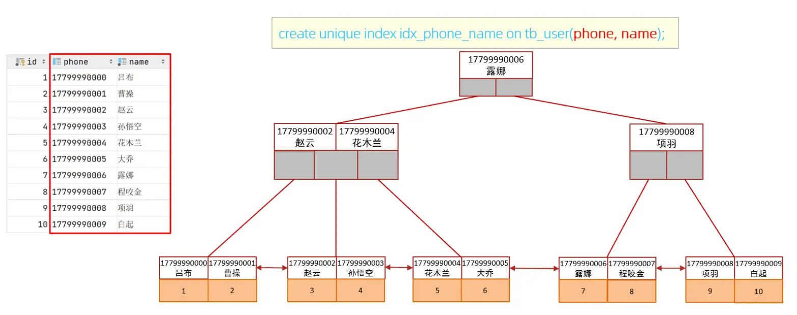

## [#](https://frxcat.fun/database/MySQL/MySQL_Advanced_index/#%E7%B4%A2%E5%BC%95%E8%AE%BE%E8%AE%A1%E5%8E%9F%E5%88%99)索引设计原则

1. 针对于数据量较大（>100万），且查询比较频繁的表建立索引。
2. 针对于常作为查询条件（where）、排序（order by）、分组（group by）操作的字段建立索引。
3. 尽量选择区分度高的列作为索引，尽量建立唯一索引，区分度越高，使用索引的效率越高。
4. 如果是字符串类型的字段，字段的长度较长，可以针对于字段的特点，建立前缀索引。
5. 尽量使用联合索引，减少单列索引，查询时，联合索引很多时候可以覆盖索引，节省存储空间，避免回表，提高查询效率。
6. 要控制索引的数量，索引并不是多多益善，索引越多，维护索引结构的代价也就越大，会影响增删改的效率。
7. 如果索引列不能存储NULL值，请在创建表时使用NOT NULL约束它。当优化器知道每列是否包含NULL值时，它可以更好地确定哪个索引最有效地用于查询。
